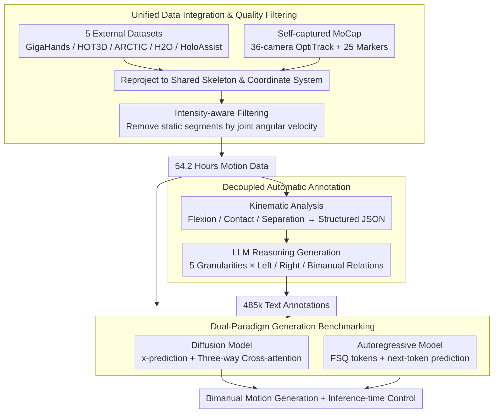

# HandX: Scaling Bimanual Motion and Interaction Generation

**Conference**: CVPR 2026  
**arXiv**: [2603.28766](https://arxiv.org/abs/2603.28766)  
**Code**: [https://handx-project.github.io](https://handx-project.github.io)  
**Area**: Human Understanding / Motion Generation  
**Keywords**: Bimanual motion generation, dexterous hand interaction, motion capture dataset, text-to-motion, Scaling Law

## TL;DR
HandX is constructed as a unified bimanual motion generation infrastructure (comprising 54.2 hours of motion data + 485,000 fine-grained text annotations). A decoupled automatic annotation strategy (kinematic feature extraction + LLM reasoning for description generation) is proposed. Diffusion and autoregressive generation paradigms are benchmarked, demonstrating clear data and model scaling trends.

## Background & Motivation

**Background**: Significant progress has been made in human motion generation at the body level (e.g., MDM, MotionDiffuse). However, most methods treat hands as rigid end-effectors, lacking fine-grained finger joint representation. Hand-related datasets and metrics are equally scarce—existing data either lacks hand details (HumanML3D, InterAct) or is confined to object manipulation scenarios (ARCTIC, H2O) with coarse annotation granularity.

**Limitations of Prior Work**: 1) Lack of high-fidelity motion data containing fine finger dynamics and bimanual coordination; 2) Inconsistent skeleton definitions, frame rates, and annotation protocols across different data sources, making merging difficult; 3) Prohibitively high costs for large-scale manual annotation; 4) Existing evaluation metrics fail to measure hand motion fidelity and bimanual coordination quality.

**Key Challenge**: Generating realistic bimanual motion requires massive high-quality data and fine-grained annotations, but high-quality data acquisition is expensive, manual annotation is unscalable, and a unified evaluation system is missing.

**Goal**: To establish a unified infrastructure covering data, annotation, and evaluation to support research in high-quality bimanual motion generation.

**Key Insight**: A three-step strategy of "integration + self-collection + automatic annotation" is adopted to solve data issues, while benchmarking two generation paradigms to study scaling behavior.

**Core Idea**: Construct a large-scale bimanual motion infrastructure through a three-pronged approach—integrating existing datasets, self-collecting new MoCap data, and decoupled LLM automatic annotation—and verify explicit scaling trends.

## Method

### Overall Architecture
HandX includes contributions at three levels: 1) Data layer—integrating 5 existing datasets (GigaHands, HOT3D, ARCTIC, H2O, HoloAssist) and self-collecting new MoCap data, unified into a shared skeleton representation with 54.2 hours of motion data after quality filtering; 2) Annotation layer—proposing a two-stage automatic annotation strategy that extracts structured kinematic features (contact events, finger flexion, etc.) and uses LLM reasoning to generate multi-granularity text descriptions (485,000 entries); 3) Generation layer—benchmarking diffusion and autoregressive models, supporting multiple condition control modes.

### Key Designs

**1. Unified Data Integration and Quality Filtering: Merging heterogeneous datasets into a trainable whole**

Skeleton definitions, frame rates, and coordinate systems vary across sources, presenting obstacles for joint training. HandX reprojects all sequences onto a shared skeleton and coordinate system, then uses an intensity-aware filter to screen by joint angular velocity. Since datasets are often dominated by static or near-static segments of little value for interaction learning, filtering retains only meaningful motion. Beyond external data, the authors self-collected bimanual interaction data using a 36-camera OptiTrack system with 25 reflective markers per actor to capture fine finger movements, reconstructing skeletons via joint center estimation and anatomical constraints. This self-collected data fills gaps in existing datasets—specifically high-difficulty scenarios like bimanual coordination and inter-finger contact—resulting in 54.2 hours of filtered data.

**2. Decoupled Automatic Annotation: Splitting "understanding motion" and "writing language"**

Large-scale manual annotation is unscalable, yet direct LLM annotation fails because LLMs excel at linguistic reasoning but cannot "read" high-dimensional continuous motion signals. HandX splits annotation into two stages. The first stage performs kinematic analysis without language: extracting structured descriptors like finger flexion, finger-palm distance, and bimanual spatial relations, analyzing their evolution to identify discrete events (contact, separation, hyperextension) in JSON format. The second stage feeds the JSON to an LLM, using prompts to generate descriptions across five granularity levels (from brief summaries to comprehensive descriptions). Each entry is required to cover the left hand, right hand, and bimanual relations in chronological order. Motion alignment is guaranteed by structured events, while linguistic fluency is handled by the LLM.

**3. Dual-Paradigm Generation Benchmarking: Running diffusion and autoregressive pipelines on the same data**

To determine which paradigm suits bimanual motion better, both mainstream routes were implemented. The diffusion model uses a joint representation of coordinates and rotation scalars to predict clean sequences. A key engineering detail is the use of three-way cross-attention to process left-hand, right-hand, and interaction text separately; simple concatenation causes "bleeding" where the model assigns right-hand actions to the left hand. The autoregressive model follows the discretization route, using FSQ (Finite Scalar Quantization) to compress motion into tokens, followed by next-token prediction with text prefixes. FSQ was chosen over VQ-VAE for its higher codebook utilization and stable scaling. The diffusion branch additionally supports inference-time controls: motion in-betweening, keyframe generation, wrist trajectory following, unimanual reaction generation, and long-range generation.

### Loss & Training
The diffusion model training objective is direct signal prediction (x-prediction) using standard denoising MSE loss. The autoregressive model's tokenizer uses reconstruction loss $\|\mathbf{x} - \mathcal{D}(\hat{\mathbf{y}})\|_2^2$, while the autoregressive part uses standard cross-entropy loss. Specialized hand interaction metrics (Contact Precision/Recall/F1) were proposed with a contact threshold of 2cm.

## Key Experimental Results

### Main Results (Diffusion Model Scaling)

| Data Ratio | Decoder Layers | R-Prec Top1↑ | FID↓ | CF1↑ |
|-----------|----------------|--------------|------|------|
| 5% | 4 | 0.142 | 2.574 | 0.523 |
| 5% | 12 | 0.343 | 1.837 | 0.618 |
| 20% | 12 | 0.357 | 1.140 | 0.606 |
| 100% | 12 | **0.427** | 1.349 | **0.641** |
| 100% | 16 | 0.382 | 1.675 | 0.624 |
| Ground Truth | - | 0.854 | 0.000 | 0.984 |

### Ablation Study (Autoregressive Model Scaling)

| Model Size (M) | Codebook | R-Prec Top1↑ | FID↓ |
|---------------|----------|--------------|------|
| 4.63 | 512 | 0.366 | 8.377 |
| 26.33 | 1024 | 0.322 | 2.750 |
| 38.95 | 2048 | 0.305 | 3.245 |
| 215.31 | 4096 | 0.281 | **1.721** |

### Key Findings
- Diffusion models show clear scaling trends: moving from 5% to 100% data and from 4 to 12 decoder layers improves R-Precision Top1 from 0.142 to 0.427 (3x) and Contact F1 from 0.523 to 0.641.
- 16 decoder layers performed worse than 12, suggesting overfitting or optimization difficulties.
- For autoregressive models, codebook size and model capacity must scale together; increasing codebook size alone without model capacity leads to performance degradation.
- FID is optimal at the largest model/data configuration (Diffusion 1.140, AR 1.721), but a significant gap remains compared to Ground Truth.

## Highlights & Insights
- The decoupled annotation strategy is the most valuable contribution—separating feature extraction from language generation allows the LLM to focus on reasoning, a concept transferable to any motion understanding task requiring large-scale labeling.
- The three-way cross-attention design effectively solves left-right hand confusion and serves as a vital engineering detail for bimanual generation.
- This work provides the first systematic demonstration of scaling behavior in bimanual motion generation, consistent with scaling law trends in NLP/CV.
- Transferring generated dexterous motion to real humanoid robots demonstrates practical application potential.

## Limitations & Future Work
- The highest R-Precision Top1 is only 0.427 (vs. 0.854 for GT), indicating a performance gap.
- Self-collected data is relatively limited; integrated external data may have quality and consistency issues.
- Motion representation uses 3D coordinates rather than rotation parameters, potentially limiting physical plausibility.
- Contact detection relies on a simple distance threshold (2cm) without modeling contact mechanics.
- Evaluation metrics lack assessment of bimanual coordination timing.

## Related Work & Insights
- **vs BOTH2Hands**: BOTH2Hands provides 8.31 hours of bimanual motion with coarse labels. Ours is 6.5x larger with fine-grained, multi-level annotations.
- **vs CLUTCH**: CLUTCH reconstructs hand motion from in-the-wild videos with action-level labels. Ours uses MoCap for high-precision data and finger-level details.
- **vs Motion-X**: Motion-X is a whole-body dataset with coarse hand labels. Ours focuses on hands, filling the data void for hand motion generation.

## Rating
- Novelty: ⭐⭐⭐⭐ Unified infrastructure + decoupled annotation strategy is innovative.
- Experimental Thoroughness: ⭐⭐⭐⭐⭐ Dual-paradigm comparison, multi-scale scaling analysis, diverse controls, and robot transfer.
- Writing Quality: ⭐⭐⭐⭐ Clear structure with detailed data statistics.
- Value: ⭐⭐⭐⭐⭐ Fills the infrastructure gap in bimanual motion generation; highly impactful for the community.

<!-- RELATED:START -->

## Related Papers

- [\[CVPR 2026\] LLaMo: Scaling Pretrained Language Models for Unified Motion Understanding and Generation with Continuous Autoregressive Tokens](llamo_scaling_pretrained_language_models_for_unified_motion_understanding_and_ge.md)
- [\[CVPR 2026\] PAMotion: Physics-Aware Motion Generation for Full-Body Interaction with Multiple Objects](pamotion_physics-aware_motion_generation_for_full-body_interaction_with_multiple.md)
- [\[CVPR 2026\] Causal Motion Diffusion Models for Autoregressive Motion Generation](causal_motion_diffusion_models_for_autoregressive_motion_generation.md)
- [\[CVPR 2026\] Open the Motion Door: Atomic Motion Decomposition and Recomposition for Open-Vocabulary Motion Generation](open_the_motion_door_atomic_motion_decomposition_and_recomposition_for_open-voca.md)
- [\[CVPR 2026\] InterPrior: Scaling Generative Control for Physics-Based Human-Object Interactions](interprior_scaling_generative_control_for_physics-based_human-object_interaction.md)

<!-- RELATED:END -->
