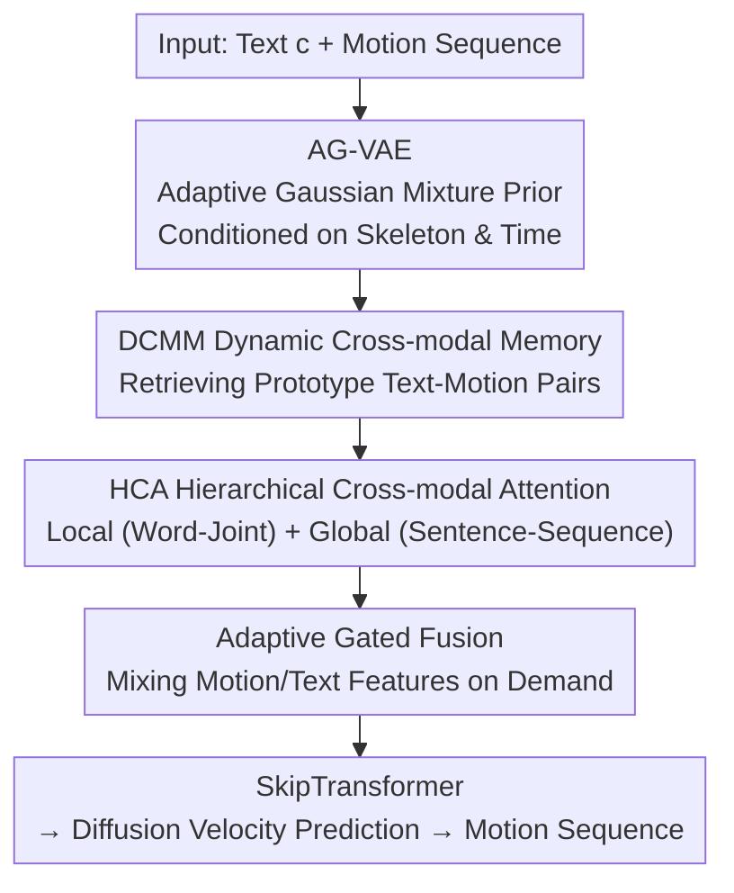

# Hierarchical Enhancement of Semantic Priors for Disentangled Text-Driven Motion Generation

**Conference**: CVPR 2026  
**Paper**: [CVF Open Access](https://openaccess.thecvf.com/content/CVPR2026/html/Lv_Hierarchical_Enhancement_of_Semantic_Priors_for_Disentangled_Text_Driven_Motion_Generation_CVPR_2026_paper.html)  
**Code**: None  
**Area**: Human Understanding / Text-driven Motion Generation / Diffusion Models  
**Keywords**: Text-to-Motion, Latent Space Disentanglement, Adaptive Gaussian Prior, Cross-modal Memory, Hierarchical Attention

## TL;DR
HESP utilizes an Adaptive Gaussian VAE (AG-VAE) that explicitly decomposes the latent space into multiple semantic sub-manifolds, combined with Dynamic Cross-Modal Memory (DCMM) and Hierarchical Cross-modal Attention (HCA). This makes text-driven 3D human motion generation more controllable and interpretable, outperforming baselines such as SALAD, MoMask, and MDM in FID and R-Precision on HumanML3D and KIT-ML.

## Background & Motivation

**Background**: The mainstream of text-to-motion is dominated by diffusion-based methods such as MDM, MoMask, and SALAD. These methods use text (usually encoded via CLIP) as a condition to progressively denoise and generate skeletal pose sequences within a latent space.

**Limitations of Prior Work**: These methods generally assume the latent space follows an **isotropic Gaussian prior** and only apply shallow cross-modal supervision at the frame level. An isotropic prior assumes all motion dynamics are smoothly connected into a single manifold, resulting in semantic entanglement—distinct semantics like "walking" and "waving" occupy overlapping distribution regions in the latent space, leading to poor controllability and interpretability.

**Key Challenge**: Human motion is inherently a combination of **multiple discrete yet interdependent dynamic patterns**. Forcing these into a unimodal Gaussian leads to both semantic entanglement and mode collapse. Furthermore, both text (words → sentences) and motion (joints → sequences) possess **hierarchical structures**, yet existing methods treat text-motion alignment as a flat, single-stage process, ignoring this hierarchical correspondence and causing misconceptions of complex instructions or lacking global temporal coherence.

**Goal**: To reshape the latent space from a "single unimodal prior" into "hierarchically organized semantic sub-manifolds" and model text-motion alignment across multiple granularities.

**Key Insight**: The authors argue that the latent space of human motion should reflect **hierarchical semantic organization** rather than a flat unimodal prior; furthermore, this structure should adaptively evolve with skeletal topology and temporal dynamics rather than remaining static.

**Core Idea**: Replace the isotropic prior with a Gaussian Mixture Prior conditioned on skeletal topology and temporal semantics, where mixture weights adapt over time. This models motion as a "time-varying mixture of semantic sub-manifolds," further utilizing memory and hierarchical attention to dynamically align language with motion hierarchies.

## Method

### Overall Architecture
HESP (Hierarchical Enhancement of Semantic Priors) is a unified text-to-motion diffusion framework. It takes a natural language text $c$ as input and outputs a motion sequence $m_{1:N} = x_1, \dots, x_N$, where $x_n$ is the skeletal pose vector of the $n$-th frame. The framework integrates three core modules: AG-VAE learns a semantically structured latent space, DCMM retrieves long-range contextual dependencies between text and motion features, and HCA performs fine-to-coarse alignment between linguistic and kinematic hierarchies; all three are jointly optimized within a diffusion-based denoising decoder.

The workflow: The motion sequence is first encoded into the structured latent space of AG-VAE via skeletal-temporal convolutions. The denoising network receives the skeleton-aware spatial-temporal latent representation $Z$ and text condition $c$. It first applies positional encoding to distinguish temporal and joint positions, then uses DCMM to inject long-range semantic memory and HCA for two-level (local/global) alignment. Finally, adaptive gated fusion mixes the "memory-enhanced motion features" and "text embeddings" as needed, followed by a SkipTransformer projection to predict the diffusion velocity for denoising.

### Key Designs

**1. AG-VAE: Replacing Isotropic Priors with Skeleton and Temporal Conditioned Adaptive Gaussian Mixture Priors**

This directly addresses the "semantic entanglement caused by isotropic Gaussians" pain point. Conventional VAEs force $p(z)=\mathcal{N}(0, I)$, treating all motion dynamics as a single smoothly connected manifold. GMVAE mitigates this with static Gaussian mixtures but still ignores skeletal topology and temporal evolution. AG-VAE defines the prior as a **time-adaptive** Gaussian mixture: $p(z_t|S,T)=\sum_{k=1}^{K}\pi_k(t,S)\,\mathcal{N}(z_t|\mu_k(S),\Sigma_k(S,T))$, where $S$ is the skeletal graph encoding joint dependencies, $T$ is the temporal position index, and mixture weights $\pi_k(t,S)$ are predicted by a lightweight attention network. Encoding uses skeletal-temporal convolutions $z=\text{STPool}(\text{TempConv}(\text{SkelConv}(m_{1:N})))$. This allows the latent distribution to evolve dynamically along the motion sequence while maintaining anatomical consistency. Its ELBO objective decomposes the joint KL divergence as $\mathcal{L}=\mathbb{E}_{q_\phi}[\log p_\theta(x|z,k)]-D_{KL}(q_\phi(k|x)\|p(k))-\mathbb{E}_{q_\phi(k|x)}[D_{KL}(q_\phi(z|x,k)\|p(z|k))]$. Crucially, the soft assignment $q_\phi(k|x)$ is performed at **each timestep** (rather than fixing one $k$ for the whole sequence), allowing multi-granularity semantic switching and enhancing disentanglement and interpretability.

**2. DCMM: Injecting Long-range Semantics using Retrieval-Augmented Memory Banks**

Designed for the problem where "flat single-stage alignment loses long-range semantic consistency." DCMM maintains a memory bank $M=\{M_p\}_{p=1}^{P}$ storing prototype text-motion pairs. Given motion latent $z_t$ and text embedding $c_w$, a query $q=\varphi_q([\text{mean}_t(z_t),\text{mean}_w(c_w)])$ is formed by concatenating their means. Similarity is calculated with each slot $M_p$ to obtain attention weights $\alpha_p$, and the retrieved representation $r=\sum_p \alpha_p M_p$ is used to obtain the fused representation $z'_t=z_t+r$. This effectively allows the network to "recall" prototypical motion-text pairs seen during training while denoising each sample, injecting long-range contextual priors.

**3. HCA: Word-Joint and Sentence-Sequence Alignment with Learnable Gating**

Addresses the "hierarchical mismatch between language (words → sentences) and motion (joints → sequences)." HCA performs two-stage alignment: local alignment between word embeddings and per-joint motion tokens to capture fine-grained semantics, and global alignment between sentence embeddings and the entire motion trajectory to ensure temporal coherence. Specifically: $A_{local}=\text{softmax}(Q_{motion}K_{word}^\top/\sqrt{d})V_{word}$ and $A_{global}=\text{softmax}(Q_{motion}K_{sent}^\top/\sqrt{d})V_{sent}$, combined via a **learnable gate** $\lambda$: $h_t=\lambda A_{local}+(1-\lambda)A_{global}$. This enforces both micro (precise motion details) and macro (temporal smoothness) semantic fidelity.

**4. Adaptive Gated Fusion: Token-wise Mixing of Motion and Text Cues**

To integrate memory-enhanced motion features and text representations without over-smoothing. For each sample $b$, a motion summary vector $m_b\in\mathbb{R}^D$ is averaged over time. For each word-level text embedding $c_{b,\ell}$, a sigmoid gate coefficient $g_{b,\ell}=\sigma(W_g[m_b,\,c_{b,\ell}]+b_g)\in[0,1]^D$ is computed. The final enhanced text representation is a convex combination of both modalities followed by LayerNorm: $c^{enh}_{b,\ell}=\text{LayerNorm}(g_{b,\ell}\odot m_b+(1-g_{b,\ell})\odot c_{b,\ell})$. Intuitively, when $g_{b,\ell}$ is close to 1, the flow favors motion-guided information, and when small, it emphasizes original text semantics.

### Loss & Training
The overall objective is derived from the ELBO of AG-VAE (reconstruction term + two KL terms, see $\mathcal{L}$), jointly optimized within the diffusion framework. Training was conducted on a single NVIDIA RTX 3090 Ti using AdamW. The VAE was trained for 50 epochs and the denoiser for 500 epochs. The denoiser uses 1000 diffusion steps for training and 50 steps of DDIM sampling for inference, utilizing classifier-free guidance.

## Key Experimental Results

### Main Results
Evaluated on two standard benchmarks: HumanML3D (14,616 motions, 44,970 texts, 22 joints) and KIT-ML (3,911 motions, 6,278 texts). Metrics include R-Precision (Top-1/2/3), FID, MM-Dist (Multi-modal Distance), Diversity, and MultiModality.

Main results on HumanML3D test set:

| Method | R-Top1 ↑ | R-Top3 ↑ | FID ↓ | MM-Dist ↓ |
|------|----------|----------|-------|-----------|
| Real motion | 0.511 | 0.797 | 0.002 | 2.974 |
| MDM | 0.320 | 0.611 | 0.544 | 5.566 |
| MoMask | 0.521 | 0.807 | 0.045 | 2.958 |
| SALAD | 0.581 | 0.857 | 0.076 | 2.649 |
| **Ours (HESP)** | **0.600** | **0.871** | **0.045** | **2.521** |

Main results on KIT-ML test set:

| Method | R-Top1 ↑ | R-Top3 ↑ | FID ↓ | MM-Dist ↓ |
|------|----------|----------|-------|-----------|
| Real motion | 0.424 | 0.779 | 0.031 | 2.788 |
| MoMask | 0.433 | 0.781 | 0.204 | 2.779 |
| SALAD | 0.477 | 0.828 | 0.296 | 2.585 |
| **Ours (HESP)** | **0.514** | **0.844** | **0.267** | **2.499** |

Across both datasets, HESP achieved the best R-Precision and MM-Dist. FID on HumanML3D tied with MoMask for the lowest (0.045), and the FID of 0.267 on KIT-ML outperformed SALAD's 0.296.

### Ablation Study
The role of AG-VAE is supported by reconstruction quality and latent space visualization:

| Configuration | Reconstruction MSE (Sample) | Description |
|------|----------------------|------|
| Standard VAE | 0.3127 / 0.1295 | Overlapping latent distributions, unstructured |
| AG-VAE | 0.2089 / 0.0572 | Separable multimodal latents, clear mapping to dynamics |

### Key Findings
- **AG-VAE is the source of interpretability**: Latent visualizations show that while standard VAE distributions overlap, AG-VAE displays clearly separated multimodal distributions with high-confidence cluster assignments, successfully partitioning the latent space into interpretable sub-manifolds representing different motion dynamics.
- **Consistent decrease in reconstruction MSE**: (0.3127 → 0.2089), proving that structured latent spaces are not only more interpretable but also more accurate for reconstruction.

## Highlights & Insights
- **Time-varying and conditional priors**: The use of mixture weights $\pi_k(t,S)$ that evolve with time and skeletal topology is a significant departure from static Gaussian mixtures. This directly encodes the intuition that motion consists of semantic primitives switching over time into the generative prior.
- **Structural disentanglement via prior design**: Disentanglement is achieved through the intrinsic structure of the prior rather than auxiliary loss terms. This approach can be generalized to other generation tasks where latent space entanglement is a bottleneck.
- **Synergy of Memory + Hierarchical Gated Attention**: DCMM addresses long-range consistency, HCA handles cross-modal hierarchical alignment, and gated fusion manages token-wise modality mixing.

## Limitations & Future Work
- There is a lack of module-wise numerical ablation for DCMM, HCA, and Gated Fusion, making it difficult to isolate their individual quantitative gains.
- Hyperparameter sensitivity for memory bank size $P$ and mixture component count $K$ is not discussed.
- While the FID is competitive, MultiModality (1.814 on HumanML3D) is lower than MDM (2.799), suggesting a trade-off between semantic precision and generation diversity.

## Related Work & Insights
- **vs SALAD / MDM / MoMask**: These utilize isotropic Gaussian priors and flat cross-modal supervision. HESP swaps these for structured time-varying Gaussian mixture priors and hierarchical (local/global) alignment. The primary advantage is increased controllability and interpretability at the cost of higher module complexity.
- **vs GMVAE / CGMVAE**: While these also use Gaussian mixtures, AG-VAE in HESP is explicitly conditioned on skeletal topology and temporal indices with time-adaptive weights, representing a "structure-aware + time-adaptive" decomposition.

## Rating
- **Novelty**: ⭐⭐⭐⭐ The combination of time-varying conditional Gaussian mixture priors and hierarchical cross-modal alignment is novel.
- **Experimental Thoroughness**: ⭐⭐⭐ Results are strong on two benchmarks, but the lack of individual module numerical ablations weakens the attribution of gains.
- **Writing Quality**: ⭐⭐⭐⭐ Clear motivation-method chain and comprehensive formulas.
- **Value**: ⭐⭐⭐⭐ Significant advancement in the controllability and interpretability of text-driven motion generation.

<!-- RELATED:START -->

## Related Papers

- [\[CVPR 2026\] MotionMaster: Generalizable Text-Driven Motion Generation and Editing](motionmaster_generalizable_text-driven_motion_generation_and_editing.md)
- [\[CVPR 2026\] MotionHiFlow: Text-to-Motion via Hierarchical Flow Matching](motionhiflow_text-to-motion_via_hierarchical_flow_matching.md)
- [\[CVPR 2026\] Pressure2Motion: Hierarchical Human Motion Reconstruction from Ground Pressure with Text Guidance](pressure2motion_hierarchical_human_motion_reconstruction_from_ground_pressure_wi.md)
- [\[CVPR 2026\] Multi-level Causal LLM-based Text-to-Motion Generation with Human Alignment (MoTiGA)](multi-level_causal_llm-based_text-to-motion_generation_with_human_alignment.md)
- [\[ICLR 2026\] Disentangled Hierarchical VAE for 3D Human-Human Interaction Generation](../../ICLR2026/human_understanding/disentangled_hierarchical_vae_for_3d_human-human_interaction_generation.md)

<!-- RELATED:END -->
