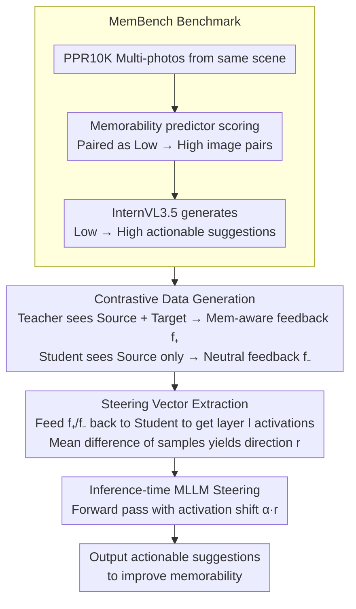

# How to Take a Memorable Picture? Empowering Users with Actionable Feedback

**Conference**: CVPR 2026  
**arXiv**: [2602.21877](https://arxiv.org/abs/2102.21877)  
**Code**: [https://laitifranz.github.io/MemCoach](https://laitifranz.github.io/MemCoach)  
**Area**: Human Understanding  
**Keywords**: Image Memorability, Actionable Feedback, Activation Steering, MLLM, Photography Assistance

## TL;DR
This paper defines a new task of Memorability Feedback (MemFeed) and proposes MemCoach—a training-free activation steering method for Multimodal Large Language Models (MLLMs). By injecting memorability-aware knowledge into the model's activation space using a teacher-student strategy, it enables MLLMs to generate natural language actionable suggestions for improving photo memorability.

## Background & Motivation
**Background**: Image memorability (the probability of being remembered) has been proven to be a predictable and quantifiable intrinsic property of images. Existing research is divided into two lines: prediction (regressing memorability scores) and generation (automatic editing to improve memorability).

**Limitations of Prior Work**: Prediction models only report numerical scores, which offer no actionable value to users. Generation models directly modify images, causing users to lose control. When taking photos, users need specific advice on "how to improve this photo" rather than scores or automatic edits.

**Key Challenge**: Even humans cannot accurately judge what makes an image memorable. Although MLLMs possess powerful reasoning capabilities, experiments show they lack understanding of memorability (Spearman correlation coefficient near 0).

**Goal**: How to enable MLLMs that do not understand memorability to generate effective suggestions for enhancing it.

**Key Insight**: Utilize the differences between photos of varying memorability within the same scene to distill memorability-aware activation direction vectors from a teacher model.

**Core Idea**: During inference, shift the student model's activations toward the memorability-aware feedback direction using activation steering, without requiring training.

## Method

### Overall Architecture
This paper addresses the fact that while MLLMs have strong reasoning abilities, they know almost nothing about "what makes a photo more memorable," leading to generic advice. MemCoach avoids training the model to understand memorability and instead "pushes" memorability knowledge into its activations during inference. The pipeline follows three steps: First, a teacher model with "privileged information" generates memorability-aware feedback from same-scene photo pairs (low vs. high memorability), while a student model generates neutral feedback for the source image. Second, both feedback types are fed into the student to collect intermediate layer activations and calculate a "memorability direction" vector. Finally, during actual inference, this vector is added to the student's activations to bias its suggestions toward improving memorability. This process requires no weight updates.

### Key Designs

**1. MemBench Benchmark: Converting an "unanswered" task into a supervised signal task**

Memorability feedback is a novel task with no existing data or evaluation protocols. Since even humans struggle to define memorability, the authors constructed MemBench based on PPR10K. This dataset contains multiple photos of the same subject across different scenes, providing natural controls. The process involves scoring photos with a memorability predictor, pairing low and high memorability images, and using InternVL3.5 to generate suggestions on "what to change to move from low to high memorability." This yields a corpus of approximately 10K images across 1,570 scenes, serving as the foundation for distilling direction vectors.

**2. Contrastive Data Generation: Defining the memorability direction via "privileged info"**

To manifest the abstract concept of "memorability" in activations, the authors create feedback pairs differing only in this dimension. A teacher model sees both the source (low) and target (high) images to describe the necessary operations, resulting in memorability-aware feedback $f_+^i$. A student model sees only the source and generates default suggestions, resulting in neutral feedback $f_-^i$. The difference between $f_+$ and $f_-$ isolates the "memorability-aware" variable from unrelated factors like phrasing or length.

**3. Memorability Steering Vector Extraction: Averaging activation differences into a reusable direction**

To apply this to the student model's inference, the authors feed $f_+$ and $f_-$ as "assistant" inputs into the student model, extract the hidden states at layer $l$, and calculate the mean difference:

$$\mathbf{r}^{(l)} = \frac{1}{N}\sum_{i=1}^N h_+^{i,(l)} - h_-^{i,(l)}$$

Based on the linear representation hypothesis, this mean vector $\mathbf{r}^{(l)}$ extracts the common "memorability-aware" direction from sample noise.

**4. Inference-time MLLM Steering: Shifting activations during forward propagation**

During inference, the steering vector is added to the activations of the student model at layer $l$ with an intensity $\alpha$:

$$\tilde{h}^{(l)} = h^{(l)} + \alpha \cdot \mathbf{r}^{(l)}$$

Increasing $\alpha$ pushes the output further toward the memorability direction. As this is a weight-independent additive intervention, the method is model-agnostic and can be applied to any MLLM with accessible intermediate representations.

## Key Experimental Results

Evaluation uses three metrics: **Improvement Ratio (IR)** (ratio of edited images with higher memorability), **Relative Memorability (RM%)** (relative increase), and **Perplexity** (closeness to ground-truth effective feedback).

### Main Results

| Method Type | Model | IR ↑ | RM% ↑ | Perplexity ↓ |
| :--- | :--- | :--- | :--- | :--- |
| Editing Baseline | Null Prompt | 0.68 | 3.72 | - |
| Zero-shot | GPT-5 Mini | 0.75 | 7.03 | - |
| Zero-shot | InternVL3.5 | 0.73 | 5.47 | 5.49 |
| Aesthetic Expert | AesExpert | 0.73 | 6.67 | 5.97 |
| **Ours** | InternVL3.5 | **0.80** | **7.21** | **4.99** |
| Teacher Upper Bound | InternVL3.5 | 0.85 | 11.92 | 2.40 |

### Cross-model Generalization

| Model | Zero-shot IR | +MemCoach IR | Gain |
| :--- | :--- | :--- | :--- |
| LLaVA-OV | 0.70 | 0.73 | +4.29% |
| Idefics3 | 0.73 | - | Consistent Gain |
| Qwen2.5VL | 0.68 | - | Largest Gain |

### Key Findings
- MLLM zero-shot memorability prediction is near zero (Spearman ~0), confirming the necessity of external signal injection.
- MemCoach outperforms GPT-5 Mini zero-shot by 5% IR and improves the baseline InternVL3.5 by 31.81% in RM.
- It surpasses specialized aesthetic models (AesExpert, Q-Instruct) that require training.
- Steering vectors are transferable and consistently effective across four different MLLMs.

## Highlights & Insights
- **Forward-looking task definition**: Shifts memorability from "passive prediction" to "active coaching," offering more practical value than score regression.
- **Teacher-student activation steering** serves as a novel form of knowledge distillation: instead of distilling output distributions, it distills directions in the activation space.
- The **training-free and model-agnostic** design ensures excellent practical utility.
- First application of **activation steering** to perceptual tasks rather than just safety or style control.

## Limitations & Future Work
- Dependency on an editing model (FLUX.1 Kontext) for verification; editing quality influences evaluation.
- The accuracy of the memorability predictor itself acts as an upper performance bound.
- Selection of steering strength $\alpha$ and layer $l$ requires hyperparameter tuning.
- Feedback primarily focuses on composition and semantics, lacking advice on technical parameters like exposure or aperture.

## Related Work & Insights
- **vs. Memorability Editing**: While editing methods directly modify images, MemCoach provides natural language suggestions, leaving control to the user.
- **vs. Aesthetic Models**: Aesthetic models offer critiques; MemCoach provides memorability-oriented actionable instructions.
- The teacher-student activation steering paradigm can be generalized to other MLLM applications requiring the injection of external domain knowledge.

## Rating
- Novelty: ⭐⭐⭐⭐⭐ (New task definition + innovative knowledge injection)
- Experimental Thoroughness: ⭐⭐⭐⭐ (Multi-model validation + human eval + ablations)
- Writing Quality: ⭐⭐⭐⭐ (Very clear motivation and architecture diagrams)
- Value: ⭐⭐⭐⭐ (Inspiring for computational photography and creative AI)

<!-- RELATED:START -->

## Related Papers

- [\[ECCV 2024\] How Video Meetings Change Your Expression](../../ECCV2024/human_understanding/how_video_meetings_change_your_expression.md)
- [\[CVPR 2025\] Reference-Free Image Quality Assessment for Virtual Try-On via Human Feedback](../../CVPR2025/human_understanding/reference-free_image_quality_assessment_for_virtual_try-on_via_human_feedback.md)
- [\[ICML 2025\] How to Move Your Dragon: Text-to-Motion Synthesis for Large-Vocabulary Objects](../../ICML2025/human_understanding/how_to_move_your_dragon_text-to-motion_synthesis_for_large-vocabulary_objects.md)
- [\[CVPR 2026\] Superman: Unifying Skeleton and Vision for Human Motion Perception and Generation](superman_unifying_skeleton_and_vision_for_human_motion_perception_and_generation.md)
- [\[CVPR 2026\] Geometric Neural Distance Fields for Learning Human Motion Priors](geometric_neural_distance_fields_for_learning_human_motion_priors.md)

<!-- RELATED:END -->
