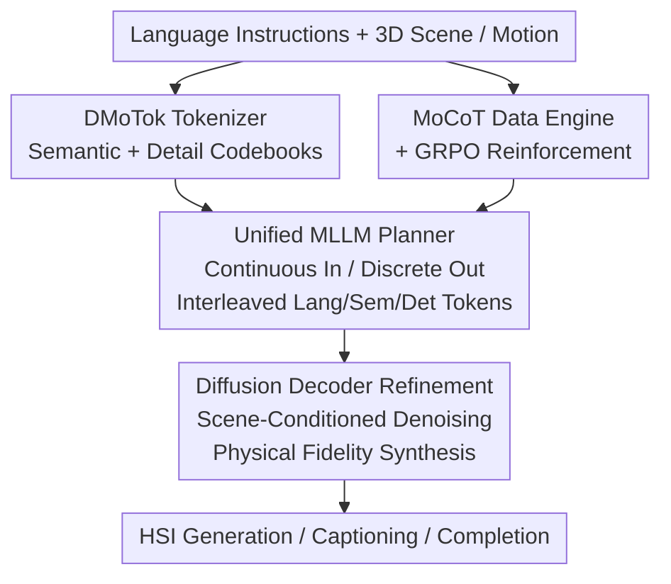

# HSI-GPT2: A Dual-Granularity Large Motion Reasoning Model with Diffusion Refinement for Human-Scene Interaction

**Conference**: CVPR 2026  
**Paper**: [CVF Open Access](https://openaccess.thecvf.com/content/CVPR2026/html/Wang_HSI-GPT2_A_Dual-Granularity_Large_Motion_Reasoning_Model_with_Diffusion_Refinement_CVPR_2026_paper.html)  
**Code**: To be confirmed  
**Area**: Human Understanding  
**Keywords**: Human-Scene Interaction, Motion Generation and Understanding, Dual-Granularity Motion Tokenizer, LLM + Diffusion, GRPO Reasoning

## TL;DR
HSI-GPT2 is a Large Motion Model (LMM) for "unified understanding + generation" of Human-Scene Interaction (HSI). It employs a **dual-granularity motion tokenizer** to decouple actions into semantic and detail codebooks. By utilizing an **LLM as a semantic planner and a diffusion decoder as a de-tokenizer**, the model achieves high physical fidelity. Integrated with a **Motion Chain-of-Thought (MoCoT) data engine and Group Relative Policy Optimization (GRPO)**, the model performs step-by-step reasoning, significantly outperforming HSI-GPT on HumanML3D and HUMANISE benchmarks for generation, description, and completion tasks.

## Background & Motivation
**Background**: HSI involves placing virtual humans in 3D scenes that are both physically plausible and aligned with linguistic intent, forming a foundation for embodied intelligence. Inspired by MLLMs, recent approaches discretize motion into "language-like" tokens for alignment within LLM space. The goal is to create a unified Large Scene-Motion-Language Model that understands the relationships between 3D scenes, motion, and text. HSI-GPT was the first integrated model in this direction.

**Limitations of Prior Work**: The authors identify three critical flaws in HSI-GPT: ① **Single-granularity codebook**: Based on VQVAE with pure reconstruction supervision, it favors low-frequency motion details while neglecting motion semantics and lacks CLIP-style pre-training alignment. ② **Limited decoding capability**: Human motion is highly articulated; vanilla token-based decoding is insufficient for fine-grained interaction, often leading to violations of physical constraints (e.g., unstable contact, penetration, or collision). ③ **Lack of semantic reasoning**: Pure SFT results in passive imitation, failing to perform compositional or long-range reasoning.

**Key Challenge**: Descriptive fidelity (details) and semantic abstraction (high-level intent) occupy **different levels of representation**. Using a single-granularity codebook to carry both leads to suboptimal performance for both. Furthermore, a significant gap exists between discrete token autoregressive decoding and continuous motion.

**Goal**: To build a unified HSI base model possessing "strong motion representation + robust decoding + compositional reasoning."

**Key Insight**: Human actions are goal-oriented "perception-action" processes—first inferring intent, then acting based on physical affordance. Therefore, reasoning should precede motion. By explicitly modeling this CoT in a multi-modal context and using RL with verifiable rewards, the model can transition from "imitation" to "reasoning."

**Core Idea**: The synergy of a dual-granularity decoupled motion representation (semantic/detail codebooks), a division of labor between LLM planning and diffusion refinement, and a MoCoT data engine with GRPO reinforcement enhances both the generation quality and reasoning capabilities of the unified HSI model.

## Method

### Overall Architecture
HSI-GPT2 is a unified MLLM combining an LLM with Diffusion. Inputs consist of language instructions and 3D scenes (potentially including motion). A Dual-Granularity Motion Tokenizer (DMoTok) discretizes body meshes into "semantic tokens" and "detail tokens." The unified MLLM places language, scene, and motion tokens in the same vocabulary to autoregressively generate interleaved "Language → Semantic → Detail" tokens. A Diffusion Decoder then maps these discrete tokens back to a continuous latent space, iteratively denoising them under 3D scene conditions to produce physically realistic motion. Training involves an SFT cold start followed by GRPO reinforcement using the MoCoT data engine. The pipeline forms a multi-stage synergy: "Representation → Planning → Refinement → Reasoning Reinforcement."

### Key Designs

**1. DMoTok Dual-Granularity Motion Tokenizer: Decoupling Semantics and Details into Two Codebooks**

To address the issue of single codebooks prioritizing low-level details over semantics, DMoTok quantizes motion into two independent codebooks. The **Semantic Path** uses a CLIP-style dual encoder (motion semantic encoder $E_\text{sem}$ + text encoder $E_t$) pre-trained with contrastive loss to align motion with text. High-level semantic features $Z_\text{sem}$ are quantized into a semantic codebook $C_\text{sem}\in\mathbb{R}^{K\times d_\text{sem}}$:

$$\hat{Z}_\text{sem}, I_\text{sem} = \arg\min_{k\in\{1,...,K\}}\lVert Z_\text{sem}-C_\text{sem}[k]\rVert$$

A cosine similarity loss constrains the reconstructed features to remain close to the semantic features of $E_\text{sem}$. The **Detail Path** follows a VQVAE-style encoding where the detail encoder $E_\text{det}$ quantizes output into $\hat{Z}_\text{det}$ to recover local motion continuity and temporal smoothness. Both tokens are concatenated along the channel dimension for motion decoding. This dual-vocabulary approach separates semantic fidelity from physical articulation, creating an interpretable and generalizable motion tokenization space. This is effective because "what the action is" (semantics) and "how the action moves coherently" (details) require different representations; combining them into one forced space degrades both.

**2. LLM Semantic Planner + Diffusion Decoder Refinement: Using Diffusion to Address Autoregressive Physical Constraints**

Existing unified models rely purely on autoregressive VQVAE decoders, which often violate physical constraints (instability, penetration) and suffer from the gap between discrete tokens and continuous motion. HSI-GPT2 separates "low-level synthesis" from "semantic planning." The LLM acts as a **Semantic Planner**, structuring instructions into symbolic motion commands and outputting semantic/detail tokens. The **Diffusion Decoder** (based on MLD, with the text encoder replaced by zero embeddings) maps tokens back to continuous embeddings via the codebook. These, along with noise latents and 3D scene queries, are iteratively denoised to generate scene-grounded motion. The model also adopts a **Continuous Input - Discrete Output** design: pre-quantized continuous motion features are aligned with the LLM text space via two motion projectors for input to preserve richness, while tokens are only used for the output stage. The scene is encoded using a pre-trained encoder for 3D geometry and affordance graphs, aligned via a Q-Former. Compared to direct VQVAE decoding, diffusion refinement provides superior realism and temporal coherence.

**3. MoCoT Motion Chain-of-Thought Data Engine: Injecting "Reason Before Action" into Supervision**

To enable step-by-step reasoning, high-quality motion CoT data is required. Unlike Motion-R1, which uses single-modal text prompts (often leading to verbosity and misalignment), MoCoT **explicitly grounds reasoning in the motion context**. First, 3D motions are rendered as SMPL-X video segments (with appropriate camera poses). These 14.6K segments and high-level captions are fused into structured prompts. Semantic planning capabilities are distilled from Qwen3-VL-235B into executable plans, where each sub-action is refined for direction, magnitude, and body articulation. To ensure physical plausibility, a **Structured Human-in-the-Loop Verification** is introduced: low-quality segments (artifacts) are removed, and each motion is paired with captions and reasoning trajectories to form {motion, caption, CoT} triplets. 15% are manually reviewed for fidelity and ambiguity, categorized as accurate (kept), minor error (corrected), or mismatch (discarded). All reasons for acceptance/rejection are codified into Gemini-2.5 Pro prompts for scalable verification.

**4. GRPO Reinforcement for Motion Reasoning: Forcing Reasoning via Verifiable Rewards**

While MoCoT provides step-by-step supervision, SFT alone results in imitation rather than generalized reasoning. The authors reformulate motion generation as an RL problem, extending GRPO to HSI for the first time. The model maximizes a clipped objective with KL regularization, with advantages calculated as $\hat{A}_i=[r_i-\mu(r)]/\sigma(r)$. Rewards are multi-faceted: ① **Format Reward** $r_\text{form}$: Forces CoT inside `<think></think>` and motion tokens inside `<answer></answer>`. ② **Motion Fidelity Reward** $r_\text{fid}$ and **Semantic Alignment Reward** $r_\text{sem}$: Use cosine similarity to measure alignment between generated motion $\hat{m}$ and ground truth/text:

$$r_\text{fid} = \frac{\Psi(\hat{m})\cdot\Psi(m)}{\lVert\Psi(\hat{m})\rVert\lVert\Psi(m)\rVert},\quad r_\text{sem} = \frac{\phi(\hat{m})\cdot\phi(T)}{\lVert\phi(\hat{m})\rVert\lVert\phi(T)\rVert}$$

where $\Psi$ is the detail encoder $E_\text{det}$ and $\phi$ is the CLIP-style semantic encoder (Diffusion is frozen during reward calculation). Training curves show the format reward peaking first (around 70 steps), after which the model shifts to optimizing semantic alignment and fidelity. This allows the model to explore reasoning trajectories within format constraints, upgrading from passive repetition to generalized step-by-step reasoning. Note: CoT is omitted for simpler, short-range HUMANISE tasks where reasoning gains are limited.

### Loss & Training
The strategy involves three parts: ① Dual-granularity tokenizer using a VQ objective $L_\text{vq}=\text{Sim}(\hat{m},m)+\lVert\text{sg}[Z]-\hat{Z}\rVert_2^2+\beta\lVert Z-\text{sg}[\hat{Z}]\rVert_2^2$, with EMA and codebook reset to prevent collapse. ② Diffusion decoder modeled as a Markovian adding-noise process $q(Z_t\mid Z_{t-1})=\mathcal{N}(\sqrt{\alpha_t}Z_{t-1},(1-\alpha_t)I)$, minimizing noise MSE. ③ MLLM undergoes alignment pre-training on mixed text+motion corpora (updating only connectors and projectors), followed by SFT cold start (HUMANISE/HumanML3D/PROX), and final GRPO reinforcement.

## Key Experimental Results

### Main Results

Text-to-motion generation on HumanML3D:

| Method | Source | R-Prec.Top1↑ | FID↓ | MM-Dist↓ | Diversity→ |
|------|------|--------------|------|----------|-----------|
| HSI-GPT | CVPR 2025 | 0.495 | 0.187 | 3.058 | 9.845 |
| Motion-R1 | 2025 | 0.515 | 0.201 | 2.854 | 10.026 |
| MotionGPT-3 | 2025 | 0.543 | 0.217 | 2.793 | 9.662 |
| **HSI-GPT2** | **Ours** | **0.545** | **0.139** | **2.708** | 10.489 |
| Real | —— | 0.511 | 0.002 | 2.974 | 9.503 |

Text-conditioned HSI generation on HUMANISE (short-range single-step interaction):

| Method | Goal Dist↓ | APD↑ | Contact↑ | N-collision↑ |
|------|-----------|------|----------|--------------|
| HSI-GPT | 0.182 | 3.492 | 92.31 | 99.82 |
| **HSI-GPT2** | **0.143** | **4.876** | **97.98** | 99.82 |

Compared to HSI-GPT: Goal Distance 0.143 (**+21.4% Gain**), APD 4.876 (**+39.7% Gain**), and Contact rate 97.98% (**+5.67% Gain**). HSI-GPT2 also leads in captioning (Bleu/Rouge/CIDEr) and motion completion (ADE/FDE).

### Ablation Study

Hybrid LLM + Diffusion architecture across different base LLMs (shading denotes hybrid setup):

| LLM Base | Goal Dist↓ | Contact↑ | R-P@3↑ | FID↓ |
|----------|-----------|----------|--------|------|
| Qwen2-1.5B (Pure / Hybrid) | 0.304 / 0.248 | 87.58 / 89.91 | 0.710 / 0.736 | 0.211 / 0.197 |
| Qwen2.5-3B (Pure / Hybrid) | 0.265 / 0.221 | 89.13 / 91.87 | 0.728 / 0.754 | 0.203 / 0.188 |
| Llama3-8B (Pure / Hybrid) | 0.198 / 0.172 | 93.22 / 95.08 | 0.781 / 0.807 | 0.176 / 0.159 |
| Qwen3-8B (Pure / Hybrid) | 0.161 / 0.143 | 96.54 / 97.89 | 0.820 / 0.835 | 0.147 / 0.139 |

### Key Findings
- **Hybrid Architecture improves all bases**: In every LLM size, the hybrid diffusion refinement setup outperforms pure autoregressive generation in Goal Dist, Contact, R-P@3, and FID. Gains stack as the base model strengthens.
- **CoT Post-training depends on task difficulty**: Gains are significant on the long-range, compositionally rich HumanML3D, while HUMANISE sees limited benefit from CoT.
- **Continuous Input - Discrete Output suppresses quantization error**: Feeding pre-quantized features to the LLM and only discretizing for the output significantly improves interaction dynamic precision.

## Highlights & Insights
- **Dual-granularity codebooks efficiently decouple semantics from details**: By handling high-level intent (semantic path via CLIP) and physical continuity (detail path via VQVAE) separately, the model avoids the compromises of single-codebook designs.
- **LLM Planning + Diffusion De-tokenizer**: Using diffusion to replace VQVAE decoders effectively addresses physical flaws like penetration and unstable contact in autoregressive motion generation.
- **MoCoT Rendering and Distillation**: Grounding reasoning in visual context (rendered video) followed by VLM-based distillation ensures that the CoT is more faithful to kinematics than pure text approaches.
- **First application of GRPO to HSI**: Implementing verifiable rewards for format, fidelity, and semantics allows the model to transition from repetition to generalized multi-step reasoning.

## Limitations & Future Work
- High dependency on large model distillation (Qwen3-VL-235B for CoT) and human-in-the-loop verification makes the data pipeline expensive and tied to external closed-source models.
- Diffusion refinement involves multi-step denoising, leading to higher inference overhead and latency compared to pure autoregressive models, which may limit real-time embodied applications.
- Simple short-range interactions show limited gain from the CoT paradigm, suggesting its primary utility is for complex, long-range instructions.
- Evaluations are limited to simulated/retargeted data (HumanML3D/PROX); generalization to real-world complex scenes and multi-person interactions remains unverified.

## Related Work & Insights
- **vs. HSI-GPT (Prior Work)**: HSI-GPT used a single-granularity codebook, pure SFT, and direct token decoding. This work introduces dual-granularity codebooks + diffusion refinement + GRPO, improving HumanML3D R-Prec from 0.495 to 0.545.
- **vs. MotionGPT / M3GPT**: While those models focus purely on autoregressive discretization, HSI-GPT2 adds a diffusion objective to improve synthesis quality and dual codebooks to enhance representation.
- **vs. Motion-R1**: Unlike Motion-R1's text-only sub-action decomposition, MoCoT grounds reasoning in rendered video contexts, ensuring higher kinematic fidelity.
- **vs. Afford-Motion / cVAE**: Specialized HSI models lack cross-task generalization; HSI-GPT2 provides a unified framework that leads in generation, captioning, and completion.

## Rating
- Novelty: ⭐⭐⭐⭐ The combination of dual-granularity codebooks, LLM-Diffusion hybrids, and GRPO is a pioneering integration for HSI.
- Experimental Thoroughness: ⭐⭐⭐⭐⭐ Comprehensive coverage across multiple tasks and ablations on base LLM scales.
- Writing Quality: ⭐⭐⭐⭐ Clear motivation and division of labor, though equations and workflows are dense.
- Value: ⭐⭐⭐⭐ Sets a standard for unified motion-language modeling and embodied motion reasoning.

<!-- RELATED:START -->

## Related Papers

- [\[CVPR 2026\] SyncMos: Scalable Motion Synchronisation for Multi-Agent Scene Interaction](syncmos_scalable_motion_synchronisation_for_multi-agent_scene_interaction.md)
- [\[ICLR 2026\] InfBaGel: Human-Object-Scene Interaction Generation with Dynamic Perception and Iterative Refinement](../../ICLR2026/human_understanding/infbagel_human-object-scene_interaction_generation_with_dynamic_perception_and_i.md)
- [\[CVPR 2026\] SceMoS: Scene-Aware 3D Human Motion Synthesis by Planning with Geometry-Grounded Tokens](scemos_scene-aware_3d_human_motion_synthesis_by_planning_with_geometry-grounded_.md)
- [\[CVPR 2026\] InterPhys: Physics-aware Human Motion Synthesis in a Dynamic Scene](interphys_physics-aware_human_motion_synthesis_in_a_dynamic_scene.md)
- [\[CVPR 2026\] Interact2Ar: Full-Body Human-Human Interaction Generation via Autoregressive Diffusion Models](interact2ar_full-body_human-human_interaction_generation_via_autoregressive_diff.md)

<!-- RELATED:END -->
