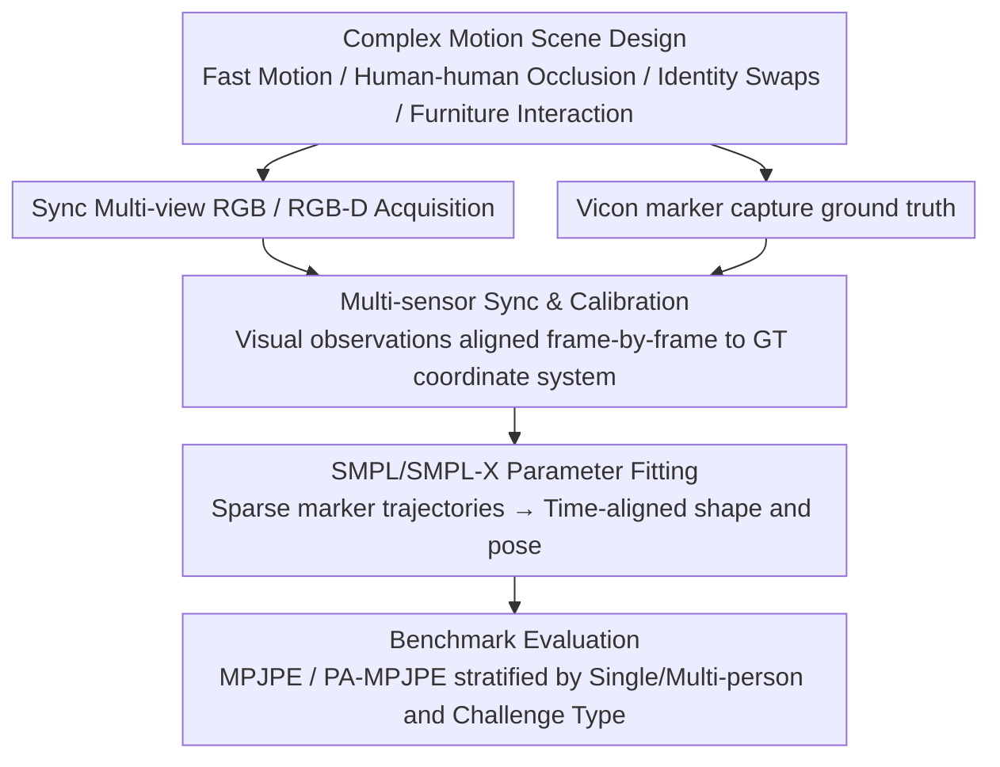

# HUM4D: A Dataset and Evaluation for Complex 4D Markerless Human Motion Capture

**Conference**: CVPR 2026  
**arXiv**: [2604.12765](https://arxiv.org/abs/2604.12765)  
**Code**: None  
**Area**: Human Understanding / Motion Capture  
**Keywords**: Markerless Motion Capture, 4D Human Modeling, Multi-person Interaction, Dataset, SMPL

## TL;DR

The HUM4D dataset is proposed, featuring complex single- and multi-person motion scenarios (fast motion, occlusion, identity swaps). It provides synchronized multi-view RGB/RGB-D sequences, precise Vicon marker-based motion capture ground truth, and SMPL/SMPL-X parameters. Benchmarking reveals significant performance degradation of SOTA markerless methods under realistic conditions.

## Background & Motivation

**Background**: Markerless human motion capture has achieved significant progress, with errors continuously decreasing on benchmark datasets. Datasets such as Human3.6M and CMU Panoptic have driven development in this field.

**Limitations of Prior Work**: High performance on benchmark datasets does not translate to robustness in real-world videos. Existing datasets impose structural constraints: limited clothing variation, controlled indoor environments, moderate motion dynamics, restricted degrees of occlusion, and predominantly single-person capture.

**Key Challenge**: A persistent domain gap exists between benchmark performance and deployment performance. Widely adopted datasets (Human3.6M, CMU Panoptic, HUMAN4D) are nearing saturation in terms of complexity.

**Goal**: To construct a dataset reflecting real-world complexity—multi-person dynamic interactions, severe occlusion, rapid identity swaps, and varying distances—and to conduct a comprehensive benchmark evaluation.

**Key Insight**: Acquiring such a dataset is non-trivial, requiring multi-sensor synchronization, precise calibration, and professional marker-based motion capture alignment.

**Core Idea**: To systematically evaluate the generalization capabilities of SOTA methods in realistic complex scenarios by providing precise ground truth via a Vicon system.

## Method

### Overall Architecture

HUM4D is not a new model but a suite of data and evaluation benchmarks tailored for "testing markerless motion capture under realistic complex conditions." It addresses a direct question: while existing methods have pushed errors very low on controlled datasets like Human3.6M, can they withstand multi-person rapid interactions, severe occlusion, and identity swaps? To provide credible answers, each scene in the dataset simultaneously records two streams: the visual input actually seen by the models (synchronized multi-view RGB and RGB-D sequences with precise camera calibration) and the ground truth that models aim to approximate (precise 3D motion provided by a Vicon marker capture system, further fitted into time-aligned SMPL/SMPL-X parameters). Scenes extend from single-person motion to multi-person interaction, covering rapid position swaps, dynamic occlusion, furniture interaction, and varying subject distances—situations common in the real world but often avoided by older datasets.

### Key Designs

**1. Complex Motion Scene Design: Surfacing difficulties avoided by older datasets**

High scores on older datasets are largely a result of "easy test questions"—limited clothing changes, controlled indoor settings, gentle motion amplitudes, minor occlusion, and mostly single subjects. HUM4D does the opposite, specifically constructing scenarios where SOTA methods genuinely fail in the wild: rapid motion transitions, frequent human-human occlusion, fast position swaps between subjects with similar appearances, and interactions with furniture. This design aims to expose the vulnerabilities hidden behind "benchmark saturation"—interrogating, for example, whether a method can still stably associate a skeleton with the correct person when two people of similar appearance cross paths.

**2. Multi-sensor Sync & Calibration: Enabling frame-by-frame alignment of visual observations and ground truth**

A prerequisite for credible evaluation in multi-person occlusion scenarios is that "the frame seen by the model" must precisely align with "the ground truth recorded by Vicon at that moment"; otherwise, it is impossible to distinguish between method errors and annotation errors. To this end, the dataset synchronizes multi-view RGB and RGB-D sensors in time and performs geometric calibration with the Vicon system. This allows image observations at any given moment to be mapped to the real 3D pose in a unified coordinate system. This engineering foundation of synchronized calibration ensures that degradation figures—such as "+90% for identity swaps" or "+69% for severe occlusion"—are credible reflections of reality rather than artifacts of annotation noise.

**3. SMPL/SMPL-X Parameter Fitting: Translating raw marker ground truth into the language of mainstream research**

Vicon provides 3D trajectories of sparse marker points, which are inconvenient for direct evaluation of parametric human methods. HUM4D further fits SMPL and SMPL-X parameters from the marker data to provide time-aligned 3D shape and pose trajectories. While this appears to be a format conversion, its significance lies in allowing the dataset to integrate seamlessly with current mainstream parametric human modeling frameworks. Researchers can use it for evaluation or as training data to improve model generalization in complex scenes without needing to create their own conversion pipelines.

### Loss & Training

This is a dataset paper and does not involve model training. Evaluation is conducted as a benchmark test on various SOTA methods using standard metrics (MPJPE, PA-MPJPE, etc.), with stratified comparisons by single/multi-person and different challenge types (fast motion, severe occlusion, identity swaps, furniture interaction) to pinpoint where performance degrades most severely.

## Key Experimental Results

### Main Results

| Method | Type | Single-person MPJPE↓ | Multi-person MPJPE↓ | Degradation |
|------|------|-----------|-----------|---------|
| HMR 2.0 | Monocular | 78.5 | 125.3 | +60% |
| WHAM | World-coord | 65.2 | 108.7 | +67% |
| GVHMR | World-coord | 58.3 | 98.5 | +69% |
| 4DHumans | Multi-person | 72.1 | 95.6 | +33% |

### Ablation Study

| Challenge Type | Mean MPJPE↓ | vs. Simple Scene |
|---------|-----------|------------|
| Simple Motion | 62.3 | Baseline |
| Fast Motion | 89.5 | +44% |
| Severe Occlusion | 105.2 | +69% |
| Identity Swap | 118.7 | +90% |
| Furniture Interaction | 95.8 | +54% |

### Key Findings

- SOTA methods show 33%-69% performance degradation in complex multi-person scenarios.
- Identity swapping is the greatest challenge, exposing vulnerabilities in tracking and identity association.
- Multi-view data can significantly improve model generalization performance.

## Highlights & Insights

- Systematically exposes generalization bottlenecks of SOTA methods, providing a clear direction for community improvement.
- The dataset design philosophy, emphasizing real-world variation over studio settings, is worth promoting.
- The provision of SMPL/SMPL-X parameters makes the dataset compatible with a wide range of downstream research.

## Limitations & Future Work

- The authors do not propose a new method; the primary contributions are the dataset and evaluation.
- Details regarding dataset scale and subject diversity (age, body type, ethnicity) require more elaboration.
- Data was collected in indoor environments only.
- Can be used as training data for multi-person motion capture models to enhance generalization.

## Related Work & Insights

- **vs Human3.6M**: Human3.6M primarily features controlled single-person scenes, whereas HUM4D extends to complex multi-person interactions.
- **vs CMU Panoptic**: While Panoptic has dense cameras, its motions are relatively simple; HUM4D introduces fast swaps and severe occlusion.

## Rating

- Novelty: ⭐⭐⭐ Primarily a dataset contribution.
- Experimental Thoroughness: ⭐⭐⭐⭐ Systematic benchmarking of multiple SOTA methods.
- Writing Quality: ⭐⭐⭐⭐ Clear problem articulation.
- Value: ⭐⭐⭐⭐ Provides a significant boost to the motion capture community.

<!-- RELATED:START -->

## Related Papers

- [\[CVPR 2026\] HUMAPS-4D: A Multimodal Dataset for HUman Motion Analysis with Physiological and Semantic informations](humaps-4d_a_multimodal_dataset_for_human_motion_analysis_with_physiological_and_.md)
- [\[CVPR 2026\] MAMMA: Markerless Accurate Multi-person Motion Acquisition](mamma_markerless_accurate_multi-person_motion_acquisition.md)
- [\[CVPR 2026\] Bézier Degradation Modeling for LiDAR-based Human Motion Capture](bézier_degradation_modeling_for_lidar-based_human_motion_capture.md)
- [\[CVPR 2026\] Bi-directional Autoregressive Diffusion for Large Complex Motion Interpolation](bi-directional_autoregressive_diffusion_for_large_complex_motion_interpolation.md)
- [\[ICCV 2025\] HUMOTO: A 4D Dataset of Mocap Human Object Interactions](../../ICCV2025/human_understanding/humoto_a_4d_dataset_of_mocap_human_object_interactions.md)

<!-- RELATED:END -->
