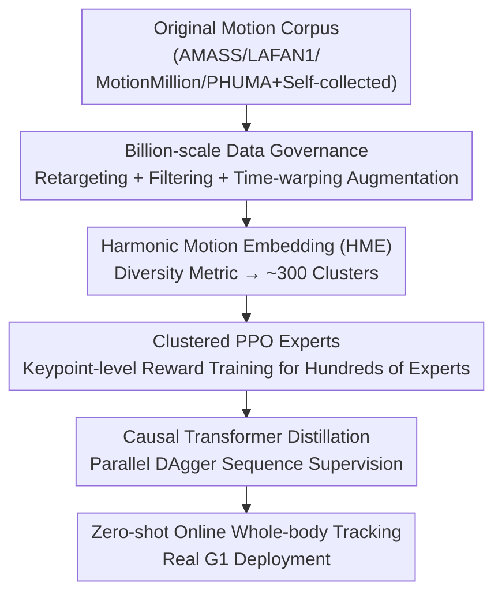

# Humanoid-GPT: Scaling Data and Structure for Zero-Shot Motion Tracking

**Conference**: CVPR 2026  
**arXiv**: [2606.03985](https://arxiv.org/abs/2606.03985)  
**Code**: https://github.com/GalaxyGeneralRobotics/Humanoid-GPT/ (Available)  
**Area**: Humanoid Robotics / Whole-Body Control / Motion Tracking / Scaling Law  
**Keywords**: Humanoid Robot, Motion Tracking, Zero-Shot Generalization, GPT Causal Transformer, Data Scaling

## TL;DR
The whole-body motion tracking of humanoid robots is reformulated as a GPT-style causal sequence modeling problem. This approach involves cluster-training hundreds of PPO experts on a retargeted motion corpus of approximately 2 billion frames, followed by distilling them into a causal-masked Transformer using DAgger. This achieves both high dynamic agility and zero-shot tracking of unseen actions on the real Unitree-G1, while establishing a scaling law for the motion tracking task.

## Background & Motivation
**Background**: In language and vision, generalization capability most reliably comes from "scaling up"—larger data, larger models, and carefully designed training objectives; scaling often unlocks emergent capabilities. However, humanoid motion tracking has not followed this path. Current mainstream trackers are mostly shallow MLPs trained on small-scale motion corpora, with common datasets (AMASS, LAFAN1, etc.) containing only about $10^4$ trajectories and approximately 7.2 million frames.

**Limitations of Prior Work**: The severe mismatch in scale leads to a persistent failure mode—**a tradeoff between agility and generalization**. Trackers that perform well on in-distribution agile movements (e.g., BeyondMimic, ASAP) often fail to generalize zero-shot to unseen movements; those with slightly better generalization (e.g., TWIST, UniTracker) underfit and show soft tracking precision on high-dynamic complex movements.

**Key Challenge**: The authors argue that this tradeoff is not inherent but rather a symptom of **insufficient scale and mismatched training design**. However, simply feeding more segments into the same pipeline is insufficient. When data volume increases by orders of magnitude, three issues become critical: ① how to select and clean massive noisy data; ② which model architecture fits online tracking (causal) constraints while improving continuously with scale; ③ which training recipe remains stable when data grows from millions to billions of frames.

**Goal**: Build a universal, online humanoid motion tracker that possesses both agility and zero-shot generalization, while quantifying "why scaling works" into measurable laws.

**Key Insight**: Online tracking is inherently causal (future observations are unavailable at test time), and shallow MLPs or non-causal modeling saturate early. Therefore, the architecture should be replaced with a GPT-style Transformer that is naturally causal and scales cleanly with data and model size.

**Core Idea**: Treat motion tracking as sequence modeling. Use GPT causal attention to predict PD targets for each joint, distilling the knowledge of hundreds of RL experts into a generative Transformer, and use a balanceable diversity sampling strategy to uniformly feed the long-tail distributions of the billion-scale corpus.

## Method

### Overall Architecture
Humanoid-GPT is a three-stage pipeline: **(a) Data governance and processing** → **(b) Training PPO motion experts on clusters** → **(c) Distilling all experts into a single Transformer generalist policy using parallel DAgger**. The input is a segment of reference motion (which can be unseen, online retargeted human motion), mapped to the 29-DoF joint space of the Unitree-G1. The output is the PD control targets for each robot joint, replicating the reference motion in real-time in a completely zero-shot manner.

The reason for the two-stage approach (experts first, then distillation) is that a single PPO expert can only achieve physical plausibility within its own cluster of motions and degrades sharply when encountering out-of-distribution targets. Uniformly distilling the behaviors of hundreds of experts into a causal Transformer eliminates domain discontinuities and allows performance to scale continuously with data and model size—which is precisely where MLPs fail to learn.

### Key Designs

**1. Billion-scale Motion Corpus Governance: Expanding Noisy Data 200x with Stability**

The limitations correspond directly to the breakdown of pipelines when data scales from millions to billions. The authors aggregated all public MoCap sources (AMASS, LAFAN1, Motion-X++, PHUMA, MotionMillion) plus large-scale self-collected internal data. They used an existing retargeting framework to map each human sequence to the 29-DoF joint space of the G1, explicitly filtering out sequences involving object interaction (sitting, swimming, climbing stairs) to ensure executability on flat ground. To enhance robustness to movement speed, **time-warping augmentation** (uniform acceleration/deceleration) was applied to each sequence, expanding the data by approximately 5x. This resulted in a G1 retargeted corpus of approximately **2 billion frames / tokens**, over $200\times$ larger than previous training sets. Crucially, this scale forced a redesign of reward components and recalibration of sensitive hyperparameters to stabilize training, providing systematic evidence that **video-estimated motion can substantially improve tracking** (whereas such noise sources often hinder performance in small-data regimes).

**2. Harmonic Motion Embedding (HME): Quantifying Diversity and Balancing the Long Tail**

More data does not equate to better generalization; common styles dominate large corpora, and rare but important behaviors vanish in the long tail. HME is a representation learned directly from raw motion: first, several Periodic Autoencoders are trained on different data partitions to extract the periodic amplitude and frequency of each joint. Then, the mean and standard deviation of these joint-level harmonic features are aggregated for each sequence to obtain a compact and descriptive HME vector. Finally, K-Means (using pairwise distance as similarity) is used to cluster the entire corpus into approximately **300 clusters**, each containing about 1k–2k sequences. This ensures intra-cluster consistency and broad global coverage. HME also provides **quantifiable diversity metrics**: given an embedding matrix $X\in\mathbb{R}^{N\times D}$ and covariance $\Sigma$, the geometric mean standard deviation is defined as $\text{gstd}=\exp\!\big(\frac{1}{D}\sum_{j=1}^{D}\log\sigma_j\big)$ and the log-volume as $\text{log-volume}=\tfrac{1}{2}\log\det(\Sigma+\epsilon I)$. The core insight is that **diversity and balance are both indispensable**—diversity without balance leads to overfitting high-frequency patterns, while balance without diversity caps performance. HME enables distribution-balanced, diversity-aware sampling during training.

**3. Clustered PPO Experts + Keypoint-level Rewards: Learning Physically Plausible Motion Priors**

The "teachers" for distillation are PPO policies $\pi:\mathcal{G}\times\mathcal{S}\mapsto\mathcal{A}$ trained on each HME cluster. They map reference joints and proprioceptive observations to low-level motor actions, converted to torques via PD controllers. Rewards are calculated at the **body keypoint level** (arms, hips, feet, pelvis, etc.), aggregating position/orientation/velocity residuals with exponential soft penalties: $R_{\text{kpt}}(t)=R_{\text{pos}}(t)+R_{\text{rot}}(t)+R_{\text{vel}}(t)+R_{\text{penal}}(t)$, where the position term $R_{\text{pos}}(t)=\sum_{k\in\mathcal{K}}w_k\exp(-\alpha_{\text{pos}}\|e^{\text{pos}}_{k,t}\|_1)$, with similar terms for rotation and velocity (using $\mathrm{SO}(3)$ log map error $\theta_{k,t}$ and velocity residual $e^{\text{vel}}_{k,t}$). $R_{\text{penal}}$ includes penalties for self-collision and smoothness. Only high-fidelity, long-term stable experts are retained to form a prior library over heterogeneous motion domains. Keypoint-level rewards were chosen over pure joint-angle rewards to constrain "global accuracy" and "local stability" simultaneously.

**4. Causal Transformer Distillation: Exhaustive Sequence Supervision via Parallel DAgger**

Dispersed experts are merged into a generalist. The distillation stage employs the DAgger framework but is **reformulated as sequence modeling**: at each time step $t$, the proprioceptive state $s_t$ and target reference pose $q_t^{\text{ref}}$ are concatenated into a token $e_t$. A sequence of tokens $\{e_{t-H+1},\dots,e_t\}$ of length $H$ is fed into a Transformer $G_\theta$ with a **temporal causal mask**. After a forward pass, the actions at all output positions are supervised by the corresponding teacher's output on that history: $\hat{a}_{t-H+1:t}=\bigcup_{t_i\in\mathcal{T}}\operatorname{concat}_{k\in[-H+1,0]} t_i(s_{t-k}^{priv.},g_{t-k})$. The loss uses SmoothL1: $l=\mathcal{L}(G_\theta(e_{t-H+1:t}),\hat{a}_{t-H+1:t})$. Thus, **a single forward pass receives DAgger feedback across multiple timesteps**, fully utilizing the parallel sequence supervision advantages of the Transformer. During inference, a queue of historical tokens up to length $H$ is maintained, and the last output is used as the current control target. An additional benefit is that tokens at different positions attend to different history lengths, allowing the model to implicitly learn **position-invariant temporal prediction**, outputting stable control even when history is scarce at the beginning of an episode—a causal design effectively aligned with online deployment constraints.

### Loss & Training
In the expert stage, PPO optimizes keypoint-level rewards (Eq. 1). Evaluation uses root pose error, velocity error, and stable tracking duration, retaining only experts that converge to physical consistency. In the distillation stage, DAgger + SmoothL1 loss (Eq. 2) is used for parallel multi-step supervision over a causal window of length $H$. For deployment, the model is exported to ONNX, compiled via TensorRT, and low communication latency is maintained through a C++ streaming pipeline, achieving an end-to-end inference latency of < 1.5ms on a single RTX 4090, approximately 5x faster than TWIST.

## Key Experimental Results

### Main Results
The backbone architecture and scaling effects were evaluated in MuJoCo simulation on AMASS-test (a subset unseen during training). Metrics: Success Rate (SR, ratio of non-falls), Mean Per-Joint Position Error (MPJPE, rad), Mean Per-Joint Velocity Error (MPJVE, rad/s), Root Velocity Error (m/s), and Mean Per-Keypoint Position Error (MPKPE, mm).

| Backbone | Training tokens | Params (M) | SR ↑ | MPJPE ↓ | MPJVE ↓ | RootVelErr ↓ | MPKPE ↓ |
|----------|-----------------|------------|------|---------|---------|--------------|---------|
| MLP (3 layers) | 2M | 0.25 | 76.89 | 0.1191 | 0.6081 | 0.2304 | 100.49 |
| TCN (8 layers) | 2M | 0.65 | 81.48 | 0.0885 | 0.5716 | 0.2266 | 79.75 |
| Humanoid-GPT-S | 2M | 5.7 | 83.26 | 0.0853 | 0.5492 | 0.2049 | 62.65 |
| Humanoid-GPT-S | 20M | 5.7 | 86.02 | 0.0802 | 0.5210 | 0.1868 | 46.49 |
| Humanoid-GPT-B | 200M | 22.1 | 88.27 | 0.0793 | 0.5076 | 0.1820 | 44.78 |
| Humanoid-GPT-B | 2B | 22.1 | 90.43 | 0.0768 | 0.4891 | 0.1756 | 41.49 |
| Humanoid-GPT-L | 2B | 80.4 | **92.58** | **0.0735** | **0.4820** | 0.1785 | **40.99** |

The largest Humanoid-GPT-L (2B tokens, 80.4M parameters) achieves the best performance across almost all metrics, with an SR of 92.58%. While MLP/TCN also benefit from scaling, they exhibit two flaws: **early saturation of data scaling** (TCN-L only reaches 89.05% SR at 2B tokens, with marginal gains from 200M to 2B); and **overfitting of large models on small data** (at 2M tokens, MLP-L 75.25% < MLP-S 76.89%, and TCN-L 79.85% < TCN-S 81.48%). Even the best baseline, TCN-L, has an MPKPE of 56.15mm, which lags behind Humanoid-GPT-S (43.25mm) by about 30%.

### Real-world Evaluation
Four high-dynamic dance sequences completely unseen during training were tracked on a real Unitree-G1:

| Backbone | Can Do Can Go! MPJPE | Gokuraku Joudo MPJPE | HuoYuanJia MPJPE | PokerFace MPJPE |
|----------|----------------------|----------------------|------------------|-----------------|
| GMT | 0.1087 | 0.1098 | 0.0921 | 0.0994 |
| TWIST | 0.1253 | 0.1162 | 0.1079 | 0.1047 |
| Any2Track | 0.1039 | 0.1136 | 0.0956 | 0.0928 |
| Humanoid-GPT-S | 0.1024 | 0.1180 | 0.0825 | 0.0903 |
| Humanoid-GPT-B | **0.0974** | **0.1075** | 0.0858 | **0.0856** |

Real-world performance aligns closely with simulation, validating strong zero-shot sim-to-real transfer. Online teleoperation (real-time MoCap stream retargeted to G1) also followed movements like squatting, stepping, turning, and leaning without additional calibration.

### Key Findings
- **Architecture is the key to scaling**: Transformers consistently improve with data/model scale, while MLPs of equivalent parameters saturate early—this is the direct benefit of reformulating tracking as sequence modeling.
- **Diversity and balance are both indispensable**: The authors used HME's gstd / log-volume to quantify dataset diversity; their curated large corpus has log-volume values ~4–5 higher than AMASS, and broader latent space coverage directly translates into stronger zero-shot priors.
- **Signals of diminishing returns in data scaling**: The gain between 200M and 2B tokens slightly decreased, suggesting the model enters a "data-constrained" regime at current capacities, requiring model enlargement to fully utilize more data.
- **Engineering feasibility**: The ONNX+TensorRT+C++ streaming pipeline reduced end-to-end latency to < 1.5ms (RTX 4090), ~5x faster than TWIST, proving that scaling models does not necessitate sacrificing real-time performance.

## Highlights & Insights
- **Reframing the tradeoff as "insufficient scale" rather than "inherent conflict"**: Previous works assumed agility and generalization were mutually exclusive. This paper uses 200x data + Causal Transformer to prove both can be achieved simultaneously, representing a conceptual reframe.
- **HME makes "diversity" measurable and sampleable**: Extracting harmonic features via periodic autoencoders followed by clustering provides a basis for clustering and comparable metrics like gstd/log-volume. This is far more substantial than vague claims of "diverse data" and can be migrated to any sequence dataset requiring long-tail balancing.
- **Parallel DAgger sequence supervision**: Performing teacher feedback across $H$ timesteps in a single forward pass combines Transformer parallelism with DAgger's online correction, offering significant efficiency when distilling hundreds of experts.
- **Position-invariant temporal prediction is an implicit benefit of causal design**: Different token positions focusing on varied history lengths allows the model to output stable control even when history is scarce—this is a elegant integration of online deployment constraints into the architecture.

## Limitations & Future Work
- **Single hardware platform**: All experiments were conducted on the 29-DoF Unitree-G1; generalization across morphologies (different DoFs/different humanoids) has not been verified.
- **Exclusion of object interactions**: To ensure flat-ground executability, the governance stage explicitly removed interactions like sitting, climbing, or swimming, meaning the system does not cover contact-rich manipulation tasks.
- **Data-constrained signals have emerged**: Diminishing returns from 200M to 2B tokens suggest that simply stacking data is providing shrinking rewards; the authors acknowledge the need for larger models.
- **Lack of multi-modal input**: Currently, the model only processes proprioceptive states + reference poses. The authors envision introducing contact, vision, and language modalities, potentially coupling with long-term planning or VLA-style instructions toward more general embodied foundation models.

## Related Work & Insights
- **vs SONIC**: SONIC scales MLP controllers to 100M frames, but MLP capacity saturates. This work uses 2B frames + Causal Transformer, replacing the "architectural ceiling" of SONIC to achieve higher zero-shot accuracy.
- **vs HumanPlus**: HumanPlus also uses a Transformer controller but only trains on limited motion duration via standard PPO, missing the advantages of parallel sequence supervision. This work maximizes that advantage via parallel DAgger distillation.
- **vs GMT / UniTracker**: GMT uses MoE-MLP + adaptive sampling, and UniTracker uses a CVAE teacher-student framework; both improve coverage but are limited by motion scale (~6–9M frames). This work addresses both data scale (2B) and architecture (Causal Transformer) to continue improving where MLPs saturate.
- **vs TWIST / ASAP / BeyondMimic**: These methods are either agile but not zero-shot (ASAP, BeyondMimic) or generalizes but are weak on high dynamics (TWIST). This paper is the first to achieve both while reformulating tracking as GPT-style sequence modeling with defined scaling laws.

## Rating
- Novelty: ⭐⭐⭐⭐⭐ First to reframe humanoid motion tracking as GPT-style sequence modeling with 200x data + scaling laws; HME diversity metrics are a functional new tool.
- Experimental Thoroughness: ⭐⭐⭐⭐ Complete scaling tables in simulation, with zero-shot dance and online teleoperation on real G1, though limited to single hardware and lacks contact tasks.
- Writing Quality: ⭐⭐⭐⭐⭐ Problem-driven with clear motivation-method-experiment logic; scaling arguments are solid.
- Value: ⭐⭐⭐⭐⭐ Provides a quantifiable scaling roadmap for whole-body control; real hardware zero-shot + <1.5ms latency has strong deployment significance.

<!-- RELATED:START -->

## Related Papers

- [\[CVPR 2026\] ProjFlow: Projection Sampling with Flow Matching for Zero-Shot Exact Spatial Motion Control](projflow_projection_sampling_with_flow_matching_for_zero-shot_exact_spatial_moti.md)
- [\[CVPR 2026\] HandDreamer: Zero-Shot Text to 3D Hand Model Generation](handdreamer_zero_shot_text_to_3d_hand_model_generation.md)
- [\[CVPR 2026\] HandX: Scaling Bimanual Motion and Interaction Generation](handx_scaling_bimanual_motion_and_interaction_generation.md)
- [\[CVPR 2026\] LLaMo: Scaling Pretrained Language Models for Unified Motion Understanding and Generation with Continuous Autoregressive Tokens](llamo_scaling_pretrained_language_models_for_unified_motion_understanding_and_ge.md)
- [\[CVPR 2026\] OpenT2M: No-frill Motion Generation with Open-source, Large-scale, High-quality Data](opent2m_no-frill_motion_generation_with_open-source_large-scale_high-quality_dat.md)

<!-- RELATED:END -->
