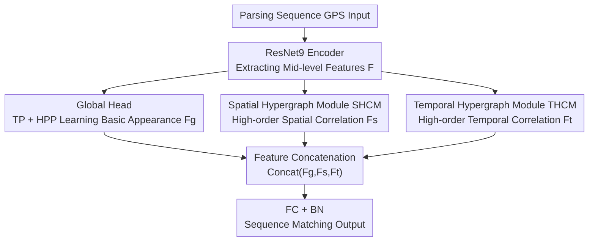

# HyperGait: Unleashing the Power of Parsing for Gait Recognition in the Wild via Hypergraph

**Conference**: CVPR 2026  
**Paper**: [CVF Open Access](https://openaccess.thecvf.com/content/CVPR2026/html/Zheng_HyperGait_Unleashing_the_Power_of_Parsing_for_Gait_Recognition_in_CVPR_2026_paper.html)  
**Code**: None (Not publicly available)  
**Area**: Human Understanding / Gait Recognition  
**Keywords**: Gait Recognition, Human Parsing, Hypergraph Convolution, High-order Correlation, Unimodal

## TL;DR
HyperGait utilizes **hypergraph convolution** to extract "high-order nonlinear correlations" among body parts and across temporal frame segments within gait parsing sequences (GPS). Using only the single parsing modality as input, it achieves a 80.5% Rank-1 accuracy on the real-world Gait3D dataset, surpassing the previous parsing-based SOTA (MultiGaitP) by 4.1 percentage points.

## Background & Motivation
**Background**: Gait recognition is transitionary from laboratory environments to real-world scenarios. To handle random occlusions, irregular walking, and arbitrary viewpoints, various representations have been proposed—binary silhouettes, optical flow, skeletons, point clouds, and 3D SMPL. Among these, **Gait Parsing Sequences (GPS, partitioning the body into semantic parts) possess the highest information entropy**. Replacing silhouettes with parsing can improve Rank-1 accuracy for most methods by 12.5%~19.2%.

**Limitations of Prior Work**: Existing parsing-based gait methods are dominated by CNNs and GCNs, which only model **pairwise, local, and linear** relationships. CNNs struggle to capture global part-level structures, while the fixed binary edges (one edge connecting two nodes) and static graph structures of GCNs are ill-suited for view changes, self-occlusion, and cross-frame temporal connections. Consequently, the high information entropy of the parsing modality is underutilized.

**Key Challenge**: The truly discriminative information in gait lies in **high-order (one-to-many, many-to-many) correlations**, such as the "simultaneous coordination of head-torso-limbs" and "cross-frame linkages between parts separated by multiple frames." Pairwise graphs or local convolutions naturally fail to represent relationships where "one edge connects an arbitrary number of vertices."

**Goal**: To maximize the extraction of high-order spatial and temporal correlations from a single parsing representation (avoiding the complex data processing of multi-modality), achieving or exceeding the precision and efficiency of multi-representation methods.

**Key Insight**: A hypergraph's **hyperedge can connect an arbitrary number of vertices**, making it naturally suited for modeling multi-way interactions among multiple parts or frames. While hypergraphs have proven effective in object detection (HyperYolo) and action recognition (HyperSA, HyperMV), they have not yet been applied to gait recognition.

**Core Idea**: Replace CNN/GCN with hypergraph convolution. Construct and convolve **adaptive hypergraphs** respectively for body parts in the spatial dimension and frame segments in the temporal dimension to explicitly model high-order correlations.

## Method

### Overall Architecture
The input is a gait parsing sequence (GPS) $X=\{x_i\}_{i=1}^S$. First, a ResNet9-style encoder extracts mid-level features $F_i = \mathcal{F}(x_i)$. Subsequently, $F_i$ is processed in three parallel branches: the **Global Head** learns basic appearance features $F_g$; the **SHCM** (Spatial Hypergraph Convolution Module) learns high-order spatial features among parts $F_s$; and the **THCM** (Temporal Hypergraph Convolution Module) learns high-order temporal features across segments $F_t$. Finally, the three branches are concatenated $F_{out}=\text{Concat}(F_g, F_s, F_t)$ and passed through a fully connected layer with BN for sequence-to-sequence matching.

### Key Designs

**1. Global Head: Anchoring Basic Appearance with Simple Pooling**

To mitigate the risk of losing global shape information when focusing purely on high-order correlations, the Global Head performs basic operations: Temporal Pooling (TP, max pooling across the temporal dimension) compresses the sequence into a single-frame feature, followed by Horizontal Pyramid Pooling (HPP, horizontal slicing + max/mean pooling) to obtain refined strip features: $F^i_g = H(T(F_i))$. It learns fundamental human appearance and acts as a baseline branch complementary to the hypergraph branches—the hypergraphs mine high-order correlations while the Global Head ensures global shape preservation.

**2. SHCM (Spatial Hypergraph Convolution Module): Capturing Part-level Coordination via Adaptive Hyperedges**

To address the inability of GCNs to connect more than two parts and the difficulty of fixed graphs in adapting to view/occlusion, SHCM constructs an **adaptive spatial hypergraph based on feature similarity** at the part level. Following ParsingGait, 11 fine-grained parts are merged into 5 coarse parts. Part features are extracted using parsing masks, pooled into part vectors $Z_p$, and normalized. Pairwise Euclidean distances $D_{ij}=\|\hat{Z}_i-\hat{Z}_j\|_2$ are calculated, and the incidence matrix connects parts based on an **adaptive threshold**: $h_{ij}=1$ when $D_{ij}<\tau$, where $\tau=\min(\tau_0, 1.5\cdot\text{mean}(D))$ adjusts automatically to feature distributions. Hypergraph convolution is then performed: $Z'=D_v^{-1/2}HW_eD_e^{-1}H^TW_vD_v^{-1/2}\Theta(Z)$, followed by residual connection and BN: $Z_{out}=\text{ReLU}(\text{BN}(Z'+Z))$. Final features $F^i_s$ are obtained via temporal pooling. A single hyperedge can connect multiple parts simultaneously, capturing multi-part coordination that pairwise GCN edges cannot.

**3. THCM (Temporal Hypergraph Convolution Module): Modeling Cross-frame Linkage via kNN Hyperedges**

To overcome the limitations of simple temporal pooling and insufficient modeling of frame relationships, THCM first divides the sequence of length $S$ into $K$ temporal segments. The segment representation $T_k$ is formed by aggregating part features of frames within each segment. Unlike the distance threshold used in SHCM, the **temporal hypergraph uses a k-Nearest Neighbor (kNN) strategy**, where each segment connects to its $k_{nn}$ nearest neighbors (including itself): $h_{ij}=1$ if $j$ is a kNN of $i$. Hypergraph convolution is applied: $T'=D_v^{-1/2}HW_eD_e^{-1}H^TW_vD_v^{-1/2}\Theta(T)$, with a residual connection $F^i_t=\text{ReLU}(\text{BN}(T'+T))$. This allows distant but motion-correlated segments to be aggregated by a single hyperedge, explicitly modeling high-order cross-frame coordination—the most critical yet implicit information in gait periodicity.

### Loss & Training
The concatenated output of the three branches passes through a fully connected layer with BN to generate the final gait features. The backbone is ResNet9 (channels [64, 128, 256, 512], layers [1, 2, 2, 1]). Training uses SGD (initial lr 0.1, momentum 0.9, weight decay 5e-4) with a fixed 30-frame input and RandomHorizontalFlip/Rotate (p=0.2) augmentation. SHCM/THCM each use 1 hypergraph convolution layer. The spatial threshold $\tau_0=0.4$; the temporal hypergraph uses 10 segments and 3-NN. Parsing is grouped into 5 coarse parts (Head-Torso, L/R Upper Limbs, L/R Lower Limbs). Gait3D is trained for 120k iterations with a batch size of 32×2; SUSTech1K is trained for 50k iterations with a batch size of 8×8.

## Key Experimental Results

### Main Results
HyperGait achieves SOTA on two large-scale real-world datasets using only parsing input, outperforming the previous unimodal parsing SOTA, MultiGaitP.

| Dataset | Metric | Ours | MultiGaitP (Prev. SOTA) | Gain |
|--------|------|-----------|----------------------|------|
| Gait3D | Rank-1 | **80.5%** | 76.4% | +4.1 |
| Gait3D | mAP | **72.7%** | 68.7% | +4.0 |
| Gait3D | mINP | **54.3%** | 49.6% | +4.7 |
| SUSTech1K | Rank-1 (Overall) | **79.9%** | 77.3% | +2.6 |
| SUSTech1K | Rank-5 (Overall) | **93.0%** | 91.3% | +1.7 |

### Ablation Study
A component-wise validation on Gait3D shows that SHCM and THCM improve the baseline (Backbone + Global Head) by 1.0 and 2.2 points, respectively. They also outperform their standard GCN counterparts (S-GCN, T-GCN) by 0.5 and 1.1 points, proving that hypergraph convolution is superior to pairwise graph convolution. The combination of both yields a 4.8-point gain over the baseline and a 2.4-point gain over the S-GCN + T-GCN combination.

| Configuration | Rank-1 | mAP | mINP | Description |
|------|--------|-----|------|------|
| Baseline (Backbone + Global Head) | 75.7 | 68.1 | 49.8 | Basic Appearance Only |
| Baseline + S-GCN + T-GCN | 78.1 | 71.1 | 49.9 | Standard GCN Version |
| Baseline + SHCM | 76.7 | 69.6 | 51.4 | Spatial Hypergraph Only |
| Baseline + THCM | 77.9 | 70.7 | 52.3 | Temporal Hypergraph Only |
| Baseline + SHCM + THCM (Full) | **80.5** | **72.7** | **54.3** | Full Model |

### Key Findings
- **THCM contributes more than SHCM**: Adding THCM alone (+2.2) is more effective than SHCM alone (+1.0), indicating that "cross-frame high-order temporal correlation" is more discriminative than "inter-part spatial correlation"—consistent with gait being a periodic temporal signal.
- **Hypergraphs outperform Graphs**: In both spatial and temporal dimensions, hypergraph versions (SHCM/THCM) consistently outperform GCN versions (S/T-GCN), validating that "one-to-many hyperedges" represent high-order associations better than pairwise edges.
- **Spatial hypergraphs should be sparse**: A threshold of $\tau_0=0.4$ is optimal; accuracy drops if it is too high or too low, suggesting sparse graphs effectively connect key parts while filtering noise.
- **Optimal segment and neighbor counts**: 10 segments and 3-NN are found to be best; too few segments or too many neighbors degrade performance, highlighting the need for balanced temporal granularity.

## Highlights & Insights
- **First introduction of hypergraphs to gait recognition**: Leveraging the "hyperedge connects any number of vertices" property to unify the modeling of high-order spatial and temporal coordination. This approach is clean and transferable to other human-centric temporal tasks.
- **Asymmetric graph construction**: The authors used different strategies—distance thresholds for spatial parts (fewer nodes, adaptive sparsity) and kNN for temporal segments (more nodes, guaranteed neighboring)—selecting construction methods based on the specific characteristics of each dimension.
- **Unimodal beating multimodal**: In a trend toward multi-representation fusion, HyperGait proves that fully exploiting a single high-entropy representation (parsing) can achieve SOTA results, reducing data processing overhead and favoring efficient deployment.

## Limitations & Future Work
- **Clothing variation (CL) remains a weakness**: On SUSTech1K under CL conditions, HyperGait achieves only 39.6%, trailing behind MultiGaitP and GaitHeat, indicating limited robustness of parsing to change in attire.
- **Dependence on parsing quality**: Since SUSTech1K lacks official parsing, it requires extraction via CDGNet; errors in the parser propagate to recognition, leading to incorrect high-order correlations.
- **Heuristic construction**: SHCM/THCM use only 1 layer, and parameters (thresholds, segments, kNN) are determined via grid search rather than end-to-end learnable mechanisms.
- ⚠️ Refer to the original paper's tables for full SOTA comparisons on Gait3D and specific sub-conditions on SUSTech1K.

## Related Work & Insights
- **vs ParsingGait**: Also uses parsing parts but relies on GCNs (fixed binary edges, fixed structure), which struggle with viewpoint changes and omit temporal linkages; HyperGait upgrades pairwise relations to high-order relations via adaptive hypergraphs.
- **vs MultiGaitP**: The previous unimodal parsing SOTA but lacks explicit high-order spatial-temporal modeling; HyperGait outperforms it on Gait3D/SUSTech1K by 4.1/2.6 points respectively.
- **vs Skeleton GCNs (GaitGraph / GPGait / SkeletonGait)**: These model joints as nodes and limbs as edges. They are limited by keypoint detection accuracy and pairwise edges; HyperGait utilizes semantic parts and hyperedges for higher information entropy and expression.

## Rating
- Novelty: ⭐⭐⭐⭐ First application of hypergraphs to parsing-based gait recognition; asymmetric spatial-temporal hypergraphs are a novel concept.
- Experimental Thoroughness: ⭐⭐⭐⭐ SOTA results on two major datasets with comprehensive ablation and construction strategy analysis.
- Writing Quality: ⭐⭐⭐⭐ Clear framework and formulas; hypergraph construction is well-explained.
- Value: ⭐⭐⭐⭐ Demonstrates the power of unimodal parsing and introduces a transferable hypergraph paradigm for real-world gait recognition.

<!-- RELATED:START -->

## Related Papers

- [\[CVPR 2026\] MMGait: Towards Multi-Modal Gait Recognition](mmgait_multi_modal_gait_recognition.md)
- [\[CVPR 2026\] EventGait: Towards Robust Gait Recognition with Event Streams](eventgait_towards_robust_gait_recognition_with_event_streams.md)
- [\[CVPR 2026\] Text-guided Feature Disentanglement for Cross-modal Gait Recognition](text-guided_feature_disentanglement_for_cross-modal_gait_recognition.md)
- [\[CVPR 2026\] Unlocking Motion from Large Vision Models with a Semantic and Kinematic Duality for Gait Recognition](unlocking_motion_from_large_vision_models_with_a_semantic_and_kinematic_duality_.md)
- [\[CVPR 2026\] MS^2Gait: A Multi-Scale Spatio-Temporal Fusion Network for LiDAR-based Gait Recognition](ms2gait_a_multi-scale_spatio-temporal_fusion_network_for_lidar-based_gait_recogn.md)

<!-- RELATED:END -->
