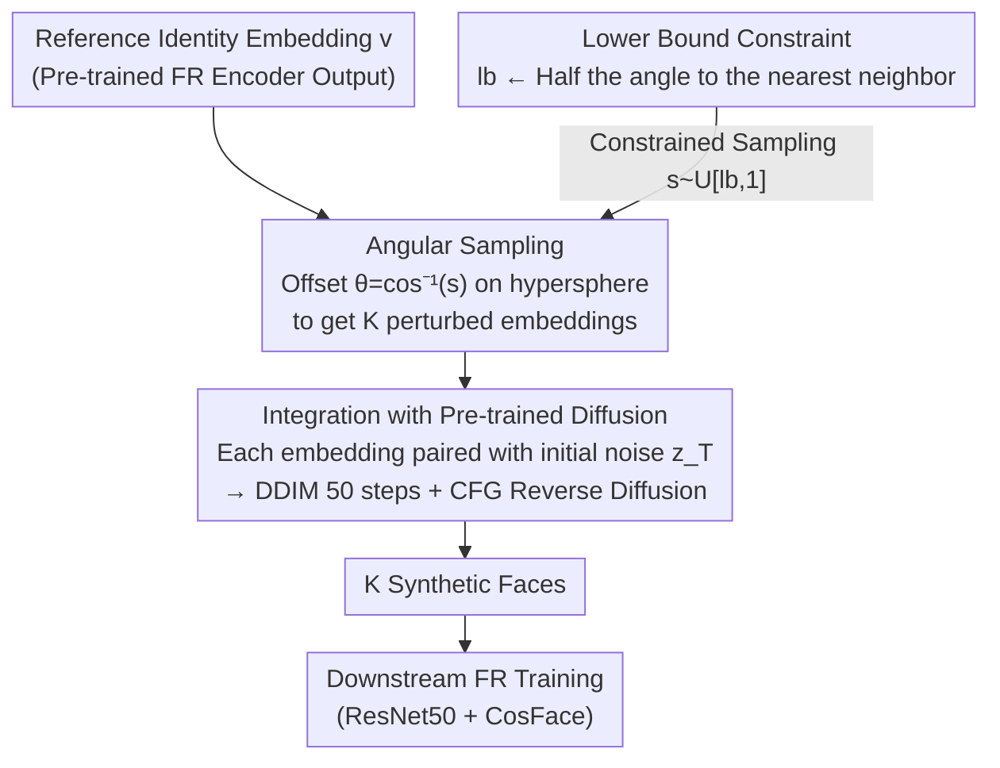

# IDperturb: Enhancing Variation in Synthetic Face Generation via Angular Perturbations

**Conference**: CVPR 2026  
**arXiv**: [2602.18831](https://arxiv.org/abs/2602.18831)  
**Code**: [GitHub](https://github.com/fdbtrs/IDiff-Face) (based on IDiff-Face)  
**Area**: Image Generation / Face Recognition  
**Keywords**: Synthetic Faces, Identity Perturbation, Angular Sampling, Diffusion Models, Face Recognition

## TL;DR

Proposes IDperturb, a geometric sampling strategy that performs angular perturbations on identity embeddings on the unit hypersphere. It significantly enhances the intra-class diversity of synthetic face datasets without modifying generative models, thereby improving downstream face recognition performance.

## Background & Motivation

Synthetic face data has become a privacy-friendly alternative for training face recognition (FR) systems. Identity-conditioned diffusion models (e.g., IDiff-Face, DCFace) can generate realistic and identity-consistent face images, but they generally suffer from **Limitations of Prior Work**: insufficient intra-class variation—images generated for the same identity are often too similar in terms of age, expression, and pose, leading to inadequate generalization of the trained FR models.

Existing methods increase diversity by introducing additional label conditions (ID3), learning style modules (DCFace), or iteratively optimizing embeddings (HyperFace). However, these methods either require modifying model architectures, auxiliary labels, or high computational costs. The **Key Insight** of this paper is: **the geometric structure of the identity embedding space itself can be exploited to introduce diversity** without any modifications to the generative model.

## Method

### Overall Architecture

IDperturb addresses a specific pain point: the "intra-class variation is too small" in synthetic faces generated by identity-conditioned diffusion models. It is a **purely geometric-driven** inference-time sampling strategy that works entirely within the embedding space of pre-trained identity-conditioned diffusion models. Given a reference identity embedding $\mathbf{v}$, it samples a set of perturbed embeddings $\{\tilde{\mathbf{v}}_k\}_{k=1}^K$ within a constrained angular cone around it, and each perturbed embedding is used as a condition to generate a face image.

### Key Designs

**1. Angular Sampling: Controlled angular offsets on the unit hypersphere to introduce variation while preserving identity**

The key to increasing diversity without losing identity is to change "within measure." IDperturb first samples a target cosine similarity $s \sim \mathcal{U}[\mathbf{lb}, 1]$, corresponding to an angle $\theta = \cos^{-1}(s)$. It then samples random noise $\mathbf{n} \sim \mathcal{N}(0, \mathbf{I})$ and projects it onto the orthogonal hyperplane of $\mathbf{v}$ to obtain a unit vector $\mathbf{u}$. Finally, the perturbed embedding is constructed as:

$$\tilde{\mathbf{v}} = \cos(\theta) \cdot \mathbf{v} + \sin(\theta) \cdot \mathbf{u}$$

This construction ensures $\|\tilde{\mathbf{v}}\| = 1$ (norm maintenance) and $\langle \tilde{\mathbf{v}}, \mathbf{v} \rangle = \cos(\theta) = s$ (precise angular control). It is effective because cosine similarity in the FR embedding space corresponds strongly to identity semantics—shifting by a small controllable angle on the hypersphere introduces variations in age, pose, etc., while maintaining the same identity.

**2. Lower Bound Constraint: Mathematically preventing identity overlap via "halving the angle"**

The parameter $\mathbf{lb}$ determines the maximum allowable angular offset. A smaller $\mathbf{lb}$ increases variation but may collapse identity consistency. To prevent the perturbation from encroaching on other identities, IDperturb dynamically adjusts the lower bound:

$$\mathbf{lb} \leftarrow \max\left(\mathbf{lb}, \max_{j \neq i} \cos\left(\frac{\angle(\mathbf{v}_i, \mathbf{v}_j)}{2}\right)\right)$$

This sets the lower bound to "half the angle to the nearest neighbor identity," ensuring that the perturbed embedding is always closer to the original identity than any other. This provides a clean geometric guarantee, embedding the "non-overlapping identity" requirement directly into the constraint.

**3. Integration with Pre-trained Diffusion: Plug-and-play with almost zero overhead**

IDperturb does not modify the model; it integrates directly with pre-trained LDMs (e.g., IDiff-Face). For each identity, it generates $K$ perturbed embeddings, each paired with different initial noise $\mathbf{z}_T$, and produces images through 50-step DDIM sampling + Classifier-Free Guidance. The extra overhead is minimal—performing 50 perturbations per identity takes only 0.01 seconds on an M3 CPU.

### Loss & Training

IDperturb itself does not involve training; it is an inference-time sampling strategy. Downstream FR training utilizes ResNet50 + CosFace loss ($margin=0.35, scale=64$), optimized by SGD for 34 epochs with an initial learning rate of 0.1.

## Key Experimental Results

### Main Results

FR verification accuracy (%) on the IDiff-Face (C-WF) baseline:

| Dataset | Metric | IDperturb (lb=0.6) | Baseline (No Perturbation) | Gain |
|--------|------|-------|----------|------|
| LFW | Acc | 99.40 | 98.75 | +0.65 |
| AgeDB-30 | Acc | 93.20 | 88.85 | +4.35 |
| CFP-FP | Acc | 93.61 | 91.61 | +2.00 |
| CA-LFW | Acc | 93.50 | 90.90 | +2.60 |
| CP-LFW | Acc | 88.37 | 86.15 | +2.22 |
| **Average** | Acc | **93.62** | 91.25 | **+2.37** |

Comparison with SOTA: Under the same setting (DGM trained on C-WF), IDperturb outperforms all competing methods with an average accuracy of 93.62%.

### Ablation Study

| Config | Average Acc | Description |
|------|---------|------|
| lb=0.9 | 92.68 | Small perturbation, limited gain |
| lb=0.8 | 93.31 | Moderate perturbation |
| lb=0.7 | 93.44 | Near optimal |
| **lb=0.6** | **93.62** | **Optimal balance point** |
| lb=0.5 | 93.56 | Slight decline starts |
| lb=0.4 | 93.36 | Decline in identity consistency |
| Baseline | 91.25 | No perturbation |

CFG strength ablation (lb=0.6): $\omega=2$ reaches the optimum (93.63%); excessively large $\omega$ limits diversity.

### Key Findings

- Lowering lb monotonically increases intra-class diversity ($D_{intra}$) but decreases intra-class consistency ($C_{intra}$), with the optimal balance at lb=0.6.
- At lb=0.6, age entropy, expression entropy, and head pose STD are all close to the real dataset C-WF.
- While perturbations only act on the embedding space, they implicitly promote diversification in pose, age, expression, and other aspects.

## Highlights & Insights

1. **Extreme Simplicity**: The method is merely a geometric operation—angular sampling on a hypersphere—requiring no model changes, no extra labels, and no training, with nearly zero computational overhead.
2. **Mathematical Elegance**: Utilizes hypersphere geometry to guarantee norm invariance and precise angular control. The "halving the angle" strategy to avoid identity overlap also has a rigorous geometric interpretation.
3. **High Versatility**: Can be used as a plug-and-play strategy for any identity-conditioned diffusion model, validated effectively on both FFHQ and C-WF baselines.

## Limitations & Future Work

1. At lower lb (e.g., 0.4), identity consistency for some samples decreases significantly, and EER increases markedly.
2. Currently validated only on IDiff-Face; stronger baselines like Arc2Face have not been tested.
3. The direction of angular sampling is uniform and random, failing to exploit the semantic structure where different directions in the embedding space correspond to different attribute variations.
4. Targeted only at 2D face synthesis; extension to 3D faces or general image generation needs verification.

## Related Work & Insights

- **IDiff-Face / UIFace**: Baseline diffusion models on which IDperturb provides plug-and-play performance improvements.
- **DCFace**: Increases diversity by learning style embeddings; more complex but potentially captures richer variations.
- **HyperFace**: Iteratively optimizes embedding space sampling, with higher computational costs.
- **Insight**: The geometric structure of hypersphere embedding spaces can be exploited more deeply—for example, non-uniform sampling along specific directions (corresponding to age, pose, etc.) or extending this logic to other conditional generation tasks (e.g., style transfer, text-to-image).

## Rating

- Novelty: ⭐⭐⭐⭐ Solves the diversity problem from a purely geometric perspective with a simple yet effective approach.
- Experimental Thoroughness: ⭐⭐⭐⭐ Very comprehensive, covering multiple baselines, benchmarks, and multi-perspective ablations (diversity/consistency/attributes/separability).
- Writing Quality: ⭐⭐⭐⭐ Clear mathematical derivations, intuitive illustrations, and well-organized experiments.
- Value: ⭐⭐⭐⭐ Provides a zero-cost, plug-and-play method to improve synthetic face data quality, with direct practical value for FR training in privacy-protected scenarios.

<!-- RELATED:START -->

## Related Papers

- [\[AAAI 2026\] SOSControl: Enhancing Human Motion Generation through Saliency-Aware Symbolic Orientation and Timing Control](../../AAAI2026/human_understanding/soscontrol_enhancing_human_motion_generation_through_saliency-aware_symbolic_ori.md)
- [\[CVPR 2026\] PC-Talk: Precise Facial Animation Control for Audio-Driven Talking Face Generation](pc-talk_precise_facial_animation_control_for_audio-driven_talking_face_generatio.md)
- [\[CVPR 2026\] Goldilocks Test Sets for Face Verification](goldilocks_test_sets_for_face_verification.md)
- [\[CVPR 2026\] FrankenMotion: Part-level Human Motion Generation and Composition](frankenmotion_part-level_human_motion_generation_and_composition.md)
- [\[CVPR 2026\] FloodDiffusion: Tailored Diffusion Forcing for Streaming Motion Generation](flooddiffusion_tailored_diffusion_forcing_for_streaming_motion_generation.md)

<!-- RELATED:END -->
