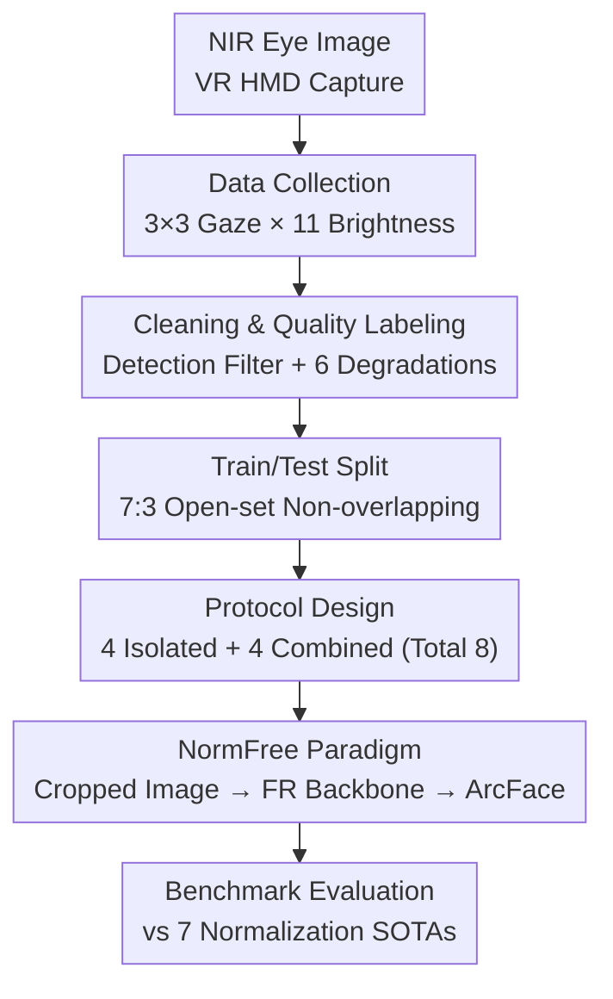

# ImmerIris: A Large-Scale Dataset and Benchmark for Off-Axis and Unconstrained Iris Recognition in Immersive Applications

**Conference**: CVPR 2026  
**arXiv**: [2510.10113](https://arxiv.org/abs/2510.10113)  
**Code**: To be confirmed (Paper promises to release the dataset)  
**Area**: Biometric Recognition / Dataset and Benchmark / Iris Recognition  
**Keywords**: Iris recognition, immersive applications, off-axis imaging, normalization-free, face recognition paradigm

## TL;DR
The authors created ImmerIris, a large-scale dataset for "off-axis and unconstrained" iris recognition in XR/VR HMD scenarios, containing 499,800 eye images from 546 subjects. They established 8 evaluation protocols of increasing difficulty and demonstrated that traditional two-stage methods are bottlenecked by "normalization." They propose a NormFree paradigm that directly processes cropped eye images using face recognition backbones, which is simple yet outperforms normalization-based SOTA methods on most protocols.

## Background & Motivation
**Background**: Traditional iris recognition, used in high-security scenarios like border control, involves users looking directly at specialized cameras to obtain "on-axis and controlled" eye images with high consistency. The recognition pipeline follows Daugman’s two-stage paradigm: first **normalization** (segmenting the iris region $\rightarrow$ fitting inner/outer circles $\rightarrow$ unwrapping polar coordinates into a rectangular texture strip), then **feature extraction** (mapping the texture strip into an identity template, using handcrafted Gabor filters or modern CNN backbones).

**Limitations of Prior Work**: With the rise of XR/VR, side-mounted cameras in consumer Head-Mounted Displays (HMDs) can capture eye images for seamless login or payments. However, this capture method differs significantly from controlled scenarios, introducing three unique challenges: **perspective distortion** (cameras view the eye at an angle, making the iris elliptical and stretching textures unevenly), **intra-class variation** (changes in lighting and gaze direction reduce texture consistency), and **quality degradation** (non-cooperative users causing eyelid occlusion or motion blur). Very few datasets cover all three challenges; most are private, small-scale, or limited to on-axis controlled capture.

**Key Challenge**: The authors found that traditional SOTA models trained on controlled data (CASIA-T) show an FRR (False Rejection Rate) spike from single digits to over 80% when tested on immersive protocols. The root cause is the normalization stage: off-axis distortion and degradation cause polar unwrapping to "misalign," while intra-class variations further destroy texture consistency. Some SOTAs attempt to improve normalization or add post-processing, but these are neither intuitive nor optimal. In other words, normalization was a hero in the controlled era (providing invariant textures for primitive feature extractors) but has become "technical debt" in immersive scenarios.

**Goal**: (1) Fill the data gap by creating a large-scale public dataset covering off-axis and unconstrained challenges; (2) Establish systematic evaluation protocols to isolate or combine various challenge factors; (3) Provide a recognition paradigm that bypasses normalization and is more robust to distortion and degradation.

**Key Insight**: Since modern feature extractors are sufficiently powerful (the success of Face Recognition (FR) relies on robust backbones and discriminative objectives rather than elaborate preprocessing), the authors decided to **remove the fragile normalization step**. They suggest learning end-to-end from "slightly adjusted eye images" by simply using a reliable detector to crop the iris region and applying an FR backbone with ArcFace.

## Method

### Overall Architecture
This work presents a "Dataset + Benchmark + Baseline" triad. On the data side: NIR eye images are captured via VR HMDs $\rightarrow$ cleaned and annotated with quality scores for 6 types of degradation $\rightarrow$ split 7:3 (subjects are non-overlapping for open-set) $\rightarrow$ organized into 8 protocols based on 6 degradation/variation factors. On the method side: The traditional "segmentation $\rightarrow$ polar unwrapping $\rightarrow$ feature extraction" paradigm is replaced with an end-to-end "detection cropping $\rightarrow$ FR backbone $\rightarrow$ ArcFace" paradigm called NormFree. A "NormKeep" variant (keeping normalization with the same backbone) is used for ablation.

### Key Designs

**1. Large-scale Off-axis and Unconstrained Collection: "Proactive Replication" of Challenges**

The value of a dataset depends on its coverage of target scenario difficulties. The authors used a general VR HMD (Skyworth Pancake XR) with custom software. Side-mounted cameras naturally produce **perspective distortion**. To replicate **intra-class variation**, a $3\times3$ grid of 9 red squares was displayed for users to gaze at, while the HMD automatically swept through 11 brightness levels at each gaze point to simulate lighting changes and pupil scaling. For each brightness level, 5 images ($640\times640$) were captured per eye. A total of 546 Asian adult volunteers (ages 20–40, balanced gender, IRB approved) were recruited, initially yielding 540,540 images. Coding distortion, lighting, and gaze as variables during capture ensures systematic coverage.

**2. Detection-based Cleaning + 6D Degradation Annotation: Quantifying "Quality Degradation"**

"Quality degradation" is hard to manufacture during capture and must be screened afterward. The authors first used a pre-trained eye detection model; **36,697 images where detection failed were discarded** (out-of-frame, eyes closed, or severe motion blur). After manual inspection removed another 4,052 defective images, **499,791 images** remained. Each image was then scored for 6 common degradations: eyelid occlusion, eyelash occlusion, excessive pupil dilation, extreme off-axis gaze, specular reflection, and motion blur. Statistics show that approximately **42% of images are degraded in at least one dimension**, quantitatively confirming the prevalence of degradation in immersive scenes.

**3. 8 Isolated + Combined Protocols: Analyzing Factors Individually and Jointly**

The authors organized variation and degradation factors into 8 protocols. **4 Isolated Protocols** target a single factor while minimizing others: Immer-Occlusion (occlusions, fixed gaze), Immer-Dilation (pairs of dilated pupils), Immer-Light (low vs. high brightness), and Immer-Gaze (different gaze points, normal images). **4 Combined Protocols** simulate different modes with increasing difficulty: Immer-Control (fixed gaze, cooperative, only off-axis distortion) $\rightarrow$ Immer-Fix (fixed gaze but allows occlusion/reflection/blur) $\rightarrow$ Immer-Select (avoids extreme gazes at the very corners of the field of view) $\rightarrow$ Immer-Any (unrestricted ideal unconstrained scenario). Each protocol supports verification (1:1) and identification (1:N) for both single and binocular modes.

**4. NormFree: An End-to-End Paradigm Bypassing Normalization**

The Core Idea is to address the failure of normalization under off-axis degradation. The process is minimalist: use a pre-trained detector to obtain the iris bounding box, crop the region squarely, and **expand the box by 1.2x** to include adjacent ocular context clues, then resize to the target input. This is far more robust than polar unwrapping. Feature extraction uses standard FR practices: a ResNet (IR-50) backbone with ArcFace loss. The logic is that deep backbones can learn invariant representations themselves, whereas normalization introduces a point of failure through "misaligned textures."

### Loss & Training
NormFree uses ArcFace (angular-margin-based loss) with an IR-50 backbone. An IR-18 model was used in ablations to verify robustness to model scale. Following immersive iris recognition conventions, left and right eyes of the same subject are treated as different classes. The 7:3 split is subject-exclusive for open-set evaluation.

## Key Experimental Results

### Cross-domain Collapse: Traditional SOTAs are Almost Unusable in Immersive Scenarios
Models trained on CASIA-T perform well on same-distribution data but collapse on Immer-Any (Verification FRR@FAR):

| Test Set | Method | FRR@FAR=1e-1 | 1e-3 | 1e-5 |
| :--- | :--- | :--- | :--- | :--- |
| CASIA-T | Gabor | 0.36 | 1.03 | 5.24 |
| CASIA-T | ComplexIrisNet | 1.08 | 13.74 | 35.79 |
| Immer-Any | Gabor | 32.12 | 64.33 | 85.47 |
| Immer-Any | ComplexIrisNet | 42.25 | 81.07 | 93.14 |

This validates that ImmerIris captures unique challenges not present in traditional datasets.

### Main Results: NormFree is Consistently Top-Tier
Performance across 4 combined protocols (Verification FRR@FAR 1e-5, lower is better, left eye):

| Method | Control | Fix | Select | Any |
| :--- | :--- | :--- | :--- | :--- |
| CM [45] | 7.18 | 18.35 | 45.03 | 49.93 |
| ComplexIrisNet [27] | 7.32 | 19.73 | 49.13 | 57.62 |
| NormKeep (Ablation) | 6.41 | 19.77 | 49.20 | 56.63 |
| **NormFree (Ours)** | **5.50** | **15.22** | **47.96** | **52.04** |

NormFree ranks first or second in almost all scenarios. The performance gap between NormFree and NormKeep underscores the net gain of removing normalization.

### Ablation Study: Gains are Robust to Scale and Implementation
Isolated factors reveal that Gaze is the biggest challenge (average **36.99%** degradation). NormFree's gain over NormKeep is even larger on degraded protocols (**4.12–16.82%**), proving that bypassing normalization is particularly beneficial for handling quality degradation.

### Key Findings
- **Crucial Component**: Removing normalization (NormFree vs. NormKeep) yielded the largest performance gains in degraded protocols; changing the normalization implementation itself failed to fix the issues.
- **Hardest Factor**: Gaze variations are the primary bottleneck for immersive recognition.
- **Counter-intuitive Point**: Pupil dilation itself does not significantly reduce recognizability, but light changes (which cause dilation) do impair normalization-based methods.

## Highlights & Insights
- **"Removal over Improvement"**: Instead of refining normalization, the authors entirelly discarded it, letting the backbone learn invariance. This simple design outperforms sophisticated ones.
- **Collection as Quality**: Proactively incorporating variations into the capture process is a reusable paradigm for high-value biometric datasets.
- **Cross-domain Synergy**: Applying "strong backbones + ArcFace" from Face Recognition suggests that when one sub-field is stuck in elaborate preprocessing, it may be time to adopt "strong representation learning" from adjacent fields.

## Limitations & Future Work
- **Gaze Sensitivity**: NormFree still lacks a decisive advantage under extreme gaze variations; geometric alignment for eye-camera poses is needed.
- **Demographic Bias**: The dataset is limited to Asian adults (20–40 years old). Robustness across ethnicities, ages, and different HMD hardware remains unverified.
- **Detection Dependency**: NormFree relies on a "reliable" detector. In real-world scenarios, the cascaded error rate of detection failures was not part of the end-to-end evaluation.

## Related Work & Insights
- **vs. Two-stage Paradigms (Daugman, etc.)**: Replaces polar unwrapping with end-to-end learning. It loses the priors of normalization but gains robustness against "misaligned textures."
- **vs. PolyU Iris DB**: ImmerIris includes significant real-world off-axis distortion and lighting changes at a much larger scale (499,791 images).
- **vs. Modern FR (ArcFace)**: Successfully validates that the FR philosophy—success comes from strong representation rather than elaborate preprocessing—holds true for iris recognition.

## Rating
- Novelty: ⭐⭐⭐⭐ (Data fills a critical gap; NormFree is a counter-intuitive yet effective paradigm)
- Experimental Thoroughness: ⭐⭐⭐⭐⭐ (8 protocols, identification/verification, multiple SOTAs, and extensive ablations)
- Writing Quality: ⭐⭐⭐⭐ (Clear motivation-diagnosis-solution logic)
- Value: ⭐⭐⭐⭐⭐ (Provides the largest public iris dataset and a solid benchmark for the community)

<!-- RELATED:START -->

## Related Papers

- [\[CVPR 2026\] M4Human: A Large-Scale Multimodal mmWave Radar Benchmark for Human Mesh Reconstruction](m4human_a_large-scale_multimodal_mmwave_radar_benchmark_for_human_mesh_reconstru.md)
- [\[CVPR 2026\] RoMo: A Large-Scale, Richly Organized Dataset and Semantic Taxonomy for Human Motion Generation](romo_a_large-scale_richly_organized_dataset_and_semantic_taxonomy_for_human_moti.md)
- [\[CVPR 2026\] LCA: Large-scale Codec Avatars - The Unreasonable Effectiveness of Large-scale Avatar Pretraining](lca_large-scale_codec_avatars_the_unreasonable_effectiveness_of_large-scale_avata.md)
- [\[CVPR 2026\] RGB-Event based Pedestrian Attribute Recognition: A Benchmark Dataset and An Asymmetric RWKV Fusion Framework](rgb-event_based_pedestrian_attribute_recognition_a_benchmark_dataset_and_an_asym.md)
- [\[CVPR 2026\] OpenDance: Multimodal Controllable 3D Dance Generation with Large-scale Internet Data](opendance_multimodal_controllable_3d_dance_generation_with_large-scale_internet_.md)

<!-- RELATED:END -->
