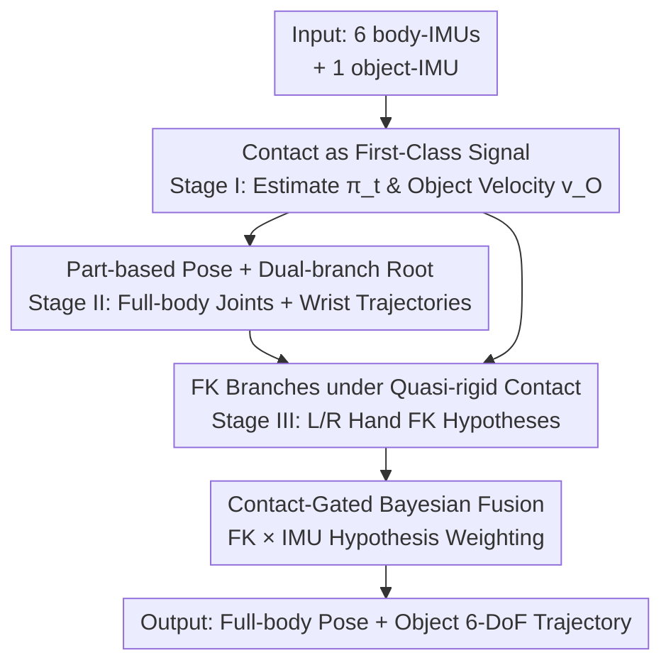

# IMU-HOI: A Symbiotic Framework for Coherent Human-Object Interaction and Motion Capture via Contact-Conscious Inertial Fusion

**Conference**: CVPR 2026  
**Paper**: [CVF Open Access](https://openaccess.thecvf.com/content/CVPR2026/html/Lin_IMU-HOI_A_Symbiotic_Framework_for_Coherent_Human_Object_Interaction_and_Motion_CVPR_2026_paper.html)  
**Code**: None  
**Area**: Human Understanding / Inertial Motion Capture  
**Keywords**: Sparse IMUs, Human-Object Interaction, Motion Capture, Contact Gating, Inertial Fusion

## TL;DR
IMU-HOI treats "hand-object contact" as a first-class probabilistic signal. Starting from sparse IMUs attached to the body (6 units) and the object (1 unit), a three-stage fusion pipeline simultaneously recovers full-body human poses and 6-DoF object trajectories, reducing object trajectory error by 44%–64% compared to strong baselines across three HOI benchmarks.

## Background & Motivation

**Background**: In AR/VR and human-robot collaboration, it is essential to capture both full-body human motion and the objects being manipulated. Vision-based solutions (multi-camera setups, pre-scanned meshes) are significantly limited by occlusion, field-of-view, and lighting. Consequently, inertial motion capture (IMU mocap) has emerged as an attractive alternative due to its non-line-of-sight and lighting-invariant properties—sparse IMUs from DIP, TransPose, TIP, to DynaIP have demonstrated success in reconstructing human poses.

**Limitations of Prior Work**: Existing inertial mocap systems almost exclusively assume an "isolated human." They reconstruct the human skeleton in isolation without modeling contacts or estimating object states. However, humans constantly interact with tools, sports equipment, and daily items. This creates a gap between system outputs and real "embodied interaction dynamics": the hand position may be known, but the location and grasp status of the object remain unknown.

**Key Challenge**: When visual observations are absent, object tracking relies solely on the object-mounted IMU. However, pure inertial integration drifts rapidly over time (accurate in the short term, drifting in the long term). Conversely, rigidly anchoring the object to the hand via Forward Kinematics (FK) avoids drift but introduces local systematic biases and fails completely if contact detection is incorrect. Both paths have intrinsic failure modes, and neither is sufficient alone.

**Goal**: To jointly and coherently recover (i) full-body pose, (ii) root translation, and (iii) 6-DoF object trajectories from only sparse body-IMUs and a single object-IMU, while maintaining robustness against long-sequence drift.

**Key Insight**: The compact form factor of IMUs allows them to be attached to both the body and objects. By explicitly estimating "which hand is in contact with the object," this estimation can serve as a high-level routing signal to dynamically switch between "kinematic reasoning" and "inertial reasoning." When contact is certain, the object is anchored to the hand (FK); when contact is weak, the system falls back to IMU integration.

**Core Idea**: Hand-object contact is modeled as a probabilistic signal $\pi_t$ that persists throughout the pipeline. It gates the Bayesian-style fusion of the FK and IMU branches, enabling drift-resistant human-object joint motion capture without requiring visual input or object meshes.

## Method

### Overall Architecture
The system observes human IMU data $X^{hum}_t \in \mathbb{R}^{N_{hum}\times 9}$ and object IMU data $X^{obj}_t \in \mathbb{R}^9$ at each frame, outputting 24 joint poses $\hat{J}_t$, root trajectory $\hat{p}_{root}(t)$, and object trajectory $\hat{p}_O(t)$. The pipeline consists of three serial stages: **Stage I** estimates the "calibrated contact prior $\pi_t$" and "short-term object velocity $\hat{v}_O(t)$" from local inertial cues; **Stage II** uses a part-based backbone to estimate full-body pose and root translation, producing stable wrist trajectories; **Stage III** generates three object position hypotheses based on a quasi-rigid contact assumption (two FK branches for hands + one IMU branch) and fuses them via contact gating. Contact remains an explicit probabilistic signal across all stages, routing between "kinematics vs. inertia" frame-by-frame, and is optimized through staged curriculum training (freeze-after-training) to ensure stability.

The final object position is a contact-weighted convex combination of the three hypotheses:

$$\hat{p}_O(t) = \sum_{k\in\{L,R,IMU\}} w_{t,k}\,\hat{p}^{(k)}_O(t)$$

### Key Designs

**1. Contact as a First-Class Probabilistic Signal: Routing Switch for Grasping**

Addressing the limitation that existing mocap ignores contact, the authors do not treat contact as a post-processing step. Instead, Stage I uses a compact LSTM head to estimate contact states directly from short-term IMU windows. Crucially, the contact parameterization is not a standard three-way softmax but is formulated as $\pi_t = (p_L(t),\, p_R(t),\, 1-\max(p_L(t),p_R(t)))\in\Delta^2$, where $p_L, p_R$ are the marginal probabilities of left and right hand contact. This formulation ensures that probability mass is correctly preserved by the "complementary term" when neither hand is in contact, avoids double-counting during hand-overs or bimanual manipulation, and aligns its three components perfectly with the three object position sources in Stage III. Training utilizes focal cross-entropy to handle the imbalance between long idle periods and short contact bursts, followed by temperature scaling for calibration. Stage I also regresses object linear velocity $\hat{v}_O(t)$ (using Huber loss and short-term integration consistency) and employs a differentiable "object stationary gate" to suppress velocity magnitude and false contact logits when the object is static.

**2. Part-based Pose + Dual-branch Root: Modifying DynaIP/TransPose for Stable Wrist Trajectories**

To anchor the object to the hand, the wrist position must be stable. Stage II follows DynaIP by dividing the body into lower limbs, torso, and upper limbs, each with a SubPoser. A lightweight global RNN aggregates sequential context, while each region outputs local joint velocities and reduced global rotations, which are processed via a differentiable FK in SMPL to obtain world-coordinate joints $\hat{J}_t$ and wrist trajectories $\hat{p}^{(L)}_H, \hat{p}^{(R)}_H$. Root translation adopts the dual-branch approach from TransPose with two modifications: the **lower-limb contact branch** maps the FK velocity of the grounded foot (selected via confidence) to root velocity with a learnable bias; the **torso velocity branch** uses a compact descriptor from only torso joints (hips, spine, neck, head) via finite differences to predict local root velocity, transformed to the world frame by the root IMU. Using velocity instead of position as the signal is cleaner and closer to the prediction target.

**3. FK Branches under Quasi-rigid Contact: Anchoring without Object Meshes**

To solve the drift in pure IMU object trajectories, Stage III assumes that once a hand $s\in\{L,R\}$ contacts the object, the corresponding contact point remains fixed in the object coordinate system. Thus, the offset $^{O}d^{(s)} = {}^{W}R_O(t)^\top({}^{W}p_O(t)-{}^{W}p^{(s)}_H(t))$ is approximately constant. Since no object mesh is available for geometric refinement, the authors **learn an object-frame offset**: a lightweight RNN for each hand takes hand kinematics and object orientation to predict a unit direction $^{O}\hat{u}^{(s)}_t\in S^2$ and a non-negative length $\hat{\ell}^{(s)}_t\ge 0$. The product $^{O}\hat{u}^{(s)}_t\hat{\ell}^{(s)}_t$ serves as the approximate offset, yielding the FK hypothesis $\hat{p}^{FK\text{-}s}_O(t)=\hat{p}^{(s)}_H(t)+{}^{W}R_O(t)\,{}^{O}\hat{u}^{(s)}_t\hat{\ell}^{(s)}_t$. Predicting the offset in the object frame factorizes out global rotation, improving stability across grasp orientations. The IMU branch uses velocities from Stage I for residual integration $\tilde{p}^{IMU}_O(t)=\hat{p}_O(t-1)+\hat{v}_O(t)\Delta t$, which is accurate locally but prone to drift.

**4. Contact-Gated Bayesian Fusion: Routing with Multiplicative Bias**

The three object hypotheses (Left FK, Right FK, IMU) are processed by a causal LSTM that observes object IMU features to output fusion logits $z_t\in\mathbb{R}^3$. The contact prior $\pi_t$ from Stage I is injected as a multiplicative bias: $w_t=\mathrm{softmax}\big(\frac{1}{\tau}(z_t+\beta\log\pi_t)\big)$, where $\tau$ controls sharpness and $\beta$ balances the prior's influence. This Bayesian routing is interpretable: high confidence in left-hand contact amplifies the Left FK branch, while no contact shifts weight to the IMU branch. The authors also regularize $w_t$ against sudden changes and slightly smooth FK outputs. First- and second-order finite difference losses enforce kinematic-inertial consistency between the fused position $\hat{p}_O$, velocity $\hat{v}_O$, and IMU acceleration, suppressing jitter. This mechanism prevents the "object detachment" common in long sequences for FK-only or IMU-only baselines.

### Loss & Training
A staged curriculum is used, freezing components after training. Stage I is trained first with $L^{(1)}=L_{hands}+\lambda_{vel}L_{vel}+\lambda_{cal}L_{cal}$ (focal contact + velocity + calibration). Stage II is trained while Stage I is frozen using $L^{(2)}=L_{pose}+\lambda_{root}L_{root}+\lambda_{part}L_{vel\text{-}part}+\lambda_{feet}L_{feet}$. Stage III is trained in two phases: first, Stage I+II are frozen to train the translation module $L^{(3)}=L_{trans}+\lambda_{cons}L_{cons}+\lambda_{HOI}L_{HOI}+\lambda_{smooth}L_{smooth}$ (consistency, offset length/direction, HOI relative pose, and weight smoothing); finally, Stage II and III are jointly fine-tuned with a small learning rate using $L^{(2+3)}=L^{(2)}+\lambda_{joint}L^{(3)}$, while Stage I remains frozen to preserve the calibrated contact prior.

## Key Experimental Results

### Main Results
Evaluation was conducted on three HOI benchmarks: OMOMO, IMHD2, and BEHAVE (IMHD2 downsampled to 30fps, long sequences randomly cropped to 5–10s, 80/20 split). Comparison was made against four inertial mocap baselines (DIP, TIP, TransPose, GlobalPose) enhanced for HOI (noted with `*`, including an object-IMU branch and the proposed HOI loss). Metrics: **Obj Err** (object trajectory error, cm), **HOI Err** (accuracy during contact frames, cm), **Ang Err** (joint rotation error, °), **Pos Err** (joint position error, cm), **Trans Err** (root translation error, cm), and **Jitter** (mean joint jerk, mm/s³).

Below is the comparison excluding root translation evaluation (Tab. 1):

| Dataset | Metric | GlobalPose* | TransPose* | Ours (Fusion) | Gain vs. GlobalPose* |
| :--- | :--- | :--- | :--- | :--- | :--- |
| OMOMO | Obj / HOI Err | 39.34 / 39.51 | 32.54 / 32.73 | **14.15 / 14.94** | -64.0% / -62.2% |
| IMHD2 | Obj / HOI Err | 101.27 / 102.03 | 90.37 / 90.61 | **49.76 / 51.09** | -50.9% / -49.9% |
| BEHAVE | Obj / HOI Err | 40.14 / 40.21 | 40.39 / 40.40 | **22.26 / 22.62** | -44.5% / -43.7% |
| OMOMO | Ang / Pos Err | 4.13 / 3.69 | 4.48 / 3.15 | **2.84 / 2.27** | — |

In the full evaluation including root translation (Tab. 2), the proposed method maintains a significant lead in Obj/HOI Err. Root translation accuracy is also competitive: on OMOMO, Trans Err is equivalent to GlobalPose*; on IMHD2 and BEHAVE, Trans Err drops by 68.5% and 30.6% respectively, suggesting that the RNN-based contact-gated estimator generalizes better on limited data. Additionally, the lightweight causal RNN architecture is an order of magnitude faster than physics-based optimization methods like GlobalPose*.

### Ablation Study
Comparison of three object translation head variants (Tab. 3):

| Configuration | OMOMO Obj/HOI | IMHD2 Obj/HOI | BEHAVE Obj/HOI | Mechanism |
| :--- | :--- | :--- | :--- | :--- |
| FK only | 31.06 / 32.51 | 61.58 / 57.64 | 23.68 / 24.58 | Anchored to hand, local bias |
| IMU only | 11.52 / 18.07 | 68.59 / 72.58 | 22.99 / 28.03 | Accurate short-term, drifts |
| **Fusion (Full)** | **11.31 / 17.44** | **43.97 / 43.39** | **20.90 / 25.74** | Contact-gated fusion |

**Plug-and-play study** (Tab. 4): Incorporating the proposed contact-gated Fusion into existing HPE backbones significantly improves object metrics compared to simply adding an object head. For example, GlobalPose* on IMHD2 saw Obj Err drop by 53.9% and HOI Err by 47.4%.

### Key Findings
- **Single branches are insufficient**: IMU-only is accurate but drifts; FK-only is stable but biased. In long sequences like IMHD2, Fusion further reduces Obj Err by 28.6% relative to the best single head, proving that contact-gated fusion is key to drift resistance and interaction fidelity.
- **Error-Time "Relay" Phenomenon**: At the start of a sequence, IMU-only has the lowest error. Over time, FK-only overtakes it. Eventually (around 120s), Fusion outperforms both as the individual heads "lose" the object while Fusion remains anchored.
- **Modular Portability**: The human pose module can be swapped with any existing HPE backbone (DIP/TransPose/GlobalPose). Contact-gated fusion acts as a plug-in to grant these backbones robust object tracking with minimal overhead.

## Highlights & Insights
- **Elevating "contact" to a first-class probabilistic signal** is the most innovative contribution. It serves as both an output of Stage I and a multiplicative bias for Stage III, turning the routing between FK and IMU into a learnable, calibrated, and interpretable switch. The one-to-one mapping between $\pi_t$ components and object sources is highly consistent.
- **Object-frame offsets** instead of world-frame offsets is a crucial trick. Predicting direction and length in the object coordinate system factorizes out global rotation, making the FK branch robust to grasp orientations without requiring object meshes.
- **The plug-and-play nature** amplifies the method's impact. Rather than proposing another end-to-end "black box," the authors provide a way to upgrade the existing sparse IMU mocap ecosystem with object-awareness.
- The strategy of "trusting inertia in the short term, kinematics in the long term, and gating via contact" provides a blueprint for any tracking problem requiring the complement of high-frequency/drifting and low-frequency/biased signals (e.g., VIO, SLAM loop closure).

## Limitations & Future Work
- The interaction model is based on a **quasi-rigid, single-contact-point** abstraction, which cannot explicitly handle sliding contacts, multi-point simultaneous contacts, or interactions with deformable objects.
- Performance depends on contact label quality: ablation shows that long-sequence failures stem from occasional contact label inaccuracies that cause interaction point offsets to accumulate over time.
- All evaluations were limited to three HOI benchmarks with single-object scenarios; complex scenes with multiple objects or tool-switching were not verified. The robustness of IMU mounting (non-rigid attachment) remains unknown.
- Future directions: Incorporating coarse object geometry for contact point refinement; extending single-point contact to surface/multi-point contact; and utilizing stronger self-supervised contact detection to reduce reliance on labels.

## Related Work & Insights
- **vs. Pure Inertial Mocap (DIP / TransPose / TIP / DynaIP)**: These systems reconstruct isolated humans and ignore objects. This work extends mocap from "human-only" to "human+object" by explicitly modeling the object and the interaction.
- **vs. Vision/Hybrid HOI Capture (PHOSA / I’M HOI / HybridCap / Interaction Replica / ECHO)**: These typically require cameras, object meshes, or heavy sensor suites. This work proves that 6 body-IMUs and 1 object-IMU are sufficient for complete HOI pose recovery, significantly lower in deployment cost.
- **vs. GlobalPose***: While GlobalPose* uses large-scale training and physics optimization for root translation, it generalizes poorly on limited data and is slower. This work's lightweight RNN + contact gating achieves lower Trans Err and faster inference.

## Rating
- Novelty: ⭐⭐⭐⭐⭐ First pure inertial human-object joint capture framework; using contact as a first-class routing prior is highly original.
- Experimental Thoroughness: ⭐⭐⭐⭐ Three benchmarks plus extensive ablation and plug-and-play studies, though limited to single-object scenarios.
- Writing Quality: ⭐⭐⭐⭐ The three-stage pipeline is clearly explained, and the "relay" analysis of error over time is insightful.
- Value: ⭐⭐⭐⭐ Strong potential for AR/VR and robotics; the modular design can upgrade the entire sparse IMU mocap ecosystem.

<!-- RELATED:START -->

## Related Papers

- [\[CVPR 2026\] Real-Time Multimodal Fingertip Contact Detection via Depth and Motion Fusion for Vision-Based Human-Computer Interaction](real-time_multimodal_fingertip_contact_detection_via_depth_and_motion_fusion_for.md)
- [\[NeurIPS 2025\] HOI-Dyn: Learning Interaction Dynamics for Human-Object Motion Diffusion](../../NeurIPS2025/human_understanding/hoi-dyn_learning_interaction_dynamics_for_human-object_motion_diffusion.md)
- [\[CVPR 2026\] Ground Reaction Inertial Poser: Physics-based Human Motion Capture from Sparse IMUs and Insole Pressure Sensors](ground_reaction_inertial_poser_physics-based_human_motion_capture_from_sparse_im.md)
- [\[CVPR 2026\] Learning to Diversify and Focus: A Reinforcement Framework for Open-Vocabulary HOI Detection](learning_to_diversify_and_focus_a_reinforcement_framework_for_open-vocabulary_ho.md)
- [\[CVPR 2026\] Decoupled Generative Modeling for Human-Object Interaction Synthesis](decoupled_generative_modeling_for_human-object_interaction_synthesis.md)

<!-- RELATED:END -->
