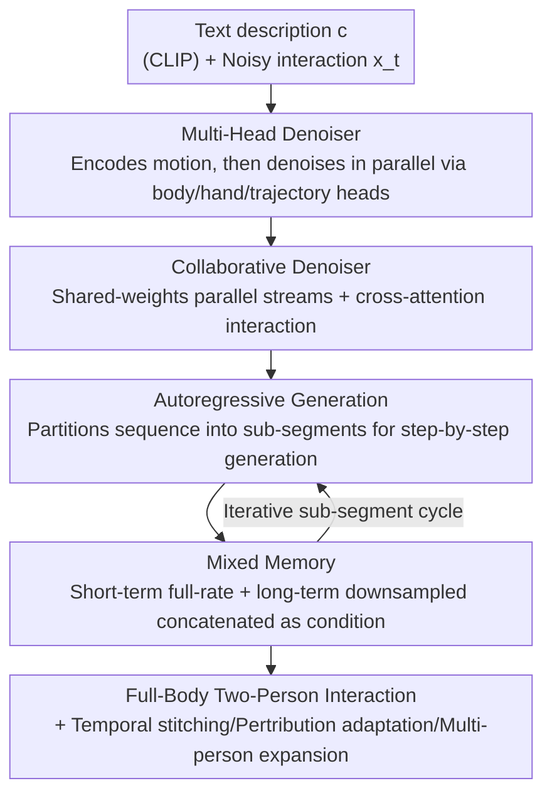

# Interact2Ar: Full-Body Human-Human Interaction Generation via Autoregressive Diffusion Models

**Conference**: CVPR 2026  
**Paper**: [CVF Open Access](https://openaccess.thecvf.com/content/CVPR2026/html/Ruiz-Ponce_Interact2Ar_Full-Body_Human-Human_Interaction_Generation_via_Autoregressive_Diffusion_Models_CVPR_2026_paper.html)  
**Code**: Project Page https://pabloruizponce.com/papers/Interact2Ar (Code repository not explicitly released)  
**Area**: Human Understanding / Human Motion Generation / Diffusion Models  
**Keywords**: Human-human interaction generation, autoregressive diffusion, full-body hand motion, mixed memory, text-driven motion

## TL;DR
Interact2Ar is the first text-conditioned, end-to-end **autoregressive diffusion** model that generates full-body **two-person interactions** with detailed hand movements. It uses a "collaborative denoiser + body/hand/trajectory-specific heads" to generate motion, and then coordinates the step-by-step generation of the entire sequence via a "mixed memory" autoregressive pipeline. This approach achieves state-of-the-art results on the Inter-X benchmark and unlocks key downstream capabilities like temporal stitching, perturbation adaptation, and multi-person interaction.

## Background & Motivation
**Background**: Human motion generation has progressed rapidly due to large-scale datasets and two major generation paradigms (diffusion and quantization). However, generating **human-human interactions** is significantly more challenging than single-person generation. The model must not only generate high-quality motions for both individuals but also ensure spatio-temporal coordination between them. The Inter-X dataset is the first to provide full-body two-person interaction data with detailed hand movements, serving as the training foundation for this research direction.

**Limitations of Prior Work**: 
1. **Directly ignoring the hands**: The hand's dimensionality is higher than the rest of the body combined. Forced inclusion often introduces more noise than signal, complicating the generation. Consequently, prior works either do not model hands or use parallel/conditional networks to model them separately, where the former lacks body context while the latter is inefficient.
2. **Denoising the entire sequence at once**: Existing diffusion methods denoise the whole sequence in one go. While acceptable for a single person, interaction is inherently reactive ("give-and-take," acting and reacting), where each person's movement depends on subtle, time-varying cues from the partner. Generating the entire block at once fails to capture this reactivity.
3. **Unreliable evaluators**: The original Inter-X evaluator is severely degraded regarding trajectories, showing almost no change in score even when the trajectories of the two persons are swapped.

**Key Challenge**: Balancing the trade-off of "signal vs. noise" in high-dimensional hand information, alongside "static whole-sequence generation vs. step-by-step reactive generation" in interaction. These two challenges compound, and the interaction dimensionality further explodes with the number of people in multi-person scenarios.

**Goal**: (a) Incorporate detailed hand movements into full-body interaction generation without being degraded by high-dimensional noise; (b) Enable step-by-step, reactive, and adaptive generation; (c) Propose an evaluator that can genuinely identify trajectory and motion degradations.

**Key Insight**: The authors observe that different body parts can be modeled with separate heads while sharing the same motion context. Furthermore, the reactivity in interactions can be achieved by adopting **autoregressive diffusion** (generating segment-by-segment over a time window), which has been validated in the single-person domain.

**Core Idea**: Solve the high-dimensional hand issue using "dedicated heads to generate body, hand, and trajectory in parallel" from a shared motion representation, and achieve reactivity and adaptability by replacing sequence-wide generation with sub-segment generation via "autoregression + mixed memory."

## Method

### Overall Architecture
Interact2Ar aims to solve the following problem: given a text description $c$, generate a two-person full-body interaction $x=\{a_x, b_x\}$ (where each person is represented by SMPL-X parameters). The overall framework consists of three steps: first, a **multi-head denoiser** encodes the noisy motion and feeds it to three dedicated heads (body, hands, and trajectory) for separate denoising; second, a **collaborative denoiser** runs a shared-weight stream for each of the two persons, exchanging information via cross-attention; finally, the "one-time sequence generation" is upgraded to **autoregressive generation** by partitioning the action sequence into non-overlapping sub-segments and generating them step-by-step, conditioned on the **mixed memory** of previously generated frames. During training, the non-autoregressive version (Interact2Ar*) is trained first, then extended to the autoregressive version.

Regarding motion representation, the authors deliberately avoid redundant representations (such as deriving velocity from position) and only use pure SMPL-X parameters $(r, \varphi, \theta_{body}, \theta_{hands})$, with rotations in the continuous 6D representation. This is because redundant representations explode in dimensionality under two-person + hand scenarios and introduce negative biases into diffusion evaluations.

### Key Designs

**1. Body/Hand/Trajectory Dedicated Heads: Preventing High-Dimensional Hand Noise from Overwhelming Signal**

Prior works predicted the entire pose as a single unified sequence, which dragged down the modeling of other parts once high-dimensional hands were introduced. Interact2Ar adds an encoding module before the collaborative denoiser to map the noisy motion to a latent representation, and then feeds this **shared motion representation** to three **dedicated denoising heads**—the global trajectory head, the body pose head, and the hand pose head. Each head is responsible for a partition but retains access to the full motion context. This maintains the benefit of "the body providing context for the hands" (the hands are no longer isolated parallel branches) while allowing the three components to calculate in parallel and focus on their respective dimensions. The paper terms this the Multi-Head Denoiser, and experiments show that this structure handles full-body representations much better than prior works, demonstrating independent improvements in both body and hand metrics.

**2. Collaborative Denoiser + Direct Prediction of $\hat{x}_0$: Integrating "Give-and-Take" into the Network via Shared-Weight Dual Streams**

The challenge of two-person interaction lies in coordinating their movements. The authors follow the collaborative denoising paradigm of InterGen: two parallel streams of transformer encoders share weights and swap hidden states via cross-attention, enabling interpersonal information flow while maintaining a compact parameter size. During diffusion, the model does not predict the noise of the previous step $\hat{x}_{t-1}$; instead, it **directly predicts the clean motion $\hat{x}_0$**, allowing various kinematic losses to be calculated at each step using Forward Kinematics (FK).

**3. Autoregressive Interaction Generation: Replacing "One-Time Sequence Generation" with "Step-by-Step Reactive Generation"**

One-time whole-sequence denoising fails to capture the reactive nature of interactions. The authors partition the interaction of total length $N$ into continuous, non-overlapping sub-segments:

$$x = \bigcup_{k=0}^{K-1} x_{kn:(k+1)n}, \quad K=\lceil N/n \rceil$$

where $n$ is the generation window (the number of frames output in one forward pass). During step $k$, the denoiser takes the short-term memory $\mathcal{M}_k^s = \{x^0_{kn-m_s:kn}\}$ of the most recent $m_s$ frames as a condition to predict the next sub-segment:

$$\hat{x}^0_{kn:(k+1)n} = G(x^t_{kn:(k+1)n}, \mathcal{M}_k^s, c, t)$$

Because each segment is conditioned on the "just generated real history," the model can dynamically adjust to the evolving interaction, tracking the partner's movements better than whole-sequence generation—which is the source of all subsequent "adaptive downstream capabilities."

**4. Mixed Memory: Eliminating Motion Repetition in Long Sequences via Downsampled Long-Term Memory**

Pure short-term memory suffers from a key drawback: if the window is too short (prior works often use 20–40 frames), historical context in long interactions is insufficient, causing motion repetition artifacts. To address this, the authors introduce a long-term memory $\mathcal{M}_k^l$ alongside short-term memory—sampling one frame every $\delta$ frames (temporal downsampling) over a much longer window $m_l \gg m_s$:

$$\mathcal{M}_k^l = \{x^0_{kn-m_l+i\delta} \mid i=0,1,\ldots,\lfloor m_l/\delta\rfloor\}$$

Both are then concatenated $\mathcal{M}_k = \{\mathcal{M}_k^l, \mathcal{M}_k^s\}$ to serve as the condition:

$$\hat{x}^0_{kn:(k+1)n} = G(x^t_{kn:(k+1)n}, \mathcal{M}_k, c, t)$$

Consequently, short-term memory uses the **full frame rate** to ensure seamless transitions, while long-term memory uses **downsampling** to cover far-reaching context at a very low cost. The paper gives an intuitive example: where standard memory requires storing 90 frames to have 90 frames of context, mixed memory achieves approximately 3× memory compression by using only 30 frames (15 short-term + 15 long-term) to cover a 90-frame context window. $\delta$ and $m_l$ are hyperparameters controlling the trade-off between coverage and computational efficiency.

**5. Adaptive Downstream Capabilities: Autoregression + Memory Conditioning Naturally Unlock Three Types of Interaction Applications**

Because generation is step-by-step and conditioned on memory $\mathcal{M}$, three capabilities are unlocked "for free": ① **Temporal Motion Stitching**—seamless transition when switching text prompts without requiring offline post-processing or experiencing global positional misalignment typical of inpainting; ② **Real-time Perturbation Adaptation**—if sudden displacements or unexpected contact perturbations occur between sub-segments, the next segment can react based on the recent history, achieving reactive generation beyond pre-designed sequences; ③ **Sequential Multi-person Interaction**—combining the former two, one person can interact with a partner, then switch to a new partner with a new text prompt, where the memory condition ensures smooth transitions between segments, scaling to multi-person scenarios without requiring simultaneous multi-person modeling.

### Loss & Training
The non-autoregressive stage uses a combination of standard diffusion motion generation losses:

$$\mathcal{L}_{total} = \lambda_{repr}\mathcal{L}_{repr}(x,\hat{x}) + \lambda_{orient}\mathcal{L}_{orient}(r,\hat{r}) + \lambda_{pos}\mathcal{L}_{pos}(p,\hat{p}) + \lambda_{vel}\mathcal{L}_{vel}(v,\hat{v}) + \lambda_{foot}\mathcal{L}_{foot}(f,\hat{f}) + \lambda_{dist}\mathcal{L}_{dist}(d,\hat{d})$$

where $\mathcal{L}_{repr}$ is the $\ell_2$ loss on raw SMPL-X representations, $\mathcal{L}_{orient}$ penalizes root orientation errors, and the remaining four are joint kinematics losses—passing the predicted SMPL-X parameters through a differentiable FK layer to obtain joint positions $p=FK(x), \hat{p}=FK(\hat{x})$, then calculating global joint position $\mathcal{L}_{pos}$, velocity $\mathcal{L}_{vel}$, foot contact $\mathcal{L}_{foot}$, and pairwise joint distance maps $\mathcal{L}_{dist}$ between the two individuals. The weights $\lambda_i$ are obtained via grid search. Implementation-wise, the collaborative denoiser uses 8 transformer blocks with 8 heads (latent 512). The trajectory head is lighter (4 blocks, 4 heads, latent 256). Full diffusion uses 1000 steps with DDIM-50 sampling, while the autoregressive version yields the best results with only 10 steps. Selecting hyperparameters $m_s=15, m_l=45, \delta=5$ yields a 60-frame context window while using only 24 frames of memory.

## Key Experimental Results

The dataset is Inter-X (11K full-body interaction segments, 40 action categories, with text descriptions). All metrics are computed "per interaction" instead of "per person." Each experiment is run 20 times to report 95% confidence intervals.

### Main Results: Comparison with SOTA (Full / Body / Hands Evaluations, Full selected here)

| Method | R-Prec.↑ Top3 | FID↓ | MM Dist↓ | Diversity→ | PJ↑ | AUJ↓ |
|------|------|------|----------|-----------|-----|------|
| Ground Truth | 0.740 | 0.002 | 3.318 | 8.973 | 0.021 | 3.944 |
| T2M | 0.434 | 9.079 | 5.766 | 7.994 | 1.889 | 124.9 |
| InterGen | 0.721 | 0.874 | 3.618 | 8.876 | 2.132 | 84.16 |
| InterMask (Prev. SOTA) | 0.722 | 0.671 | 3.487 | 8.654 | 2.328 | 61.74 |
| Interact2Ar* (Non-autoregressive) | 0.757 | 0.556 | 3.246 | 8.916 | 2.110 | 54.97 |
| **Interact2Ar (Autoregressive)** | **0.773** | **0.277** | **3.095** | 9.305 | **0.136** | **8.837** |

The non-autoregressive version already outperforms InterMask. The autoregressive version leads further in almost all metrics, especially with a drastic reduction in smoothness metrics, PJ (Peak Jerk) and AUJ (Area Under Jerk) (AUJ 54.97 → 8.837), indicating much smoother transitions. Separate evaluations on Body and Hands also achieve best or second-best results, demonstrating the advantage of dedicated heads for full-body representation.

### Evaluator Robustness (Tab.1)

| Setting | Old Evaluator FID↓ | Our Evaluator FID↓ |
|------|------|------|
| Ground Truth | 0.001 | 0.002 |
| Interact2Ar | 0.148 | 0.277 |
| +10% Full Representation Noise | 38.35 | 74.58 |
| +10% Trajectory-only Noise | **0.122** (almost insensitive) | **62.05** (strong penalty) |
| Swapped trajectories of both persons | **0.165** (almost insensitive) | **8.65** (significant penalty) |

The old evaluator is nearly blind to "trajectory-only degradation" and "trajectory swapping." The proposed evaluator (re-trained using global joint coordinates rather than rotation representations, and separately trained as three evaluators for full-body, body, and hands) identifies these degradations strongly.

### Ablation Study: Mixed Memory vs. Regular Memory (Tab.3)

| $m_s$ | $m_l$ | Actual Frames $M$ | R-Prec.↑ | FID↓ |
|------|------|------|---------|------|
| 60 | - | 60 | 0.776 | 0.316 |
| 90 | - | 90 | 0.771 | 0.412 |
| 120 | - | 120 | 0.774 | 0.413 |
| 15 | 45 | **24** | 0.773 | **0.277** |
| 15 | 75 | 30 | 0.771 | 0.279 |
| 15 | 105 | 36 | 0.773 | 0.325 |

### Key Findings
- **Without mixed memory, adding more memory degrades performance** (FID goes from 0.316 to 0.413 as context increases from 60 to 90 to 120 frames): longer contexts increase modeling complexity, making simple memory accumulation counterproductive.
- **Mixed memory achieves better results with fewer actual frames**: $m_s=15, m_l=45$ only uses 24 frames to achieve an FID of 0.277, outperforming regular configurations that use 60–120 frames. This validates the "short-term full-rate + long-term downsampled" design.
- **Autoregression is key to smoothness**: AUJ drops from 54.97 in the non-autoregressive version to 8.837, matching the physical perception of "seamless transitions" in downstream tasks.
- In the user study (35 participants ranking 10 interactions), the proposed method was significantly preferred over InterGen/InterMask in both "text alignment" and "hand realism," approaching ground truth.

## Highlights & Insights
- **"Dedicated heads sharing a single motion representation" is an elegant compromise for handling high-dimensional hands**: it neither loses context like parallel networks nor lacks efficiency like conditional networks. Body information naturally flows to the hands, and calculations can be done in parallel. This motif can be transferred to any structured generation task where certain parts have a much higher dimensionality than others.
- **Splitting "memory" into full-rate short-term + downsampled long-term** is essentially providing a "cheap long context" for autoregressive diffusion. While sharing architectural intuition with long-context LLMs, it uses downsampling to save efficiency, offering a valuable reference for streaming or long-sequence generation.
- **Downstream capabilities are a byproduct of the architecture rather than extra modules**: temporal stitching, perturbation adaptation, and multi-person extension all organically emerge from the "step-by-step + memory condition" setup, without requiring extra training or post-processing—this is the most tangible dividend of the autoregressive paradigm over whole-sequence diffusion.
- **Fixing the evaluator along the way**: pointing out that the old evaluator is insensitive to trajectory degradation or swapping, and re-training it with global coordinates while separating it into full-body, body, and hand evaluators, provides crucial infrastructure that future works in this direction can directly leverage.

## Limitations & Future Work
- **Limitations**:
  - Due to dataset constraints, Inter-X normalizes body shapes to a neutral template, lacking diversity in physical shapes. This harms the precision of hand contact between the two actors, as real interaction modeling requires handling different body sizes.
  - Multi-person capability is achieved sequentially (swapping partners one after another), which is not true simultaneous multi-person joint modeling; complex interactions involving three or more concurrent people might not be covered.
  - Evaluation relies heavily on the single Inter-X dataset and its text annotation quality; cross-dataset generalization remains unverified.
  - While the autoregressive version yields the best results with 10-step sampling, the cumulative error or drift over very long sequences has not been specifically analyzed.
- **Future Work**: Incorporate body shape as a generation condition, introduce contact-aware losses to improve hand contact accuracy, and explore true simultaneous multi-person collaborative denoising (instead of sequential stitching).

## Related Work & Insights
- **vs InterGen**: Both use shared-weight collaborative denoisers, but InterGen does not separate body parts, generates the whole sequence at once, and lacks detailed hand modeling. The proposed method introduces dedicated body/hand/trajectory heads and upgrades to autoregression + mixed memory, delivering stronger quality and adaptability.
- **vs InterMask**: InterMask uses a residual VQ-VAE + masked transformer, serving as the prior SOTA on Inter-X. This work follows the diffusion path; the non-autoregressive version already outperforms InterMask, and the autoregressive version further widens the gap in smoothness and text alignment.
- **vs Single-person Autoregressive Diffusion**: This paper represents the first end-to-end application of text-conditioned autoregressive diffusion to full-body two-person interactions, and proposes mixed memory to solve motion repetition in long interactions, marking a key extension from single-person to interaction modeling.

## Rating
- **Novelty**: ⭐⭐⭐⭐⭐ First text-conditioned end-to-end autoregressive diffusion model for full-body two-person interactions. The combination of mixed memory + dedicated heads is highly novel.
- **Experimental Thoroughness**: ⭐⭐⭐⭐ Complete evaluation across full-body/body/hands on Inter-X, combined with evaluator robustness tests, memory ablation, and a user study. However, validation is limited to a single dataset.
- **Writing Quality**: ⭐⭐⭐⭐ Motivations and contributions are clear, and Figs 2/3 provide intuitive explanations of the architecture and mixed memory.
- **Value**: ⭐⭐⭐⭐⭐ Beyond setting a new SOTA, it provides reusable evaluators and "free" downstream adaptive capabilities, significantly driving forward the interaction motion generation line.

<!-- RELATED:START -->

## Related Papers

- [\[CVPR 2026\] Causal Motion Diffusion Models for Autoregressive Motion Generation](causal_motion_diffusion_models_for_autoregressive_motion_generation.md)
- [\[CVPR 2026\] SAM 3D Body: Robust Full-Body Human Mesh Recovery](sam_3d_body_robust_full-body_human_mesh_recovery.md)
- [\[CVPR 2026\] PAMotion: Physics-Aware Motion Generation for Full-Body Interaction with Multiple Objects](pamotion_physics-aware_motion_generation_for_full-body_interaction_with_multiple.md)
- [\[CVPR 2026\] Towards Decompositional Human Motion Generation with Energy-Based Diffusion Models](towards_decompositional_human_motion_generation_with_energy-based_diffusion_mode.md)
- [\[CVPR 2026\] Next-Scale Autoregressive Models for Text-to-Motion Generation](next-scale_autoregressive_models_for_text-to-motion_generation.md)

<!-- RELATED:END -->
