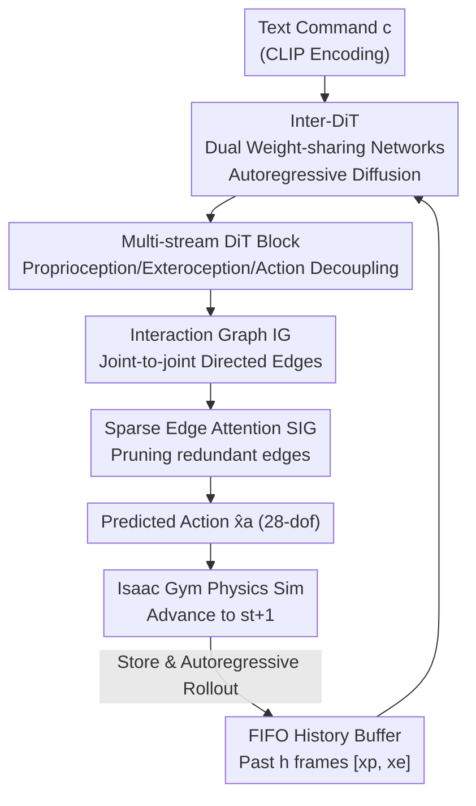

# InterAgent: Physics-based Multi-agent Command Execution via Diffusion on Interaction Graphs

**Conference**: CVPR 2026  
**Paper**: [CVF Open Access](https://openaccess.thecvf.com/content/CVPR2026/html/Li_InterAgent_Physics-based_Multi-agent_Command_Execution_via_Diffusion_on_Interaction_Graphs_CVPR_2026_paper.html)  
**Code**: Project Page https://binlee26.github.io/InterAgent-Page (Code not explicitly released)  
**Area**: Human Understanding / Physics Simulation / Diffusion Models  
**Keywords**: Multi-agent interaction, physics-based humanoid control, text-driven motion generation, interaction graph, sparse attention

## TL;DR
InterAgent is the first text-driven, physics-based **dual-humanoid agent** control framework. It employs a multi-stream autoregressive diffusion Transformer (Inter-DiT) to decouple proprioception, exteroception, and action, and utilizes an "Interaction Graph + Sparse Edge Attention" to characterize fine-grained joint-to-joint relationships, generating physically plausible and semantically faithful dual-humanoid interactions from a single text command.

## Background & Motivation

**Background**: Humanoid agent motion generation follows two main trajectories. One is **kinematics-based** methods, which use diffusion or autoregressive models to synthesize motion sequences (e.g., InterGen, InterMask). These achieve good semantic alignment but lack physics engine integration. The other is **physics-based** methods, which use reinforcement learning (RL) to train tracking policies (PHC, PULSE) or end-to-end diffusion policies (PDP, UniPhys, Diffuse-CLoC), ensuring actions are constrained by physical laws.

**Limitations of Prior Work**: Kinematic methods ignore physical feasibility, often resulting in artifacts like limb penetration, floating, or foot sliding. "Generate-then-track" physics methods (PhysDiff, CLoSD) suffer from inconsistencies between kinematic priors and physical tracking, leading to balance issues. Most critically, **nearly all physics-based methods focus on single agents**, leaving a gap in modeling rich interaction dynamics like multi-agent collaboration or social behavior.

**Key Challenge**: In multi-agent scenarios, an agent's motion is determined not only by its own dynamics (**proprioception**) but also by the state and behavior of others (**exteroception**). Modeling agents in isolation or representing exteroception simply as "the other's relative state in my coordinate system" loses the **fine-grained joint-to-joint spatial dependencies** (e.g., handshaking primarily involves arms and hands, with the lower body being largely irrelevant).

**Goal**: To construct an end-to-end, text-driven, physics-integrated dual-agent control framework that produces interactions that are both physically sound and semantically faithful.

**Key Insight**: Model proprioception, exteroception, and action as **three heterogeneous modalities** to reduce mutual interference; explicitly construct exteroception as an "Interaction Graph" and leverage the intrinsic sparsity of real-world interactions for edge pruning.

**Core Idea**: Use a multi-stream autoregressive diffusion Transformer to decouple the three modalities, combined with "Interaction Graph Exteroception + Sparse Edge Attention" to explicitly and selectively characterize inter-agent relationships.

## Method

### Overall Architecture
InterAgent solves the task of "given a text instruction $\to$ two physics-simulated humanoids complete a coordinated interaction." It follows the **track-then-distill** paradigm common in physics simulation: first, a tracking policy is trained in Isaac Gym via RL to mimic MoCap reference motions (an **interaction graph reward** is added to explicitly constrain spatial relationships). Then, the expert policy rollouts a trajectory dataset consisting of "noisy states + clean actions" (8 successful rollouts per motion at noise $\sigma=0.01$). The actual generative model is **Inter-DiT**: two **weight-sharing and collaborative** networks operate under an autoregressive diffusion paradigm, taking the past $h$ frames of history $S=[x_p,x_e]_{n-h:n}$ and text condition $c$ to predict the denoised behavior sequence for future $m$ frames $\hat{X}^{(0)}=[x_p,x_e,x_a]$. Predicted actions $\hat{x}_a$ are fed into Isaac Gym to advance the physical state, which is then stored in a FIFO buffer for autoregressive execution.

### Key Designs

**1. Inter-DiT: Weight-sharing Dual-network Autoregressive Diffusion Transformer**

To address the challenge where each agent's movement depends on both internal dynamics and external influence, Inter-DiT models the **joint distribution** of states and actions under text condition $c$. This implicitly learns a world model for dynamic transitions. Inspired by InterGen, it employs **two collaborative, weight-sharing** networks to handle both agents, naturally capturing the symmetry of dual-human interactions. The training objective is denoising regression:

$$\mathcal{L} = \mathbb{E}_{t,X}\big[\,\lVert X - \Phi(X^{(t)}, t, c, S)\rVert\,\big]$$

Where $t$ is the diffusion timestep, $X^{(t)}$ is the noisy behavior sequence, and $S$ is the history. This unifies "generation" and "physical execution" into an end-to-end policy, avoiding inconsistencies found in two-stage methods.

**2. Multi-stream DiT Block: Decoupling Proprioception/Exteroception/Action**

To prevent interference between state and action representations, Inter-DiT treats **proprioception $x_p$, exteroception $x_e$, and action $x_a$** as three distinct streams. Each block features two attention stages: ① **Inter-stream fusion attention**: features are projected into a shared space, concatenated along the sequence dimension for self-attention, and then split back, allowing cross-modal information exchange without pollution. ② **Context-aware conditioning attention**: uses the three-stream outputs as queries, with historical observations $[x_{p},x_{e}]_{n-h:n}$ and the other agent's latent features as keys/values to inject temporal and inter-agent context. Text $c$ and time $t$ are injected via AdaLN. Each block contains 1 fusion attention and 5 conditioning attention layers.

**3. Interaction Graph (IG) Exteroception: Explicit Joint-level Spatial Dependencies**

Standard exteroception uses relative states (RS) of the opponent. InterAgent instead builds a **directed interaction graph**: for each joint position $p_j \in \mathbb{R}^3$ of one agent, a directed edge is drawn to every joint $p_i$ of the opponent. The edge vector $e_{ij}=p_i-p_j \in \mathbb{R}^3$ encodes the spatial interaction. The fully connected version (FIG) is represented as $x_e=(e_{1,1},\dots,e_{J,J}) \in \mathbb{R}^{(J \ast J) \times 3}$, where $J$ is the number of joints per humanoid (15 joints, 28-dof in the paper).

**4. Sparse Edge Attention (SIG): Pruning Based on Interaction Sparsity**

Real-world interactions are inherently sparse (e.g., a handshake involves hands, not legs). A **sparse attention** mechanism is applied to the exteroception stream: edges are distributed across attention heads, and an attention map $A=\text{Gumbel-Softmax}(QK^{\top}/\sqrt{d_f})$ is computed. A top-$k$ binary mask $M$ is used to retain only the most significant edges:

$$M_{ij}=\begin{cases}1,& j\in\arg\text{TopK}_k(A_i)\\ 0,& \text{otherwise}\end{cases},\qquad f' = (M\circ A)V$$

This **Sparse IG (SIG)** forces the model to focus on critical joint-level dependencies (e.g., hand-to-hand) while suppressing noise.

### Loss & Training
The framework involves: ① RL tracking policy training using curriculum learning with interaction graph rewards. ② Inter-DiT training using the denoising regression loss $\mathcal{L}$. The text encoder uses a frozen CLIP-ViT-L/14 with classifier-free guidance (10% dropout). Horizon $m=4$, history $h=364$. Optimizer: AdamW, cosine schedule (peak $1\times10^{-4}$), 80K steps on 8x RTX 4090.

## Key Experimental Results

### Main Results
Evaluated on InterHuman (dual-human MoCap with text) using standard protocols. Phys-GT represents the upper bound of physics-simulated ground truth.

| Method | R-prec Top-3 ↑ | FID ↓ | MMDist ↓ | MModality ↑ |
|------|----------------|-------|----------|-------------|
| Phys-GT (Upper Bound) | 0.722 | 0.004 | 3.401 | - |
| InterGen++ [Gen+Track] | 0.542 | 0.943 | 3.751 | 2.482 |
| InterMask++ [Gen+Track] | 0.339 | 2.143 | 4.027 | 1.939 |
| PDP (Ext. Dual) | 0.375 | 1.268 | 3.927 | 2.402 |
| CLoSD (Ext. Dual) | 0.470 | 1.132 | 3.827 | 1.474 |
| **InterAgent (Ours)** | **0.615** | **0.582** | **3.585** | 1.903 |

**Main Results**: InterAgent outperforms all baselines in R-Precision, FID, and MMDist. It produces motions such as "tight hugs" and "precise punches" that are physically coherent and semantically faithful, whereas "generate-then-track" methods often fail or become unstable.

### Ablation Study
**Exteroception & Stream Count**:
| Exteroception | DiT Streams | R-prec Top-3 ↑ | FID ↓ |
|----------|----------|----------------|-------|
| RS | 3 | 0.588 | 0.676 |
| FIG | 1 | 0.523 | 0.828 |
| FIG | 3 | 0.612 | 0.634 |
| **SIG (Ours)** | 3 | **0.615** | **0.582** |

**Key Findings**:
- **Interaction Graph > Relative State**: FIG/SIG outperform RS, proving structured graph representations are more informative.
- **Sparsity is Effective**: SIG improves upon FIG by utilizing the natural sparsity of interactions; the optimal pruning ratio is found to be 1/2.
- **Three-stream Decoupling**: Stable performance gains are observed over single-stream or dual-stream variants.
- **Zero-shot Reactive Control**: By fixing one agent's behavior via inpainting during inference, the other agent can generate reactive behaviors without retraining.

## Highlights & Insights
- **Explicit Interaction Graphing**: Using joint-to-joint directed vectors provides finer granularity than global relative states, property applicable to human-object interaction or group dynamics.
- **Domain-Priors in Architecture**: Observing that real interactions are sparse led to the top-$k$ edge pruning design, effectively reducing redundancy and improving robustness.
- **Decoupled but Coordinated**: Treating proprioception, exteroception, and action as separate streams with multi-stage attention prevents cross-modal interference.

## Limitations & Future Work
- **Scaled to Two Agents**: Verification for groups of three or more is missing; computational costs may grow quadratically with the number of agents.
- **Dependence on Tracking Experts**: Requires reliable RL experts and MoCap data; performance on novel interactions outside the dataset is uncertain.
- **Diversity Trade-off**: Physic constraints slightly reduce generation diversity compared to kinematic-only methods like InterGen.

## Related Work & Insights
- **vs. Kinematic Methods (InterGen/InterMask)**: Kinematic methods have better diversity but lack physical grounding; InterAgent ensures physical validity.
- **vs. Two-stage Methods (PhysDiff/CLoSD)**: Two-stage methods suffer from the "gap" between generation and tracking; InterAgent's end-to-end approach is more stable.
- **vs. Single-agent End-to-end (PDP/UniPhys)**: InterAgent extends the end-to-end paradigm to dual agents via weight-sharing and structured interaction modeling.

## Rating
- Novelty: ⭐⭐⭐⭐⭐ 
- Experimental Thoroughness: ⭐⭐⭐⭐ 
- Writing Quality: ⭐⭐⭐⭐ 
- Value: ⭐⭐⭐⭐

## Related Papers

- [\[CVPR 2026\] AssistMimic: Physics-Grounded Humanoid Assistance via Multi-Agent RL](assistmimic_physics_grounded_humanoid_assistance.md)
- [\[CVPR 2026\] SyncMos: Scalable Motion Synchronisation for Multi-Agent Scene Interaction](syncmos_scalable_motion_synchronisation_for_multi-agent_scene_interaction.md)
- [\[CVPR 2026\] PAMotion: Physics-Aware Motion Generation for Full-Body Interaction with Multiple Objects](pamotion_physics-aware_motion_generation_for_full-body_interaction_with_multiple.md)
- [\[CVPR 2026\] DyaDiT: A Multi-Modal Diffusion Transformer for Socially Favorable Dyadic Gesture Generation](dyadit_a_multi-modal_diffusion_transformer_for_socially_favorable_dyadic_gesture.md)
- [\[CVPR 2026\] HSI-GPT2: A Dual-Granularity Large Motion Reasoning Model with Diffusion Refinement for Human-Scene Interaction](hsi-gpt2_a_dual-granularity_large_motion_reasoning_model_with_diffusion_refineme.md)

<!-- RELATED:END -->

<!-- RELATED:START -->

## Related Papers

- [\[CVPR 2026\] AssistMimic: Physics-Grounded Humanoid Assistance via Multi-Agent RL](assistmimic_physics_grounded_humanoid_assistance.md)
- [\[CVPR 2026\] DyaDiT: A Multi-Modal Diffusion Transformer for Socially Favorable Dyadic Gesture Generation](dyadit_a_multi-modal_diffusion_transformer_for_socially_favorable_dyadic_gesture.md)
- [\[CVPR 2026\] HSI-GPT2: A Dual-Granularity Large Motion Reasoning Model with Diffusion Refinement for Human-Scene Interaction](hsi-gpt2_a_dual-granularity_large_motion_reasoning_model_with_diffusion_refineme.md)
- [\[CVPR 2026\] ViBES: A Conversational Agent with Behaviorally-Intelligent 3D Virtual Body](vibes_a_conversational_agent_with_behaviorally_intelligent_3d_virtual_body.md)
- [\[CVPR 2026\] FusionAgent: A Multimodal Agent with Dynamic Model Selection for Human Recognition](fusionagent_a_multimodal_agent_with_dynamic_model_selection_for_human_recognitio.md)

<!-- RELATED:END -->
