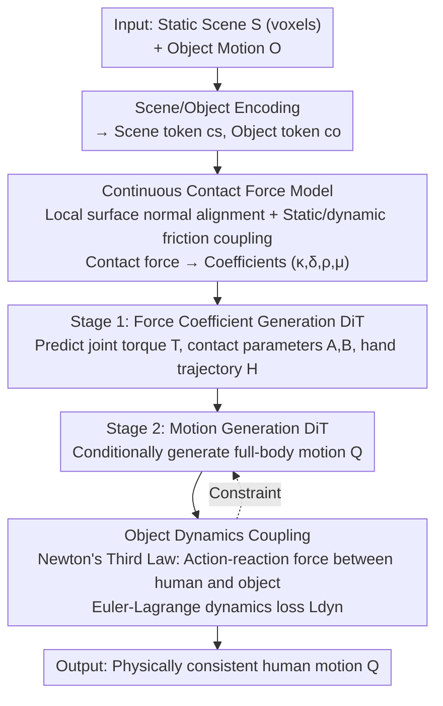

# InterPhys: Physics-aware Human Motion Synthesis in a Dynamic Scene

**Conference**: CVPR 2026  
**Paper**: [CVF Open Access](https://openaccess.thecvf.com/content/CVPR2026/html/Xing_InterPhys_Physics-aware_Human_Motion_Synthesis_in_a_Dynamic_Scene_CVPR_2026_paper.html)  
**Code**: None  
**Area**: Human Understanding / Human Motion Generation  
**Keywords**: Human Motion Synthesis, Human-Object Interaction, Differentiable Contact Force Modeling, Physics Consistency, Diffusion Models

## TL;DR
InterPhys proposes a differentiable continuous contact force model that integrates human-object, human-scene, and internal dynamics into the Euler-Lagrange equations. By employing a two-stage diffusion pipeline to first predict physical parameters and subsequently generate human motion, it significantly enhances the physical plausibility of human motion in dynamic scenes involving moving objects.

## Background & Motivation
**Background**: Human motion synthesis is widely used in VR/AR, animation, and embodied AI. Recently, numerous diffusion-based methods have succeeded in generating increasingly smooth human movements, while also beginning to attempt interaction between humans, scenes, and objects.

**Limitations of Prior Work**: Motions generated by prevailing methods often "appear plausible but violate physics" — exhibiting artifacts like foot sliding, body floating, and unnatural surface penetration. The root cause is their reliance on weak interaction priors, such as binary contact labels, distance thresholds, or penetration penalties, and contact modeling is predominantly focused on the **hands** without modeling actual contact forces. Another paradigm uses physical simulators combined with reinforcement learning (RL); while physically accurate, simulators are non-differentiable and cannot be integrated into end-to-end generative pipelines, and RL policies remain task-specific and difficult to generalize.

**Key Challenge**: Achieving both "physical plausibility" and "end-to-end differentiability + generatability" has historically been mutually exclusive. The only work that integrates a continuous contact model into a differentiable framework, PhysPT, assumes that contact surfaces are fixed, upward-facing infinite planes, and treats normal and tangential (friction) forces as two independent sets of springs. This holds only for humans standing on flat ground, but completely fails on arbitrary curved surfaces, moving objects, or coupled normal-friction dynamics.

**Goal**: To generate physically consistent human motions interacting with a **dynamic scene** (containing a moving object) within an end-to-end differentiable framework. This requires resolving three sub-problems: (1) how contact forces should be modeled to generalize to arbitrary curved surfaces with coupled normal-friction dynamics; (2) how to incorporate the dynamics of moving objects into the constraints; (3) how to interface this physical formulation with a diffusion-based generation pipeline.

**Core Idea**: Replace "weak contact priors" and "non-differentiable simulators" with a **differentiable continuous contact force model**. This model aligns forces with local surface normals, explicitly models static/dynamic friction while making friction dependent on the normal force, couples the dynamics of the moving object back into the human dynamics via Newton's third law, and finally leverages the Euler-Lagrange equations as a physical consistency loss to supervise the two-stage diffusion generation.

## Method

### Overall Architecture
The input consists of an **object motion** $O \in \mathbb{R}^{T\times B}$ and a **static scene** $S \in \{0,1\}^{N_x\times N_y\times N_z}$ represented as voxels, and the output is a **human motion** $Q \in \mathbb{R}^{T\times D}$ interacting with both the moving object and the scene. The core flow is as follows: The physics of the "human + object + scene" is first formulated via the Euler-Lagrange equations, introducing a continuous contact force model that generalizes to arbitrary curved surfaces. Then, the physics are decoupled into "learnable force coefficients" in a two-stage diffusion process. **Stage 1** predicts force coefficients (joint torques, contact parameters, and hand trajectories) from scene/object tokens. **Stage 2** generates full-body motion conditioned on these force coefficients and pulls the generated motion back to physical consistency utilizing a dynamics loss derived from the Euler-Lagrange equations.

### Key Designs

**1. Continuous Contact Force Model: Differentiable soft-gating and surface normals for generalized contact force on arbitrary 3D surfaces**

This is the foundation of the paper, addressing the pain point that PhysPT's "fixed upward plane + decoupled normal/tangential springs" cannot handle curved surfaces and moving objects. Given a potential contact point $p$ on the human body and its closest surface point $x$ on the object/scene, let the relative position be $\tilde{p}=p-x$. This is decomposed along the local surface normal $n(x)$ into the normal component $\tilde{p}_\perp=(\tilde{p}^\top n(x))n(x)$ and the tangential component $\tilde{p}_\parallel=\tilde{p}-\tilde{p}_\perp$. The contact force is controlled via two sigmoid soft-gating functions $h(x)=\frac{1}{1+e^{-x}}$:

$$\lambda(p)=h(-\alpha(\|\tilde{p}_\parallel\|-d_0))\,h(\beta(\tilde{p}^\top n(x)+d_1))\,f(p)$$

The intuition is that the contact force is activated only when the human body is sufficiently close to the surface (small $\|\tilde{p}_\parallel\|$) and has no severe penetration (where $\tilde{p}^\top n(x)$ is positive or slightly negative). Here, $\alpha,\beta$ control the transition steepness, and $d_0,d_1$ act as buffers. This soft-gating converts the discrete, non-differentiable contact decision into a continuous and differentiable one, allowing gradient optimization. The fundamental difference from PhysPT is that **it aligns the normal force with the local geometry using $n(x)$** instead of assuming the normal is always pointing upwards, enabling the same formulation to compute contact forces on arbitrary curved surfaces like tables, chairs, and moving boxes.

**2. Explicit Modeling of Normal Springs + Static/Dynamic Friction: Coupling tangential friction directly onto the normal force**

The contact force is further decomposed into normal $f_\perp$ and tangential $f_\parallel$ components. The normal force uses a damped spring model aligned with the surface normal: $f_\perp(p)=k(p)n(x)$, where $k(p)=-\kappa(\|\tilde{p}_\perp\|-d_0)-\delta(\dot{\tilde{p}}^\top n(x))$, and $\kappa,\delta$ are spring stiffness and damping. The novelty lies in the tangential force: While PhysPT used springs for friction, it ignored the physical reality that friction magnitude depends on the normal force. This paper explicitly models static friction $f_s$ and dynamic friction $f_k$:

$$f_k(p)=-\mu\|f_\perp(p)\|\frac{\dot{\tilde{p}}_\parallel}{\|\dot{\tilde{p}}_\parallel\|}$$

Dynamic friction is proportional to the normal force magnitude $\|f_\perp\|$ and acts opposite to the relative tangential velocity, where $\mu$ is the dynamic friction coefficient — thereby coupling the normal force with friction. Static friction $f_s$ is triggered by velocity gating, and **its direction is reversed between static scenes and moving objects**: For static scenes, the tangential direction is aligned with the tangential acceleration of the contact point, $d_\parallel=\ddot{p}_\parallel/\|\ddot{p}_\parallel\|$ (ground friction "propels" human forward, such as the ground pushing the supporting foot during walking). For moving objects, the direction is opposite to the tangential acceleration of "external forces applied to the object (excluding gravity)", $d_\parallel=-(a-g)_\parallel/\|(a-g)_\parallel\|$ (since the human pushes the object). This distinction of "which pushes which" is a critical detail for physical correctness in dynamic object interactions.

**3. Object Dynamics Coupling: Feeding back moving objects into human constraints via Newton's third law**

Unlike previous works that treat the scene as a static floor, this paper formulates Euler-Lagrange equations for both the human and the object. For the human:

$$M_h(q)\ddot{q}+C_h(q,\dot{q})+G_h(q)=\tau+J_{hs}^\top\lambda_s+J_{ho}^\top\lambda_o$$

where $q=\{\theta,R,T\}\in\mathbb{R}^{75}$ is the SMPL pose, $M_h$ is the mass matrix, $C_h,G_h$ are Coriolis/centrifugal and gravity terms, $\tau$ represents internal joint torques, $\lambda_s,\lambda_o$ are the contact forces applied by the scene and object, and $J_{hs},J_{ho}$ are contact Jacobians. Similarly, the object is modeled as $M_o(q_o)\ddot{q}_o+C_o+G_o=-J_o^\top\lambda_o$. Note that the contact force $\lambda_o$ has an **opposite sign**, which is precisely Newton's third law: the force of the hand acting on the object is equal and opposite to the force of the object acting on the hand. This action-reaction relationship tightly couples the object dynamics into the human dynamics. This not only models how the object responds to human manipulation, but also back-calculates the reaction forces exerted by the object on the hands, providing hard constraints for physically consistent human-object interaction.

**4. Two-Stage Diffusion Pipeline + Dynamics Consistency Loss: Separating force estimation from motion generation using physical parameters as intermediaries**

The contact force is a function of "motion + geometry + coefficients $(\kappa,\delta,\rho,\mu)$", where the coefficients vary per frame and per contact point (noted as $A\in\mathbb{R}^{T\times C_s\times 4}$ for human-scene points $C_s$, and $B\in\mathbb{R}^{T\times C_o\times 4}$ for hand-object points $C_o$). Since learning both motion and physics simultaneously is highly complex, the pipeline is divided into two stages.
**Stage 1** ($\hat{Y}_0=f_\phi(Y_n,c_s,c_o,n)$) uses a transformer-based diffusion model (DiT) to predict force coefficients $\hat{Y}_0=\{\hat{H},\hat{T},\hat{A},\hat{B}\}$ (including hand trajectory $H$, which has proven effective for hand-object interaction in prior work) from the scene token $c_s$ and object token $c_o$, supervised by an $\ell_1$ loss.
**Stage 2** ($\hat{Q}_0=f_\theta(Q_n,\hat{Y}_0,c_s,c_o,n)$) generates full-body motion conditioned on these coefficients. Along with a reconstruction loss $L_{reco}$, it introduces a crucial **dynamics consistency loss** derived from Equation (2):

$$L_{dyn}=\sum_{t=1}^{T}\big\|M_h(\hat{q}_t)\ddot{\hat{q}}_t+C_h+G_h-J_{hs}^\top\lambda_s-J_{ho}^\top\lambda_o-\tau_t\big\|_1$$

This loss measures the deviation of the calculated generalized force residuals from zero. Smaller residuals indicate that the generated motion is more compliant with the Euler-Lagrange equations, hence physically consistent. The total loss is $L=L_{reco}+\lambda_{dyn}L_{dyn}$. This loss "welds" the force coefficients predicted in the first stage and the motion generated in the second stage, serving as the most influential component in the ablation studies.

### Loss & Training
Both stages are trained as diffusion models using the $\ell_1$ loss. The supervision signals (joint torques $T$, contact coefficients $A, B$) are obtained by running a **dynamic optimization** on the ground-truth human/object motions. Specifically, the residual of the Euler-Lagrange equation is minimized using Equations (2) and (3), assuming a known gravity $g$, SMPL segment masses/inertias regressed by $\beta$, object mass and inertia, and a predefined set of candidate contact points, to solve for $A, B, T$. Training is conducted using Adam (initial learning rate of 0.002) on a single RTX 4090 GPU.

## Key Experimental Results

### Main Results
Evaluations are performed on two datasets: OMOMO (approx. 10 hours, 15 categories of daily objects, flat contact) and TRUMANS (15 hours, approx. 1.6M frames, 20 categories of objects, containing rich indoor geometries). Error metrics are lower-is-better, while contact precision/recall/F1 are higher-is-better.

| Dataset | Method | HandJPE↓ | MPJPE↓ | MPVPE↓ | Coll.(%)↓ | F1↑ |
|--------|------|----------|--------|--------|-----------|-----|
| OMOMO | OMOMO [21] | 24.01 | 12.42 | 16.67 | 0.50 | 0.72 |
| OMOMO | InterDiff [51] | 31.76 | 16.03 | 20.19 | 0.61 | 0.63 |
| OMOMO | CHOIS [22] | 28.50 | 14.96 | 18.73 | 0.56 | 0.67 |
| OMOMO | InterAct [53] | 24.62 | 12.59 | 16.71 | 0.47 | 0.73 |
| OMOMO | **Ours** | **20.09** | **10.02** | **13.60** | **0.40** | **0.80** |
| TRUMANS | Trumans [18] | 47.85 | 36.20 | 38.02 | 0.45 | 0.59 |
| TRUMANS | **Ours** | **38.00** | **31.28** | **34.20** | **0.41** | **0.69** |

On OMOMO, the proposed method surpasses the runner-up method (OMOMO) by at least 12% across all motion metrics, with fewer object intersections and more accurate/complete contacts. On TRUMANS, where the scene geometry is more complex (including pelvis-chair contact, in addition to foot-ground), the proposed method consistently dominates all metrics, dropping the scene penetration (Sc. Pen.) from 33.48 to 21.03.

> Note: The only exception is foot sliding (FS), where the proposed method exhibits slightly higher FS. The authors attribute this to a flaw in the FS metric definition — floating human characters above the floor can artificially lower the FS score. Therefore, a lower FS does not necessarily represent better quality (baselines achieved lower FS by floating the feet).

### Ablation Study
Ablation studies on three components on OMOMO:

| Configuration | HandJPE↓ | MPJPE↓ | Coll.↓ | F1↑ | Explanation / Description |
|------|----------|--------|--------|-----|------|
| Ours w/o PL | 21.63 | 11.18 | 0.45 | 0.73 | Without dynamics consistency loss |
| Ours w/o OBJ | 21.02 | 10.73 | 0.43 | 0.74 | Without object dynamics coupling |
| Ours w PT | 21.47 | 10.74 | 0.43 | 0.76 | Replacing contact model with PhysPT's |
| **Ours (Full)** | **20.09** | **10.02** | **0.40** | **0.80** | Full Model |

### Key Findings
- **Dynamics consistency loss (PL) contributes the most**: Without it, F1 drops from 0.80 to 0.73 (approx. 7%), and the quality of object contacts degrades significantly. This indicates that the physical loss is core to aligning "force coefficients" with "motion".
- **Replacing the contact model with PhysPT (w PT) is better than w/o PL but still lags behind the full model**: This directly demonstrates that the proposed continuous contact model (surface normal alignment + static/dynamic friction coupling) is more accurate than PhysPT's decoupled flat spring model.
- **Removing object dynamics coupling (OBJ)** leads to a consistent drop across all metrics, validating the effectiveness of using Newton's third law as a constraint for human-object interaction consistency.

## Highlights & Insights
- **Soft-gating discrete contact decisions**: Utilizing two sigmoid gates + buffers $d_0, d_1$ to model "contact/penetration" (originally a non-differentiable logic) as a continuous and differentiable process is an engineering stroke of genius, allowing physics constraints to be backpropagated in diffusion models. This can be transferred to other generation/optimization tasks requiring differentiable contacts.
- **Physical differentiation of friction directions based on "who pushes whom"**: Static scenes (ground pushing human) and moving objects (human pushing object) have opposite tangential directions. Modeling this physical causality in detail is something that pure data-driven methods struggle to learn — hardcoding physical domain knowledge into losses rather than over-fitting with data.
- **Newton's third law as a free constraint**: The opposite signs of contact forces in the object's dynamics equations provide joint constraints for free, constraining both human and object without introducing additional learnable parameters.
- **Separation of physics and motion via physical parameters**: The two-stage design that first generates "force coefficients" and then generates "motion" decouples complex physics from relatively simple motion generation. This proves much more stable than generating motions end-to-end directly, serving as a highly referable paradigm.

## Limitations & Future Work
- **Dependency on dynamic optimization for supervision**: Ground-truth force coefficients/torques are obtained by optimizing the Euler-Lagrange residuals over the ground-truth motion. This relies on substantial assumptions such as known mass, inertia, and candidate contact points, and the quality of supervision is bounded by this offline optimization accuracy.
- **Scenes limited to a single dynamic object**: The authors deliberately selected a subset from TRUMANS containing only "one dynamic object per sequence". More complex scenarios such as multiple moving objects, articulated tools, and multi-person collaboration remain unverified (and are left as future work).
- **Requirement of known physical attributes**: Object mass, inertia, etc., are treated as known constants, whereas in real-world scenarios, these are often unknown or need to be estimated.
- **Code is not open-source**: No code is available, making the entry barrier for reproducing the full pipeline of "dynamic optimization for supervision + two-stage diffusion" relatively high.

## Related Work & Insights
- **vs PhysPT [58]**: Both use continuous contact models for differentiable physics. However, PhysPT assumes fixed, upward-facing infinite planes and decoupled normal/tangential springs, which only models foot-ground contact. This work aligns forces with local surface normals and couples normal and static/dynamic friction, generalizing to arbitrary curved surfaces and moving objects. The ablation `w PT` directly proves the proposed contact model is superior.
- **vs OMOMO / InterDiff / CHOIS / InterAct [21,51,22,53]**: These diffusion methods "encourage" interaction using contact/penetration priors, but do not predict real forces, leading to floating and foot sliding. The proposed method explicitly models contact forces and constraints using a dynamics loss, yielding much better physical plausibility and contact quality.
- **vs RL + Physical Simulators [14,29,49,54]**: Simulators are physically correct but non-differentiable and task-specific, which limits their generalization. This work combines a differentiable continuous contact model with diffusion, ensuring both physical correctness and end-to-end learnability/generatability.

## Rating
- **Novelty**: ⭐⭐⭐⭐⭐ Formulating a differentiable continuous contact model with surface normal alignment and normal/friction coupling, combined with Newton's third law for object dynamics coupling within a diffusion pipeline, goes significantly deeper in physical modeling than similar works.
- **Experimental Thoroughness**: ⭐⭐⭐⭐ Evaluated on two datasets against four strong baselines with three ablation configurations, showing consistent conclusions supported by qualitative proofs. However, scenes are limited to a single dynamic object, lacking multi-object or multi-person validation.
- **Writing Quality**: ⭐⭐⭐⭐ Clear physical derivations, self-consistent equations, and step-by-step motivation. However, the contact force formulas are dense, placing a slightly higher entry barrier for readers without a physics background.
- **Value**: ⭐⭐⭐⭐⭐ Establishes a new baseline for "physically consistent human-dynamic scene interaction generation". The differentiable contact modeling offers solid transfer value for animation, embodied simulation, and human-object interaction.

<!-- RELATED:START -->

## Related Papers

- [\[CVPR 2026\] PAMotion: Physics-Aware Motion Generation for Full-Body Interaction with Multiple Objects](pamotion_physics-aware_motion_generation_for_full-body_interaction_with_multiple.md)
- [\[CVPR 2026\] SceMoS: Scene-Aware 3D Human Motion Synthesis by Planning with Geometry-Grounded Tokens](scemos_scene-aware_3d_human_motion_synthesis_by_planning_with_geometry-grounded_.md)
- [\[CVPR 2026\] 4DSurf: High-Fidelity Dynamic Scene Surface Reconstruction](textit4dsurf_high-fidelity_dynamic_scene_surface_reconstruction.md)
- [\[CVPR 2026\] SyncMos: Scalable Motion Synchronisation for Multi-Agent Scene Interaction](syncmos_scalable_motion_synchronisation_for_multi-agent_scene_interaction.md)
- [\[CVPR 2026\] InterPrior: Scaling Generative Control for Physics-Based Human-Object Interactions](interprior_scaling_generative_control_for_physics-based_human-object_interaction.md)

<!-- RELATED:END -->
