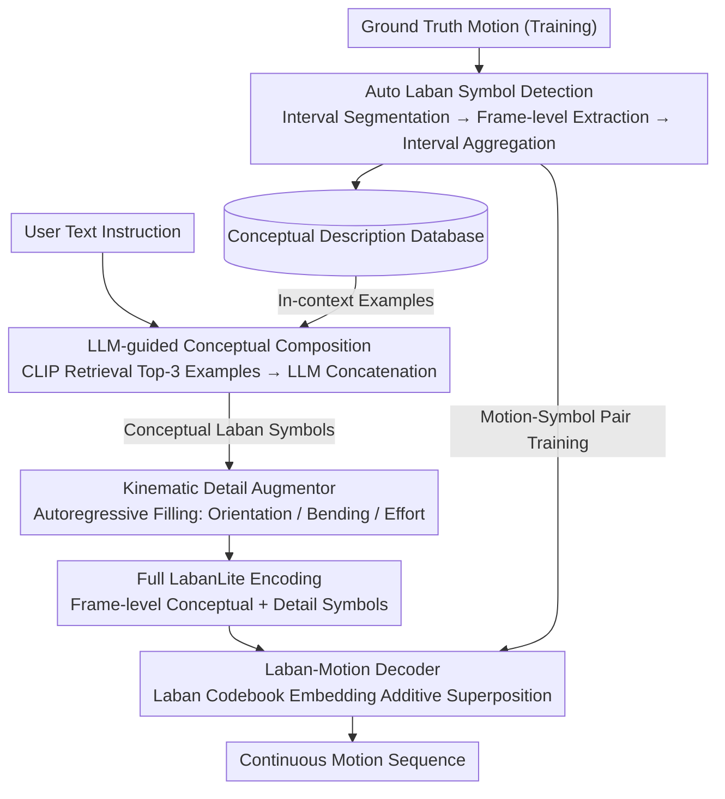

# LaMoGen: Language to Motion Generation Through LLM-Guided Symbolic Inference

**Conference**: CVPR 2026  
**arXiv**: [2603.11605](https://arxiv.org/abs/2603.11605)  
**Code**: Yes ([Project Page](https://jjkislele.github.io/LaMoGen/))  
**Area**: Human Understanding  
**Keywords**: Text-driven motion generation, Labanotation, Symbolic inference, LLM Agent, Interpretable motion synthesis

## TL;DR

This work proposes the LabanLite symbolic motion representation and the LaMoGen framework, enabling LLMs to autonomously compose motion sequences through interpretable Laban symbolic reasoning for the first time, surpassing traditional text-motion joint embedding methods in temporal precision and controllability.

## Background & Motivation

**Background**: Text-driven human motion generation (Text-to-Motion) has achieved significant progress recently. Mainstream methods rely on a text-motion joint embedding space, generating motion sequences through diffusion models or autoregressive Transformers. Representative works include MDM, ReMoDiff, MoDiff, CoMo, and MotionGPT.

**Limitations of Prior Work**: Methods based on joint embeddings perform poorly when handling **temporal precision** and **fine-grained semantics**. For instance, given the instruction "Walk forward in 5 steps and then walk backward in 3 steps," existing methods often generate a generic "walking forward" motion, failing to accurately reflect the number of steps and the sequential order. Furthermore, these methods lack **interpretability**—the generation results are black-box outputs, preventing users from understanding or editing the intermediate process.

**Key Challenge**: The gap between the high-level semantic structure of language (containing explicit body parts, directions, timing, and repetitions) and the continuity and non-interpretability of the motion embedding space. Prior attempts have tried decomposing text into body-part level tokens (e.g., Posescript in CoMo), but these representations only encode static poses and lack the ability to express transition processes and timing.

**Goal**: To establish an interpretable and editable intermediate symbolic representation that allows LLMs to autonomously compose motion sequences through symbolic reasoning while ensuring precision in timing, body part coordination, and linguistic alignment.

**Key Insight**: Inspiration is drawn from the Labanotation system—a dance notation system that symbolically encodes movement attributes such as body parts, directions, levels, and durations, naturally possessing interpretability and structural characteristics. The authors designed LabanLite as a "symbolic bridge" connecting language and motion.

**Core Idea**: Decompose complex motions into Laban symbol sequences, allowing the LLM to reason and compose motion plans in the symbolic space, followed by a decoder that restores the symbols into continuous motion trajectories.

## Method

### Overall Architecture

The core problem LaMoGen aims to solve is enabling LLMs to "understand" and compose human motions without fine-tuning or interacting with continuous motion embeddings. It inserts an interpretable symbolic layer—LabanLite—between language and motion, splitting generation into two stages: **Text → LabanLite → Motion**. The first stage is high-level semantic planning: the LLM translates user text instructions into a series of conceptual Laban symbols ("which body part, in which direction, for how many seconds") using retrieved similar motion examples. The second stage is low-level motion synthesis: a Kinematic Detail Augmentor autoregressively completes these conceptual symbols (which only contain the skeletal structure) into full LabanLite encodings (adding details like orientation, bending, and effort), which are finally restored into continuous motion trajectories by a Laban-Motion Decoder.

This pipeline is supported by two components: a **Laban-Motion Encoder-Decoder** responsible for the bidirectional conversion between motion and symbols (also used during training to derive symbolic labels from ground-truth motions), and an **LLM-guided generation module** responsible for symbol retrieval, composition, and detail completion.

### Key Designs

**1. LabanLite: Transforming Notation into LLM-readable Frame-level Representations**

Original Labanotation consists of event-level notation designed for humans, which is neither regular nor suitable for models. Moreover, pose codes like those in CoMo only encode static poses, losing transitions and timing. LabanLite makes three modifications: First, it splits symbols into two layers—**conceptual symbols** manage the skeletal motion structure (direction, level changes), while **detail symbols** manage fine-grained attributes (like bending angles). This allows the LLM to only interact with the conceptual layer aligned with natural language, leaving tedious details to the Augmentor. Second, it replaces event-level annotation with **frame-level annotation**, where each frame corresponds to a Laban instance, naturally fitting autoregressive ML models. Third, each conceptual symbol is paired with a fixed-format **conceptual description**, such as `<body-part group> <moving semantic> in <time> seconds`, enabling unambiguous translation between symbols and text.

**2. Laban Codebook: Approximating Continuous Motion via Additive Composition**

Motion is continuous, but symbols are discrete. How can continuous changes be composed from discrete symbols? LaMoGen assigns a Laban code to each unique frame-level Laban instance, forming a Codebook $C=\{c_n\}_{n=1}^{N}$. To encode a frame, a binary indicator vector $v_t$ marks which entries are activated in that frame, and the embeddings of these entries are summed to obtain the latent for that frame:

$$z_t=\sum_{n} v_t^n\, c_n$$

The decoder is a Transformer that reconstructs the motion from the latent sequence. The key difference from VQ-VAE (which selects one nearest token) is that it allows **simultaneous activation and linear superposition of multiple entries**, enabling the approximation of complex, continuous movement from a small set of simple symbols without being constrained by discrete boundaries.

**3. Automatic Laban Symbol Detection: Labeling Motion via Professional Notation Thresholds**

Training the encoder-decoder and building benchmarks requires large-scale "motion + symbol" pairs, which is impractical to annotate manually. The authors designed a three-step pipeline to extract symbols from continuous motion: first, **dynamic interval segmentation** to classify frames as moving or static and segment them into atomic motions; second, **frame-level symbol extraction** using 3D displacements of end-effectors relative to the pelvis for direction/level, Euler angles for orientation/bending, and pelvis velocity for effort; third, **interval-level aggregation** to assign representative symbols to each segment. For reliability, discretization thresholds directly follow standards from Labanotation literature recognized by professionals.

**4. LLM-guided Conceptual Composition: "Writing" Laban Symbols via RAG**

LLMs are unfamiliar with the Laban system. Instead of fine-tuning, LaMoGen maintains a **conceptual description database** storing motion caption → conceptual description pairs. During inference, CLIP calculates the semantic similarity between user text and database captions to retrieve Top-K examples as in-context examples. The LLM then infers the symbolic motion pattern corresponding to the user instruction and edits or concatenates new conceptual descriptions. Since descriptions follow a fixed format, LLM outputs can be mapped back to Laban symbols without ambiguity.

**5. Kinematic Detail Augmentor: Recovering Temporal Details**

LLMs excel at skeletal planning but struggle with temporal details like "the specific orientation or bending at each frame," which are the contents of detail symbols. The Augmentor fills this layer: conditioned on text $m$ and masked conceptual vectors $\hat{v}_{1:t-1}$, it autoregressively predicts the full binary indicator vector $v_t$ per frame, activating relevant conceptual and detail entries in the codebook. Random masking (optimal ratio = 0.3) is applied to conceptual vectors during training to force the model to infer details rather than over-relying on conceptual clues. This augmentation increases the information content of the symbol sequence by approximately 60%.

### Example: Generating "Walk forward in 5 steps and then walk backward in 3 steps"

1.  **Retrieval (RAG)**: CLIP identifies similar captions from the database (e.g., "walking forward several steps"), retrieving Top-3 examples.
2.  **LLM Conceptual Composition**: Based on examples, the LLM splits the instruction into two sets of conceptual symbols—one for the lower body "forward, low level, ~5 steps duration" and another for "backward, ~3 steps duration," arranged chronologically.
3.  **Detail Augmentation**: The Augmentor completes the sequence with per-frame orientation, bending, and effort symbols.
4.  **Decoding**: The Laban-Motion Decoder superimposes embeddings into latents to reconstruct continuous motion—5 steps forward followed by 3 steps backward, matching both the count and the sequence.

Throughout the chain, symbols remain human-readable: if the LLM errs in the step count, it can be audited and corrected at the conceptual description stage rather than dealing with a black-box embedding.

### Loss & Training

-   **Codebook Training**: Jointly optimizes decoder parameters $\theta$ and codebook $C$, minimizing $\mathcal{L}_{rec} = \|X - \hat{X}\|_1 + \lambda\|\dot{X} - \dot{\hat{X}}\|_1$ (Pose L1 + Velocity L1).
-   **Augmentor Training**: Binary cross-entropy loss $\mathcal{L}_{gen} = -\sum_{t,n}[v_t^n \log p_t^n + (1-v_t^n)\log(1-p_t^n)]$ to predict activation probabilities.
-   **End-of-sequence**: Appends an `<EOS>` token to the codebook to mark motion termination.

## Key Experimental Results

### Main Results

**Table 1: Quantitative Comparison on Laban Benchmark** (Labanotation-based metrics + R@3 / FID)

| Method | avg.SMT↑ | avg.TMP↑ | avg.HMN↑ | R@3↑ | FID↓ |
|------|----------|----------|----------|------|------|
| MDM | 0.338 | 0.298 | 0.201 | 0.180 | 22.81 |
| ReMoDiff | 0.441 | 0.365 | 0.265 | 0.192 | 7.121 |
| MoDiff | 0.466 | 0.366 | 0.274 | 0.196 | 5.701 |
| CoMo | 0.393 | 0.239 | 0.251 | 0.176 | 21.94 |
| MotionGPT | 0.461 | 0.347 | 0.307 | 0.195 | 2.072 |
| **LaMoGen (GPT-4.1)** | **0.534** | **0.502** | **0.393** | **0.208** | **1.861** |
| LaMoGen (Human) | 0.626 | 0.628 | 0.462 | 0.211 | 1.769 |

**Table 2: Comparison on HumanML3D Standard Benchmark**

| Method | R@1↑ | R@3↑ | FID↓ | MM-Dist↓ | Diversity→ |
|------|------|------|------|----------|-----------|
| Real data | 0.511 | 0.797 | 0.002 | 2.974 | 9.503 |
| ReMoDiff | 0.510 | 0.795 | **0.103** | **2.974** | 9.018 |
| CoMo | 0.502 | 0.790 | 0.262 | 3.032 | 9.936 |
| MotionGPT | 0.492 | 0.778 | 0.232 | 3.096 | 9.528 |
| **LaMoGen (GPT-4.1)** | 0.491 | **0.796** | 0.252 | 3.087 | 9.124 |
| LaMoGen (Human) | **0.513** | **0.813** | 0.206 | 2.993 | 9.635 |

### Ablation Study

**LLM Capability**: Stronger LLMs result in higher generation quality. GPT-4.1 > DeepSeek-V3 > Qwen3 > GPT-4.1mini > None, shown by consistent improvements in Laban metrics and FID.

**Retrieval Samples**: Performance improves from K=1 to K=3 as the LLM benefits from more imitation context. K=5 or 7 shows no further gain due to context window saturation.

**Masking Ratio**: A masking ratio of 0.3 in Augmentor training provided the best balance between generalization and conceptual guidance.

**Laban Symbol Detection Accuracy** (Table 3):
- **Ours**: 0.871 (SMT), 0.852 (TMP), 0.786 (HMN), significantly higher than prior baselines (e.g., Ikeuchi et al.).

### Key Findings

1.  **Symbolic Reasoning Superiority**: LaMoGen (GPT-4.1) outperforms all joint embedding methods in SMT/TMP/HMN, proving its advantage in temporal and coordinative precision.
2.  **MotionGPT's Performance**: While average on standard benchmarks, MotionGPT outperforms CoMo on the Laban Benchmark, suggesting traditional metrics fail to distinguish structural understanding.
3.  **FID Limitations**: LaMoGen's FID is slightly lower because high-level symbolic abstractions treat varied low-level executions (e.g., speed of raising a hand) as the same symbol, revealing inherent expressivity limits.
4.  **Human Limit**: Using "Human" ground-truth conceptual symbols yields better results than using an LLM, indicating room for growth in LLM symbolic composition.

## Highlights & Insights

-   **First LLM-based Autonomous Motion Agent**: LaMoGen is the first framework to enable autonomous motion composition through symbolic reasoning without LLM fine-tuning.
-   **Dual Advantages**: LabanLite enables both machine "understanding" (via descriptions) and human oversight/editability.
-   **Evaluation Contribution**: Proposed SMT/TMP/HMN metrics fill the gap in evaluating temporal precision and multi-part coordination.
-   **Hierarchical Design**: The separation of conceptual/detail layers and LLM/Augmentor tasks provides an elegant "divide and conquer" architecture.

## Limitations & Future Work

1.  **LabanLite Expressivity**: Discretization loses low-level motion details, leading to higher FID. Future work could introduce continuous attribute fields.
2.  **LLM Dependency**: Performance is tied to LLM capability, and API-based inference increases latency/cost.
3.  **Dataset Scope**: The Laban Benchmark focuses on walking; assessment for complex motions like dance or gymnastics is limited.
4.  **Fixed Symbol Set**: Relying on traditional Labanotation sets may limit descriptions for emerging motion types.
5.  **Retrieval Constraints**: RAG effectiveness depends on the coverage of the Conceptual Description Database.

## Related Work & Insights

-   **CoMo (ECCV 2024)**: Uses Posescript for body-part pose codes but lacks temporal transitions. LabanLite provides a more complete semantic representation.
-   **MotionGPT (NeurIPS 2024)**: Fine-tunes LLMs on motion tokens. LaMoGen works in the symbolic space without fine-tuning.
-   **Insight**: The paradigm of symbolic intermediate representation + LLM reasoning can be extended to other modalities (e.g., music-to-dance, sign language).

## Rating

⭐⭐⭐⭐ — Introducing Labanotation to LLM-driven motion generation is a clever innovation. The symbolic reasoning route opens new directions for interpretable and controllable generation. While FID and LLM dependency are bottlenecks, the Laban Benchmark contribution is substantial.

<!-- RELATED:START -->

## Related Papers

- [\[CVPR 2026\] MoLingo: Motion-Language Alignment for Text-to-Human Motion Generation](molingo_motion-language_alignment_for_text-to-motion_generation.md)
- [\[AAAI 2026\] SOSControl: Enhancing Human Motion Generation through Saliency-Aware Symbolic Orientation and Timing Control](../../AAAI2026/human_understanding/soscontrol_enhancing_human_motion_generation_through_saliency-aware_symbolic_ori.md)
- [\[CVPR 2026\] Multi-level Causal LLM-based Text-to-Motion Generation with Human Alignment (MoTiGA)](multi-level_causal_llm-based_text-to-motion_generation_with_human_alignment.md)
- [\[ECCV 2024\] CoMo: Controllable Motion Generation Through Language Guided Pose Code Editing](../../ECCV2024/human_understanding/como_controllable_motion_generation_through_language_guided_pose_code_editing.md)
- [\[CVPR 2026\] Towards Highly-Constrained Human Motion Generation with Retrieval-Guided Diffusion Noise Optimization](towards_highly-constrained_human_motion_generation_with_retrieval-guided_diffusi.md)

<!-- RELATED:END -->
