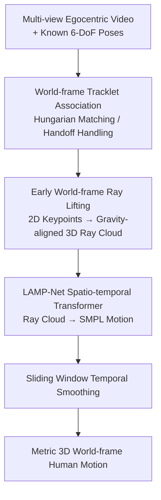

# LAMP: Localization Aware Multi-camera People Tracking in Metric 3D World

**Conference**: CVPR 2026  
**arXiv**: [2605.05390](https://arxiv.org/abs/2605.05390)  
**Code**: https://facebookresearch.github.io/LAMP (Project page, committed to open-sourcing models and code)  
**Area**: Human Understanding / 3D Human Motion Tracking / Egocentric Perception  
**Keywords**: Multi-camera Headset, World-frame Motion Tracking, Ray Lifting, SMPL, Spatio-temporal Transformer

## TL;DR
LAMP leverages the known 6-DoF poses of a headset to lift 2D human keypoints detected across multiple cameras into a unified world-frame 3D ray cloud at an early stage. A spatio-temporal Transformer then fits human SMPL motion directly to this ray cloud. This "lift-then-fit" paradigm completely decouples the wearer's head motion from the observed person's motion, achieving SOTA performance on monocular benchmarks and significantly outperforming baselines in multi-camera egocentric scenarios.

## Background & Motivation

**Background**: Tracking 3D human motion from video has been studied for decades. The mainstream approach utilizes the SMPL parametric body model, relying on monocular image regression or video temporal aggregation (Temporal CNNs / RNNs / Transformers) for frame-wise pose estimation. Recently, research has pivoted toward "world-frame" recovery, such as WHAM using gyroscopes, GVHMR using gravity-aligned coordinates, and TRAM/WHAC/PromptHMR combining off-the-shelf SLAM with monocular depth for world-frame conversion.

**Limitations of Prior Work**: Most existing methods are designed for monocular, uncalibrated, and static or slowly moving camera scenes. They often fail when applied to modern AR/Smart Glasses egocentric headsets for three reasons:
1. Headsets exhibit violent 6-DoF self-motion (frequent and rapid head turns), while most tracking algorithms assume a static or slowly moving camera.
2. Headsets use multi-camera arrays to cover a large field of view (FoV) with minimal stereo overlap. A person may be partially seen by only one camera, and observations frequently shift between cameras (camera hand-off). Monocular methods using late fusion are unstable and carry inherent monocular scale ambiguity.
3. 3D annotated video data is scarce and expensive to collect, yet headset camera configurations change with every generation, making it nearly impossible to gather sufficient training data for specific devices.

**Key Challenge**: Existing methods attempt to "simultaneously" estimate both observer and target motion. This works when the observer deliberately follows the target (correlated motion), but in egocentric settings, these motions are completely independent. This entanglement makes the problem fundamentally harder and forces a single model to resolve scale ambiguity, partial observation, and camera hand-off simultaneously.

**Goal**: To stably track the motion of multiple people in a metric 3D world-frame under the threefold constraints of violent head motion, multi-camera setups, and data scarcity.

**Key Insight**: Device localization (VIO/SLAM) for modern headsets is essentially a "solved" problem, where 6-DoF poses and camera calibration are available with high precision. Instead of forcing a network to learn camera motion, this known information should be used as input to strip away self-motion "early" in the pipeline.

**Core Idea**: An "Early World-frame Ray Lifting" paradigm. Before any spatio-temporal reasoning, 2D keypoints from each camera are back-projected into a 3D ray cloud in the world-frame using known 6-DoF poses. This allows the subsequent network to focus exclusively on learning the prior of "how humans move."

## Method

### Overall Architecture

LAMP takes multi-view egocentric video ($K$ cameras, $T$ timesteps) with known 6-DoF poses $\{\mathbf{T}_k^t \in \mathbb{SE}(3)\}$ as input and outputs the SMPL parameterized human motion $\mathcal{H}_i^t := \{\boldsymbol{\theta}_i^t, \boldsymbol{\beta}_i^t, \boldsymbol{\omega}_i^t, \boldsymbol{\tau}_i^t\}$ (joint angles, shape, global rotation, and translation) for each person at each timestep. The pipeline is a serial sequence: "Detection & Association → Ray Lifting → Fitting → Smoothing," with a core "lift-then-fit" decoupling.

The first step back-projects 2D keypoints from all cameras and timesteps into a **unified world-frame** using known poses and calibration, forming a spatio-temporal 3D ray cloud. This achieves two key decouplings: (1) 6-DoF self-motion is stripped, so the network no longer needs to learn camera motion; (2) 2D detection is separated from 3D motion fitting, allowing the reuse of off-the-shelf 2D detectors and the **simulation** of training samples from any pure motion data. The second step utilizes LAMP-Net (a spatio-temporal Transformer) to fit this ray cloud directly into world-frame human motion. It treats finding the 3D human motion most consistent with the given ray cloud as an inverse problem, naturally performing "3D triangulation" across asynchronous, partial, and multi-camera observations via human motion priors.

### Key Designs

**1. Early World-frame Ray Lifting: Stripping Self-motion Before Reasoning**

This is the lifeline of the approach, addressing the core observer-target motion entanglement. For each 2D keypoint $\mathbf{p}_j^t$, the calibrated back-projection function $\pi^{-1}$ yields a unit ray, which is transformed into the world-frame using the camera pose $\mathbf{T}^t_{W\leftarrow C_k}$, and finally normalized to a **gravity-aligned** local coordinate system $L_T$ defined by the first frame's camera:

$${}^{c}\boldsymbol{\phi}_j^t := \mathbf{T}_{L_T \leftarrow W} \cdot \mathbf{T}^t_{W\leftarrow C_k} \cdot \pi^{-1}(\mathbf{p}_j^t)$$

Each ray, together with the transformed camera center ${}^{o}\boldsymbol{\phi}^k_t$, is parameterized as a 6D Plücker ray and concatenated with the 2D detector's confidence to form a tensor $\boldsymbol{\Phi} \in \mathbb{R}^{T\times K \times J \times 7}$ ($J=17$ MSCOCO keypoints, zeros for missing observations). This is effective because 6-DoF poses are "known and trusted" inputs rather than quantities to be learned. Self-motion is subtracted before the network, allowing the fitting process to focus solely on "how people move," with estimated motion naturally anchored in the metric world-frame without monocular scale ambiguity. This differs from "late composition" methods like GloPro or PromptHMR; LAMP is early-lifting and supports causal real-time inference.

**2. World-frame Tracklet Association: Seamless Camera Handoff**

In multi-camera arrays, a person’s visibility alternates between cameras. LAMP maintains each tracklet in the **world-frame**. At each timestep, 3D points from existing trajectories are projected back into each camera image to find expected positions. Matching costs are calculated against current 2D boxes for bipartite matching via the Hungarian algorithm. If matching fails, a new trajectory starts; trajectories are deactivated if not seen for a prolonged period. By living in the world-frame, the projection step **automatically compensates for headset motion**, making the specific camera source irrelevant. Cross-camera handoffs are treated as continuous observations on the same world-frame trajectory.

**3. LAMP-Net Spatio-temporal Transformer: Multi-stage Cross-attention**

LAMP-Net maps the ray cloud to SMPL motion using a spatio-temporal Transformer. The encoder performs self-attention across **spatial (joints)** and **temporal (frames)** dimensions to estimate shape and dynamics. Learnable read-out embeddings with temporal encoding act as queries in the cross-attention decoder to regress frame-wise SMPL parameters (rotation in 6D). Unlike models that only interact with the final encoder layer, LAMP-Net’s decoder performs cross-attention at **every encoder block**, allowing the read-out embedding to repeatedly aggregate motion and geometric information across feature levels. This multi-level interaction significantly improves temporal stability and convergence, as it captures geometric constraints and motion priors distributed across different scales.

**4. Simulating Multi-camera Training: Cross-device Data Engine**

Since LAMP-Net processes 3D rays rather than raw pixels, training data can be "simulated" by projecting 3D ground-truth joints from any motion dataset into arbitrary virtual camera configurations. This addresses data scarcity: large-scale training data can be synthesized for any camera layout. The paper uses Nymeria data (Aria Gen1) to simulate training samples for Aria Gen2 (~270° FoV, 4 cameras). The model, having never seen real Gen2 data, can directly process real Gen2 sequences, proving that "simulation + heavy data augmentation" minimizes the sim-to-real gap.

### Loss & Training

The training loss constrains SMPL parameters, 3D joints, mesh vertices, and joint velocities:

$$\mathcal{L} = \lambda_{\text{SMPL}}\mathcal{L}_{\text{SMPL}} + \lambda_{\text{3D}}\mathcal{L}_{\text{3D}} + \lambda_{\text{V}}\mathcal{L}_{\text{V}} + \lambda_{\text{vel}}\mathcal{L}_{\text{vel}}$$

These terms represent frame-wise L2 errors for ground-truth SMPL parameters, joint positions $\mathcal{J}$, vertex positions $\mathcal{V}$, and joint velocities $\mathcal{D}$ (via finite differences). Weights are set to $\lambda_{\text{SMPL}}=1.0, \lambda_{\text{3D}}=5.0, \lambda_{\text{V}}=1.0, \lambda_{\text{vel}}=20.0$. The vertex loss $\mathcal{L}_V$ was found to improve results despite the ill-posed nature of mesh reconstruction from sparse rays. The model consists of 3 encoder-decoder blocks with a hidden dimension of 512, inputting a 4-second temporal window (120 frames at 30 Hz), trained for 200 epochs on 4 H100 nodes (~19 hours).

**Sliding Window Temporal Smoothing**: For causal online inference, each frame is processed $T$ times as the window shifts. Taking the **average** of these multiple predictions reduces noise and jitter at zero additional inference cost, with a maximum latency of $T-1$ frames.

## Key Experimental Results

### Main Results

Evaluated on EMDB (slow tracking, zero-shot) and Nymeria (violent egocentric motion, long sequences). MPJPE and FS are in mm, RTE is %, and Jitter is $10\,m/s^3$.

| Dataset | Method | MPJPE↓ | PA-MPJPE↓ | WA-MPJPE₁₀₀↓ | W-MPJPE↓ | RTE↓ | Jitter↓ | FS↓ |
|--------|------|--------|-----------|--------------|----------|------|---------|-----|
| EMDB | PromptHMR | **68.1** | **40.1** | **63.9** | 278.1 | 0.4 | 16.3 | 3.5 |
| EMDB | LAMP-mono | 82.3 | 46.3 | 77.8 | **165.1** | **0.2** | **4.6** | **3.2** |
| Nymeria | PromptHMR | 109.2 | 66.0 | 101.6 | 246.0 | 0.11 | 114.1 | 7.7 |
| Nymeria | LAMP-mono | 92.3 | 55.5 | 80.4 | 203.4 | 0.09 | 23.8 | **3.2** |
| Nymeria | LAMP-mv | **54.8** | **37.3** | **58.7** | **113.3** | **0.05** | 21.8 | 3.6 |

- On EMDB, LAMP-mono leads significantly in world-frame localization metrics (W-MPJPE 165.1 vs 278.1, RTE 0.2 vs 0.4), though it trails in "local pose" metrics like PA-MPJPE—a trade-off for collapsing pixels into rays to enable multi-view integration.
- On Nymeria, LAMP-mono outperforms PromptHMR across the board. The multi-camera version (LAMP-mv) provides a massive boost: MPJPE drops from 109.2 (PromptHMR) to 54.8, and W-MPJPE from 246.0 to 113.3.

### Ablation Study

Ablation on Nymeria (posed=using camera pose; smooth=sliding window; simulate=simulated keypoints; multiview=4 cameras):

| Variant | posed | smooth | simulate | multiview | MPJPE↓ | W-MPJPE↓ | RTE↓ | Jitter↓ | FS↓ |
|------|:----:|:----:|:----:|:----:|--------|----------|------|---------|-----|
| var₀ |  |  |  |  | 98.5 | 296.3 | 0.50 | 93.1 | 6.1 |
| var₁ | ✓ |  |  |  | 98.3 | 209.6 | 0.09 | 91.7 | 5.5 |
| var₂ | ✓ | ✓ |  |  | 92.3 | 203.4 | 0.09 | 23.8 | 3.2 |
| var₃ | ✓ | ✓ | ✓ |  | 60.4 | 199.8 | 0.08 | 21.4 | 3.5 |
| var₄ | ✓ | ✓ |  | ✓ | 54.8 | 113.3 | 0.05 | 21.8 | 3.6 |
| var₅ | ✓ | ✓ | ✓ | ✓ | **52.0** | **111.5** | **0.05** | 21.4 | 3.5 |

### Key Findings

- **Ray lifting (posed) primarily contributes to global localization**: var₀→var₁ slashes RTE from 0.50 to 0.09, proving that "early use of known camera motion" is critical for world-frame accuracy.
- **Sliding window smoothing targets jitter**: var₁→var₂ reduces Jitter from 91.7 to 23.8 at nearly zero cost.
- **Multi-camera is transformative**: Comparing var₂ (mono: 92.3) and var₄ (mv: 54.8) shows massive improvements in nearly all metrics, especially W-MPJPE (203.4 vs 113.3).
- **Multi-view closes the sim-to-real gap**: The gap between simulation and real data is large for monocular (var₂ vs var₃) but tiny for multi-view (var₄ vs var₅), suggesting multi-view + data augmentation allows pure simulation to approach real-world performance.
- **Failures**: In the EMDB `64_outdoor_skateboard` sequence, LAMP performs worse due to a lack of skateboarding-like activities in the training data.

## Highlights & Insights
- **The "Don't learn what is known" philosophy**: Since 6-DoF localization is solved by VIO/SLAM, LAMP treats it as input. This decouples observer-target motion before the network, achieving performance gains through simplicity.
- **Early-lifting vs Late-composition**: Most world-frame methods predict in camera-space and transform later. LAMP proves that "lifting to world-space rays first" is more accurate, supports causal real-time processing, and enables natural multi-view fusion.
- **Ray representation as a data engine**: By using 3D rays instead of pixels, training data can be synthesized from any motion library. This addresses the "new device, no data" bottleneck, applicable to any sensor array with calibratable geometry (LiDAR, Radar).
- **Multi-stage cross-attention**: Aggregating features at every block effectively extracts geometric and motion information from sparse ray clouds.

## Limitations & Future Work
- **Strict dependence on reliable 6-DoF**: The method requires accurate camera poses and calibration, making it unsuitable for standard monocular smartphones or web videos without pose data.
- **Multi-view for full potential**: While it beats baselines in monocular settings, its true strength lies in multi-camera configurations.
- **Local pose precision trade-off**: Collapsing pixels into sparse rays loses fine-grained details, resulting in lower PA-MPJPE on EMDB compared to monocular-specific methods. Incorporating pixel-derived information could mitigate this.
- **Reliance on front-end detection**: Performance degrades in dense crowds or during long-term occlusions where 2D detection and Hungarian association fail.

## Related Work & Insights
- **vs PromptHMR / TRAM / WHAC**: These methods predict in camera-space and scale later. LAMP uses known poses for early world-frame lifting, avoiding late-composition errors and scale ambiguity while supporting causal inference.
- **vs WHAM / GVHMR**: These rely on gyroscopes/gravity for single-camera world-frame alignment. LAMP is designed for multi-camera headsets using the entire 6-DoF pose stream as input.
- **vs Traditional Triangulation**: Classic methods require fixed rigs and overlapping FoVs. LAMP uses motion priors to perform "soft triangulation" across moving, asynchronous, and partial observations.

## Rating
- Novelty: ⭐⭐⭐⭐⭐ The "lift-then-fit" paradigm shift cleanly decouples egocentric motion.
- Experimental Thoroughness: ⭐⭐⭐⭐ Extensive evaluation across EMDB/Nymeria with a complete four-way ablation and Aria Gen2 cross-device validation.
- Writing Quality: ⭐⭐⭐⭐ Clear motivation and factorization; primary logic is easy to follow.
- Value: ⭐⭐⭐⭐⭐ Highly practical for AR/Smart Glasses; the method is real-time, simple, and cross-device compatible.

<!-- RELATED:START -->

## Related Papers

- [\[CVPR 2026\] Humanoid-GPT: Scaling Data and Structure for Zero-Shot Motion Tracking](humanoid-gpt_scaling_data_and_structure_for_zero-shot_motion_tracking.md)
- [\[CVPR 2026\] MetricHMSR: Metric Human Mesh and Scene Recovery from Monocular Images](metrichmsr_metric_human_mesh_and_scene_recovery_from_monocular_images.md)
- [\[CVPR 2026\] Seeing without Pixels: Perception from Camera Trajectories](seeing_without_pixels_perception_from_camera_trajectories.md)
- [\[CVPR 2026\] OSMO: Open-vocabulary Self-eMOtion Tracking](osmo_open-vocabulary_self-emotion_tracking.md)
- [\[CVPR 2026\] Active Intelligence in Video Avatars via Closed-loop World Modeling](active_intelligence_in_video_avatars_via_closed-loop_world_modeling.md)

<!-- RELATED:END -->
