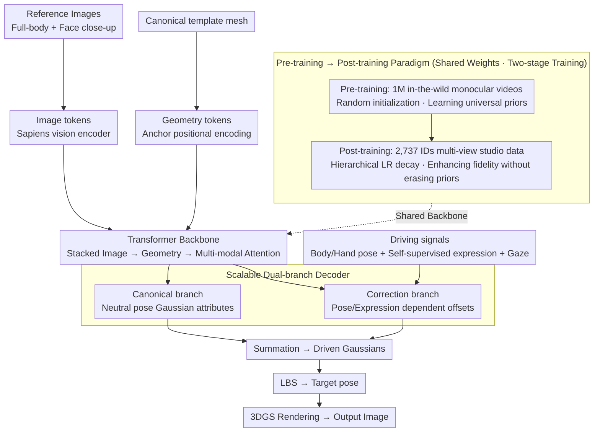

# LCA: Large-scale Codec Avatars - The Unreasonable Effectiveness of Large-scale Avatar Pretraining

**Conference**: CVPR 2026  
**arXiv**: [2604.02320](https://arxiv.org/abs/2604.02320)  
**Code**: [https://junxuan-li.github.io/lca](https://junxuan-li.github.io/lca)  
**Area**: Human Understanding / 3D Vision  
**Keywords**: 3D Avatars, Large-scale Pretraining, Feed-forward Generation, Gaussian Splatting, Expression Control

## TL;DR

LCA applies the large-scale pre-training/post-training paradigm to 3D avatar modeling for the first time: pre-training on 1 million in-the-wild videos to learn broad appearance and geometric priors, followed by post-training on high-quality multi-view studio data to enhance fine expressions and fidelity, breaking the inherent trade-off between generalization and fidelity.

## Background & Motivation

High-quality 3D avatar modeling faces a core trade-off: studio data generates high-fidelity avatars but lacks generalization (limited to captured individuals); in-the-wild data generalizes to more people but suffers from low quality (3D ambiguity leading to distortion).

**Key Insight**: Inspired by LLMs and vision foundation models—large-scale pre-training learns universal priors, while post-training with a small amount of high-quality data aligns with the target task. This work demonstrates for the first time that this paradigm is equally effective in the 3D avatar domain.

## Method

### Overall Architecture

LCA aims to answer whether a single feed-forward network can cover a massive range of identities while maintaining studio-level expression fidelity. The approach decouples this into two stages: "learning universal priors on massive in-the-wild videos" followed by "aligning quality on small-scale high-quality data," utilizing a shared scalable network.

During inference, the model takes several reference images (full-body + face close-ups) and a template body mesh in a canonical pose. Images are processed by a general vision encoder (Sapiens) into image tokens, while anchors of the template mesh are processed via positional encoding into geometry tokens. Both are fed into a large Transformer backbone—each layer sequentially performs image attention (per-image self-attention), geometry attention, and multi-modal attention to fuse both streams. This allows information exchange between multiple input images and accommodates a variable number of reference views. Fused features are decoded via two branches: the canonical branch outputs a set of pose-independent Gaussian attributes in a neutral pose, and the correction branch predicts offsets based on driving signals (body/hand pose + self-supervised expression codes + gaze direction). The driven Gaussians are obtained by summation, transformed to the target pose via Linear Blend Skinning (LBS), and finally rendered using 3D Gaussian Splatting (3DGS). Both stages share this network: pre-training starts with random initialization on ~1M in-the-wild videos, and post-training continues on multi-view studio data for 2,737 identities using hierarchical learning rate decay to preserve pre-trained priors.

### Key Designs

**1. Scalable Dual-branch Architecture: Unified Pipeline for Studio and In-the-wild Data**

In-the-wild and studio data differ significantly—the former consists of casual videos without geometry or textures, while the latter includes calibrated multi-view sequences. To train on both, the architecture avoids "high-quality conditional inputs." LCA uses image tokens from a general encoder (Sapiens) and geometry tokens from a canonical mesh, both of which are readily available for any source. The Transformer backbone alternates between image, geometry, and multi-modal attention, enabling cross-view information exchange. Decoding into "neutral + offset" allows the same weights to learn appearance priors from static frames and expressions from dynamic sequences.

**2. Pre-training → Post-training Paradigm: Trading Scale for Generalization, then Quality for Fidelity**

The conflict between generalization and fidelity was previously viewed as an inherent trade-off. LCA adopts the LLM approach: the pre-training stage learns broad human appearance and geometric priors on millions of videos, ensuring the model has "seen the world." The post-training stage then specializes using multi-view studio data to maximize facial expression precision and 3D consistency. Since post-training optimizes on top of pre-trained weights rather than starting from scratch, it layers accuracy over generalization without overriding it.

**3. Self-supervised Expression Encoding: Finer Driving Signals than Parametric Models**

Traditional parametric models (e.g., blendshapes) are too coarse for studio-level micro-expressions. LCA uses a self-supervised method to learn 128-dimensional facial expression latent codes (following [69]) as driving signals for the correction branch. Combined with 138-dimensional body/hand poses from expressive models (SMPL-X type) and gaze direction, it achieves control from facial details down to fingertips. Since the codes are learned and not restricted by predefined blendshape bases, the correction branch can represent detailed offsets beyond parametric models.

### Loss & Training

The training objective combines rendering losses and Gaussian regularization. Rendering losses apply $L_1$ + $LPIPS$ (perceptual loss) to both canonical and corrected rendering results. Gaussian regularization uses ACAP (position) and ASAP (scale) constraints. Pre-training uses random initialization on ~1M videos, while post-training continues from these weights on 2,737 identities with multi-view supervision, using hierarchical learning rate decay. During animation, opacity is fixed to stabilize rendering across poses/expressions.

## Key Experimental Results

### Main Results

| Capability | LCA (Ours) | Prev. SOTA | Description |
|-----------|-----------|------------|-------------|
| Identity Generalization | Global population coverage | Thousands of identities | Hair/Clothing/Skin/Accessories |
| Expression Control | Fine facial + Fingertip level | Coarse-grained | Significantly enhanced by post-training |
| 3D Consistency | Strong | Weak for in-the-wild methods | Pre-training + Post-training synergy |
| Feed-forward Inference | Efficient | Requires optimization | Generation from few images |

### Ablation Study

| Configuration | Generalization | Expression Accuracy | 3D Consistency | Description |
|---------------|----------------|---------------------|----------------|-------------|
| Pre-training Only | Strong | Weak (Blurred expressions) | Medium (3D distortion) | Broad priors but insufficient precision |
| Post-training Only | Weak | Strong | Strong | High quality but poor generalization |
| Pre + Post-training | Strong | Strong | Strong | Optimal balance |

### Key Findings

- **Emergent Capabilities**: Without direct supervision, the model spontaneously generalizes to relighting, loose clothing support, and zero-shot robustness for stylized images.
- Priors learned during pre-training are not overwritten during post-training—similar to capability retention in LLMs.
- The scale of 1 million videos is crucial for robust generalization.

## Highlights & Insights

- **3D Transfer of LLM Paradigm**: First to prove that the pre/post-train paradigm breaks the generalization-fidelity trade-off in 3D avatars.
- **Emergent Capabilities**: The emergence of relighting and stylization robustness suggests that large-scale data allows the model to learn deep physical/semantic understandings.
- **Feed-forward Efficiency**: High-quality avatars generated from only a few images, suitable for practical deployment.

## Limitations & Future Work

- High computational cost for 1M video pre-training (Meta-scale resources).
- Fidelity of body parts is lower than facial regions.
- Open-source status is uncertain; reproducibility remains to be verified.

## Related Work & Insights

- **vs. Codec Avatars**: Traditional Codec Avatars require per-person optimization; LCA is feed-forward.
- **vs. TRELLIS/Rodin**: These methods use smaller scales; LCA is the first to reach the million-video scale.
- **vs. Real3D-Portrait**: Single-image methods have limited fidelity; LCA's multi-image + large-scale pre-training is superior.

## Rating

- Novelty: ⭐⭐⭐⭐⭐ First successful application of pre/post-train paradigm in 3D avatars.
- Experimental Thoroughness: ⭐⭐⭐⭐ Comprehensive demonstration, though quantitative benchmarks could be more standardized.
- Writing Quality: ⭐⭐⭐⭐⭐ Fluent narrative with deep insights.
- Value: ⭐⭐⭐⭐⭐ Transformative for the 3D digital human industry.

<!-- RELATED:START -->

## Related Papers

- [\[CVPR 2026\] OpenDance: Multimodal Controllable 3D Dance Generation with Large-scale Internet Data](opendance_multimodal_controllable_3d_dance_generation_with_large-scale_internet_.md)
- [\[CVPR 2026\] M4Human: A Large-Scale Multimodal mmWave Radar Benchmark for Human Mesh Reconstruction](m4human_a_large-scale_multimodal_mmwave_radar_benchmark_for_human_mesh_reconstru.md)
- [\[CVPR 2026\] RoMo: A Large-Scale, Richly Organized Dataset and Semantic Taxonomy for Human Motion Generation](romo_a_large-scale_richly_organized_dataset_and_semantic_taxonomy_for_human_moti.md)
- [\[CVPR 2026\] OpenT2M: No-frill Motion Generation with Open-source, Large-scale, High-quality Data](opent2m_no-frill_motion_generation_with_open-source_large-scale_high-quality_dat.md)
- [\[ICML 2026\] Efficient, Validation-Free Intrinsic Quality Estimation for Large-Scale Face Recognition Datasets](../../ICML2026/human_understanding/efficient_validation-free_intrinsic_quality_estimation_for_large-scale_face_reco.md)

<!-- RELATED:END -->
