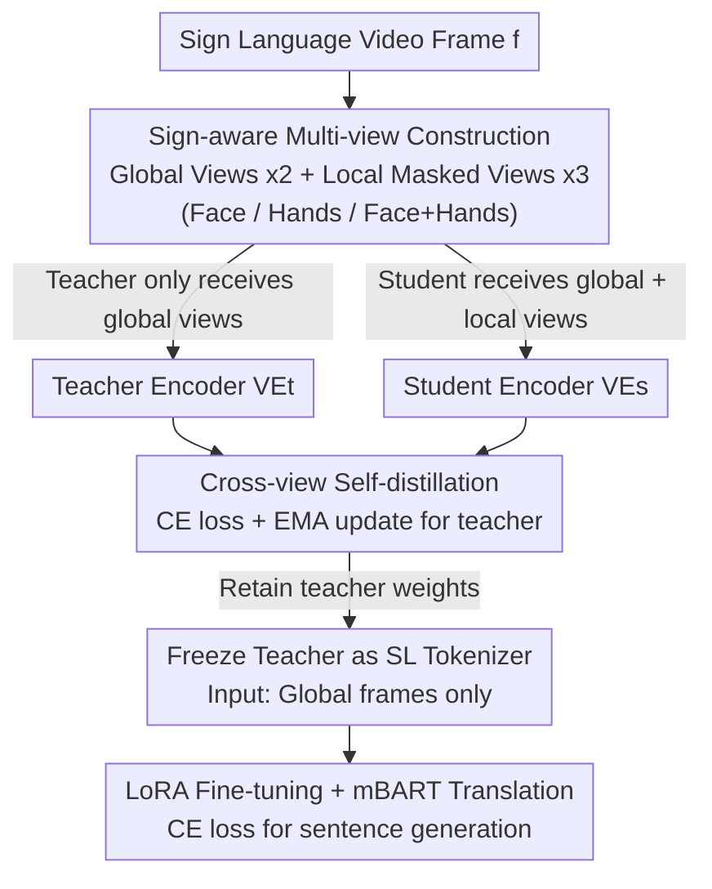

# Learning Effective Sign Features without Text for Gloss-free Sign Language Translation

**Conference**: CVPR 2026  
**Paper**: [CVF Open Access](https://openaccess.thecvf.com/content/CVPR2026/html/Gan_Learning_Effective_Sign_Features_without_Text_for_Gloss-free_Sign_Language_CVPR_2026_paper.html)  
**Code**: To be confirmed  
**Area**: Human Understanding / Sign Language Translation / Self-supervised Learning  
**Keywords**: Text-free pre-training, Sign language translation, Self-distillation, DINO, Local discriminative cues

## TL;DR
This paper proposes SignDINO—a "sign-aware" pre-training strategy adapted from DINO self-distillation. By providing the teacher with only global frames and the student with local masked views of hands/faces, the model is forced to infer discriminative local cues from global frames alone. This enables pre-training of a sign language tokenizer **entirely without gloss or text annotations**, achieving or exceeding SOTA performance on four public GFSLT datasets that usually rely on text-based pre-training.

## Background & Motivation

**Background**: Sign Language Translation (SLT) follows two paths. Gloss-based SLT pre-trains a visual encoder (sign tokenizer) under CTC constraints using gloss annotations before connecting to translation models like mBART/GPT-2/mT5. However, gloss annotations are expensive and depend on linguistic experts, limiting scalability. Consequently, the community has shifted toward Gloss-free SLT (GFSLT), which eliminates glosses during pre-training and instead **uses text annotations** to align visual and textual representations (via contrastive learning, pseudo-gloss + CTC, text-conditioned vector quantization, multi-stage pre-training, etc.).

**Limitations of Prior Work**: Current GFSLT still cannot decouple from **text supervision** to pre-train tokenizers; "gloss-free" merely swaps gloss dependency for text dependency. Recent works like SHuBERT and SignMusketeers use DINO-style text-free pre-training, but suffer from two major drawbacks: (1) pre-training focuses only on local discriminative regions (hands/face) and fails to learn full-frame representations; (2) the encoder **can only process local regions** (hands, face, skeleton) as input during inference, requiring extra detection/cropping pipelines rather than using global video frames directly.

**Key Challenge**: Sign language videos are characterized by global content that remains similar across most frames (background/body appearance is static), while semantic and discriminative information is highly concentrated in **subtle movements of the hands and face**. General visual SSL (MAE, SimSiam, DINO) naturally tends to capture global semantics while ignoring fine-grained local cues, leading to poor performance when directly applied to the sign language domain.

**Goal**: This is split into two sub-goals: (1) Completely decouple pre-training from gloss/text annotations using only raw sign language frames to improve scalability for unlabeled videos; (2) Ensure the tokenizer relies only on **global video frames** during inference, eliminating the need for extra inputs like hands/faces/skeletons.

**Key Insight**: Empirical evidence shows that SOTA SSL methods like MAE or DINO fail on sign videos because they prioritize global context over local details. Since discriminative cues are local, the **global and local information can be split between teacher and student** to force the model to establish a "global frame $\to$ local semantics" mapping.

**Core Idea**: In one sentence: **The teacher views the global frame while the student views local masked views for self-distillation**, forcing the teacher to "hallucinate" discriminative cues for hands/faces using only global frames, so only global frames are needed during inference.

## Method

### Overall Architecture
The goal of SLT is to learn a mapping $p(w|f)$ from sign language video $f=\{f_i\}_{i=1}^{\theta}$ to a text sequence $w=\{w_i\}_{i=1}^{\varsigma}$. A sign language tokenizer (visual encoder $\mathcal{VE}$) extracts visual features $v=\mathcal{VE}(f)$ for the translation model. SignDINO divides the pipeline into two stages: **Sign-aware DINO self-distillation pre-training** to obtain a tokenizer capable of capturing local cues, followed by **freezing the teacher and attaching mBART for GFSLT translation fine-tuning**. The key innovation lies in the asymmetric construction of "views" during pre-training: the teacher receives only global views, while the student receives additional local masked views (hand/face), distilling "local discriminativity" into a global frame encoder.

### Key Designs

**1. Sign-aware Multi-view Construction: Splitting Global/Local between Teacher and Student**

Original DINO uses multi-crop to randomly sample global/local crops, which is ineffective for sign language as random crops often capture background/torso and miss hands/faces. This work adopts **Sign-aware Data Augmentation**: for each frame $x$, two types of views are constructed. The global view set $\{x_1^g, x_2^g\}$ undergoes standard augmentation (resize 256, random crop 224, flip, grayscale, Gaussian blur, color jitter). The local view set $\{x_i^l\}_{i=1}^3$ retains (1) the face, (2) both hands, or (3) face + hands. Notably, **local views are not resized back to global scale**; instead, they maintain original spatial size with irrelevant regions masked out. The student "sees" only hands/faces against a black background, forcing it to recover semantics from partial cues.

**2. Teacher-Student Self-distillation + EMA Teacher: Forcing Global Encoders to "Hallucinate" Local Details**

The student $\mathcal{VE}_s$ processes both global and local views, while the teacher $\mathcal{VE}_t$ processes only global views. Both project into a $K=65536$ dimensional space via a DINO head. The student distribution is $P_s(x)^j = \frac{\exp(\mathcal{VE}_s(x)^j/\tau_s)}{\sum_k \exp(\mathcal{VE}_s(x)^k/\tau_s)}$, and $P_t$ is defined similarly. The objective is cross-view cross-entropy self-distillation:

$$\Theta_{\mathcal{VE}_s}^* = \arg\min_{\Theta_{\mathcal{VE}_s}} \mathbb{E}_{x\sim\mathcal{D}}\Big[\sum_{x\in x^g}\sum_{x'\in x^g,x^l,\, x'\ne x} H(P_t(x), P_s(x'))\Big]$$

Where $H(a,b)=-a\log b$. Teacher parameters are updated via Exponential Moving Average (EMA) of the student: $\Theta_{\mathcal{VE}_t}\leftarrow \lambda\Theta_{\mathcal{VE}_t}+(1-\lambda)\Theta_{\mathcal{VE}_s}$, with $\lambda$ following a cosine schedule from 0.996 to 1. The essence is **information asymmetry**: the teacher must provide a distribution consistent with the student's local view despite seeing only the global frame, effectively training a **global frame encoder** to predict local discriminative cues.

**3. Global Frame Inference + LoRA + mBART Fine-tuning: Decoupling Annotations and Simplifying Inference**

After pre-training, the **teacher weights are retained** as the SL tokenizer and connected to an mBART model with temporal convolution modules for GFSLT fine-tuning under standard cross-entropy (text is used only here, consistent with GFSLT protocols). During inference, the teacher **only processes global sign frames** without needing hand/face/skeleton detection. For base-sized backbones (e.g., DINOv3-Base), **LoRA fine-tuning** is used; with total parameters at 85.8M and only 0.20M trainable parameters, the ViT backbone is efficiently adapted. This achieves two decoupling goals: pre-training is text-free, and inference requires no extra inputs.

### Loss & Training
Pre-training uses the cross-view self-distillation cross-entropy from Eq. (5) with EMA updates. Fine-tuning uses translation cross-entropy $\Theta_{\mathcal{TR}}^*=\arg\min\,\mathbb{E}[-\log p(t\mid \mathcal{TR}(v))]$ with frozen/LoRA-adapted backbones. The DINO head consists of a 3-layer MLP with L2 normalization and a projection layer (65536 dimensions). Training on four RTX 4090s takes ~30 min/epoch for pre-training and ~24 min/epoch for fine-tuning. Inference speed is 1.5 videos/sec (~250 frames per video).

## Key Experimental Results

### Main Results
Evaluated on Phoenix14T, CSL-Daily, How2Sign, and OpenASL using ROUGE-L F1 and BLEU-1/2/3/4. The table below compares Phoenix14T Test results with existing GFSLT methods ("Extra Input" indicates reliance on multi-stage MT, pose, or text pre-training):

| Method (Phoenix14T TEST) | Extra Input | ROUGE | BLEU-1 | BLEU-4 |
|--------|---------|-------|--------|--------|
| GFSLT-VLP | Text | 42.49 | 43.71 | 21.44 |
| Sign2GPT | Text | 48.90 | 49.54 | 22.52 |
| SignLLM | Text | 47.23 | 45.21 | 23.40 |
| C2RL | Text | 50.96 | 52.81 | 26.75 |
| MixSignGraph | Text | 51.14 | 50.01 | 24.02 |
| PGG-SLT | MT+Text | 51.85 | 53.45 | 26.85 |
| **SignDINO (Ours)** | **None** | **53.79** | **54.15** | **27.17** |

Despite using no text/gloss/pose/multi-stage pre-training, SignDINO exceeds all text-dependent competitors. It also leads on CSL-Daily (ROUGE 52.36, BLEU-1 53.64, compared to MixSignGraph's 49.93/50.24).

### Ablation Study
A core ablation validates the contribution of each region in the "Sign-aware Multi-view" (student views vs. fixed global teacher) on Phoenix14T Test:

| Student View Configuration | ROUGE | BLEU-1 | BLEU-4 | Note |
|------|-------|--------|--------|------|
| Baseline (End-to-end, no SSL) | 34.65 | 36.10 | 10.41 | Worst |
| Global Only | 39.26 | 42.25 | 15.48 | Insufficient |
| Hand Only | 40.15 | 38.64 | 15.79 | Key cue |
| Global + Hand | 49.63 | 51.78 | 25.92 | Significant Gain |
| **Global + Face + Hand (Full)** | **53.79** | **54.15** | **27.17** | Best |

Additional analysis shows using general-domain DINO/MAE as frozen tokenizers yields BLEU-4 of only 4-5. Standard DINO pre-trained on Phoenix14T reaches only 15.48, whereas SignDINO reaches 27.17—proving gains come from English-sign-aware strategies rather than just backbone changes.

### Key Findings
- **Hand views are most critical**: Adding the hand view to the global view jumps ROUGE from 39.26 to 49.63; adding the face further increases it to 53.79.
- **Sign-aware ≫ Backbone swapping**: Training from scratch (51.46 ROUGE) is close to using LVD-1689M pre-trained initialization (52.76), indicating gains come from the strategy.
- **Transferability + Scalability**: Cross-dataset pre-training (CSL-Daily $\to$ Phoenix14T) still yields 41.83 ROUGE. BLEU-4 increases with pre-training data volume, showing good scalability.

## Highlights & Insights
- **Leveraging "Information Asymmetry" as supervision**: The teacher sees less (global) while the student sees more (local targets), yet they must match outcomes. This asymmetry distills "local discriminativity" into the global encoder for free.
- **Advancing "Gloss-free" to "Text-free"**: The authors highlight that existing GFSLT is actually text-dependent. This work achieves zero-language-annotation backbone pre-training.
- **Masking instead of resizing local views**: Keeping original scales and masking non-interest regions prevents spatial distortion, a technique applicable to other "global similarity, local discriminativity" video tasks.

## Limitations & Future Work
- Authors admit cross-dataset pre-training is currently inferior to in-domain pre-training due to limited data scale; larger diver datasets are needed to mitigate overfitting.
- ⚠️ **Text annotations are still required** during the translation fine-tuning stage; end-to-end zero-text SLT remains an open problem.
- Evaluations are mainly RGB frontal view; robustness to multi-view or extreme occlusion is not fully verified.

## Related Work & Insights
- **vs SHuBERT / SignMusketeers**: These use DINO-style pre-training but focus on local regions and **require local inputs during inference**; Ours uses only global frames, simplifying deployment.
- **vs GFSLT-VLP / C2RL / LLaVA-SLT**: These rely on text-contrastive pre-training; Ours outperforms them despite no text during backbone pre-training, suggesting text supervision is not essential for tokenizers.
- **vs General SSL (MAE / DINO)**: General SSL ignores local cues in sign language; Ours adapts them by making the model "look at hands and faces."

## Rating
- Novelty: ⭐⭐⭐⭐ The identification of the "text-dependence" trap is sharp, and the asymmetric view design is elegant.
- Experimental Thoroughness: ⭐⭐⭐⭐⭐ Comprehensive coverage across four datasets and six ablation groups.
- Writing Quality: ⭐⭐⭐⭐ Clear motivation and illustrations.
- Value: ⭐⭐⭐⭐ Achieves zero-language-annotation for sign tokenizers and simplifies inference to global frames; high engineering and research significance.

<!-- RELATED:START -->

## Related Papers

- [\[CVPR 2026\] BoostSLT: Boosting Sign Language Translation via a Plug-and-Play Diffusion-Based Semantic Enhancer](boostslt_boosting_sign_language_translation_via_a_plug-and-play_diffusion-based_.md)
- [\[CVPR 2026\] Text-Driven 3D Hand Motion Generation from Sign Language Data](text-driven_3d_hand_motion_generation_from_sign_language_data.md)
- [\[CVPR 2026\] Sign Language Recognition in the Age of LLMs](sign_language_recognition_llms.md)
- [\[CVPR 2025\] Lost in Translation, Found in Context: Sign Language Translation with Contextual Cues](../../CVPR2025/human_understanding/lost_in_translation_found_in_context_sign_language_translation_with_contextual_c.md)
- [\[CVPR 2026\] SignPR: A Progressive Vector-Quantized Diffusion Framework for Sign Language Production](signpr_a_progressive_vector-quantized_diffusion_framework_for_sign_language_prod.md)

<!-- RELATED:END -->
