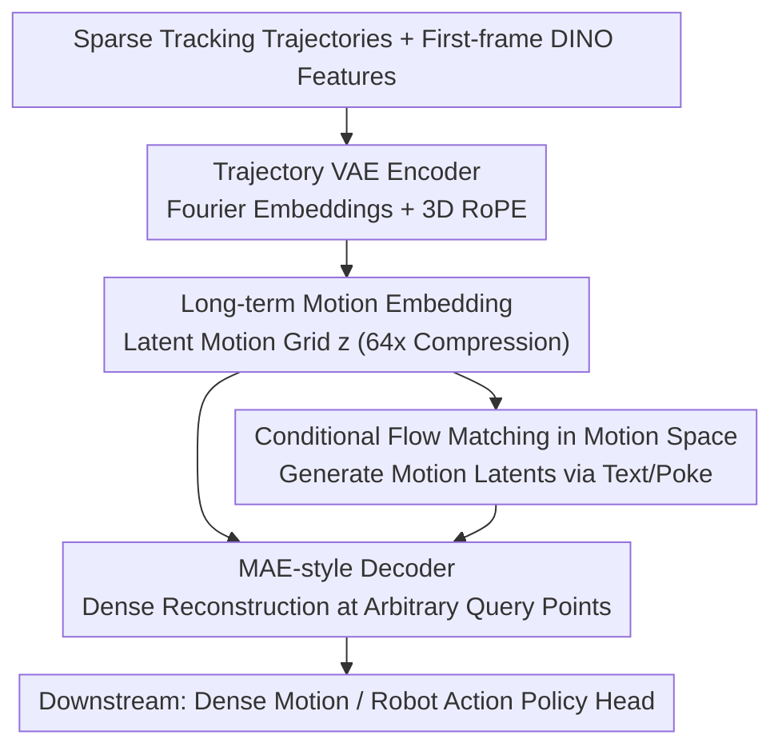

# Learning Long-term Motion Embeddings for Efficient Kinematics Generation

**Conference**: CVPR 2026  
**Paper**: [CVF Open Access](https://openaccess.thecvf.com/content/CVPR2026/html/Stracke_Learning_Long-term_Motion_Embeddings_for_Efficient_Kinematics_Generation_CVPR_2026_paper.html)  
**Code**: [compvis.github.io/long-term-motion](https://compvis.github.io/long-term-motion) (Project Page)  
**Area**: Motion Representation Learning / Motion Generation / Embodied Planning  
**Keywords**: Long-term Motion Embeddings, Temporal Compression, Flow Matching, Goal-conditioned Motion Generation, Trajectory Autoencoder

## TL;DR
Instead of modeling "appearance + motion" pixel-by-pixel using video generation models, this work proposes learning a **motion-only long-term latent space with $64\times$ temporal compression**. A Trajectory VAE first compresses sparse tracking trajectories into a dense, queryable motion grid, followed by a conditional flow matching model that generates long-term goal-directed motion based on text or "pokes." This approach is over 10,000 times faster than SOTA video models while achieving higher quality.

## Background & Motivation

**Background**: Understanding and predicting motion is core to visual intelligence. Current learning methods either focus on low-level motion (optical flow, sparse trajectories) or entangle motion with appearance within video generation models. However, the latter must model pixel-wise changes over time, which is a high-dimensional signal requiring massive computation.

**Limitations of Prior Work**: ① Modeling video/optical flow directly is high-dimensional and computationally expensive, and it **cannot achieve high temporal compression without severe information loss** (video VAEs typically compress only $4\times$–$8\times$ before visual details collapse). ② Trajectories are compact and interpretable but lack generalization and context aggregation, as they only describe the sparse points sampled by trackers. ③ Exploring "multiple possible futures" is prohibitively expensive with full video synthesis.

**Key Challenge**: High-level motion reasoning (e.g., how multi-object motions aggregate, what complex future behaviors are plausible) requires an intermediate abstraction that is "longer" than optical flow, "richer" than trajectories, and "cheaper" than video—yet existing representations fail in at least one of these aspects.

**Goal**: To learn a **long-term motion embedding**—a compact, semantic latent representation that aggregates global kinematic structures, integrates cross-trajectory information, and characterizes motion evolution over long horizons, enabling direct goal-conditioned motion generation and reasoning.

**Key Insight**: Two insights support this work. First, useful motion representations must reason not just about "what is moving," but "how things can move, how motion aggregates across objects, and what complex futures are plausible." Second, trajectories themselves are low-dimensional and decoupled from appearance, allowing them to undergo **heavy temporal compression without losing semantics**, which is impossible for video/optical flow.

**Core Idea**: Treat "motion itself" as the generative domain. First learn a highly compressed ($64\times$) motion latent space, then use conditional flow matching to generate motion within this space via text or pokes, bypassing the overhead of pixel-wise video synthesis.

## Method

### Overall Architecture
The method is a two-stage framework. **Stage 1** involves training a Trajectory VAE: the encoder takes a set of sparse, partially masked tracking trajectories $X=\{x_0,\dots,x_{N-1}\}$ (each being a sequence of $[x_t,y_t]$ in normalized coordinates) plus first-frame DINO features $f_0$, and outputs a latent motion grid $z\in\mathbb{R}^{H\times W\times D}$. The decoder follows an MAE-style design, enabling **dense motion reconstruction at arbitrary spatial query points**, thereby "infilling" sparse trajectories into a context-aware motion field. **Stage 2** freezes this motion space and trains a conditional flow matching model to generate motion latents $z$ directly, conditioned on $f_0$ and text/pokes. The generated latents can be decoded into dense motion or fed to downstream policy heads for robot actions. A key pillar is "strong temporal compression": $64\times$ compression reduces token counts for efficiency and makes the latent space more semantic.

### Key Designs

**1. Trajectory VAE: Learning a Dense Queryable Space from Sparse Tracks**

The VAE $F_\theta=(E_\theta,D_\theta)$ maps "trajectories + first-frame" into a latent grid $z$. On the encoder side, each trajectory $x_{i,t}$ is first processed via Fourier embeddings at random frequencies. **3D Rotary Positional Encoding (RoPE)** is used to jointly encode the temporal index $t$ and starting position $[x_{i,0},y_{i,0}]$ (which anchors the identity of the track): tokens and PE are $\text{tok}(x_{i,t})=\text{MLP}([F(x_t)\,|\,F(y_t)])$ and $\text{PE}(x_{i,t})=[R(x_0)\,|\,R(y_0)\,|\,R(t)\,|\,1]$. The latent grid $z$ is initialized by broadcasting learnable embeddings to $H\times W$. Only partial RoPE is applied to the grid to force the model to rely more on semantics than pure position. All $N\cdot T$ trajectory tokens and latent grid tokens interact via global self-attention with interleaved cross-attention to $f_0$. The MAE-style decoder allows query tokens to encode their own time/start positions and cross-attend to $z$ and $f_0$. Since **query points are not restricted to those used during encoding**, the model performs dense decoding at any location.

**2. 64× Temporal Compression: High Compression Improves Quality and Semantics**

Unlike video latents which collapse beyond $4\times$–$8\times$ compression, the authors argue that because tracks are decoupled from appearance and are low-dimensional, they can sustain **$64\times$ temporal compression**. A compression factor $t_c$ means $t_c$ consecutive frames are aggregated into a **timeless** latent representation. Training at $t_c\in\{2,4,8,16,32,64\}$ reveals that motion generation quality improves monotonically with compression while inference efficiency surges. Furthermore, semantic structure is enhanced (measured by kNN retrieval accuracy on SSv2, which tracks whether semantically similar motions cluster closer in latent space).

**3. Conditional Flow Matching in Motion Space: Efficient Goal-Directed Generation**

Within the compact motion space, generation becomes highly efficient. A neural vector field $v_\theta(z_t,c,t)$ is trained to predict the instantaneous flow of samples $z_t$ along a continuous path from a prior $p_0(z)=\mathcal{N}(0,I)$ to the empirical distribution $p_1(z)$. The objective is $L_{FM}(\theta)=\mathbb{E}_{t,z_0,z_1}\|v_\theta(z_t,c,t)-v^*_t(z_0,z_1)\|^2_2$, where $z_t=(1-t)z_0+tz_1$. The model $v_\theta$ is a transformer denoiser taking noisy latents $z_t$, time $t$, and conditions $c$ (including $f_0$, text, or pokes). In poke-conditioned settings, target locations and times are Fourier-embedded and injected via cross-attention, allowing for an **arbitrary number of pokes at arbitrary timestamps**.

### Loss & Training
Stage 1 $\beta$-VAE objective = L1 reconstruction loss (encoded points) + masked reconstruction loss (randomly held-out points $J_{mae}$ to force dense generalization) + KL regularization $\beta D_{KL}[q_\theta(z|\cdot)\,\|\,p(z)]$. Stage 2 uses the flow matching loss $L_{FM}$. Implementation: $16\times16$ latent grid, $t_c=64$. VAE and Motion Planner use LLaMA-style transformers (340M / 530M parameters). Trained on KOALA-36M with TapNext pseudo-labels and LIBERO robot data with CoTracker3.

## Key Experimental Results

Evaluations use **Min MSE** (fidelity/best-of-N), **Mean MSE** (diversity/distribution), and **EPE** (End-point Error for poke compliance).

### Main Results

Poke-conditioned motion generation (Table 1, "Dense" represents the strongest conditioning):

| Method | Representation | Speed (timesteps/s) ↑ | Min MSE ↓ | Mean MSE ↓ | EPE ↓ |
| :--- | :--- | :--- | :--- | :--- | :--- |
| Motion-I2V | Optical Flow | 21 | 46.9 | 71.7 | 8.8 |
| Track2Act | Trajectory | 180 | 138.7 | 156.1 | 20.9 |
| **Ours** | Latent Motion | **2500** | **30.4** | **44.1** | **1.1** |

Ours leads across all poke densities and is two orders of magnitude faster than flow-based baselines. Sparse conditioning highlights the value of modeling a multi-modal motion distribution.

Comparison with Video Generation Models (Sample Matched vs. Time Matched):

| Setting | Model | Sample Time / Count | Min MSE ↓ | Mean MSE ↓ | EPE ↓ |
| :--- | :--- | :--- | :--- | :--- | :--- |
| Sample Matched | Wan 14B | 1h | 28.67 | 57.02 | 4.68 |
| Sample Matched | Veo 3 | ? | 36.18 | 94.00 | 6.21 |
| Sample Matched | **Ours** | **1s** | **27.08** | **39.53** | **1.17** |
| Time Matched | Wan 14B | 1 sample | 64.20 | 64.20 | 5.23 |
| Time Matched | Ours | **>10k samples** | **21.29** | **40.33** | **1.17** |

Video models must synthesize pixels and require CoTracker3 to extract trajectories afterward (introducing drift/loss errors). Ours generates motion latents directly. In equal wall-clock time, Ours generates >10,000 samples compared to 1 for video models.

### Ablation Study

| Dimension | Configuration | Observation | Description |
| :--- | :--- | :--- | :--- |
| Compression $t_c$ | 2 → 64 | Quality ↑, Speed ↑, kNN ↑ | Higher compression consistently improves performance. |
| LIBERO (vs ATM) | ATM | 60.4 Avg Success | Trajectory policy baseline. |
| LIBERO (vs ATM) | **Ours** | **79.6** | Action prediction from motion embeddings. |
| LIBERO (vs Tra-MoE) | Tra-MoE | 61.4 Avg | Alternative baseline setting. |
| LIBERO (vs Tra-MoE) | **Ours** | **80.3** | Significant performance gain. |

### Key Findings
- **High compression is the "main course"**: Fixing the compute budget and increasing temporal compression to $64\times$ improves generation quality, throughput, and semantic structure.
- **Robot performance**: In LIBERO, the policy head only consumes generated motion embeddings to predict actions; task reasoning is handled by the motion planner.
- **Efficiency over Video Models**: Ours generates 4 orders of magnitude more samples in the same time with lower error.

## Highlights & Insights
- **Motion as an Independent Domain**: Positioned between optical flow and full video, this abstraction makes multi-modal future sampling real-time.
- **Sparse Training, Dense Decoding**: The MAE-style query decoder allows models trained on sparse tracks to reconstruct dense motion at any point.
- **Compression as Semantics**: Quantifying semantic structure via kNN retrieval accuracy demonstrates the "compression → semantics → quality" causal narrative.

## Limitations & Future Work
- **Dependency on Pseudo-labels**: Training relies on TapNext/CoTracker3; tracker drift in occlusions or fast motion is learned by the embedding space.
- **Fixed Latent Resolution**: The $16\times16$ grid may lack granularity for extremely fine local movements.
- **Evaluation Metrics**: Open-world motion is multi-modal; single-point metrics (Mean MSE) are insufficient and must be combined with Min MSE.

## Related Work & Insights
- **vs. Video Models (Wan / Veo 3)**: Video models entangle appearance and motion, making them $10,000\times$ slower and harder to control.
- **vs. Track Predictors (Track2Act / ATM)**: These predict explicit sparse tracks; Ours generates a dense, semantic latent space, resulting in higher LIBERO success rates.
- **vs. Feature-space World Models**: Unlike methods predicting DINO feature evolution, Ours explicitly separates motion, providing better interpretability and control.

## Rating
- Novelty: ⭐⭐⭐⭐⭐ (Treating motion as a $64\times$ compressed generative domain is a significant innovation).
- Experimental Thoroughness: ⭐⭐⭐⭐ (Extensive coverage across open/closed domains, but multi-modal evaluation remains challenging).
- Writing Quality: ⭐⭐⭐⭐ (Clear causal narrative regarding compression).
- Value: ⭐⭐⭐⭐⭐ (Enables real-time exploration of multiple futures for world models and robotics).

<!-- RELATED:START -->

## Related Papers

- [\[ECCV 2024\] Motion Mamba: Efficient and Long Sequence Motion Generation](../../ECCV2024/human_understanding/motion_mamba_efficient_and_long_sequence_motion_generation.md)
- [\[AAAI 2026\] Robust Long-term Test-Time Adaptation for 3D Human Pose Estimation through Motion Discretization](../../AAAI2026/human_understanding/robust_long-term_test-time_adaptation_for_3d_human_pose_estimation_through_motio.md)
- [\[CVPR 2026\] LLaMo: Scaling Pretrained Language Models for Unified Motion Understanding and Generation with Continuous Autoregressive Tokens](llamo_scaling_pretrained_language_models_for_unified_motion_understanding_and_ge.md)
- [\[CVPR 2026\] MoLingo: Motion-Language Alignment for Text-to-Human Motion Generation](molingo_motion-language_alignment_for_text-to-motion_generation.md)
- [\[CVPR 2026\] Geometric Neural Distance Fields for Learning Human Motion Priors](geometric_neural_distance_fields_for_learning_human_motion_priors.md)

<!-- RELATED:END -->
