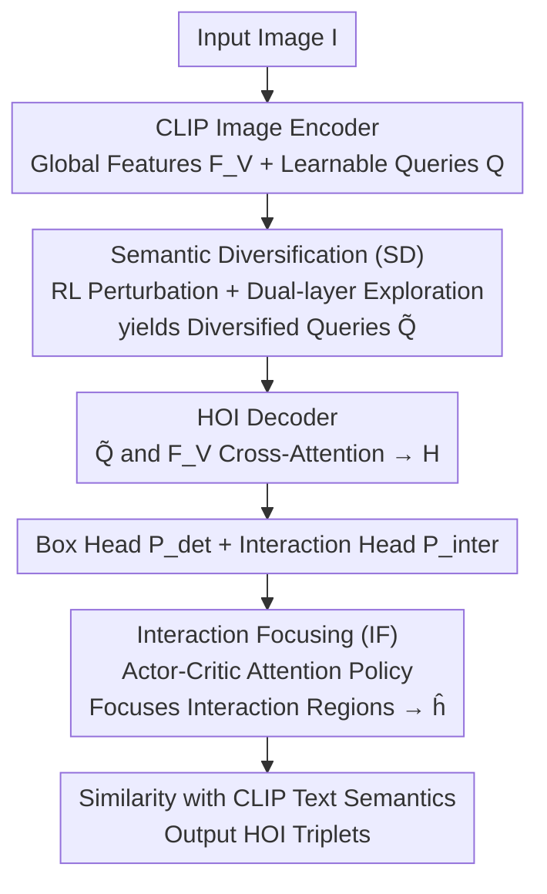

# Learning to Diversify and Focus: A Reinforcement Framework for Open-Vocabulary HOI Detection

**Conference**: CVPR 2026  
**Paper**: [CVF Open Access](https://openaccess.thecvf.com/content/CVPR2026/html/Xu_Learning_to_Diversify_and_Focus_A_Reinforcement_Framework_for_Open-Vocabulary_CVPR_2026_paper.html)  
**Code**: To be confirmed  
**Area**: Human Understanding / Open-Vocabulary HOI Detection  
**Keywords**: Open-Vocabulary HOI Detection, Reinforcement Learning, Semantic Diversification, Actor-Critic, CLIP

## TL;DR
To address the "query overfitting to seen classes" and "diffuse CLIP attention" issues in open-vocabulary human-object interaction (OV-HOI) detection, this paper proposes the SD-IF framework. It utilizes reinforcement learning (RL)-driven semantic perturbations to push queries out of seen semantic clusters and employs an actor-critic mechanism to "focus" attention on actual interaction regions. Experiments show that ours significantly outperforms previous SOTAs in unseen class mAP on HICO-DET and SWIG-HOI.

## Background & Motivation
**Background**: OV-HOI detection aims to recognize novel interaction categories beyond the training set. Current mainstream methods (THID, CMD-SE, INP-CC, SGC-Net) mostly adopt a one-stage paradigm—extracting global visual representations with CLIP and using learnable queries in a Transformer decoder to perform cross-attention with global features to locate human-object pairs and classify interactions, without relying on pre-trained detectors or unseen class names during training.

**Limitations of Prior Work**: The authors identify two overlooked structural flaws. First is the **Seen-Unseen Bias**: because bipartite matching (Hungarian) only provides supervision for seen HOIs, learnable queries are continuously pushed toward interaction categories in the training set, leading to severe overfitting where the mAP gap between seen and unseen classes exceeds 5%. Second is **Limited Interaction Awareness**: under the open-vocabulary setting without regional proposals from pre-trained detectors, the CLIP visual encoder (trained primarily with image-level supervision) lacks fine-grained spatial cues, causing attention to scatter across irrelevant areas rather than key interaction parts.

**Key Challenge**: The one-stage paradigm simultaneously handles "semantic generalization" and "spatial localization." However, its optimization signals (matching supervision of seen classes + global CLIP semantics) are naturally biased toward seen and global patterns, locking queries within seen semantic clusters and obscuring interaction details.

**Goal**: Without introducing pre-trained detectors or leaking unseen class names, simultaneously (1) expand query semantic coverage to generalize to unseen classes and (2) converge attention to key interaction regions to enhance spatial discriminability.

**Key Insight**: Both objectives involve "adaptive exploration/decision-making under indirect supervision"—scenarios where RL excels. Since there are no direct pixel-level labels for where to expand semantics or where to focus attention, proxy rewards can be used for guidance.

**Core Idea**: Treat queries as agents and use RL-driven stochastic semantic perturbations to "Diversify" them away from seen clusters; then use an actor-critic mechanism to learn an attention strategy that allows them to "Focus" on interaction regions—forming the Semantic-Diversified and Interaction-Focused (SD-IF) framework.

## Method

### Overall Architecture
SD-IF is built on a one-stage CLIP-based OV-HOI baseline: an input image passes through a CLIP image encoder $E_v$ to obtain global visual features $F_V$; $N_q$ learnable queries $Q$ are initialized as "human-object prototypes"; these go through an $L$-layer Transformer decoder $D_V$ (with queries as $Q$ and $F_V$ as Key/Value) to yield HOI representations $H$. This is followed by a detection head $P_{det}$ (predicting confidence $c$ and human/object boxes $b_h, b_o$) and a linear projection head $P_{inter}$ (mapping $H$ to a joint visual-text space $\tilde H$ for similarity classification with CLIP text embeddings).

SD-IF inserts two RL modules: the **Semantic Diversification (SD) module** applies RL-driven perturbations to queries before they enter the decoder, and the **Interaction Focusing (IF) module** uses actor-critic to reassign attention after the decoder. Together, they address baseline weaknesses at the "semantic" and "spatial" levels.

### Key Designs

**1. Semantic Diversification (SD) Module: Treating queries as agents to escape seen clusters via RL perturbations**

Directly targeting the "Seen-Unseen Bias," SD addresses the issue where queries cluster around seen semantic centers during training. SD assigns a **conditional Gaussian policy** to each query $q_i$: it computes the visual context $\bar F_V = \text{AvgPool}(F_V)$, and a policy network $g_\theta$ outputs the mean and covariance $[\mu_i, \Sigma_i] = g_\theta(q_i, \bar F_V)$. A semantic perturbation $a_i \sim \mathcal{N} (\mu_i, \Sigma_i)$ is sampled to update the query: $\tilde q_i = q_i + \kappa a_i$ ($\kappa$ controls magnitude).

Exploration is guided by **Dual-layer Semantic Exploration**: ① *Local Consistency*—perturbations are conditioned on $\bar F_V$ to ensure $\tilde q_i$ remains visually plausible within the global context; ② *Global Expansion*—a regularization term $\mathcal L_{global} = -\frac1{N_q} \sum_i \log(1 - \text{sim}(\tilde q_i, \mu_c^{seen}))$ pushes $\tilde q_i$ away from seen cluster centers $\mu_c^{seen}$ defined by CLIP text embeddings. A **proxy semantic reward** is designed: $r_i = \text{KL}(p_{\text{text}}(q_i) \| p_{\text{text}}(\tilde q_i)) - \gamma \text{KL}(p_{\text{visual}}(\tilde q_i) \| p_{\text{visual}}(q_i))$, where the first term rewards semantic deviation in text space and the second penalizes excessive visual drift. The policy is optimized via policy gradient: $\mathcal L_{local} = -\mathbb E_{a_i \sim \pi_\theta} [(r_i - \hat r_i) \log \pi_\theta(a_i | q_i)]$.

**2. Interaction Focusing (IF) Module: Actor-critic attention policy for regional focusing**

Addressing "Limited Interaction Awareness," IF models focusing as an actor-critic framework. The **state** $s_i = \phi_s(\tilde q_i, p_i^{det}, \tilde h_i)$ bridges visual localization and interaction reasoning. The **action** is an adaptive attention map $A_i = \text{Softmax}(f_\phi(s_i, \tilde H))$ provided by the actor network, which re-weights interaction prototypes to get refined representations $\hat h_i = \sum_i A_i \tilde h_i$.

The **hybrid reward** $R_i = R_i^{spatial} + \eta R_i^{semantic}$ includes: ① a differentiable *Spatial Focusing Reward* $R_i^{spatial}$ measuring the overlap between the attention map and the human-object mask $M_{ho}$ derived from predicted boxes; ② a *Semantic Consistency Reward* $R_i^{semantic}$ ensuring alignment with the original query. The actor-critic pair $(\pi_\phi, C_\psi)$ is optimized jointly to converge attention on semantically coherent and spatially critical regions.

### Loss & Training
The total objective is: $\mathcal L = \mathcal L_{det} + \lambda_{sd} \mathcal L_{sd} + \lambda_{if} \mathcal L_{if}$. $\mathcal L_{det}$ follows standard query-based bipartite matching. During **inference, RL modules become deterministic**: SD uses the mean $\tilde q_i = q_i + \kappa \mu_i$, and the actor in IF outputs attention directly without sampling. Training uses CLIP ViT-B/16, AdamW, 80 epochs, and a batch size of 128.

## Key Experimental Results

### Main Results
Evaluated on HICO-DET and SWIG-HOI using mAP.

| Dataset | Metric | SD-IF (Ours) | Prev. SOTA (SGC-Net) | Gain |
|--------|------|-------|------|------|
| HICO-DET | Unseen mAP | 28.01 | 23.27 | +4.74 |
| HICO-DET | Seen mAP | 30.09 | 28.34 | +1.75 |
| HICO-DET | Full mAP | 29.63 | 27.22 | +2.41 |
| SWIG-HOI | Unseen mAP | 15.57 | 12.46 | +3.11 |
| SWIG-HOI | Rare mAP | 18.86 | 16.55 | +2.31 |
| SWIG-HOI | Full mAP | 19.48 | 17.20 | +2.28 |

On HICO-DET, SD-IF reduces the seen-unseen gap from 5.07% to 2.08%. Even compared to zero-shot methods with pre-trained detectors (e.g., HOICLIP unseen 23.48), ours (28.01) performs better.

### Ablation Study
Performed on SWIG-HOI (Full mAP).

| Configuration | Non-rare | Rare | Unseen | Full | Note |
|------|----------|------|--------|------|------|
| Base (CMD-SE style) | 15.75 | 11.51 | 7.35 | 11.47 | CLIP + decoder only |
| + SD | 21.39 | 16.23 | 14.01 | 16.89 | Unseen +6.66 |
| + IF | 24.55 | 16.49 | 13.50 | 17.64 | Added interaction focus |
| Full (SD+IF) | 25.01 | 18.86 | 15.57 | 19.48 | Complete model |

- **RL vs Non-RL**: Replacing SD with Gaussian noise yields 13.58; replacing IF with supervised attention yields 16.20. Both are significantly lower than RL-based counterparts.
- **RL Algorithm**: The customized actor-critic (19.48) outperforms PPO (18.32) and SAC (18.48).

### Key Findings
- **SD contributes most to unseen generalization**: Adding SD nearly doubles unseen mAP on SWIG-HOI (7.35 to 14.01), confirming it effectively mitigates seen-class overfitting.
- **Synergy between modules**: SD expands semantic boundaries while IF captures spatial details; both are required for peak performance.
- **RL is essential**: Guided exploration via rewards significantly outperforms simple noise injection or direct regression.

## Highlights & Insights
- **Handing exploration to RL**: In the absence of unseen labels, the paper transforms "unsupervised generalization" into "rewarded exploration," viewing detection queries as agents.
- **Differentiable spatial reward without extra labels**: $R^{spatial}$ utilizes predicted boxes to guide attention, acting as a lightweight self-supervised signal.
- **Stochastic training, deterministic inference**: This transition allows the model to benefit from exploration during training while maintaining stability during deployment.
- **Plug-and-play**: SD/IF modules are independent of the backbone and can theoretically be integrated into other CLIP-based detection frameworks.

## Limitations & Future Work
- Absolute mAP on SWIG-HOI (19.48) remains low, indicating HOI detection is still far from saturated.
- RL introduces training complexity and multiple hyperparameters; stability across different backbones requires further verification.
- The proxy reward relies on CLIP's predefined seen clusters; more structured semantic priors (e.g., from LLMs) could improve the direction of "expansion."

## Related Work & Insights
- **Comparison with CLIP-based OV-HOI**: Unlike CMD-SE or SGC-Net which use concept calibration or LLM-hierarchies, SD-IF addresses the optimization mechanism itself via RL.
- **Comparison with Two-stage Methods**: While GEN-VLKT relies on pre-trained detectors, ours achieves better open-vocabulary performance without such priors.

## Rating
- Novelty: ⭐⭐⭐⭐½ Introduces a systematic RL "exploration-focus" perspective to OV-HOI.
- Experimental Thoroughness: ⭐⭐⭐⭐½ Solid benchmarks with detailed ablation of RL components.
- Writing Quality: ⭐⭐⭐⭐ Clear motivation, though some stability analysis is thin.
- Value: ⭐⭐⭐⭐ Significant gains in unseen metrics with modular potential.

<!-- RELATED:START -->

## Related Papers

- [\[CVPR 2026\] OSMO: Open-vocabulary Self-eMOtion Tracking](osmo_open-vocabulary_self-emotion_tracking.md)
- [\[CVPR 2026\] Open the Motion Door: Atomic Motion Decomposition and Recomposition for Open-Vocabulary Motion Generation](open_the_motion_door_atomic_motion_decomposition_and_recomposition_for_open-voca.md)
- [\[CVPR 2026\] AVATAR: Reinforcement Learning to See, Hear, and Reason Over Video](avatar_reinforcement_learning_to_see_hear_and_reason_over_video.md)
- [\[CVPR 2026\] RegFormer: Transferable Relational Grounding for Efficient Weakly-Supervised HOI Detection](regformer_transferable_relational_grounding_for_weakly-supervised_hoi_detection.md)
- [\[CVPR 2026\] IMU-HOI: A Symbiotic Framework for Coherent Human-Object Interaction and Motion Capture via Contact-Conscious Inertial Fusion](imu-hoi_a_symbiotic_framework_for_coherent_human-object_interaction_and_motion_c.md)

<!-- RELATED:END -->
