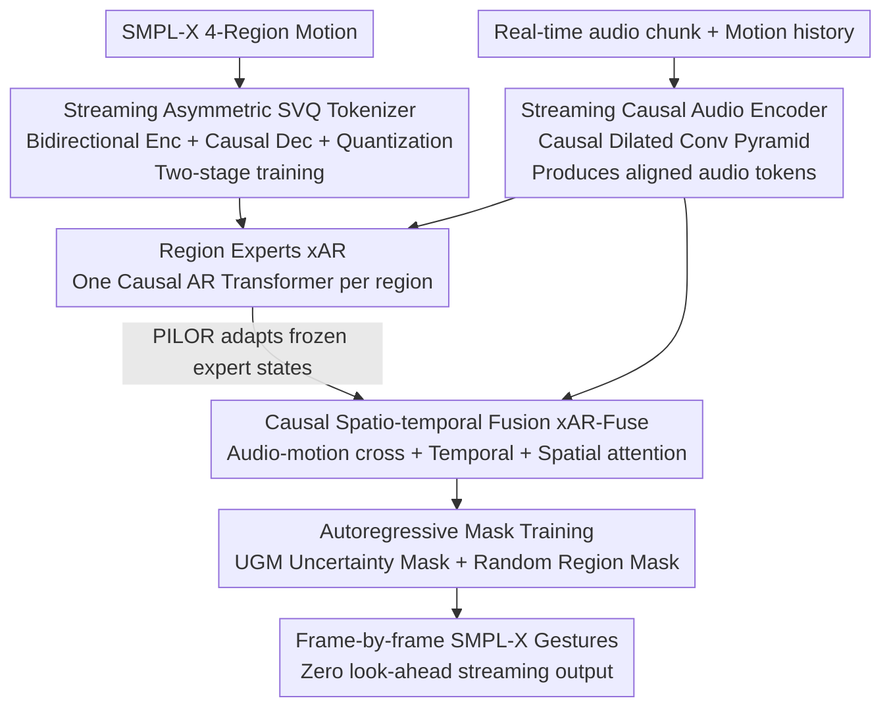

# LiveGesture: Streamable Co-Speech Gesture Generation Model

**Conference**: CVPR 2026  
**Paper**: [CVF Open Access](https://openaccess.thecvf.com/content/CVPR2026/html/Saleem_LiveGesture_Streamable_Co-Speech_Gesture_Generation_Model_CVPR_2026_paper.html)  
**Code**: TBD (Project page: m-usamasaleem.github.io)  
**Area**: Human Understanding / Co-speech Gesture Generation / Streaming Autoregression  
**Keywords**: Streaming generation, Zero look-ahead, Co-speech gestures, Autoregression, Region experts

## TL;DR
This paper proposes LiveGesture—the first **fully streamable, zero look-ahead** speech-driven full-body gesture generation framework. It employs a streaming vector quantized motion tokenizer (SVQ, featuring asymmetric bidirectional encoding + causal decoding) to discretize each body region into causal motion tokens. A Hierarchical Autoregressive Transformer (region experts xAR + causal spatio-temporal fusion xAR-Fuse) then generates SMPL-X full-body gestures frame-by-frame while receiving audio, achieving or exceeding offline SOTA performance on BEAT2 under strict streaming constraints.

## Background & Motivation

**Background**: Co-speech gesture generation aims to synthesize rhythmic full-body motions from speech. Mainstream methods use continuous trajectories or discrete motion tokens, with recent approaches frequently adopting diffusion models (DiffSHEG, SynTalker, GestureLSM) or autoregressive decoders (CaMN, EMAGE). These methods are in high demand for digital humans, VR/AR avatars, and telepresence.

**Limitations of Prior Work**: Nearly all existing methods are **offline**—they assume access to full sentences or long segments of audio/text context before generation begins, resulting in high latency and a lack of true interactivity. Even GestureLSM, despite its lightweight architecture for speed, remains **non-streamable**: it must wait for complete speech segments and cannot update incrementally as audio arrives. Furthermore, most methods either **fully decouple** body parts (losing fine-grained dependencies and lacking full-body coordination) or **entangle** all joints into a single model (making it difficult to model the distinct motion distributions of different regions).

**Key Challenge**: Real-time interaction requires **strict causality + zero look-ahead** (at time $t$, the model can only access historical motion and current audio without "peeking" into the future). However, high-quality full-body gestures require **cross-region coordination** (arm-torso coupling, left-right hand mirroring) and **fine-grained regional dynamics** (large upper-limb movements vs. high-frequency fine hand gestures). Streaming causality naturally conflicts with full-body coordination: common motion token decoders are bidirectional, where future tokens influence current decoding, making them inherently non-streamable.

**Goal**: To build a zero look-ahead, streamable full-body gesture generator capable of handling arbitrary length sequences with low latency (<50 ms/200 ms chunk) while maintaining regional coordination and diversity.

**Key Insight**: Design the motion representation specifically for streaming from the start—create a **strictly causal decodable** motion tokenizer, and build a hierarchical autoregressive structure on top. The base layer uses a "region expert" for each part to model local dynamics, while the top layer uses a causal spatio-temporal fusion module to ensure cross-region coordination.

**Core Idea**: In brief—**Asymmetric tokenizer (bidirectional encoding, causal decoding) + Region expert autoregression + Causal spatio-temporal fusion**. This hierarchical structure simultaneously addresses "streaming causality" and "full-body coordination" by assigning them to different levels.

## Method

### Overall Architecture
The problem is formulated under strict causality: at time $t$, the model receives only the recent motion history $S_t=[q_{t-H+1},\dots,q_{t-1}]$, current audio token $a_t$, and optional text token $w_t$ to predict the next full-body pose $\hat{q}_t=f_\Theta(S_t,a_t,w_t)$. LiveGesture consists of two main components: first, the **SVQ motion tokenizer** discretizes continuous motion from four SMPL-X regions (upper body, lower body, hands, face) into causal, time-synchronized tokens. Second, the **Hierarchical Autoregressive Transformer (HAR)** features an xAR expert for each region to model local dynamics and an xAR-Fuse for cross-region spatio-temporal fusion. Both are conditioned on audio tokens from a streaming causal audio encoder. Autoregressive mask training is implemented to combat streaming noise and error accumulation.

### Key Designs

**1. Streaming Asymmetric SVQ Motion Tokenizer: Balancing quality and causality**

Training a strictly causal motion tokenizer directly often yields poor quality because the causal decoder cannot see the future; however, bidirectional tokenizers cannot stream. This work uses an **asymmetric architecture**: the encoder $E$ is a **bidirectional** 1D convolution that aggregates past and future context and reduces the frame rate by 4x via strided convolution to obtain compact latent representations $z^{region}=E(\{\theta_t^{region}\}),\ T=T_f/4$. Conversely, the corresponding causal streaming decoder $D_{CS}$ is **strictly causal**, reconstructing the current frame only from historical latents. Training is conducted in **two stages** to prevent token/embedding collapse: Stage 1 trains the asymmetric autoencoder (reconstruction loss $\mathcal{L}_{AE}=\lambda_{AE}\mathcal{L}_{recon}$) to learn a stable streamable latent space. Stage 2 **freezes the encoder and decoder**, adding only a region-specific codebook $C^{region}=\{c_k\}_{k=1}^K$ and a projection head $W^{region}$ (small MLP) for vector quantization, where $\tilde{z}_\tau=W^{region}(\hat{z}_\tau)$ maps discrete codes back to the latent space expected by the decoder. The projection head acts as a "learned adapter" to absorb quantization artifacts. Stage 2 loss is $\mathcal{L}_{stage2}=\lambda_{rec}\lVert\theta^{region}-D_{CS}(W^{region}(\hat{z}^{region}))\rVert_1+\lambda_{cb}\mathcal{L}_{cb}$. Ablations confirm that "freezing more is better": training only the Quantizer+MLP with a frozen decoder achieved the lowest FGD of 4.557.

**2. Region Experts (xAR): Modeling distinct motion distributions**

Motion distributions vary greatly across body regions—the upper body often performs large movements while hands perform high-frequency fine gestures. A single model entangling all joints struggles with both. This work divides the body into $\mathcal{R}=\{$upper body, lower body, hands, face$\}$. **One xAR expert per region** is used: at time $t$, each expert receives a causal window of historical region tokens $\{x_{t-h}^r,\dots,x_{t-1}^r\}$ and audio tokens $\{a_{t-h},\dots,a_t\}$. Motion tokens are projected via MLP + Rotary Positional Encoding and passed through causal Transformer blocks that alternate between (i) **Causal Audio-Motion Cross-Attention** (aligning rhythm and gesture) and (ii) **Causal Temporal Self-Attention** (capturing intra-region correlations). Each expert is trained independently but **shares the same audio encoder**.

**3. Causal Spatio-temporal Fusion xAR-Fuse + PILOR Adapter: Restoring coordination**

While region experts learn rich local distributions, they do not explicitly enforce full-body coordination. xAR-Fuse is a **causal spatio-temporal Transformer** operating atop frozen experts. Since experts are trained independently, their hidden states $\{h_t^r\}$ are not naturally aligned. A lightweight residual adapter, PILOR, is used: $\Delta h_t^r=W_r h_t^r,\ \tilde{h}_t^r=h_t^r+\Delta h_t^r$, to align outputs into a shared fusion space. The fusion Transformer factors each block into three attention layers: **Causal Audio-Motion Cross-Attention** (for step-by-step beat/semantic alignment), **Causal Global Temporal Attention**, and **Cross-Region Spatial Attention** (capturing arm-torso coupling, etc.). Finally, **region-specific** classifiers are used to enhance fine-grained expression. Ablations show temporal attention is most critical (removing it shifts FGD from 4.57 to 15.52).

**4. Autoregressive Mask Training (UGM + RM): Resisting noise and error accumulation**

During streaming inference, the model sees its own potentially erroneous generated history, which mismatches the clean history used in teacher-forcing during training (exposure bias). Stage 1 expert training uses standard CE loss $\mathcal{L}_{local}$ with Gaussian noise injection. Stage 2 fusion training uses **Mixed Masking**: **Uncertainty-guided token Masking (UGM)**—masking the $M_{eff}(s)$ tokens with the lowest prediction probabilities via cosine annealing, and **Random Region Masking (RM)**—masking entire region trajectories to force the fuser to reconstruct them from audio and other regions. Additionally, **Classifier-Free Guidance (CFG)** is used to strengthen alignment.

### Loss & Training
The overall process is two-stage: 1) Train four region xAR experts (AR CE + optional pose reconstruction + noise injection) and freeze them. 2) Train xAR-Fuse ($\mathcal{L}_{fuse}$ under UGM+RM). Total AR loss: $\mathcal{L}_{AR}=\lambda_{local}\mathcal{L}_{local}+\lambda_{fuse}\mathcal{L}_{fuse}$. Ablations show $\lambda_{local}=0.3$ is optimal.

## Key Experimental Results

### Main Results
Evaluated on the BEAT2 corpus (60 hours SMPL-X, 25 speakers). Metrics: FGD (realism, ↓), BC (beat consistency, → target GT), Diversity (↑), Face MSE (↓). **LiveGesture is the only streaming method**:

| Method | Conference | Streamable | FGD↓ | BC→ | Div.↑ | MSE↓ |
|------|------|------|------|-----|-------|------|
| TalkShow | CVPR'23 | ✗ | 6.209 | 0.695 | 13.47 | 7.791 |
| EMAGE | CVPR'24 | ✗ | 5.512 | 0.772 | 13.06 | 7.680 |
| MambaTalk | NeurIPS'24 | ✗ | 5.366 | 0.781 | 13.05 | 7.680 |
| SynTalker | MM'24 | ✗ | 4.687 | 0.736 | 12.43 | – |
| GestureLSM | ICCV'25 | ✗ | **4.247** | 0.729 | 13.76 | **1.021** |
| **LiveGesture (Ours)** | Ours | **✓** | 4.57 | **0.794** | **13.91** | 1.241 |

Under strict zero look-ahead constraints, LiveGesture achieves **best BC (0.794) and highest diversity (13.91)**. FGD (4.57) is close to the offline SOTA GestureLSM (4.25). Initial latency is only **250 ms**.

### Ablation Study
Ablation of core components on BEAT2:

| Configuration | FGD↓ | BC→ | Div.↑ | Note |
|------|------|-----|-------|------|
| **Full LiveGesture** | **4.57** | **0.794** | 13.97 | — |
| w/o Temporal Attention | 15.52 | 0.712 | 10.40 | Most significant drop; essential for causal timing |
| w/o Spatial Attention | 6.64 | 0.732 | 11.56 | Coordination impaired |
| w/o PILOR | 4.89 | 0.774 | 13.41 | Unstable expert alignment |
| w/o UGR | 4.98 | 0.723 | 13.64 | Exposure bias worsened |
| w/o text cues | 4.60 | 0.796 | 13.96 | Audio is the primary beat driver |

### Key Findings
- **Causal temporal attention is vital**: Removing it causes FGD to spike from 4.57 to 15.52, showing that causal temporal modeling is far more important than local experts in streaming scenarios.
- **Audio > Text**: Removing text cues has minimal impact, confirming rhythm is primarily driven by audio.
- **Freeze more for stability**: In SVQ Stage 2, freezing more components leads to lower FGD, validating the philosophy of learning a stable latent space first.

## Highlights & Insights
- **Asymmetric tokenizer is a breakthrough**: Bidirectional encoding for quality and causal decoding for streaming. This "Bidirectional Enc + Causal Dec" paradigm is transferable to any sequence task requiring high-quality, real-time causal generation.
- **Hierarchical decoupling**: Separating local high-frequency dynamics from global spatio-temporal coordination avoids the dilemma of a single model trying to achieve both under causal constraints.
- **UGM combats error accumulation**: Masking tokens the model is least confident in during training better simulates real-world streaming errors than random masking.

## Limitations & Future Work
- Face MSE (1.241) is slightly inferior to GestureLSM (1.021), and FGD is higher than the best offline method—streaming causality still comes at a slight cost to realism.
- Evaluated only on BEAT2; robustness across speakers, languages, and long-term drift requires further validation.
- The multi-stage training process is relatively complex with higher implementation costs.

## Related Work & Insights
- **vs GestureLSM (ICCV'25)**: Both seek fast inference, but GestureLSM still requires full speech segments (**non-streamable**); LiveGesture is truly zero look-ahead.
- **vs EMAGE / CaMN**: These use unified GPT-style decoders for face/body but are offline and region-entangled.
- **vs T2M-GPT / BAMM**: Their token decoders are bidirectional and cannot stream; the asymmetric causal SVQ breaks this limitation.

## Rating
- Novelty: ⭐⭐⭐⭐⭐ First zero look-ahead streaming full-body framework; specific design for asymmetric tokenization.
- Experimental Thoroughness: ⭐⭐⭐⭐ Solid main results and six-part ablation, though limited to a single dataset.
- Writing Quality: ⭐⭐⭐⭐ Clear motivation and modular Breakdown; CVF version has some formatting issues with formulas.
- Value: ⭐⭐⭐⭐⭐ High potential for digital humans/VTubers/telepresence where real-time interaction is critical.

<!-- RELATED:START -->

## Related Papers

- [\[CVPR 2026\] CoordSpeaker: Exploiting Gesture Captioning for Coordinated Caption-Empowered Co-Speech Gesture Generation](coordspeaker_exploiting_gesture_captioning_for_coordinated_caption-empowered_co-.md)
- [\[ICCV 2025\] SemGes: Semantics-aware Co-Speech Gesture Generation using Semantic Coherence and Relevance Learning](../../ICCV2025/human_understanding/semges_semantics-aware_co-speech_gesture_generation_using_semantic_coherence_and.md)
- [\[AAAI 2026\] Streaming Generation of Co-Speech Gestures via Accelerated Rolling Diffusion](../../AAAI2026/human_understanding/streaming_generation_of_co-speech_gestures_via_accelerated_rolling_diffusion.md)
- [\[CVPR 2026\] Stability-Driven Motion Generation for Object-Guided Human-Human Co-Manipulation](stability-driven_motion_generation_for_object-guided_human-human_co-manipulation.md)
- [\[CVPR 2026\] HandDreamer: Zero-Shot Text to 3D Hand Model Generation](handdreamer_zero_shot_text_to_3d_hand_model_generation.md)

<!-- RELATED:END -->
