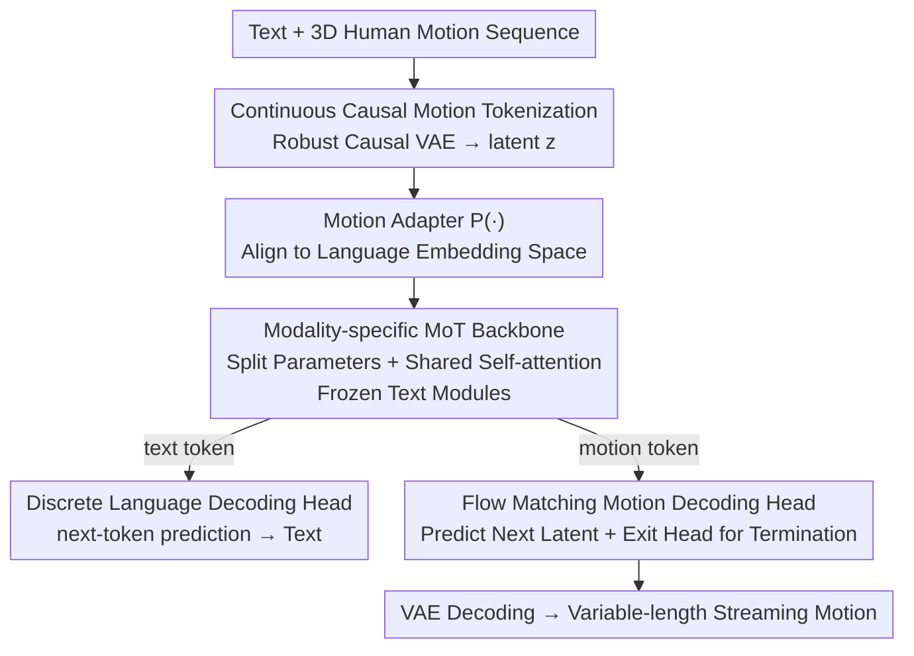

# LLaMo: Scaling Pretrained Language Models for Unified Motion Understanding and Generation with Continuous Autoregressive Tokens

**Conference**: CVPR 2026  
**Paper**: [CVF Open Access](https://openaccess.thecvf.com/content/CVPR2026/html/Li_LLaMo_Scaling_Pretrained_Language_Models_for_Unified_Motion_Understanding_and_CVPR_2026_paper.html)  
**Code**: https://kunkun0w0.github.io/project/LLaMo/ (Project Page)  
**Area**: Human Understanding / Motion Generation and Understanding  
**Keywords**: Human Motion, Unified Multi-modal, Mixture-of-Transformers, Continuous Autoregressive, Flow Matching

## TL;DR
LLaMo extends pretrained LLMs into a unified large model capable of both "motion-to-text" (understanding) and "text-to-motion" (generation) using "modality-split Mixture-of-Transformers + continuous causal motion tokens + flow matching decoding heads + exit heads." The key is **freezing text modules to preserve the original language capabilities of the LLM**, while supporting real-time (≥30 FPS) streaming generation of arbitrary length.

## Background & Motivation
**Background**: Unified Multi-modal Models (UMM) in image/video/audio can already perform understanding and generation within a single end-to-end framework, relying on massive paired data for cross-modal alignment and huge text corpora to maintain language capabilities.

**Limitations of Prior Work**: Applying this to the "human motion-language" domain faces two major issues. First, **catastrophic forgetting**: high-quality paired motion-text data (e.g., Mocap) is far scarcer than image-text pairs. Directly fine-tuning LLM text parameters on this limited data significantly degrades language/reasoning performance—yet strong language capabilities are precisely what are needed in the post-training phase to support cross-modal reasoning (e.g., prompt rewriting, multi-modal dialogue). Second, **the motion tokenization dilemma**: existing unified motion-language models either use vector quantization to discretize motion (introducing jitter artifacts) or use continuous tokens but lose the ability to autoregressively generate arbitrary-length sequences (generating only fixed durations). Since human motion is inherently continuous and variable in length, neither solution is ideal.

**Key Challenge**: To "extend LLMs to the motion modality," one must modify its parameters and token space; however, modifying text parameters loses language capabilities, while using discrete tokens sacrifices motion fidelity and variable-length support.

**Goal**: To enable the LLM to understand and autoregressively generate **high-fidelity, variable-length** 3D human motion while **preserving the frontier text-only performance of the LLM**.

**Key Insight**: Separate "language preservation" and "continuous variable-length motion" into two independent engineering constraints—the former using an architecture that isolates parameters by modality, the latter using continuous causal latents combined with a flow matching autoregressive head.

**Core Idea**: Use modality-specific MoT to freeze text parameters and update only motion parameters (avoiding language forgetting). Use continuous causal motion latents + flow matching heads for next-token prediction (no quantization loss, variable length), supplemented by a binary classification "exit head" to decide when to stop generation (replacing discrete [EOM] tokens).

## Method

### Overall Architecture
LLaMo uses a decoder-only Llama as the backbone. The input is an interleaved sequence of text and motion, organized as `[BOS]{Text}[BOM]{Motion}[EOM]{Text}…[EOS]` (where [BOM]/[EOM] are special text tokens marking motion embedding boundaries). For motion, a **causal VAE** encodes 272-dimensional motion representations into continuous causal latents, which are then aligned to the language embedding space via a motion adapter $P(\cdot)$. Text tokens are embedded normally. Both token types are fed into several **MoT blocks**—each layer selects RMSNorm/QKV/FFN parameters based on the token's modality, while sharing the same self-attention for cross-modal interaction. Finally, two output heads are used: text tokens go to the original LLM discrete language decoding head (next-token prediction), while motion tokens go to a flow matching head (predicting the continuous latent of the next motion token) plus an exit head to determine the end of the motion sequence. The understanding task (motion→text) autoregressively generates text via the language head, and the generation task (text→motion) autoregressively generates motion latents via the flow matching head, which are then reconstructed by the VAE decoder.

### Key Designs

**1. Modality-specific Mixture-of-Transformers: Split parameters for language preservation, shared attention for alignment**

This design directly addresses "catastrophic forgetting." The pain point is that fine-tuning LLM text parameters on scarce motion-text data inevitably damages language performance. LLaMo routes each Transformer layer's input token through different parameters based on its modality—normalization, QKV projections, attention output projections, and FFNs are all split into a text group (subscript T) and a motion group (subscript M), while the **self-attention mechanism itself is shared** to retain cross-modal interaction. Formally, given an input embedding $h$, the output of the next layer is diverted by modality: $h_{in}=\text{RMSNorm}_{T/M}(h[i])$, $h_Q,h_K,h_V=\text{QKV}_{T/M}(h_{in}[i])$, post-attention $h_{mid}=h_O+h$, and $h'=\text{FFN}_{T/M}(h_O[i])+h_{mid}[i]$ (choosing T or M based on whether $h[i]$ is text or motion).

The key is **freezing all text-related modules and only training motion-related parameters**: text-side weights remain untouched, preserving the LLM's full text-only capability, while motion capability is added as a "new modality." The authors emphasize that this design is model-agnostic—any LLM can be extended with motion capabilities without degradation, which is the fundamental difference between LLaMo and "full fine-tuning" or "parameter-efficient fine-tuning of text parameters."

**2. Continuous Causal Motion Tokenization + Flow Matching Head: Autoregressive, quantization-free generation of variable lengths**

This solves the "motion tokenization dilemma." The pain point: discrete VQ introduces jitter, while fixed-length continuous tokens cannot perform variable-length autoregression. LLaMo uses a **Causal CNN VAE** to encode motion into continuous causal latents (maintaining strict temporal causality, streaming encoding, and a high temporal downsampling rate). A 272-dimensional motion representation (including root linear/angular velocity, joint positions/velocities/rotations, see Eq. 1 in the paper) is used to minimize inverse kinematics errors. However, continuous autoregression faces a risk: flow matching sampling in dense latent space can let small errors accumulate, requiring the decoder to be highly robust to sampling noise. To address this, the authors **do not let the VAE predict variance**; instead, they manually sample variance from a uniform distribution: $\mu=\text{Enc}_\phi(m)$, $z=\mu+\sigma\odot\epsilon,\ \epsilon\sim\mathcal N(0,I),\ \sigma\sim\mathcal U(0,C_\sigma)$ ($C_\sigma=0.01$), $\hat m=\text{Dec}_\psi(z)$. This results in a causal VAE robust to imperfect sampling; latent dimensions are set to $z=32$ (higher dimensions cause instability in MLP flow matching training).

On the generation side, the motion decoding head uses **flow matching** to model the continuous distribution of the "next motion token." Conditioned on the motion hidden state $\hat h_i^{motion}$ from the backbone, a lightweight flow matching head $f_\theta$ predicts the velocity $v_t=\frac{dx_t}{dt}$. Using rectified flow linear interpolation $x_t=(1-t)\epsilon+t x_0$ (where $x_0=z$ is the clean latent), the optimal transport path is $v_t=x_0-\epsilon$, with the objective $\mathcal L_{FM}=\mathbb E_{t\in[0,1]}\|f(x_t,t,\hat h_i^{motion})-v_t(x)\|$. During training, the time step $t$ is resampled $k=4$ times for each $\hat h_i^{motion}$ to stabilize against drift in the conditional distribution. The text side retains original LLM sampling: $P(x_i^{text}|x_{<i})=\text{softmax}(\hat h_i^{text}W_{text})$, using a next-token prediction loss $\mathcal L_{NTP}$ for understanding tasks. Continuous representations thus avoid quantization jitter while preserving high-frequency micro-dynamic semantics.

**3. Motion Generation Exit Head: Knowing "when to stop" in continuous autoregression**

This fills an engineering gap in continuous token modeling. The pain point: discrete motion tokens can terminate by generating an [EOM] token, but LLaMo uses continuous latents without samplable discrete terminators. Inspired by TransformerTTS/SpeechT5, the authors add a **fully connected binary classifier** to the decoder output to predict "whether the motion has ended," trained with binary cross-entropy $\mathcal L_{End}$. This allows the model to generate **arbitrary-length** rather than fixed-duration motion, supporting streaming and interactive scenarios. Random noise $\eta\sim\mathcal N(0,0.01)$ is also added to the input motion latents during training to simulate the distribution gap between training and inference under teacher forcing. The total loss for the three heads is $\mathcal L=\mathcal L_{FM}+\lambda_1\mathcal L_{NTP}+\lambda_2\mathcal L_{End}$.

### Loss & Training
To stabilize this multi-modal multi-objective model, a **three-stage training** strategy is used:

- **Stage 1: Feature Alignment**: Only the motion adapter $P(\cdot)$ and the flow matching head are trained to align motion embeddings to the LLM representation space. Base LR $10^{-4}$, 100k steps, text/motion task ratio 0.5:0.5.
- **Stage 2: Joint AR & FM**: The full model is trained (freezing Causal VAE and text parameters). During this stage, flow matching heads are prone to loss spikes, and the motion understanding objective can dominate. The authors mitigate this by: (i) reducing the sampling rate of motion-to-text data, (ii) sampling 4 time steps per motion token in text-to-motion tasks, and (iii) using different LR schedules for each module. 200k steps, task ratio 0.8:0.2.
- **Stage 3: Motion Head Annealing**: Only the motion prediction and exit heads are refined (rest frozen) to improve output quality and suppress joint-training instabilities. 50k steps, text-to-motion only, Head LR cos-annealed to $10^{-5}$.

For data, the authors constructed a large-scale motion-text dataset with over **3 million sequences (3,076 hours)**. This aggregates public sets like HumanML3D, Motion-X, 100-Style, BABEL, and FineDance. Additionally, GVHMR was used to estimate motion via HMR from private human videos, and Gemini-2.5Pro was used to generate diverse motion descriptions (to avoid severe hallucinations seen in MotionMillion's LLM caption rewrites). HumanML3D accounts for less than 1% of the training data.

## Key Experimental Results

### Main Results
Evaluated on HumanML3D for text-to-motion and motion-to-text (despite it being <1% of training data). Metrics: R@k (R-Precision, higher is better), FID (lower is better), MM-D (MMDist, lower is better), Div (Diversity, closer to real is better); Captioning uses BLEU/ROUGE/CIDEr/BERTScore.

| Task / Metric | Ours (LLaMo-3B) | Representative Baselines | Notes |
|------|------|------|------|
| Text→Motion R@1 ↑ | 0.606 | MotionMillion-7B 0.616 / MotionStreamer 0.631 | Comparable to large-scale/expert models |
| Text→Motion R@3 ↑ | 0.839 | MotionStreamer 0.859 / MoMask 0.846 | Competitive semantic alignment |
| Text→Motion FID ↓ | 22.491 | MotionMillion-7B 23.582 / MotionStreamer 11.790 | ⚠️ FID is unreliable on HumanML3D (reflects dataset gap) |
| Motion→Text CIDEr ↑ | 100.8 | MotionGPT3 28.7 / MoTe 31.5 | Significant lead (strong descriptive ability) |
| Motion→Text BERTScore ↑ | 34.8 | MotionGPT3 35.2 | High sentence-level semantic similarity |

In text-to-motion, "scaling emergence" was observed similar to MotionMillion: generation quality improved significantly as the model scaled from 1B to 3B (LLaMo-1B FID 53.942, R@1 0.541 → LLaMo-3B FID 22.491, R@1 0.606). In motion-to-text, LLaMo is the only method that does not fine-tune backbone LLM text parameters yet far exceeds expert models in CIDEr, although the understanding task did not scale as linearly as generation (1B CIDEr 104.7 vs 3B 100.8).

### Ablation Study

| Configuration | MPJPE ↓ | MPJRE ↓ | sJPE ↓ | Comp. ↓ | Description |
|------|---------|---------|--------|------|------|
| FSQ-z512-c64000 (Discrete VQ) | 41.9 | 6.31 | 0.710 | ×94.1% | Low fidelity despite 64k codebook |
| CausalTAE-z16 (Ours) | 32.3 | 6.07 | 0.738 | ×1.47% | Dimension too low |
| CausalTAE-z32 (Ours - Final) | 10.1 | 2.58 | 0.586 | ×2.94% | Best fidelity/stability trade-off |
| CausalTAE-z64 (Ours) | 3.86 | 0.68 | 0.389 | ×5.88% | Highest fidelity but unstable FM training |

Note: MPJPE/MPJRE are average joint position/rotation errors; sJPE measures reconstruction artifacts/noise via jerk; Comp. is the storage ratio of motion latents relative to input representations.

### Key Findings
- **Continuous Causal VAE outperforms discrete VQ**: CausalTAE-z32's MPJPE of 10.1 is far lower than FSQ's 41.9, with a compression ratio of ×2.94% vs ×94.1%. Discrete codebooks struggle to capture fine-grained temporal changes under high downsampling, whereas continuous latents compress easily into compact vectors.
- **Latent dimension is a trade-off between fidelity and stability**: z64 offers the best reconstruction but makes the MLP flow matching head unstable during training; z32 is chosen as the optimal balance.
- **"Language preservation" is the core selling point**: By freezing text modules, LLaMo maintains base LLM performance while adding motion capability—a structural advantage over methods that fine-tune text parameters and suffer score drops.
- **Emergent behavior**: Zero-shot text-to-motion can generate reasonable actions for unseen complex composite descriptions, and preliminary emergence shows the model generating motion from non-English text it never saw during motion training.

## Highlights & Insights
- **Turning "language preservation" into an architectural constraint rather than a training trick**: Split modality parameters + frozen text modules prevents catastrophic forgetting structurally. This is cleaner than "offsetting forgetting with text corpora" and is model-agnostic, applicable to extending LLMs to any new continuous modality.
- **Flow Matching + Exit Head completes "continuous autoregressive variable-length generation"**: Flow matching solves continuous next-token prediction, while the exit head solves the "when to stop" problem. Together, they allow continuous latents to autoregressively yield arbitrary-length sequences just like discrete tokens—a key engineering piece for continuous motion modeling.
- **Robust VAE via "manual variance sampling"**: Not predicting variance but sampling from $\mathcal U(0,0.01)$ forces the decoder to tolerate flow matching noise. This simple design effectively targets "error accumulation" and is worth adopting in other continuous autoregressive tasks.
- **Honesty regarding FID**: The authors clearly state that FID is unreliable on HumanML3D (capturing distribution gaps rather than quality) and prioritize R-Precision accordingly. This clarity regarding metric limitations is highly valuable.

## Limitations & Future Work
- **Understanding tasks do not scale linearly**: 3B did not outperform 1B on motion-to-text (CIDEr 100.8 vs 104.7), suggesting "scaling emergence" is primarily a generation-side phenomenon; the bottleneck for understanding remains unresolved.
- **High FID and reliance on private data**: LLaMo's FID on HumanML3D (22.491) is significantly higher than MotionStreamer (11.790) which was trained specifically on that set. Despite the "FID unreliability" explanation, absolute quality under this protocol may still lag behind expert models. The core training data (3M proprietary sequences) also affects reproducibility ⚠️.
- **Complex training**: The three-stage recipe plus multiple LR schedules and sampling rate adjustments require significant hyperparameter tuning to mitigate instabilities like loss spikes.
- **Future directions**: Introducing stronger motion-semantic alignment objectives for understanding tasks or a more principled multi-task balancing in Stage 2 (replacing heuristic downsampling) might allow the understanding side to benefit more from scaling.

## Related Work & Insights
- **vs MotionGPT / TM2T (Fine-tuning LLM text parameters)**: These rely on discrete codebooks and fine-tune text parameters, degrading language performance. LLaMo freezes text and uses continuous latents for both language preservation and jitter-free motion.
- **vs MotionGPT3 (MoT + Continuous latents)**: While similar in using MoT and continuous latents, MotionGPT3 does not preserve base language capability nor support streaming generation—it generates fixed lengths via padded `<motion out>` tokens in a single forward pass and uses non-causal VAEs. LLaMo supports real-time, variable-length streaming via causal VAEs and exit heads.
- **vs MotionMillion (Large-scale T2M expert)**: Both verify scaling emergence in generation, but MotionMillion uses discrete FSQ-VAE and lacks unified understanding. LLaMo achieves unified understanding and generation using continuous tokens while matching R-Precision performance.

## Rating
- Novelty: ⭐⭐⭐⭐½ Combining "frozen text MoT + continuous causal tokens + flow matching + exit head" is a comprehensive and rare solution in motion-language modeling.
- Experimental Thoroughness: ⭐⭐⭐⭐ Covers reconstruction, generation, understanding, and zero-shot, though some scaling analysis for understanding is in the appendix.
- Writing Quality: ⭐⭐⭐⭐ Motivation and design are clear; honest regarding FID limitations; math layout is somewhat dense.
- Value: ⭐⭐⭐⭐½ The first unified motion model to extend LLMs without damaging language performance; CIDEr vastly leads competitors; supports real-time streaming. Foundational work.

<!-- RELATED:START -->

## Related Papers

- [\[CVPR 2026\] Next-Scale Autoregressive Models for Text-to-Motion Generation](next-scale_autoregressive_models_for_text-to-motion_generation.md)
- [\[CVPR 2026\] HandX: Scaling Bimanual Motion and Interaction Generation](handx_scaling_bimanual_motion_and_interaction_generation.md)
- [\[CVPR 2026\] Humanoid-GPT: Scaling Data and Structure for Zero-Shot Motion Tracking](humanoid-gpt_scaling_data_and_structure_for_zero-shot_motion_tracking.md)
- [\[CVPR 2026\] Towards Decompositional Human Motion Generation with Energy-Based Diffusion Models](towards_decompositional_human_motion_generation_with_energy-based_diffusion_mode.md)
- [\[CVPR 2026\] Unified Number-Free Text-to-Motion Generation Via Flow Matching](unified_number-free_text-to-motion_generation_via_flow_matching.md)

<!-- RELATED:END -->
