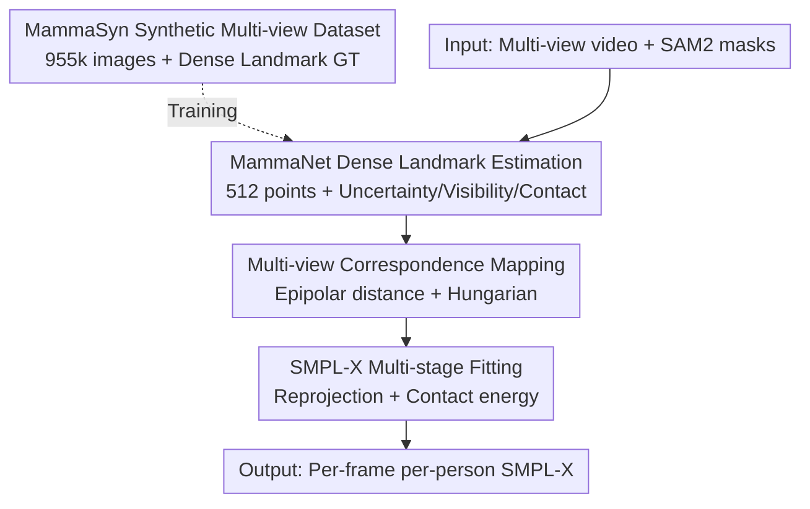

# MAMMA: Markerless Accurate Multi-person Motion Acquisition

**Conference**: CVPR 2026  
**Paper**: [CVF Open Access](https://openaccess.thecvf.com/content/CVPR2026/html/Velasquez_MAMMA_Markerless_Accurate_Multi-person_Motion_Acquisition_CVPR_2026_paper.html)  
**Code**: https://mamma.is.tue.mpg.de/ (Project Page)  
**Area**: Human Understanding / Multi-person Motion Capture  
**Keywords**: Markerless MoCap, SMPL-X, Dense Surface Landmarks, Multi-view Correspondence, Close-range Interaction

## TL;DR
MAMMA is a markerless multi-person motion capture pipeline: starting from multi-view videos, it uses a Transformer (MammaNet) with independent queries for each landmark to predict 512 contact-aware and visibility-aware dense 2D surface landmarks. By fitting SMPL-X to these landmarks, it achieves an accuracy within 0.862mm of commercial marker-based systems (Vicon) in close-range two-person interaction scenarios, while eliminating the need for tedious marking and manual data cleaning.

## Background & Motivation
**Background**: Traditional marker-based motion capture (Vicon, OptiTrack, Qualisys) is the "gold standard" for accuracy but requires physical optical markers, expert configuration, and minutes to hours of manual cleaning for noisy, missing, or mismatched marker data, followed by additional conversion to parametric models like SMPL/SMPL-X. While markerless solutions aim to replace them, most commercial markerless systems are closed-source, do not report standard benchmarks, and do not directly output parametric humans.

**Limitations of Prior Work**: Academic markerless methods are mostly designed for **single-person** scenarios, rely on **sparse keypoints**, or collapse during occlusion and interpersonal contact. Monocular methods suffer from depth ambiguity; multi-view methods often only annotate sparse keypoints, stop at the skeletal level, or require a subsequent fitting stage with strong priors. Crucially, landmark detectors are typically trained on "isolated person" images and fail to distinguish "which landmark belongs to whom" during close interaction, nor can they obtain fine-grained information like contact or visibility from real data.

**Key Challenge**: The long-standing conflict between accuracy (marker-based gold standard) and ease of use/scalability (markerless, no manual cleaning); daily but high-occlusion movements like close-range two-person interactions (hugging, martial arts, dancing) are severely undersampled in existing datasets.

**Goal**: To build a "user-deployable" markerless system that inputs multi-view video and outputs per-frame, per-person SMPL-X with accuracy approaching commercial marker-based systems, specifically tackling two-person close-contact scenarios. This is decomposed into: (i) person-specific dense correspondence under heavy occlusion; (ii) using synthetic data to fill gaps in interaction/contact/visibility annotations; (iii) stable fitting without relying on pose priors.

**Key Insight**: Vision-based systems have a unique advantage over marker-based ones—they can leverage richer pixel-level supervision signals (segmentation masks, visibility, contact) to disambiguate. The authors condition landmark detection on SAM2 segmentation masks and have the network directly output visibility and contact probabilities.

**Core Idea**: A two-stage "estimate virtual landmarks, then fit body" approach, but transforming the dense landmark detector into a **Transformer with independent queries per landmark**, accompanied by uncertainty, visibility, and contact predictions. This allows landmarks to be correctly assigned to each person even under heavy occlusion and extreme poses.

## Method

### Overall Architecture
MAMMA takes multi-view videos as input and outputs SMPL-X models for each person per frame. The pipeline consists of two stages: first, **MammaNet** is used in each view to detect 512 dense 2D surface landmarks (simultaneously outputting coordinates, uncertainty, visibility, and interpersonal/ground contact probabilities), conditioned on SAM2 masks to distinguish individuals in close proximity. Then, **multi-view correspondence** matches the same person across views. Finally, L-BFGS is used to project SMPL-X onto the calibrated cameras to minimize reprojection error, optimizing pose/shape/translation in stages. The ground truth dense landmarks for training MammaNet come from the authors' new synthetic dataset, **MammaSyn**.

### Key Designs

**1. MammaSyn Synthetic Multi-view Dataset: Filling the Gaps in Interaction/Contact/Visibility GT**

Addressing the pain point that real data lacks contact/visibility and interaction data is undersampled. The authors extended the BEDLAM synthetic dataset into **MammaSyn**, containing approx. 2.5M crops and 955k images, expanding rendering from single/few-view to a **32-camera virtual multi-view** configuration. They specifically sampled two sets of marker-based (Vicon) interaction data (Latin-Dance: 10 segments of 2 people; Interacting Couples: 48 segments of 2 people) to fill the high-quality interaction gaps in BEDLAM. All humans are in SMPL-X format, with per-person segmentation masks, depth maps, and per-vertex visibility. **Per-vertex ground/interpersonal contact labels** were calculated using Signed Distance Functions (SDF) + surface normals. Dense landmark ground truths were obtained via Farthest Point Sampling (FPS) of 512 vertices from the SMPL-X body, with weighted sampling for hands/feet/head to account for these small, flexible parts.

**2. MammaNet & Landmark Queries: Per-landmark Independent Query Dense Estimation**

Addressing the failure of landmark detectors to distinguish individuals in proximity and instability under heavy occlusion. MammaNet uses ViT-Base for image features and a CNN for mask processing, with a Transformer decoder to decode $N=512$ surface landmarks. Unlike CameraHMR, which uses a **single** learnable embedding for all landmarks, MammaNet learns an **independent embedding (landmark query) for each landmark**: cross-attention allows each query to match relevant image patches, while self-attention learns pairwise correlations between landmarks. Image and mask features are encoded into the same space and **element-wise summed** for mask conditioning. For each landmark $i$, the network predicts pixel coordinates $\mu_i=[x_i,y_i]$, uncertainty $\sigma_i$, visibility probability $p_i$, and interpersonal contact $pc_i$ and ground contact $fl_i$. Training is supervised by Gaussian Negative Log-Likelihood (NLL) for coordinates+uncertainty, Binary Cross-Entropy (BCE) for visibility, and focal loss for contact (balancing the majority of non-contact landmarks), with per-landmark weights $\lambda_*$.

**3. Multi-view Correspondence: Linking the Same Person Across Views via Dense Geometry**

Addressing identity consistency in multi-person multi-view scenarios. **SAM2** is used to initialize in a frame (via auto-detection/bbox/points) and propagate segmentation to track individuals. SAM2 tracking labels are assigned to each landmark prediction, resulting in 2D landmarks $x\in\mathbb{R}^{F\times N\times2}$ for each person per frame per view. For cross-view comparison, geometric affinity $A_g(x_a,x_b)=\exp(-D_g/\lambda)\in[0,1]$ is defined using **symmetric epipolar distance** $D_g$:

$$D_g=\frac{1}{2FN}\sum_{i=1}^{FN}\big(d(x_b^i,F_{ba}x_a^i)+d(x_a^i,F_{ab}x_b^i)\big)$$

where $F_{ba}$ is the fundamental matrix between views and $d(x,l)$ is the point-to-epipolar-line distance. To prevent errors from occluded landmarks, affinity is only calculated for landmarks visible in both views; if too few landmarks are visible or $D_g$ exceeds a threshold, affinity is set to zero. The **Hungarian algorithm** finds one-to-one matches based on cost $1-A_{ab}$, and all high-affinity matches form a cycle-consistent correspondence graph. Connected components identify the same person across views. This design relies **entirely on dense landmark geometry**, requiring no external re-identification network.

**4. SMPL-X Multi-stage Fitting: Direct Optimization via Dense Landmarks without Pose Priors**

Addressing the inadequacy of sparse keypoints and reliance on strong priors. MAMMA fits the SMPL-X neutral body $M(\beta,\theta,t)$ (16 shape coefficients) to multi-view sequences **without any regression-based pose/shape initialization**—dense landmarks themselves carry sufficient person and scene information. Optimization stages: (1) Find translation and rotation via reprojection energy $E_{ldmks}=\frac1C\sum_{t,c,l}\rho\big(\frac{\|\mu_{t,c,l}-\Pi(V_{t,l},Q_c)\|}{\sigma_{t,c,l}}\big)p_{t,c,l}$ (where $\rho$ is the Geman-McClure robust function weighted by visibility $p$); (2) Add shape prior regularization $E_{shape}$ to optimize pose/shape/translation; (3) Reweight uncertainty using reprojection error $e_i$: $\sigma_i'=\sigma_i\cdot\min(\max(\frac{e_i}{\tau},0),1)$ ($\tau=10$px) to handle points the network is unconfident about, and increase joint acceleration penalty $E_{temp}$ for temporal smoothness; (4) Finally, optimize contact energy $E_{cont}=E_p+E_c$: repulsion term $E_p$ penalizes vertices interpenetrating the other body, and attraction term $E_c$ pulls points near the surface to contact based on predicted contact probability. Total energy $E=E_{ldmks}+E_{shape}+E_{temp}+E_{cont}$.

### Loss & Training
MammaNet is trained solely on the synthetic MammaSyn dataset with an input resolution of $512\times384$. Losses: Gaussian NLL for coordinates+uncertainty, BCE for visibility, and Focal loss for interpersonal/ground contact, all with per-landmark weighting. Inference fitting uses L-BFGS with four-stage energy optimization, assuming known camera calibration.

## Key Experimental Results

Evaluation spans single-person (RICH, MOYO, MammaEval-S) and two-person interactions (Harmony4D, CHI3D, Hi4D, MammaEval-D), compared against marker-based Vicon+MoSh++ using independent held-out markers.

### Main Results: 2D Dense Landmark Error (pixels, lower is better)

| Model | RICH (Single) | MOYO (Single) | MammaEval-S (Single) | Harmony4D (Double) | CHI3D (Double) | MammaEval-D (Double) |
|-------|--------------|---------------|----------------------|--------------------|----------------|----------------------|
| Look-Ma* | 13.26 | 22.43 | 10.25 | 31.45 | 8.77 | 15.01 |
| CameraHMR | 8.84 | 12.53 | 6.32 | 32.84 | 6.30 | 10.21 |
| MammaNet (Ours) | 8.55 | 11.40 | 6.09 | 31.96 | 6.22 | 9.87 |
| MammaNet + SAM2 Mask | 8.83 | 11.04 | 6.16 | **18.33** | **4.36** | **7.70** |

Mask conditioning provides marginal gains in single-person scenes but **massive improvements in two-person interactions** (Harmony4D: 31.96 → 18.33), confirming that a mask's primary value is "distinguishing target individuals under overlap." Two-person evaluation is limited to images with IoU > 0.5.

### Ablation Study: 3D Fitting Error and Penetration

| Dataset / Metric | SMPLify-X | Look-Ma* | CameraHMR | MAMMA | MAMMA-C |
|------------------|-----------|----------|-----------|-------|---------|
| MammaEval-D MPJPE↓ | 53.92 | 27.98 | 20.41 | **17.71** | 17.73 |
| MOYO MPJPE↓ | 62.15 | 60.15 | 33.75 | **22.95** | **22.95** |
| Harmony4D MPJPE↓ | – | 59.37 | 58.59 | 45.26 | 45.35 |
| Hi4D MPJPE↓ (19 joints) | – | – | – | – | **12.44** |
| Avg. Penetration Depth (mm)↓ | – | 13.73 | 13.41 | 10.50 | **8.46** (GT: 9.84) |

Note: MAMMA already outperforms previous methods without contact optimization. MAMMA-C (with contact) reduces penetration depth from 10.50 to 8.46mm, which is **even lower than the GT's 9.84mm**. On Hi4D, MPJPE is 12.44mm, significantly better than other multi-view methods like AvatarPose (32.10).

### Key Findings
- **Masks are a key variable for two-person interaction**: The significant improvement in two-person cases indicates that the bottleneck for MammaNet is not "seeing" the landmarks, but "assigning" them; SAM2 masks resolve this ambiguity.
- **100% accurate correspondence**: Cross-view identity matching achieved 100% accuracy using only dense landmark geometry + visibility, without requiring an external identity feature network.
- **Contact optimization is primary for interpersonal cases**: Optimizing interpersonal contact reduces penetration; however, ground contact optimization yielded no improvement, suggesting landmark predictions are already robust enough.
- **Approaching the Gold Standard**: On held-out markers, Vicon+MoSh++ error is 21.619mm, while MAMMA is 22.481mm—a difference of only 0.862mm. The authors argue markerless solutions can replace traditional pipelines, reducing human effort from ~72 to 26 hours.

## Highlights & Insights
- **The cleverness of per-landmark queries**: Replacing CameraHMR's "single token for all points" with "one query per point" allows cross-attention to naturally learn "point-to-patch" alignment and self-attention to learn relationships, which is key for generalizing to extreme poses (e.g., MOYO yoga).
- **Transferable methodology for pixel-level disambiguation**: Using SAM2 mask conditioning + assigning tracking labels to landmarks distinguishes close-proximity individuals and provides identity cues for multi-view correspondence; this "segmentation-driven correspondence" can be adapted to any multi-person multi-view task.
- **Contact modeling surpassing GT**: Using SDF repulsion and attraction energy to push penetration lower than the ground truth reveals that even the "gold standard" contains penetration noise, posing a caveat for evaluation metrics.

## Limitations & Future Work
- **Dependency on calibration and multi-view**: Assumes known camera calibration; single-frame/monocular setups cannot recover global translation and rotation.
- **SAM2 mask incompleteness**: SAM2 might miss parts of the body when people are too close, leading to suboptimal landmark prediction.
- **Synthetic-to-real domain gap**: MammaNet is trained only on synthetic MammaSyn; the risks of domain shift in complex real scenes require more verification.

## Related Work & Insights
- **vs. CameraHMR**: Both use ViT-Base, but MAMMA's per-landmark query is more robust under occlusion/extreme poses and achieves lower 2D error.
- **vs. Look-Ma* (Hewitt et al. implementation)**: MammaNet is more accurate across single/double people in both 2D and 3D.
- **vs. Multi-view Skeleton Methods (MvP/AvatarPose)**: These often stop at sparse skeletons and require strong priors for fitting; MAMMA directly predicts dense surfaces, allowing SMPL-X body+hand recovery without priors, outperforming AvatarPose on Hi4D.
- **vs. Marker-based Vicon+MoSh++**: Achieves error within 0.862mm of the gold standard while saving time on marker setup and manual cleaning.

## Rating
- Novelty: ⭐⭐⭐⭐ (Per-landmark queries + contact/visibility-aware landmarks is a strong combination)
- Experimental Thoroughness: ⭐⭐⭐⭐⭐ (Solid benchmarking across single/double people, 2D/3D, and Vicon comparison)
- Writing Quality: ⭐⭐⭐⭐ (Clear motivation and well-defined energy terms)
- Value: ⭐⭐⭐⭐⭐ (Enables markerless MoCap to approach gold standard accuracy with higher efficiency)

<!-- RELATED:START -->

## Related Papers

- [\[CVPR 2026\] EgoPoseFormer v2: Accurate Egocentric Human Motion Estimation for AR/VR](egoposeformer_v2_accurate_egocentric_human_motion_estimation_for_arvr.md)
- [\[AAAI 2026\] Spatiotemporal-Untrammelled Mixture of Experts for Multi-Person Motion Prediction](../../AAAI2026/human_understanding/spatiotemporal-untrammelled_mixture_of_experts_for_multi-person_motion_predictio.md)
- [\[CVPR 2026\] MFEN: Multi-Frequency Expert Network for Visible-Infrared Person Re-ID](mfen_multi-frequency_expert_network_for_visible-infrared_person_re-id.md)
- [\[CVPR 2026\] GazeOnce360: Fisheye-Based 360° Multi-Person Gaze Estimation with Global-Local Feature Fusion](gazeonce360_fisheye-based_360deg_multi-person_gaze_estimation_with_global-local_.md)
- [\[CVPR 2026\] SyncMos: Scalable Motion Synchronisation for Multi-Agent Scene Interaction](syncmos_scalable_motion_synchronisation_for_multi-agent_scene_interaction.md)

<!-- RELATED:END -->
