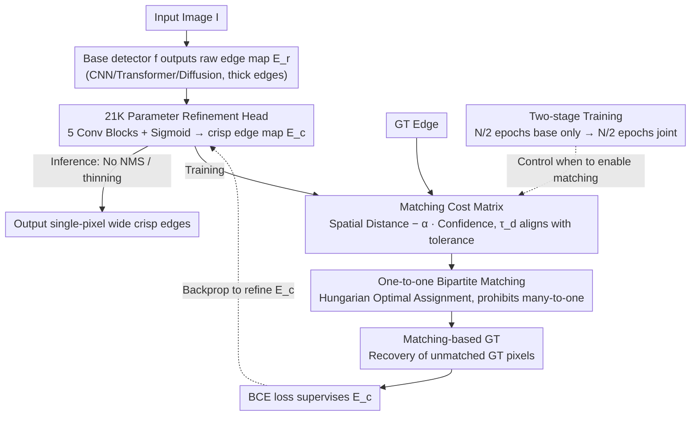

# MatchED: Crisp Edge Detection Using End-to-End, Matching-based Supervision

**Conference**: CVPR 2026  
**arXiv**: [2602.20689](https://arxiv.org/abs/2602.20689)  
**Code**: [https://cvpr26-matched.github.io](https://cvpr26-matched.github.io)  
**Area**: Human Understanding / Edge Detection  
**Keywords**: Edge detection, crisp edges, bipartite matching, plug-and-play, end-to-end training

## TL;DR

MatchED proposes a lightweight (approx. 21K parameters) plug-and-play module that generates crisp (single-pixel wide) edge maps through one-to-one bipartite matching based on spatial distance and confidence during training. It can be attached to any edge detector for end-to-end training and, for the first time, matches or exceeds standard post-processing methods without relying on NMS and thinning.

## Background & Motivation

**Background**: Edge detection is a fundamental computer vision problem supporting downstream tasks such as depth estimation, semantic segmentation, and image generation. Modern deep learning edge detectors (eED, RCF, PiDiNet, RankED, SAUGE, etc.) have achieved significant progress in detection accuracy. However, almost all methods rely on a standard post-processing pipeline to produce final single-pixel wide edge maps: first applying Non-Maximum Suppression (NMS), followed by skeleton-based thinning.

**Limitations of Prior Work**: NMS and skeleton thinning are hand-crafted, non-differentiable algorithms that block the end-to-end optimization path. This leads to three core issues: (i) the model optimizes "thick" edge probability maps during training while using post-processing to obtain "thin" edges during testing, causing a train-test protocol inconsistency; (ii) post-processing hyperparameters (NMS window size, boundary decay, etc.) require manual tuning and cannot be optimized via gradients; (iii) the few attempts to directly generate crisp edges (LPCB, CATS, DiffusionEdge, CPD, etc.) still require post-processing to achieve satisfactory performance.

**Key Challenge**: Edge annotations themselves possess spatial imprecision (human labeling bias), leading to positional offsets between predictions and ground truths (GT). To cover these offsets, models tend to output thick edge responses to "hedge" against annotation noise. The only method attempting to solve this, GLR, uses fixed Canny guidance to refine labels before training but cannot dynamically adapt to the evolving predictions of the model.

**Goal**: (a) Enable edge detectors to directly output single-pixel wide crisp edges. (b) Align training objectives with testing evaluation. (c) Design a universal module that can be attached to any existing detector.

**Key Insight**: Inspiration is drawn from matching concepts in object detection (such as bipartite matching in DETR). If one-to-one optimal matching between predicted edge pixels and GT edge pixels can be established in each training iteration, each predicted pixel is assigned to only one GT pixel, naturally preventing the "thick edge" problem where multiple responses correspond to the same GT. Matching considers both spatial distance and confidence, with the distance threshold aligned with the evaluation protocol to ensure train-test consistency.

**Core Idea**: Replace non-differentiable post-processing with differentiable matching-based supervision, directly producing crisp edges through prediction-GT bipartite matching during training.

## Method

### Overall Architecture

The MatchED pipeline is highly concise: given any edge detector $f$ (CNN/Transformer/Diffusion-based), which outputs a raw edge map $\mathbf{E}_r = f(I; \theta_r)$, MatchED is attached as a lightweight CNN after the final layer of $f$ to refine the raw edge map into a crisp edge map $\mathbf{E}_c = \text{MatchED}(\mathbf{E}_r; \theta_c)$. During training, MatchED performs bipartite matching between predictions and GT in each iteration to generate a matching-based GT, optimized via BCE loss. At inference, it directly outputs the crisp edge map without NMS or thinning.

### Key Designs

**1. Matching Cost Matrix: Encoding Distance and Confidence**

To eliminate thick edges, the calculation of the matching cost is critical. In each training iteration, MatchED calculates a cost for every pair of (predicted pixel $\mathbf{p_c}$, GT pixel $\mathbf{p_g}$): the cost is finite only if three conditions are met—predicted confidence reaches threshold $\tau_c$, the GT position is an edge, and their Manhattan distance is within $\tau_d$. Otherwise, the cost is infinite (matching prohibited). The finite cost is defined as:

$$\text{cost}(\mathbf{p_c}, \mathbf{p_g}) = d(\mathbf{p_c}, \mathbf{p_g}) - \alpha \cdot \mathbf{E}_c(\mathbf{p_c})$$

This represents "spatial distance minus a confidence-weighted term." The three conditions each serve a purpose: the confidence threshold filters out low-response noise; the GT edge condition ensures matching only to true edges; the distance threshold $\tau_d$ restricts matching to a local neighborhood. Crucially, $\tau_d$ directly aligns with the tolerance radius for a "hit" in the evaluation protocol, ensuring consistency from the source. The subtraction of the confidence term means more confident predictions have lower costs and are more likely to be selected, encouraging the model to concentrate responses on a few high-confidence pixels.

**2. One-to-one Bipartite Matching: Mechanically Prohibiting Multiple Responses per GT**

The essence of thick edges is that multiple predicted pixels respond to the same segment of GT edge. MatchED uses the Hungarian algorithm on the cost matrix to find the optimal assignment minimizing total cost, yielding one-to-one pairs to construct the matching-based GT. One-to-one mapping is core to eliminating dilation: when multiple predicted pixels compete for the same GT pixel, only the one with the lowest cost is retained, while others are supervised as non-edges in that round. Through repeated supervision, the model learns to narrow responses to single-pixel width rather than "thickening" to hedge against shifts. For GT edge pixels without any predicted response within $\tau_d$, MatchED restores them into the matching-based GT to ensure the model has opportunities to cover them in subsequent iterations.

**3. 21K Parameter Refinement Head: Extreme Lightweight Portability**

To be "attachable to any detector," the refinement module itself must have negligible overhead. MatchED is a minimal CNN consisting of 5 standard convolutional blocks (Conv2D + ReLU + Normalization) followed by a Sigmoid, totaling approx. 21K parameters. When attached to the lightweight PiDiNet, it adds only ~3% parameters; for large models, the increase is less than 0.02%. The architecture is intentionally simple because the matching-based supervision, rather than the architecture, drives the refinement.

**4. Two-stage Training: Stabilizing the Base Model**

Matching-based supervision assumes the base detector can already output roughly reasonable edge responses. If initial predictions are purely noise, the matched targets will also be noise. MatchED splits training into two phases: the first $N/2$ epochs train only the base detector to learn "where edges generally are," and the remaining $N/2$ epochs perform joint training, allowing the refinement head to stably narrow thick edges based on reliable responses.

### Loss & Training

The total loss is a weighted combination of the base model loss and the MatchED loss:

$$\mathcal{L}_{\text{total}} = \beta \cdot \mathcal{L}_{\text{MatchED}} + \mathcal{L}_f$$

The MatchED loss is binary cross-entropy (BCE) between the predicted edge map and the matching-based GT. $\beta$ controls the weight. The base detector uses its original loss function (e.g., weighted BCE for PiDiNet, ranking loss for RankED), making MatchED transparent to the base architecture.

## Key Experimental Results

### Main Results

Evaluated on four datasets (BSDS500/NYUDv2/BIPED-v2/Multi-Cue) with four base models. CEval denotes evaluation without post-processing:

| Dataset | Model | CEval ODS | CEval OIS | CEval AC | Gain vs Original |
|--------|------|-----------|-----------|----------|------------|
| BSDS | PiDiNet+MatchED | .800 | .811 | .866 | ODS +0.222, AC +0.717 |
| BSDS | RankED+MatchED | .789 | .795 | .600 | ODS +0.188, AC +0.438 |
| BSDS | SAUGE+MatchED | .809 | .813 | .818 | ODS +0.156, AC +0.631 |
| BSDS | DiffEdge+MatchED | .830 | .839 | .875 | ODS +0.084, AC +0.474 |
| NYUDv2 | PiDiNet+MatchED | .736 | .749 | .930 | ODS +0.337, AC +0.757 |
| NYUDv2 | RankED+MatchED | .775 | .784 | .886 | ODS +0.298, AC +0.740 |
| NYUDv2 | DiffEdge+MatchED | .759 | .762 | .937 | ODS +0.032, AC +0.074 |
| BIPED-v2 | PiDiNet+MatchED | .900 | .905 | .971 | Exceeds post-processed |

Comparison with crisp edge detection SOTA (AC metric):

| Method | BSDS AC | Multi-Cue AC | BIPED AC |
|------|---------|-------------|----------|
| PiDiNet+Dice | .306 | .208 | .340 |
| DiffusionEdge | .401 | .498 | .879 |
| **MatchED** | **.875** | **.846** | **.971** |

### Ablation Study

Hyperparameter analysis on BSDS using PiDiNet (baseline ODS=.789, OIS=.803):

| Hyperparameter | Setting | ODS | OIS | AP | Description |
|--------|------|------|------|----|------|
| Confidence $\tau_c$ | 0.01 | .800 | .811 | .866 | Optimal |
| Confidence $\tau_c$ | 0.10 | .799 | .808 | .836 | Still superior to baseline |
| Confidence $\tau_c$ | 0.30 | .761 | .771 | .803 | Decline when too high |
| Distance $\tau_d$ | 2 | .797 | .807 | .856 | Robust |
| Distance $\tau_d$ | 4 | .800 | .811 | .866 | Optimal |
| Confidence Weight $\alpha$ | 5 | .630 | .639 | .653 | Too low |
| Confidence Weight $\alpha$ | 25 | .800 | .811 | .866 | Optimal range |

Runtime comparison (NYUD test set, 654 images, CPU):

| Method | Time (s) |
|------|---------|
| NMS | 25.69 |
| NMS + Thinning (x100) | 1875.57 |
| **MatchED** | **32.98** |

### Key Findings

- **AC improved by 2-4x**: MatchED significantly enhances edge sharpness; PiDiNet's AC on BSDS improved from 0.149 to 0.866.
- **First to match or exceed standard post-processing**: SAUGE+MatchED's CEval ODS of .809 on BSDS exceeds the SEval (with post-processing) of .808.
- **Post-processing MatchED output yields no gain**: Applying NMS/thinning to MatchED results even decreases performance, proving the output is already crisp.
- **Effective across four architectures**: Validated on CNN, Transformer, Diffusion, and SAM-based models.
- **Minimal 21K parameter overhead**: Inference time is significantly lower than the full post-processing pipeline.

## Highlights & Insights

- **Matching-based supervision is the core innovation**. By migrating bipartite matching from object detection to pixel-level edge detection, one-to-one constraints naturally eliminate edge dilation. The matching cost aligns spatial distance and confidence with the evaluation protocol, achieving train-test consistency.
- **True plug-and-play design**. It only requires an additional 21K parameter CNN and matching loss, without modifying the base model's architecture or loss. This confirms its universality across different paradigms.
- **The "Post-processing Killer"**. While edge detection has relied on NMS + thinning for decades, MatchED proves for the first time that they are unnecessary. This has implications for other pixel-level prediction tasks relying on non-differentiable post-processing.
- **Unmatched GT recovery strategy**. Retaining GT edge pixels that lack predicted responses in the matching GT prevents information loss and ensures the model can learn to cover those areas in later stages.

## Limitations & Future Work

- **GPU VRAM overhead**: The matching matrix for a 320x320 input reaches 28.32 GB, necessitating patch-wise processing; scalability at high resolutions is limited.
- **Requirement for retraining**: Hyperparameter adjustments require a full retrain, unlike NMS which can be tuned instantly.
- **RankED downsampling issues**: Interpolation artifacts from 0.25x resolution affect matching quality.
- **Dataset diversity**: Evaluated primarily on four standard datasets; lacks evaluation in complex real-world scenarios (autonomous driving, industrial inspection, etc.).
- **Hungarian algorithm complexity**: In extremely dense edge scenes, the $O(n^3)$ complexity may become a bottleneck.

## Related Work & Insights

- **vs DiffusionEdge**: The strongest crisp edge SOTA, but still requires post-processing. MatchED acts as a plug-in to further improve its AC (+0.474 on BSDS).
- **vs LPCB (Dice loss)**: Encourages crisp edges via loss improvements but still produces thick predictions. MatchED solves the many-to-one problem fundamentally at the matching level.
- **vs GLR**: Uses fixed label refinement before training and cannot adapt dynamically. MatchED matches dynamically in each iteration.
- **vs DETR**: The matching idea originates from DETR but is scaled from instance-level to pixel-level with a completely different cost matrix design.

## Rating

- **Novelty**: ⭐⭐⭐⭐ Migrates bipartite matching to pixel-level edge detection, achieving post-processing-free crisp edges for the first time.
- **Experimental Thoroughness**: ⭐⭐⭐⭐⭐ Four datasets, four architectures, detailed ablation, and runtime/parameter analysis with qualitative visualization.
- **Writing Quality**: ⭐⭐⭐⭐ Problems are clearly defined, method is concise, and contributions are explicit.
- **Value**: ⭐⭐⭐⭐ Provides an end-to-end post-processing-free solution; matching-based supervision is generalizable to other pixel-level tasks.

<!-- RELATED:START -->

## Related Papers

- [\[CVPR 2026\] UniLS: End-to-End Audio-Driven Avatars for Unified Listening and Speaking](unils_end-to-end_audio-driven_avatars_for_unified_listening_and_speaking.md)
- [\[CVPR 2025\] CryptoFace: End-to-End Encrypted Face Recognition](../../CVPR2025/human_understanding/cryptoface_end-to-end_encrypted_face_recognition.md)
- [\[CVPR 2025\] WiLoR: End-to-end 3D Hand Localization and Reconstruction in-the-wild](../../CVPR2025/human_understanding/wilor_end-to-end_3d_hand_localization_and_reconstruction_in-the-wild.md)
- [\[CVPR 2026\] FlexAvatar: Learning Complete 3D Head Avatars with Partial Supervision](flexavatar_learning_complete_3d_head_avatars_with_partial_supervision.md)
- [\[CVPR 2026\] FMPose3D: monocular 3D pose estimation via flow matching](fmpose3d_monocular_3d_pose_estimation_via_flow_matching.md)

<!-- RELATED:END -->
