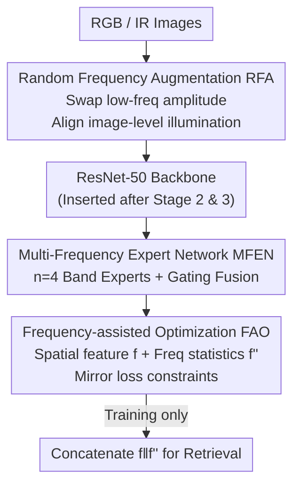

# MFEN: Multi-Frequency Expert Network for Visible-Infrared Person Re-ID

**Conference**: CVPR 2026  
**Paper**: [CVF Open Access](https://openaccess.thecvf.com/content/CVPR2026/html/Li_MFEN_Multi-Frequency_Expert_Network_for_Visible-Infrared_Person_Re-ID_CVPR_2026_paper.html)  
**Code**: Not released  
**Area**: Human Understanding / Cross-modal Person Re-identification  
**Keywords**: Visible-Infrared ReID, Frequency Domain Learning, Mixture-of-Experts, Data Augmentation, Cross-modal Alignment

## TL;DR
To address the challenge in visible-infrared person re-identification where "illumination differences span across multiple frequency bands and the optimal band varies by sample," MFEN utilizes a Mixture-of-Experts (MoE) structure with multiple frequency band experts and a gating mechanism to adaptively fuse frequency domain cues per sample. Complemented by image-level Random Frequency Augmentation (RFA) and optimization-level Frequency-assisted Optimization (FAO), it achieves or approaches SOTA performance on three VI-ReID datasets.

## Background & Motivation
**Background**: Visible-Infrared Person Re-identification (VI-ReID) aims to match the same individual between daytime RGB images and nighttime infrared (IR) images. In addition to the RGB-IR modality gap, IR images exhibit significant intra-class variance. Recent works have shifted toward the **frequency domain**: transforming images into the Fourier domain to separate "identity-related contour details" from "illumination/color-related irrelevant information" using amplitude and phase spectra, achieving notable progress.

**Limitations of Prior Work**: The authors point out that modality differences largely stem from **varying illumination conditions**—including color differences from wavelength variations (RGB three-channel vs. IR single-channel) and brightness differences from **light source types** (IR surveillance cameras often rely on their own light sources, leading to underexposure or overexposure). Identity-related and illumination-related cues are actually **dispersed across multiple frequency bands**: severely overexposed samples require suppressing dominant low-frequency illumination, while blurry, low-contrast samples rely more on medium-to-high frequency details. Existing frequency-domain methods either apply uniform modulation to the entire spectrum or focus on fixed high-frequency regions, failing to perform "sample-adaptive" frequency selection.

**Key Challenge**: The optimal frequency band is **sample-dependent**, whereas existing methods utilize fixed priors (full-spectrum or single fixed band), resulting in a natural mismatch.

**Goal**: (1) Perform sample-adaptive cross-multi-band frequency domain fusion at the feature level; (2) Reduce image-level illumination differences at the data level; (3) Introduce frequency domain constraints at the optimization level to further suppress modality gaps.

**Key Insight**: Since different frequency bands serve different purposes for various samples and are complementary (low frequencies for illumination correction, high frequencies for boundary recovery), an "expert" can be assigned to each frequency band. A gating mechanism then dynamically weights these experts per sample, allowing the model to decide "which frequency bands to trust for this specific image."

**Core Idea**: Replace "fixed frequency priors" with "multi-frequency experts + adaptive gating fusion," supported by data augmentation (RFA) and optimization (FAO). This fully utilizes frequency domain information across the data, model, and optimization levels.

## Method

### Overall Architecture
MFEN integrates frequency domain concepts across three layers: At the **image layer**, Random Frequency Augmentation (RFA) aligns the illumination patterns of both modalities; at the **feature layer**, the Multi-Frequency Expert Network (MFEN module) is inserted after stages 2 and 3 of ResNet-50 to adaptively fuse multi-band cues per sample; at the **optimization layer**, Frequency-assisted Optimization (FAO) applies loss constraints using frequency statistics as a complementary view to spatial features. The three components collaborate during training; during inference, augmentation and auxiliary losses are removed, and the spatial feature $f$ is concatenated with the complementary frequency statistics $f''$ for retrieval.

### Key Designs

**1. Random Frequency Augmentation (RFA): Swapping low-frequency amplitudes at the image level to simulate illumination of the other modality.**

RFA addresses the image-level issue where "IR images are frequently under/overexposed, remaining distinct from grayscale RGB images even after conversion." Since color and brightness are primarily encoded in the Fourier amplitude spectrum, a direct approach would be swapping the entire amplitude spectra of RGB and IR. However, the authors found that the full amplitude also contains high-frequency structural energy that should align with the original phase; swapping it entirely produces severe artifacts and distorts identity structure. Thus, RFA uses Gaussian low/high-pass filters to split the amplitude into low-frequency $A_l$ and high-frequency $A_h$, **swapping only the low-frequency amplitude**: $A_s(x)=A_l(x')+A_h(x)$ (where $x'$ is a randomly selected image from the other modality). The **original phase** $P(x)$ is preserved to reconstruct the frequency domain $F_s(x)=A_s(x)\cdot e^{jP(x)}$ before applying inverse FFT. Post-augmentation, one channel is randomly selected from the RGB image and replicated three times to suppress residual color bias, while the IR image remains unchanged. This brings the illumination patterns of RGB/IR closer without destroying structural details, easing subsequent cross-modal feature learning.

**2. Multi-Frequency Expert Network (MFEN): Using Mixture-of-Experts with gating for sample-adaptive frequency selection.**

MFEN is the core contribution, addressing the mismatch where "optimal bands vary by sample while fixed priors are insufficient." Given a feature map $X$, each expert first uses $1\times1$ convolutions to project $Q,K$ (channel-compressed to 64 for efficiency), then applies FFT to obtain $Q_F,K_F$. A binary band-pass mask $M_b$ is applied **only to $K_F$** to filter the target band $K_{Fb}=M_b\odot K_F$, while $Q_F$ remains full-spectrum as a "content anchor." This allows each expert to learn "how full content interacts with a specific target band"—masking both $Q_F$ and $K_F$ would trap experts in narrow bands and weaken cross-band complementarity. Frequency bands are divided by **octaves** (default 4 experts with thresholds $\{0,\frac{1}{2^{n-1}},\dots,\frac14,\frac12,1\}$), matching the need for "coarse low-frequency and fine high-frequency modeling." The output of each expert $A_b=\mathrm{BN}_b(F^{-1}(Q_F\odot K_{Fb}))$ is weighted and summed via a gate $A=\sum_j \mathrm{Gate}(X)_j A_j$, where $\mathrm{Gate}(X)=\mathrm{sigmoid}(W_g(X))$.

Notably, it **does not use top-k selection or normalize gating weights**: the goal is to let the model learn from all bands simultaneously rather than through mutually exclusive competition. Non-overlapping bands make experts naturally complementary (the same sample might need low-frequency for lighting and high-frequency for boundaries). Top-k would impose sparsity, and normalization would introduce unnecessary competition between experts. Finally, $A$ modulates the spatial features: $X_{out}=W(A\odot W_V(X))$.

**3. Frequency-assisted Optimization (FAO): Using frequency domain statistics as a complementary view for mirror losses.**

FAO addresses the limitation of "calculating ReID losses only in the spatial domain without frequency constraints." It applies FFT to the backbone output feature map $F$ to get $F'$, then pools it for a first-order frequency representation $f'=\mathrm{GAP}(F')$. This is supplemented by second-order moments $f''=f'+\sqrt{\mathrm{GAP}((F'-f')^2)}$—the second-order term measures the dispersion of frequency response, serving as an "energy-aware" supplement to the first-order mean. $f''$ characterizes not just which frequencies are activated, but how strong their responses are. Crucially, FAO **does not treat the frequency domain as an isolated branch**; instead, $f''$ acts as a complementary statistical view to **regularize** the primary spatial feature $f$. It uses frequency identity loss $L_{fid}=\mathbb{E}_i[-y_i\log\frac{p_i+p_i''}{2}]$ to replace standard identity loss (where $p_i, p_i''$ are predicted probabilities from $f, f''$); frequency KL loss $L_{fkl}$ to align classification distributions of cross-modal positive samples; and frequency Euclidean loss $L_{feu}$ (margin $\rho=0.6$) to pull positive samples closer and push negatives apart in the embedding space. The total loss is $L_{total}=L_{fid}+L_{fkl}+L_{feu}$, trained end-to-end.

### Loss & Training
The backbone is an ImageNet-pretrained ResNet-50 (last layer stride set to 1, with BNNeck). MFEN is inserted after stages 2 and 3 with $n=4$ experts. Images are resized to $384\times192$ with random cropping, horizontal flipping, and random erasing. Training uses SGD for 120 epochs, batch size 64 (8 identities), learning rate 0.02 with warm-up and cosine decay, and margin $\rho=0.6$. The total loss is the sum of the three FAO terms: $L_{fid}+L_{fkl}+L_{feu}$.

## Key Experimental Results

### Main Results
Evaluation was conducted on three datasets (SYSU-MM01, RegDB, LLCM), reporting CMC (rank-k) and mAP, averaged over 10 random splits.

| Dataset / Setting | Metric | MFEN | Prev. SOTA | Gain |
|--------|------|------|----------|------|
| SYSU-MM01 All-Search | R-1 / mAP | 80.93 / 76.56 | DSSF3 79.12 / 75.27 | +1.81 / +1.29 |
| SYSU-MM01 Indoor-Search | R-1 / mAP | 87.88 / 88.12 | DSSF3 85.01 / 86.75 | +2.87 / +1.37 |
| RegDB (Avg. both directions) | R-1 / mAP | 94.48 / 90.16 | DSSF3 ≈91.2 / 85.7 | ≈+3.30 / +4.48 |
| LLCM (Avg. both directions) | R-1 / mAP | 63.5 / 67.6 | DNS ≈61.8 / 66.4 | ≈+1.7 / +1.2 |

The authors emphasize that MFEN shows larger gains in All-Search (SYSU-MM01), where illumination and clutter are more diverse, justifying the "multi-band modeling + sample-adaptive fusion" motivation. Consistent gains across both retrieval directions in RegDB and the complex nighttime scenes of LLCM further validate the robustness of frequency domain modeling.

### Ablation Study
Conducted on SYSU-MM01 All-Search (baseline = ResNet-50 + identity/KL/Euclidean losses, but without frequency components).

| Configuration | R-1 / mAP | Note |
|------|---------|------|
| Baseline | 71.85 / 68.95 | No frequency components |
| + RFA | 75.01 / 71.23 | Image-level, +3.16 / +2.28 |
| + RFA + MFEN | 78.42 / 74.85 | Feature-level, +3.41 / +3.62 |
| + RFA + MFEN + FAO (Full) | 80.93 / 76.56 | Optimization-level, +2.51 / +1.71 |
| MFEN→SE | 76.90 / 71.55 | Replacing with SE drops 4.03 / 5.01 |
| MFEN→CBAM | 75.45 / 70.33 | Replacing with CBAM drops 5.48 / 6.23 |
| 1 Expert (Full spectrum) | 79.87 / 75.61 | Single expert inferior to multi-band |
| 2 Experts | 80.22 / 75.93 | Still inferior to 4 experts |
| High-freq only / Low-freq only | 79.63 / 78.52 | Single band misses information |

### Key Findings
- **MFEN module is the primary contributor**: It independently provides +3.41 R-1 / +3.62 mAP, serving as the core contribution. RFA and FAO provide complementary gains at the data and optimization ends, respectively.
- **Skipping top-k and normalization is a critical design choice**: Ablations show that 1 expert (full spectrum), 2 experts, or single high/low frequency experts are all suboptimal, validating that "identity cues and illumination noise are dispersed across bands and the useful bands vary per sample."
- **Insertion position is sensitive**: Inserting MFEN after ResNet-50 stages 2 and 3 is optimal. Placing it after stage 4 dropped R-1 to 76.42, suggesting middle-layer features are better for extracting discriminative frequency information.
- **Frequency augmentation benefits various losses generally**: FAO's $L_{fid}/L_{fkl}/L_{feu}$ consistently improved over counterparts without frequency components ($L_{id}/L_{kl}/L_{eu}$), indicating frequency statistics are a general auxiliary constraint rather than being tied to one specific supervision form.

## Highlights & Insights
- **"Swap low-freq amplitude + Keep original phase" is clever**: It directly targets the physical fact that "color/brightness are encoded in low-frequency amplitude, while structure resides in phase and high frequencies." This simulates another modality's illumination without destroying structure, proving more effective than pure grayscale or brightness jittering (like CAJ).
- **Removing top-k and normalization in MoE is a counter-intuitive but justified trade-off**: Since frequency bands are complementary rather than competitive, enforcing sparsity or normalization would harm complementarity. This insight on "when not to use standard MoE recipes" is transferable to other "complementary multi-view" fusion tasks.
- **Second-order moments for complementary frequency statistics $f''$**: Using $\sqrt{\mathrm{GAP}((F'-f')^2)}$ to capture "how strong" frequency responses are is a lightweight way to explicitly encode "energy distribution" into retrieval features, which could be reused in other representation learning tasks.

## Limitations & Future Work
- The paper has not released code, and the number of experts ($n=4$) and octave thresholds are fixed; there is no exploration into whether finer or adaptive band division would provide further gains.
- The three datasets are relatively controlled VI-ReID benchmarks. Whether the method remains effective under extreme illumination or occlusion in real-world open scenarios was not directly verified.
- The three loss terms in FAO are summed with equal weights; weight sensitivity analysis was not performed, and it is worth investigating if different datasets require re-balancing.
- Personal observation: Gains primarily come from scenarios with significant illumination differences (SYSU/RegDB). For hard cases where illumination differences are small and discrimination relies on pose/occlusion, the gains might be limited.

## Related Work & Insights
- **vs. FDMNet / FDNM / DSSF3 (Frequency-domain VI-ReID)**: Most existing works rely on uniform frequency transformations or full-spectrum fusion. MFEN explicitly decomposes feature maps into non-overlapping bands and uses gating for sample-adaptive fusion, delegating the "band selection" flexibility to the model rather than a fixed prior.
- **vs. FDConv**: FDConv decomposes convolutional kernels for dense prediction; MFEN decomposes spatial feature maps to directly align spatial-frequency differences across modalities in VI-ReID.
- **vs. CAJ / DMT / RLE (Data Augmentation)**: These mainly adjust color and global brightness. RFA produces local brightness changes by swapping frequency amplitudes, better simulating real illumination like overexposure/underexposure.
- **vs. SE / CBAM / Non-local (Attention)**: MFEN performs element-wise multiplication in the frequency domain before transforming back, allowing interactions between different spatial positions (which element-wise spatial weights like CBAM cannot do) while remaining more efficient than the quadratic complexity of Non-local.

## Rating
- Novelty: ⭐⭐⭐⭐ Introducing MoE for frequency selection and intentionally removing top-k/normalization is insightful, though frequency domain + ReID is a maturing direction.
- Experimental Thoroughness: ⭐⭐⭐⭐ Three datasets + layer-by-layer ablation + detailed analysis of experts/positions, quite solid.
- Writing Quality: ⭐⭐⭐⭐ Clear logic (Motivation-Method-Ablation), complete formulas, and well-defined three-layer framework.
- Value: ⭐⭐⭐⭐ Consistent improvements in VI-ReID with plug-and-play components; the frequency-expert idea is transferable to other cross-modal fusion tasks.

<!-- RELATED:START -->

## Related Papers

- [\[CVPR 2026\] Spatial-Frequency Collaborative Learning for Occluded Visible-Infrared Person Re-Identification](spatial-frequency_collaborative_learning_for_occluded_visible-infrared_person_re.md)
- [\[CVPR 2026\] BIT: Matching-based Bi-directional Interaction Transformation Network for Visible-Infrared Person Re-Identification](bit_matching-based_bi-directional_interaction_transformation_network_for_visible.md)
- [\[CVPR 2026\] Towards Cross-Modal Preservation, Consistency and Alignment for Privacy-Preserving Visible-Infrared Person Re-Identification](towards_cross-modal_preservation_consistency_and_alignment_for_privacy-preservin.md)
- [\[CVPR 2026\] COPE: Consistent Occlusion and Prompt Enhancement Network for Occluded Person Re-identification](cope_consistent_occlusion_and_prompt_enhancement_network_for_occluded_person_re-.md)
- [\[ICCV 2025\] Weakly Supervised Visible-Infrared Person Re-Identification via Heterogeneous Expert Collaborative Consistency Learning](../../ICCV2025/human_understanding/weakly_supervised_visible-infrared_person_re-identification_via_heterogeneous_ex.md)

<!-- RELATED:END -->
