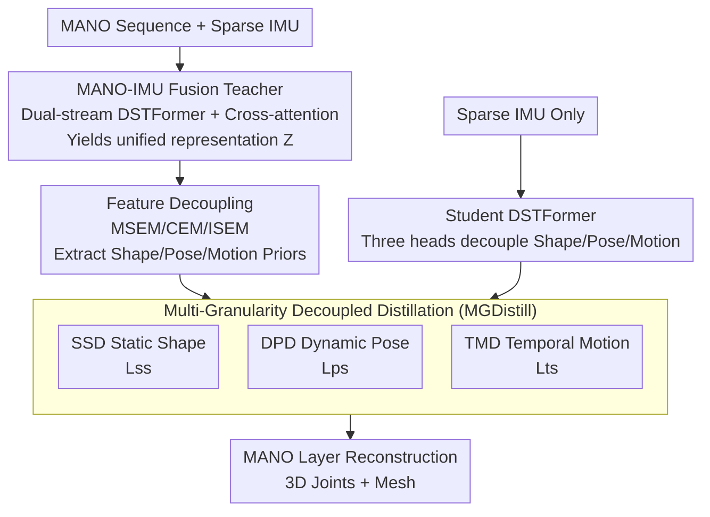

# MGDHand: Multi-Granularity Prior-to-Inertial Distillation Framework for Sequential 3D Hand Pose Estimation from Sparse IMUs

**Conference**: CVPR 2026  
**Paper**: [CVF Open Access](https://openaccess.thecvf.com/content/CVPR2026/html/Wang_MGDHand_Multi-Granularity_Prior-to-Inertial_Distillation_Framework_for_Sequential_3D_Hand_Pose_CVPR_2026_paper.html)  
**Code**: Not released  
**Area**: Human Understanding / 3D Hand Pose Estimation  
**Keywords**: Sparse IMU, Hand Pose Estimation, Knowledge Distillation, MANO, Multi-granularity Decoupling

## TL;DR
To address the highly ill-posed problem of directly regressing dense hand poses from sparse IMUs due to the semantic gap, MGDHand pre-trains a MANO-IMU fusion teacher to encode priors into three categories: static shape, dynamic pose, and temporal motion. It then employs multi-granularity decoupled distillation (SSD/DPD/TMD) to transfer these priors to an IMU-only student in their respective semantic domains. On the VIHand dataset, this reduces MPJPE by 40.7% compared to a student without distillation.

## Background & Motivation
**Background**: Mainstream 3D hand pose estimation (HPE) relies on vision (RGB/Depth/RGB-D), which offers high accuracy but is limited by occlusion, privacy, and field of view (FoV). **IMUs** (wearable inertial sensors in watches, smart rings, or data gloves) are occlusion-resistant, FoV-independent, and low-power, gaining increasing attention. Early research used dense configurations (10–18 IMUs) for stable results but suffered from heavy and inconvenient hardware; recent trends have shifted toward **sparse configurations (2–7 IMUs)** for daily usability.

**Limitations of Prior Work**: Sparse IMUs only provide local dynamic motion signals (rotation, acceleration, angular velocity) and lack explicit joint positions and appearance semantics, leading to a massive **information density gap** compared to the global morphological structure of the hand. Direct regression of dense hand poses from sparse IMUs is thus highly **ill-posed**, often resulting in joint misalignment and morphological distortion. To mitigate this, VIFNet attempted to distill visual features into an IMU student, making progress. However, distilling only static visual features fails to utilize complex motion information, leading to temporal inconsistency and poor robustness against fast gestures.

**Key Challenge**: Teacher knowledge is rich but **entangled** (mixing shape, joint position, and action). Combined with the inherent **semantic mismatch and information density gap** between vision and inertia, direct distillation of entangled features makes student optimization difficult—restricting the transfer quality of coarse-grained cross-modal distillation.

**Goal**: (1) Construct a strong teacher whose priors are both rich and "interpretable" for the student; (2) Decouple entangled priors by semantics and transfer them by granularity to reduce the student's learning difficulty.

**Key Insight**: Hand knowledge can naturally be decomposed into three granularities: **Shape (static, time-invariant)**, **Pose (per-frame high-DOF joint motion)**, and **Motion (fast-changing trends like velocity/acceleration)**. Instead of forcing the student to learn a cluster of entangled features, it is more effective to split the priors and align them in their respective semantic domains.

**Core Idea**: Use a MANO-IMU fusion teacher to explicitly encode priors into the MANO parameter space, then use "Multi-Granularity Decoupled Distillation" to transfer the triplet of complementary priors (shape/pose/motion) at matching granularities to a pure IMU student for collaborative reconstruction of dense hand structures.

## Method

### Overall Architecture
MGDHand is a two-stage teacher-student distillation framework. **First Stage**: Pre-train a MANO-IMU fusion teacher $T$ that takes both masked MANO sequences and sparse IMU sequences. It uses a dual-stream DSTFormer to extract a morphology branch $F^m_T$ and a kinematic branch $F^k_T$, which are fused via cross-attention into a unified representation $Z$. This $Z$ is used to regress MANO parameters and is decoupled into shape/pose/motion priors. **Second Stage**: Freeze the teacher and train the IMU-only student $S$. The student similarly decouples IMU hidden features into three-granularity representations and performs distillation (SSD/DPD/TMD) against the corresponding teacher priors. At inference, only the IMU is used.

### Key Designs

**1. MANO-IMU Fusion Teacher: Explicitly Mapping Sparse Inertia to MANO Morphological Space**

The teacher addresses the issue of teacher knowledge being "uninterpretable" to the student. The key is introducing the parametric hand model **MANO** as a bridge. Given an IMU sequence $I\in\mathbb{R}^{T\times S\times C_{imu}}$ and a masked MANO sequence $\tilde\Theta=(\tilde\theta,\beta)$, MANO pose parameters are linearly projected into joint-level pose features, and shape parameters are broadcasted into shape features to form $F_{init}$. Adding positional encoding yields MANO embeddings $F$, while projected IMUs yield embeddings $G$. A dual-stream DSTFormer extracts kinematic hidden features $F^k_T$ from $G$ and morphological hidden features $F^m_T$ from $F$. **Per-frame cross-attention** is then applied: using MANO features as queries to attend to IMU features (K, V), producing a unified representation $Z$ (i.e., $\tilde F^m_T$) via residual fusion. $Z$ encodes both shape priors and temporal dynamics. Dual regression heads predict per-frame poses $\hat\theta$ and (via spatio-temporal pooling) global shape $\hat\beta$ from $Z$, which are fed into the MANO layer to reconstruct 3D joints $\hat J$ and mesh $\hat V$. Thus, the teacher learns an "identifiable mapping" that explicitly associates sparse IMUs with joint space, making it far more suitable for guiding an IMU student than the RGB-IMU teacher in VIFNet-T.

**2. Feature Decoupling: Z-guided Cross-attention + Three Enhancement Modules to Extract Priors**

This step solves the entanglement of shape, joint position, and action within $Z$. First, $Z$-guided cross-attention is applied to the two branches using $Z$ as a query to obtain refined features $\hat F^m_T, \hat F^k_T$. These are then reorganized into complementary priors via three arithmetic modules: **MSEM (Morphology-Specific Enhancement)** combines the difference and intersection of the branches ($(\hat F^m_T-\hat F^k_T)\oplus(\hat F^m_T\odot\hat F^k_T)$) to strengthen MANO-dominant components, yielding the static shape prior $Z^{sh}_T$ (globally pooled to $\mathbb{R}^D$ as shape is time-invariant). **CEM (Consistency Enhancement)** uses element-wise product and sum ($(\hat F^m_T\odot\hat F^k_T)\oplus(\hat F^m_T\oplus\hat F^k_T)$) to emphasize shared components, yielding the dynamic pose prior $Z^{po}_T$. **ISEM (Inertial-Specific Enhancement)** mirrors MSEM to extract motion-dominant cues where IMU is strong and MANO is weak, yielding the temporal motion prior $Z^{tm}_T$. Each prior is supervised by auxiliary heads using MANO labels (shape head regresses $\beta$, pose head regresses per-frame $\theta$, and motion head regresses velocity $v$ and acceleration $\alpha$ derived from ground truth joint differencing $d^{gt}_t=(\Delta J^{gt}_t,\Delta^2 J^{gt}_t)$). The student similarly decouples $\{Z^{sh}_S,Z^{po}_S,Z^{tm}_S\}$ using channel attention for shape, joint-axis spatial attention for pose, and temporal attention for motion.

**3. Multi-Granularity Decoupled Distillation (MGDistill): Aligning Priors at Matching Granularities**

This stage transfers the decoupled priors to the student. All distillation losses are computed on $\ell_2$ normalized features. **Static Shape Distillation (SSD)**: Since hand shape is time-invariant and summarizes the global descriptor, it directly aligns the global shape features: $L_{ss}=\|\hat Z^{sh}_S-\hat Z^{sh}_T\|_2^2$, allowing the student to inherit stable global shape and bone length ratios. **Dynamic Pose Distillation (DPD)**: Pose changes continuously and has high DOF, so per-frame alignment is used: $L_{ps}=\frac1T\sum_t\|\hat Z^{po}_{S,t}-\hat Z^{po}_{T,t}\|_2^2$, transferring fine-grained joint configuration priors and bridging the sparse-dense gap. **Temporal Motion Distillation (TMD)**: Since IMUs are sensitive to dynamics, this distill emphasizes velocity/acceleration trends: $L_{ts}=\frac1T\sum_t\|\hat Z^{tm}_{S,t}-\hat Z^{tm}_{T,t}\|_2^2$, ensuring the student encodes inertial dynamics consistent with the teacher, enhancing robustness to fast or ambiguous movements. Total loss: $L_{distill}=\lambda_{sh}L_{ss}+\lambda_{po}L_{ps}+\lambda_{tm}L_{ts}$.

### Loss & Training
Two-stage training is employed. **Teacher**: $L_T=L_{recon}+\alpha_{sh}L^{sh}_T+\alpha_{po}L^{po}_T+\alpha_{tm}L^{tm}_T$. Parameters are frozen after convergence. **Student**: $L_S=L_{recon}+L_{distill}$. The student learns stable and structured priors under a fixed teacher. Implementation: PyTorch + single RTX 4090, AdamW, initial LR 1e-4 with cosine decay, 80 epochs, batch size 32. DSTFormer depth $N=5$, 8 heads, 512 dimensions, sequence length $T=32$.

## Key Experimental Results

### Main Results
Evaluated on the public multi-modal hand pose dataset **VIHand** (over 1.4M frames, 15 subjects, ROM01–12 for training / ROM13–15 for testing). Metrics: MPJPE and MPVPE (mean Euclidean distance for joints and vertices in mm, lower is better).

| Method | Input | Distill | #IMU | MPJPE | MPVPE |
| :--- | :--- | :--- | :--- | :--- | :--- |
| WiLoR† (Vision) | RGB | ✗ | - | 10.49 | 11.74 |
| VIFNet-T (RGB-IMU Teacher) | RGB+IMU | ✗ | 7 | 7.86 | 8.94 |
| VIFNet (IMU) | IMU | ✗ | 7 | 16.93 | 19.41 |
| VIFNet-S (Global Feature Distill) | IMU | ✓ | 7 | 13.69 | 16.53 |
| MGDHand (Student w/o Distill) | IMU | ✗ | 7 | 15.40 | 17.15 |
| **MGDHand (MGDistill)** | IMU | ✓ | 7 | **9.13** | **10.46** |

Key Comparisons: Ours **MANO-IMU Teacher** improves MPJPE by 25.7% (5.84 vs 7.86mm) over VIFNet-T. Ours **MGDistill Student** reduces MPJPE by 33.3% (9.13 vs 13.69mm) compared to VIFNet-S (coarse global distillation) and by 40.7% (9.13 vs 15.40mm) against its own non-distilled version. The pure IMU method approaches the performance of mainstream vision methods.

### Ablation Study
Conducted under the VIHand 7-IMU configuration.

| Config | $L_{ss}$ | $L_{ps}$ | $L_{ts}$ | MPJPE | MPVPE |
| :--- | :--- | :--- | :--- | :--- | :--- |
| w/o SSD | ✗ | ✓ | ✓ | 9.87 | 12.58 |
| w/o DPD | ✓ | ✗ | ✓ | 12.39 | 13.90 |
| w/o TMD | ✓ | ✓ | ✗ | 9.65 | 10.74 |
| MGDistill (Full) | ✓ | ✓ | ✓ | 9.13 | 10.46 |

Comparison of different distillation methods (7-IMU):

| Method | MPJPE | MPVPE |
| :--- | :--- | :--- |
| SimKD | 13.78 | 15.89 |
| DKD | 11.92 | 13.37 |
| SCJD (strong baseline) | 11.24 | 13.50 |
| **MGDistill** | **9.13** | **10.46** |

### Key Findings
- **DPD (Dynamic Pose Distillation) contributes most**: Removing it worsens MPJPE/MPVPE by 35.7%/32.9%, indicating that per-frame dynamic pose priors are the main driver for bridging the sparse-dense gap.
- **SSD stabilizes geometry**: Removing it increases MPVPE by 20.3% (greater impact on vertices than joints), validating that static morphology priors stabilize global shape and bone ratios.
- **TMD provides small but consistent gains**: Removing it increases MPJPE/MPVPE by 5.7%/2.7%, primarily reducing temporal drift and jitter.
- **Graceful degradation with sensor sparsification**: When reducing IMUs from 7 to 3/2, MGDistill still reduces MPJPE/MPVPE compared to no distillation, showing that granular prior transfer keeps the model stable even with sparser inputs.
- **Superior to general distillation**: MGDistill outperforms SCJD by 2.11/3.04mm—general methods transfer in an entangled global feature space without explicitly addressing student optimization, limiting gains.

## Highlights & Insights
- **MANO as an "Interpretable Bridge" for Teacher Construction**: Explicitly mapping sparse inertia to MANO parameters ensures teacher knowledge inherently possesses shape/pose semantics. This is a strong example of "making knowledge interpretable before distillation," applicable to other cross-modal tasks with parametric models (SMPL for body, 3DMM for face).
- **Explicit Decoupling via Simple Arithmetic**: Using differences for specific features, intersections for shared features, and sums for enhancement—simple element-wise operations achieve semantic decoupling that is both lightweight and explainable.
- **"Matching Granularity Distillation" is the core insight**: Shape uses a global descriptor, pose uses per-frame alignment, and motion distills trends. Aligning different physical quantities at their natural spatio-temporal granularities is far more effective than "one-size-fits-all global distillation."

## Limitations & Future Work
- The code is not public, and evaluations were only conducted on the VIHand dataset (noted as the only public vision-inertial dataset with precise 3D joint + MANO labels). Cross-dataset/cross-subject generalization is unverified.
- ⚠️ Details on teacher reconstruction loss $L_{recon}$ and network specifics are in the supplementary material; the main text lacks a complete definition, making reproduction reliant on the supplement.
- Weights for distillation ($\lambda_{sh}, \lambda_{po}, \lambda_{tm}$) and auxiliary losses ($\alpha$) are manually tuned hyperparameters without sensitivity analysis in the paper.
- Self-identified limitation: The teacher still requires paired MANO-IMU sequences for pre-training. Such data is scarce, limiting the ease of extension to new scenarios or hand types.

## Related Work & Insights
- **vs VIFNet (Cross-modal Distillation)**: VIFNet uses an RGB-IMU teacher and distills entangled global visual features, ignoring semantic mismatch and information density gaps. MGDHand uses a MANO-IMU teacher and decouples priors for more effective transfer.
- **vs DWPose (Two-stage Distillation)**: DWPose transfers global structure then refines joints in a temporal sequence; MGDHand utilizes parallel semantic decoupling.
- **vs Dense IMU Methods (GESTO, etc.)**: These methods switch robustness for bulky hardware. MGDHand uses sparse IMUs (2–7) and compensates for missing information via prior distillation.
- **vs Vision/Vision-Inertial Fusion (HaMeR/VIST)**: Vision methods suffer from occlusion; fusion methods increase deployment costs. MGDHand approaches vision-level accuracy using only IMUs at inference.

## Rating
- Novelty: ⭐⭐⭐⭐ The combination of "MANO bridge + multi-granularity decoupling" is novel and insightful.
- Experimental Thoroughness: ⭐⭐⭐ Main experiments and comparisons are complete, but limited to a single dataset.
- Writing Quality: ⭐⭐⭐⭐ Logical flow from motivation to decoupling to distillation is clear.
- Value: ⭐⭐⭐⭐ Achieving vision-level accuracy with pure IMUs is highly practical for wearable/VR/AR interaction.

<!-- RELATED:START -->

## Related Papers

- [\[CVPR 2026\] JUMP-Hand: Learning Joint-wise Uncertainty to Gate Mixture of View Experts for Multi-View 3D Hand Reconstruction](jump-hand_learning_joint-wise_uncertainty_to_gate_mixture_of_view_experts_for_mu.md)
- [\[CVPR 2026\] HandDreamer: Zero-Shot Text to 3D Hand Model Generation](handdreamer_zero_shot_text_to_3d_hand_model_generation.md)
- [\[CVPR 2026\] Sketch2Colab: Sketch-Conditioned Multi-Human Animation via Controllable Flow Distillation](sketch2colab_sketch-conditioned_multi-human_animation_via_controllable_flow_dist.md)
- [\[CVPR 2026\] Ultra Diffusion Poser: Diffusion-Based Human Motion Tracking From Sparse Inertial Sensors and Ranging-Based Between-Sensor Distances](ultra_diffusion_poser_diffusion-based_human_motion_tracking_from_sparse_inertial.md)
- [\[CVPR 2026\] A2P: From 2D Alignment to 3D Plausibility for Occlusion-Robust Two-Hand Reconstruction](from_2d_alignment_to_3d_plausibility_unifying_hete.md)

<!-- RELATED:END -->
