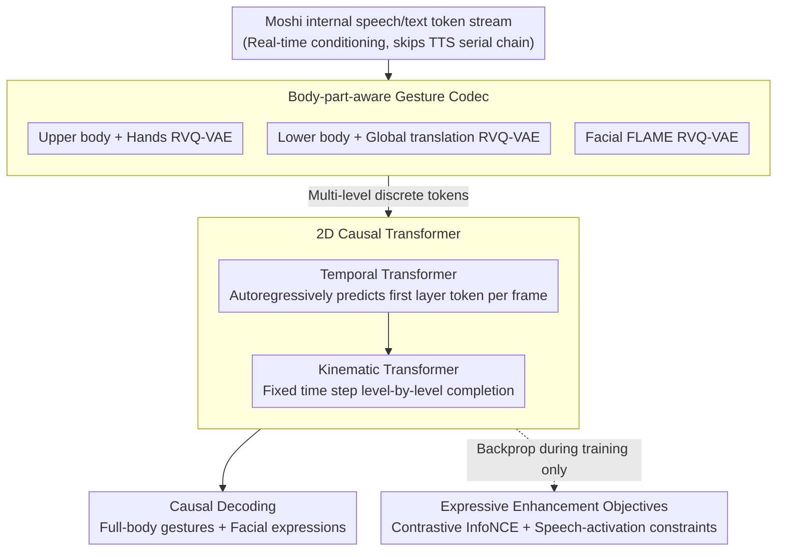

# Miburi: Towards Expressive Interactive Gesture Synthesis

**Conference**: CVPR 2026  
**arXiv**: [2603.03282](https://arxiv.org/abs/2603.03282)  
**Code**: [Project Page](https://vcai.mpi-inf.mpg.de/projects/MIBURI)  
**Area**: Human Understanding  
**Keywords**: Co-speech gesture generation, embodied dialogue agents, causal autoregressive, real-time generation, residual vector quantization

## TL;DR

Miburi is proposed as the first online causal framework that directly utilizes the internal token streams of the speech-text foundation model Moshi and a 2D causal Transformer to achieve real-time synchronized full-body gesture and facial expression synthesis.

## Background & Motivation

Current LLM dialogue agents lack embodied capabilities and expressive gestures. Existing co-speech gesture generation methods fall into two categories: (1) Generative methods (Diffusion/Transformer) produce natural expressive gestures but require future audio context, precluding real-time operation; (2) Real-time systems (rules/simple networks) can run online but result in stiff gestures with low diversity. The **Key Challenge** is the difficulty of satisfying both **causality** (relying only on past inputs) and **real-time** (low latency) requirements simultaneously. Traditional pipelines process LLM output $\rightarrow$ speech synthesis $\rightarrow$ audio encoding $\rightarrow$ gesture generation serially, introducing significant latency.

## Method

### Overall Architecture

To enable dialogue agents to generate natural, expressive full-body gestures and facial expressions while speaking in real-time, the difficulty lies in satisfying both "causality" (looking only at the past) and "real-time" (low latency). Miburi is built directly upon the speech-text foundation model Moshi, using its internal speech/text token streams as conditioning signals to skip the traditional serial LLM $\rightarrow$ TTS $\rightarrow$ audio encoding chain. Motion is first quantized into multi-level discrete tokens via body-part-aware codecs. Subsequently, a 2D causal Transformer (operating across temporal and kinematic dimensions) generates gesture tokens autoregressively. During training, an expressive enhancement objective is added to ensure motion occurs only when appropriate.

### Key Designs

**1. Body-part-aware Gesture Codec: Quantizing by regions to preserve kinematic details**

The correlation between different body parts and speech varies significantly; holistic approaches often lose fine-grained movements such as finger motion. Miburi decomposes full-body motion into three regions: upper body + hands $\mathbf{x}^u$, lower body + global translation $\mathbf{x}^l$, and facial expressions (FLAME parameters) $\mathbf{x}^f$. Each region is independently encoded using a **Residual VQ-VAE**. The encoder consists of downsampled 1D convolutions and causal self-attention Transformers, quantizing output into multi-level tokens $\mathbf{g}^b \in \mathbb{R}^{T \times K^b}$ ($K^u=K^l=8, K^f=4$ levels), where each token represents 2 frames (0.08 s) of motion, deliberately aligned with Moshi's token rate. Compared to standard VQ-VAE, the multi-level residual structure of RVQ better preserves fine kinematic details.

**2. 2D Causal Transformer: Decoupling temporal and kinematic dimensions to minimize context length and latency**

A naive approach treating $T \cdot K$ tokens as a single stream results in excessive attention context and prohibitive latency. Miburi splits prediction into two dimensions: the temporal Transformer $\mathcal{T}_{\text{temporal}}$ (4 layers, 2 heads) uses causal self-attention (context of 25 tokens) and dual-causal cross-attention (speech/text, context of 50 tokens) to autoregressively predict the first-level token of each frame $\mathbf{g}_{(t,1)}$, with embeddings of $K$ levels summed into a single input. The kinematic Transformer $\mathcal{T}_{\text{kinematic}}$ (2 layers, 1 head) then autoregressively predicts subsequent levels $\mathbf{g}_{(t,k)}$ within a fixed time step $t$, conditioned on the temporal context $\mathbf{h}_t$ and speech/text embeddings. This decomposition significantly reduces attention context length and inference latency, which is critical for real-time performance.

**3. Expressive Enhancement Objective: Contrastive learning and speech-activation constraints**

Relying solely on cross-entropy tends to produce flat or "ghost" gestures. Miburi introduces two objectives: a contrastive InfoNCE loss reparameterizes predicted tokens via Gumbel-Softmax into differentiable latent representations $\mathbf{z} = \sum_k \text{GumbelSoftmax}(\tilde{\mathbf{o}}_k) \mathbf{C}_k$, maximizing the similarity of matching GT-prediction pairs while minimizing non-matching pairs over temporal segments. This bridges discrete sampling and continuous loss. Additionally, a speech-activation loss applies a binary classification head on $\mathbf{h}_t$ to distinguish between listening and speaking states (BCE loss), preventing erratic movement while listening and enforcing expressive gestures aligned with speech while speaking.

### Loss & Training

The total loss is $\mathcal{L} = \mathcal{L}_{\text{CE}} + \alpha \mathcal{L}_{\text{con}} + \beta \mathcal{L}_{\text{va}}$, where $\alpha=0.1$ and $\beta=0.01$. During inference, top-p nucleus sampling ($p=0.8$ for the temporal Transformer, $p=0.95$ for the kinematic Transformer, and temperature 0.9) is used to maintain diversity, alongside classifier-free guidance (CFG=1.5 for single-speaker, CFG=2.3 for multi-speaker). KV-Cache is implemented for efficient causal inference, and lower-body tokens mask speech/text cross-attention to save runtime.

## Key Experimental Results

### Main Results

| Method | FGD↓ | BeatAlign→ | L1-Div→ | Causal | Real-time |
|------|------|------------|---------|------|------|
| CaMN | 0.736 | 0.176 | 6.73 | ✗ | ✗ |
| RAG-Gesture | 0.515 | 0.648 | 10.09 | ✗ | ✗ |
| GestureLSM | 0.537 | 0.481 | 8.41 | ✗ | ✓ |
| GestureLSM (Causal) | 2.792 | 0.684 | 9.11 | ✓ | ✓ |
| MambaTalk | 1.375 | 0.080 | 3.73 | ✗ | ✓ |
| **Ours (+Face)** | **0.480** | **0.461** | **10.44** | **✓** | **✓** |

### Ablation Study

| Configuration | Key Metrics | Description |
|------|---------|------|
| Moshi tokens vs wav2vec | FGD 0.480 vs 0.665, BeatAlign 0.461 vs 0.363 | Moshi internal features significantly outperform standard audio encoding |
| 2D Transformer vs Single-stream | Improved FGD/BeatAlign/Diversity, ~50% latency reduction | Decoupling temporal and kinematic dimensions is critical |
| Single-speaker vs Multi-speaker | Multi-speaker FGD reduced from 0.753 to 0.480 | Model benefits significantly from larger datasets |
| Latency Comparison | Ours 34.9ms vs GestureLSM 144.7ms | Achieves minimal latency (on A100) |

### Key Findings

- Miburi is the only method that satisfies the three conditions of causality, real-time performance, and expressiveness simultaneously.
- It achieves SOTA performance in a 23-speaker multi-speaker setting (FGD 0.480, BeatAlign 0.461), surpassing all non-causal baselines.
- Naively converting existing methods to causal versions (e.g., GestureLSM Causal, MambaTalk Causal) leads to significant performance degradation, demonstrating the necessity of a dedicated causal architecture.
- User studies show that Miburi outperforms EMAGE and GestureLSM in terms of motion naturalness and speech alignment.

## Highlights & Insights

- **New Paradigm**: By bypassing the traditional serial LLM $\rightarrow$ TTS $\rightarrow$ audio encoder $\rightarrow$ gesture pipeline and utilizing internal token streams of the speech model, the latency bottleneck is eliminated.
- **2D Causal Token Prediction**: The decoupling of temporal and kinematic dimensions elegantly applies the logic of RQ-Transformers to motion generation.
- **RVQ Hierarchical Encoding**: The distinction between coarse large-scale movements and fine finger gestures, along with independent region encoding, respects the varying correlations between body parts and speech.
- **Gumbel-Softmax Bridge**: This allows contrastive learning to be trained end-to-end within the discrete token space.

## Limitations & Future Work

- User studies indicate a remaining performance gap compared to ground-truth motion data.
- The quality of facial expressions (Facial-MSE 7.77) has room for improvement relative to specialized models.
- The correlation between lower-body motion and speech is weak; the current approach of masking cross-attention may be too simplistic.
- Dependence on the Moshi model requires running both Moshi and Miburi during inference, leading to high system resource demands.
- Evaluation was limited to the BEAT2 dataset; generalization to other domains (such as sign language or virtual YouTubers) remains to be verified.

## Related Work & Insights

- **Moshi**: A full-duplex speech dialogue model; Miburi utilizes its internal token streams as conditioning signals.
- **Audio2Photoreal**: Uses diffusion and VQ for dyadic interaction gestures, but is offline and non-causal.
- **GestureLSM**: A flow-matching real-time framework that is non-causal; its performance drops significantly when made causal.
- **RQ-Transformer**: The concept of residual quantization in autoregressive models inspired Miburi's 2D Transformer design.
- **Insight**: Utilizing the internal representations of large models as conditioning for downstream tasks is a paradigm worth broader adoption.

## Rating

- **Novelty**: ⭐⭐⭐⭐⭐ The first qualified causal, real-time, and expressive gesture generation system with a groundbreaking new paradigm.
- **Experimental Thoroughness**: ⭐⭐⭐⭐ Comprehensive multi-speaker evaluations, user studies, and ablations, though conducted on a single dataset.
- **Writing Quality**: ⭐⭐⭐⭐ Accurate problem definitions (distinguishing causality from real-time) and clear illustrations.
- **Value**: ⭐⭐⭐⭐⭐ Significant contribution to the field of embodied dialogue agents with a highly scalable technical route.

<!-- RELATED:START -->

## Related Papers

- [\[CVPR 2026\] ParTY: Part-Guidance for Expressive Text-to-Motion Synthesis](party_part-guidance_for_expressive_text-to-motion_synthesis.md)
- [\[CVPR 2026\] CoordSpeaker: Exploiting Gesture Captioning for Coordinated Caption-Empowered Co-Speech Gesture Generation](coordspeaker_exploiting_gesture_captioning_for_coordinated_caption-empowered_co-.md)
- [\[CVPR 2026\] SyncDreamer: Controllable and Expressive Avatar Generation Beyond the Talking Head](syncdreamer_controllable_and_expressive_avatar_generation_beyond_the_talking_hea.md)
- [\[CVPR 2026\] LiveGesture: Streamable Co-Speech Gesture Generation Model](livegesture_streamable_co-speech_gesture_generation_model.md)
- [\[CVPR 2026\] Avatar Forcing: Real-Time Interactive Head Avatar Generation for Natural Conversation](avatar_forcing_real-time_interactive_head_avatar_generation_for_natural_conversa.md)

<!-- RELATED:END -->
