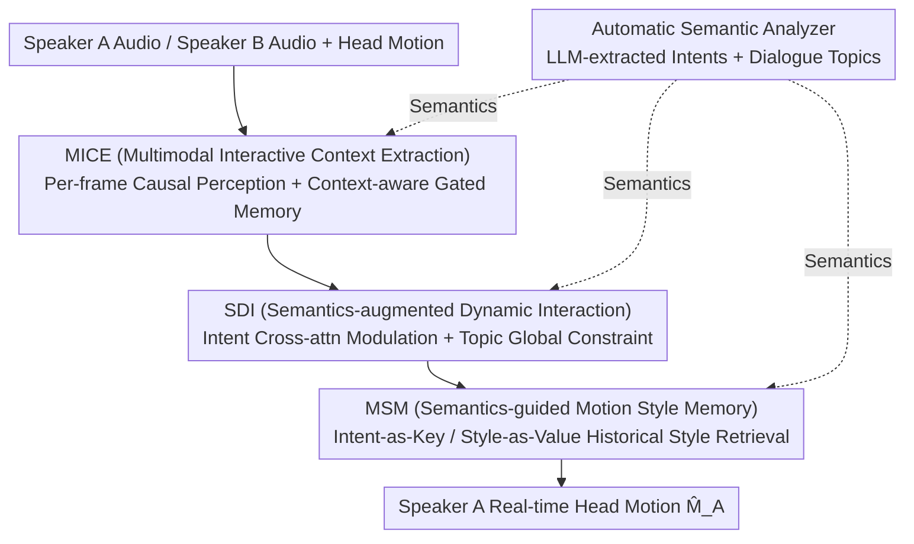

# MimicTalker: A Multimodal Interactive and Memory-Enhanced Framework for Real-Time Dyadic 3D Head Generation

**Conference**: CVPR 2026  
**Paper**: [CVF Open Access](https://openaccess.thecvf.com/content/CVPR2026/html/Wang_MimicTalker_A_Multimodal_Interactive_and_Memory-Enhanced_Framework_for_Real-Time_Dyadic_CVPR_2026_paper.html)  
**Code**: Project Page https://nuo1wang.github.io/MimicTalker (Code TBD)  
**Area**: Human Understanding / Digital Humans / 3D Talking Head Generation  
**Keywords**: Dyadic interactive head generation, Real-time, Multimodal, Semantic memory, Motion style consistency

## TL;DR
MimicTalker focuses on 3D head motion generation for "real-time dyadic conversations." It employs frame-by-frame causal processing combined with Gated Multi-scale Memory (MICE) to achieve zero-latency perception of the interloutor. Intent and topic semantics extracted by an LLM are used for Semantics-augmented Dynamic Interaction (SDI) to modulate speaker features. Furthermore, a Semantics-guided Motion Style Memory (MSM), utilizing an "intent-as-key, style-as-value" external memory bank, maintains motion style consistency during long conversations. This allows for the generation of natural, coherent, and style-consistent real-time reactions across both 25-second short clips and 6-minute long dialogues, achieving 10%–30% improvements over methods like DualTalk on most metrics.

## Background & Motivation

**Background**: Enabling digital humans to both "speak" and "react" in face-to-face dialogues is critical for human-computer interaction. Existing research is divided into two branches: **talking head generation**, which synchronizes head movements with input audio but neglects responses to the interlocutor; and **listening head generation**, which focuses on dyadic interaction but only generates non-verbal feedback like nodding or smiling. Simply concatenating these fails to model the dynamics between both parties and cannot achieve smooth transitions between speaking and listening roles. Thus, **dyadic interactive head generation** has emerged as a more practical unified paradigm.

**Limitations of Prior Work**: The authors summarize three hard requirements for real-world scenarios and the gaps in existing methods: (1) **Real-time Performance**: Systems should integrate multimodal signals (audio, motion, semantics) from the partner and generate responses in real-time, yet most methods are **offline**, generating by clips, requiring complete future information and introducing inherent latency; (2) **Deep Semantic Alignment**: Systems should understand dialogue topics and speaker intent, but real-time methods either underestimate interaction complexity or ignore deep dialogue understanding, leading to unnatural reactions; (3) **Long-term Consistency**: Real conversations are lengthy, and interactive heads should maintain personal style throughout, which existing methods oversimplify, resulting in style drift over time.

**Key Challenge**: Real-time requirements demand "per-frame causality without future dependence," whereas deep understanding and long-term consistency require "global context and historical memory." The former lacks long-range information, and the latter often breaks real-time constraints. Resolving how to obtain instantaneous reactions, deep semantics, and long-term style memory simultaneously under causal constraints is the primary challenge of this work.

**Goal**: Solve the sub-problems of "multimodal instantaneous + long-term perception," "deep semantic injection," and "long-term style consistency" within a real-time (causal) framework.

**Key Insight**: The authors observe that ARIG, the most relevant work, only uses low-level audio/motion signals and neglects deep dialogue semantics and long-term consistency—both of which are crucial for generating realistic, coherent head movements. Consequently, an LLM is introduced to automatically extract intent/topic as high-level semantics, and an external memory bank is used to explicitly store and retrieve historical styles.

**Core Idea**: Integrate "semantics" and "memory" into a causal real-time network: MICE performs causal multimodal perception and memory, SDI dynamically injects intents/topics, and MSM uses semantics to retrieve historical styles. All three are supplied with semantics by a parallel LLM semantic analyzer.

## Method

### Overall Architecture
The network $f$ takes Speaker A's audio $A_A$, Speaker B's audio $A_B$, and head motion $M_B$ as input, and outputs Speaker A's head motion $\hat{M}_A = f(A_B, M_B, A_A)$. This output is synchronized with A's own audio while responding in real-time to B's verbal (audio) and non-verbal (motion) cues. The entire network uses a **causal structure** to ensure A's real-time response to B, consisting of four components: MICE (Multimodal Interactive Context Extraction) for frame-by-frame causal perception of B; SDI (Semantics-augmented Dynamic Interaction) for dynamic injection of A's intent and dialogue topics; MSM (Semantics-guided Motion Style Memory) using an external memory bank to maintain long-term style consistency; and a parallel LLM Automatic Semantic Analyzer that continuously provides intent and topic semantics. Finally, interaction features modulated by style are fed into an MLP to predict $\hat{M}_A$.

### Key Designs

**1. MICE Multimodal Interactive Context Extraction: Per-frame Causal Perception + Gated Multi-scale Memory**

To address the inherent latency of offline methods that depend on future context, MICE processes the interlocutor's (B) features **frame-by-frame** rather than in batch time-windows. It first projects B's audio (via MFCC) and head motion into a shared space $H_B, M'_B$ using MLPs, then fuses them via cross-attention and self-attention with a causal mask $M$ to obtain instantaneous frame-level features $Z_B = \mathrm{SelfAttn}(\mathrm{CrossAttn}(H_B, M'_B, M), M)$. Since instantaneous features contain limited information, a **context-aware memory** is designed: a multi-scale memory $m^{(t)} \in \mathbb{R}^{K \times d}$ is updated guided by B's intent $I_B$, using input gates $g_i^{(t)}$ and forget gates $g_f^{(t)}$ to control memory flow:

$$m^{(t+1)} = g_i^{(t)} \mathrm{MLP}(h^{(t)}) + g_f^{(t)} m^{(t)}, \quad h^{(t)} = \mathrm{Concat}(i_B, z_B^{(t)}, m^{(t)})$$

This allows the network to maintain zero-latency perception while aggregating long-term history relevant to the current dialogue across multi-scale subspaces.

**2. SDI Semantics-augmented Dynamic Interaction: Intent Cross-attention Modulation + Topic Global Constraint**

Low-level signals alone do not inform when head movements should be driven by intent. SDI first encodes A's audio using Whisper to get $H_A$, which is aligned to frame-level $Z_A$ via convolution and causal self-attention. It models the "intent-audio" correlation using cross-attention ($H_A$ as query, A's intent $I_A$ as key/value) to get per-frame correlation features $C_A = \mathrm{CrossAttn}(H_A, I_A)$. higher correlation in a frame indicates a higher likelihood that the head movement is influenced by intent. These are injected into audio features using adaLN: $(\gamma_A, \beta_A) = \mathrm{MLP}(C_A),\ F_A = (1+\gamma_A) H_A + \beta_A$. Subsequently, an Interaction Block fuses B's instantaneous features $Z_B$ and long-term memory $m^{(t)}$ into $F_A$ to produce interaction features $F_{AB}$. Since **dialogue topics** represent global atmosphere rather than frame-level guidance, they are treated as global conditions: $F = \mathrm{SelfAttn}(\mathrm{Concat}(T, F_{AB}), M)$.

**3. MSM Semantics-guided Motion Style Memory: Intent-as-Key, Style-as-Value External Memory Bank**

To prevent "style drift" in long conversations, MSM uses an external memory bank to store **all** of Speaker A's past motion styles, maintaining consistency regardless of sequence length. For each segment of length $w$, a style encoder trained with contrastive loss extracts A's motion style, storing **intent as the key and motion style as the value**. During inference, the current intent serves as the query to retrieve the most similar historical style. The retrieved style $s$ is modulated via adaLN: $(\gamma_s, \beta_s) = \mathrm{MLP}(s),\ F' = (1+\gamma_s) F + \beta_s$. Compared to segment-based or previous-clip-conditioned methods, MSM stores highly compressed representative information for efficient retrieval across any historical point.

**4. Automatic Semantic Analyzer: Extracting Intent and Topics via LLM**

Existing work oversimplifies interaction by using only low-level information. This paper uses an LLM to analyze dialogues at a higher level: audio is transcribed to text, and every $k$ dialogue turns, an LLM (GPT-4o) infers intents and topics. RoBERTa then extracts semantic features $I_A, I_B, T$ for injection. The analyzer runs **in parallel** (processing a 30s clip takes under 3 seconds), ensuring it does not bottleneck the real-time main network while providing semantic-level understanding of social interactions.

### Loss & Training
The model is trained on the DualTalk dataset using the Adam optimizer with a batch size of 32. Fragments for style updates are $w=20$ seconds, and intent/topic updates occur every $k=3$ turns. To ensure robustness, style reference sequences are zeroed with 0.1 probability, and intent/topics are replaced with default sentences with 0.1 probability during training.

## Key Experimental Results

> Metrics: **FD/P-FD** measures (paired) Fréchet Distance for motion realism (lower is better); **MSE** measures expression accuracy (lower is better); **SID** measures diversity (higher is better); **rPCC** measures residual Pearson Correlation Coefficient for interaction synchrony (lower is better).

### Main Results
Testing on DualTalk test set vs. OOD set (using POSE as a representative metric):

| Method | FD↓ EXP | P-FD↓ EXP | MSE↓ EXP | SID↑ EXP | rPCC↓ EXP |
|------|------|------|------|------|------|
| L2L | 24.61 | 24.99 | 5.68 | 2.86 | 8.52 |
| DualTalk | 11.14 | 11.88 | 3.59 | 3.48 | 4.73 |
| **Ours (MimicTalker)** | **7.12** | **8.20** | **3.09** | **3.63** | **4.16** |

The FD/P-FD for expressions and head poses show over 30% relative improvement. MSE for expressions improves by approximately 20%, with notable gains in SID and rPCC, indicating more realistic, accurate, and synchronous interactions.

### Ablation Study
Ablation on DualTalk test set (EXP metrics, baseline lacks semantic/memory components):

| Configuration | FD↓ EXP | P-FD↓ EXP | MSE↓ EXP | rPCC↓ EXP | Description |
|------|------|------|------|------|------|
| Baseline | 7.95 | 9.08 | 3.23 | 4.58 | No semantics, no memory |
| + MICE | 7.45 | 8.58 | 3.21 | 4.24 | Causal memory significantly improves rPCC |
| + SDI | 7.69 | 8.79 | 3.19 | 4.43 | Semantic injection improves expression accuracy |
| + MSM | 7.39 | 8.49 | 3.15 | 4.22 | Style memory optimizes overall motion |
| **Ours (Full)** | **7.12** | **8.20** | **3.09** | **4.16** | Synergistic best performance |

### Key Findings
- **MICE is crucial for synchrony**: The significant drop in rPCC highlights the effectiveness of using causal memory for historical interaction.
- **SDI facilitates appropriateness**: Improvements in FD/MSE/rPCC show that dynamic intent/topic embedding generates movements better suited to the context.
- **MSM maintains long-term consistency**: It ensures quality over long sequences; on the Seamless Interaction sequence (5–11 minutes), MimicTalker outperformed all baselines.
- **Real-time efficiency**: Runs at >300 fps on a single RTX 5000, far exceeding the 30 fps required for real-time operation.

## Highlights & Insights
- **"Per-frame Causal vs. Batch Window" is the key to real-time**: MimicTalker eliminates inherent latency by processing interlocutor features frame-by-frame, a strategy applicable to any streaming interaction generation.
- **Granular Semantic Treatment**: Treating intent as frame-level modulation and topic as a global constraint is a pragmatic design that avoids forcing coarse-grained information into frame-level supervision.
- **"Intent-as-Key, Style-as-Value" Retrieval**: Transforming consistency into a retrieval problem ("same intent, same style") makes the system resistant to drift over unlimited sequence lengths.
- **Decoupled Parallel LLM Semantic Supply**: Obtaining deep semantics without sacrificing real-time performance through a parallel "heavy side-channel, light backbone" architecture is highly effective.

## Limitations & Future Work
- The DualTalk training fragments are short (~25s), creating a gap with real-world long dialogues where style might evolve.
- Strong dependency on external LLM and ASR quality; transcription errors or intent misjudgments can pollute downstream semantic injection.
- The "similar intent $\rightarrow$ reuse style" assumption in MSM leaves the "cold start" problem for new intents unsolved.
- Evaluation relies heavily on statistical motion metrics; subjective social appropriateness remains better suited for qualitative study.

## Related Work & Insights
- **vs. ARIG**: ARIG uses a light diffusion network but ignores deep semantics and consistency; MimicTalker bridges this gap with LLM semantics and MSM memory.
- **vs. DualTalk**: DualTalk is an offline clip-based method; MimicTalker is causal/per-frame and achieves superior metrics.
- **vs. AV-Flow / OmniResponse**: These generate response audio/motion but often suffer from modality gaps; MimicTalker directly models head motion with semantic memory enhancement.

## Rating
- Novelty: ⭐⭐⭐⭐ (Innovative combination of LLM semantics and style memory in a causal framework).
- Experimental Thoroughness: ⭐⭐⭐⭐ (Extensive testing on short/long sequences and OOD sets, though lacks user study).
- Writing Quality: ⭐⭐⭐⭐ (Clear motivation and mechanism descriptions).
- Value: ⭐⭐⭐⭐ (Practical utility for digital humans and interactive virtual agents).

<!-- RELATED:START -->

## Related Papers

- [\[CVPR 2026\] Avatar Forcing: Real-Time Interactive Head Avatar Generation for Natural Conversation](avatar_forcing_real-time_interactive_head_avatar_generation_for_natural_conversa.md)
- [\[CVPR 2026\] Real-Time Multimodal Fingertip Contact Detection via Depth and Motion Fusion for Vision-Based Human-Computer Interaction](real-time_multimodal_fingertip_contact_detection_via_depth_and_motion_fusion_for.md)
- [\[CVPR 2026\] ReMoGen: Real-time Human Interaction-to-Reaction Generation via Modular Learning from Diverse Data](remogen_real-time_human_interaction-to-reaction_generation_via_modular_learning_.md)
- [\[CVPR 2026\] OpenDance: Multimodal Controllable 3D Dance Generation with Large-scale Internet Data](opendance_multimodal_controllable_3d_dance_generation_with_large-scale_internet_.md)
- [\[CVPR 2026\] DyaDiT: A Multi-Modal Diffusion Transformer for Socially Favorable Dyadic Gesture Generation](dyadit_a_multi-modal_diffusion_transformer_for_socially_favorable_dyadic_gesture.md)

<!-- RELATED:END -->
