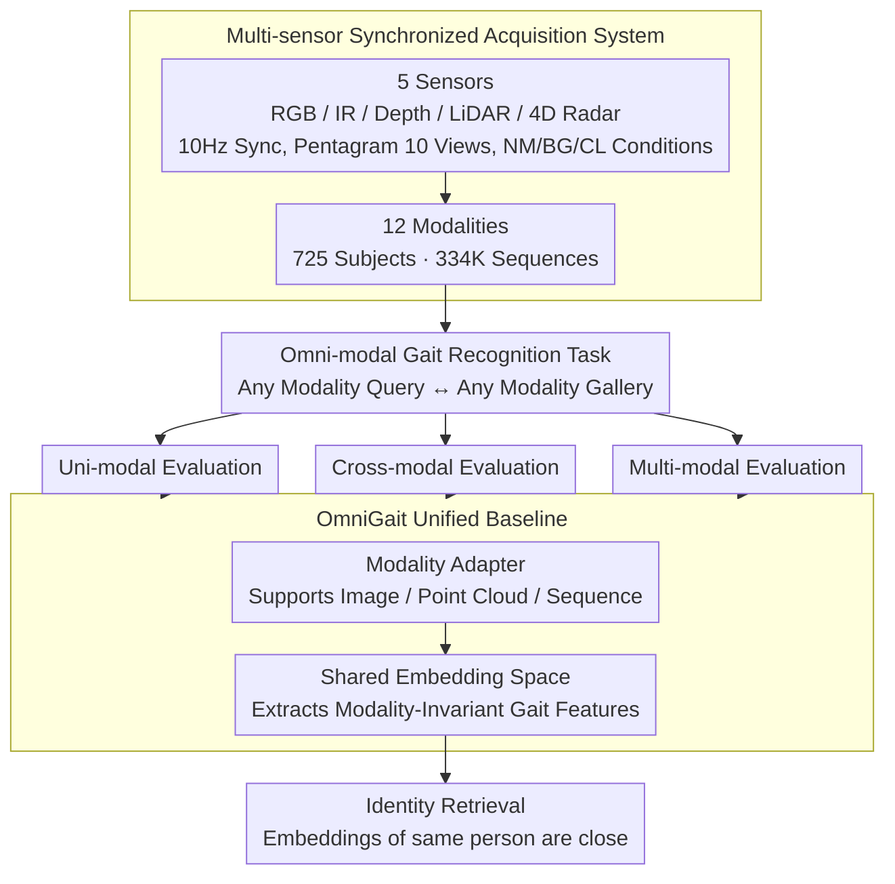

# MMGait: Towards Multi-Modal Gait Recognition

**Conference**: CVPR 2026  
**arXiv**: [2604.15979](https://arxiv.org/abs/2604.15979)  
**Code**: [https://github.com/BNU-IVC/MMGait](https://github.com/BNU-IVC/MMGait)  
**Area**: Human Understanding  
**Keywords**: Gait Recognition, Multi-modal Benchmark, Multi-sensor Fusion, Cross-modal Retrieval, Omni-modal Recognition

## TL;DR

MMGait constructs the most comprehensive multi-modal gait recognition benchmark dataset to date (5 sensors, 12 modalities, 725 subjects, 334K sequences) and proposes a new task of Omni-modal Gait Recognition along with a unified baseline model, OmniGait.

## Background & Motivation

**Background**: As a long-distance, non-contact biometric technology, gait recognition has achieved significant progress recently. Mainstream methods concentrate on RGB-derived modalities (silhouettes, pose sequences), performing well in indoor and outdoor scenarios.

**Limitations of Prior Work**: RGB-derived modalities lack 3D perception and suffer severe performance degradation under adverse conditions such as occlusions, rain, fog, and low light. Existing multi-modal datasets (e.g., LidarGait, FreeGait) only include RGB and LiDAR sensors, failing to support research on heterogeneous modality interaction and unified cross-sensor retrieval.

**Key Challenge**: Practical deployment environments are typically equipped with various sensors (RGB, infrared, depth, LiDAR, 4D radar), but the lack of a gait benchmark covering multiple sensors restricts research on unified multi-modal systems. Each modality has unique advantages and disadvantages—RGB is information-rich but light-sensitive, LiDAR is precise but sparse, infrared adapts to darkness but lacks texture, and 4D radar has strong penetration but limited resolution.

**Goal**: To construct a multi-modal gait benchmark covering 5 types of sensors, systematically study the characteristics of each modality, and propose a unified omni-modal recognition framework.

**Key Insight**: Evaluate the recognition capability, transferability, and complementarity of each modality comprehensively from three dimensions: uni-modal, cross-modal, and multi-modal.

**Core Idea**: Establish a large-scale multi-sensor gait dataset and propose the new task of Omni Multi-Modal Gait Recognition—using a single model to accept any modality input and retrieve targets within any modality.

## Method

### Overall Architecture

MMGait consists of three levels: (1) Dataset layer—synchronized acquisition from 5 sensors, processed into 12 modalities; (2) Benchmark evaluation layer—systematic assessment under uni-modal, cross-modal, and multi-modal paradigms; (3) OmniGait model—learning a cross-modal shared embedding space to unify the three recognition paradigms. These levels progress sequentially: first, a synchronized acquisition system aligns heterogeneous sensor data on the same timeline to produce aligned multi-modal datasets; then, modality characteristics are evaluated; finally, the omni-modal task definition and OmniGait baseline integrate the fragmented recognition paradigms into a unified model.

### Key Designs

**1. Multi-sensor Synchronized Acquisition System: Bringing 5 sensors' gait data to the same timeline**

Existing multi-modal gait datasets (LidarGait, FreeGait) have at most two sensors (RGB+LiDAR), making it impossible to study how heterogeneous modalities interact or achieve unified retrieval. MMGait fills the sensor spectrum: RGB cameras (1280×800), infrared cameras (940nm narrow-band, specifically avoiding LiDAR's wavelength to prevent interference), ToF depth cameras, 128-line LiDAR, and 4D FMCW radar. All five sensors are sampled at 10Hz synchronously. During collection, 725 subjects walked along a pentagram route, covering 10 viewpoints from 0° to 360°. Each subject performed under three conditions: normal (NM), carrying a bag (BG), and changing clothes (CL). Raw data were processed into 12 modalities. This configuration allows researchers to compare modalities from visible light to infrared, 2D to 3D, and low-cost to high-cost under strictly aligned conditions for the first time.

**2. Omni Multi-Modal Gait Recognition Task: One model for any modality input and retrieval**

In practical multi-sensor systems, different sensors may become available or fail under changing weather and lighting. Training a separate model for every "Query ↔ Gallery" modality pair would lead to a combinatorial explosion. This work redefines the objective: training a single model where the query can be any modality (RGB silhouette, LiDAR point cloud, IR image, etc.), and the gallery can also be any modality. As long as it is the same person, the embeddings should be close. This forces the model to learn modality-invariant gait representations rather than sensor-specific features, unifying uni-modal, cross-modal, and multi-modal evaluations.

**3. OmniGait Unified Baseline: Proving omni-modal feasibility with a shared embedding space**

To demonstrate the feasibility of the new task, OmniGait learns a shared embedding space across all heterogeneous modalities. The front end uses modality adapters to ingest various formats (images, point clouds, sequences) and extracts modality-invariant gait features. During training, all available modalities are mixed to share the same feature space. While the architecture is kept simple, experiments show that this unified model can approach or exceed the performance of models specifically trained for single modalities, proving the potential of omni-modal recognition.

### Loss & Training

A combination of triplet loss and cross-entropy loss is used, following the standard gait recognition training paradigm. The split consists of 200 subjects for training and 525 for testing. Gallery uses NM-01, while queries include NM-02, BG-01, and CL-01.

## Key Experimental Results

### Main Results (Uni-modal, GaitBase framework)

| Modality | NM R1 | BG R1 | CL R1 |
|------|-------|-------|-------|
| RGB Silhouette | 98.5 | 96.4 | 61.0 |
| RGB Image | 98.4 | 95.3 | 51.7 |
| IR Silhouette | 92.1 | 82.3 | 52.0 |
| Depth | 93.5 | 89.1 | 59.1 |
| LiDAR Point Cloud | 82.7 | 78.2 | 58.5 |
| 4D Radar Point Cloud | 23.6 | 14.4 | 15.2 |

### Ablation Study (OmniGait vs. Individual Models)

| Setting | Performance |
|------|------|
| Modality-specific models | Optimal for each modality |
| OmniGait unified model | Comparable or superior performance to specific models in most modalities |

### Key Findings

- **Infrared modality shows clear advantages in clothing-change conditions**: IR's inherent suppression of texture and color makes it perform well in changing-clothes scenarios.
- **Structural modalities like Depth and LiDAR are also robust to clothing**: 3D structural information is naturally unaffected by the color or texture of clothing.
- **4D radar performance is significantly lagging**: Sparser point clouds and lower resolution limit its gait representation capability.
- **The performance gap between RGB and IR silhouettes stems from segmenter domain shift**: Silhouette extractors trained on RGB suffer quality loss when directly applied to IR data.
- **OmniGait demonstrates the feasibility of omni-modal unification**: A single model achieves performance comparable to specialized models across multiple modalities.

## Highlights & Insights

- **Unmatched comprehensiveness of the dataset**: The combination of 5 sensors, 12 modalities, 10 viewpoints, and 3 conditions provides an unprecedented dimension for research.
- **Forward-looking omni-modal task definition**: The goal of a unified model handling any modality directly corresponds to practical deployment requirements.
- **Value of systematic analysis**: A comprehensive evaluation across 12 modalities reveals, for the first time, the specific strengths and weaknesses of each modality in gait tasks, such as IR's clothing robustness and 4D radar's limitations.

## Limitations & Future Work

- Data collection was conducted in controlled environments, which still differs from real outdoor scenes.
- While 725 subjects is large for multi-modal gait, it remains small compared to RGB-only datasets like GREW (26K subjects).
- OmniGait, as a baseline, has a simple design; more complex cross-modal alignment strategies might yield better performance.
- The potential of 4D radar is not fully realized, requiring specialized network designs.

## Related Work & Insights

- **vs SUSTech1K**: SUSTech1K only features RGB+LiDAR, whereas MMGait expands to 5 sensors and 12 modalities.
- **vs CASIA-B**: CASIA-B is a classic benchmark but only includes RGB and has a smaller scale (124 subjects); MMGait offers a qualitative leap in multi-modal dimensions.
- **vs FreeGait**: FreeGait is also RGB+LiDAR but only provides a single viewpoint, while MMGait provides full coverage with 10 viewpoints.

## Rating

- Novelty: ⭐⭐⭐⭐⭐ First 5-sensor 12-modality gait benchmark; pioneering omni-modal task definition.
- Experimental Thoroughness: ⭐⭐⭐⭐⭐ Systematic evaluation across uni-modal, cross-modal, and multi-modal dimensions with multi-method comparisons.
- Writing Quality: ⭐⭐⭐⭐ Detailed dataset description and clear evaluation logic.
- Value: ⭐⭐⭐⭐⭐ Provides a milestone benchmark resource for the multi-modal gait recognition field.

<!-- RELATED:START -->

## Related Papers

- [\[CVPR 2026\] Text-guided Feature Disentanglement for Cross-modal Gait Recognition](text-guided_feature_disentanglement_for_cross-modal_gait_recognition.md)
- [\[CVPR 2026\] MS^2Gait: A Multi-Scale Spatio-Temporal Fusion Network for LiDAR-based Gait Recognition](ms2gait_a_multi-scale_spatio-temporal_fusion_network_for_lidar-based_gait_recogn.md)
- [\[CVPR 2026\] EventGait: Towards Robust Gait Recognition with Event Streams](eventgait_towards_robust_gait_recognition_with_event_streams.md)
- [\[CVPR 2026\] HyperGait: Unleashing the Power of Parsing for Gait Recognition in the Wild via Hypergraph](hypergait_unleashing_the_power_of_parsing_for_gait_recognition_in_the_wild_via_h.md)
- [\[CVPR 2026\] Unlocking Motion from Large Vision Models with a Semantic and Kinematic Duality for Gait Recognition](unlocking_motion_from_large_vision_models_with_a_semantic_and_kinematic_duality_.md)

<!-- RELATED:END -->
