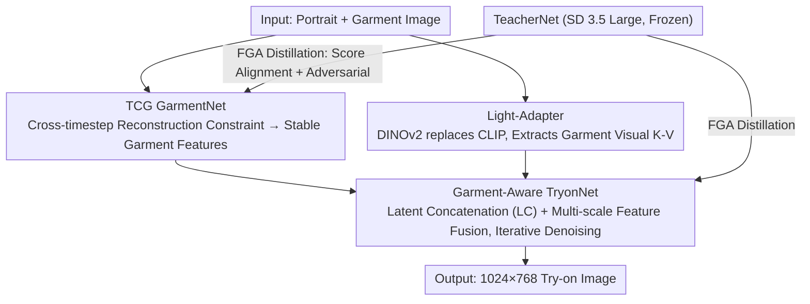

# Mobile-VTON: High-Fidelity On-Device Virtual Try-On

**Conference**: CVPR 2026  
**arXiv**: [2603.00947](https://arxiv.org/abs/2603.00947)  
**Code**: Available ([https://zhenchenwan.github.io/Mobile-VTON/](https://zhenchenwan.github.io/Mobile-VTON/))  
**Area**: Human Understanding  
**Keywords**: Virtual Try-On, Mobile Deployment, Knowledge Distillation, Diffusion Models, Privacy Protection  

## TL;DR
The first fully offline mobile-side diffusion-based virtual try-on framework, based on the TeacherNet-GarmentNet-TryonNet (TGT) architecture. Through Feature-Guided Adversarial Distillation (FGA), the capabilities of SD3.5 Large are transferred to a lightweight student network with 415M parameters. It matches or even exceeds server-side baselines on VITON-HD and DressCode at 1024×768 resolution, with an end-to-end inference time of approximately 80 seconds (Xiaomi 17 Pro Max).

## Background & Motivation
Virtual Try-On (VTON) technology is highly practical in the fashion e-commerce field. However, existing high-quality methods almost entirely rely on cloud-side GPUs: users must upload personal photos to servers for inference, which not only causes latency and energy issues but also poses significant privacy risks (especially under strict data protection regulations). Deploying diffusion-based VTON to mobile devices faces three major challenges: (1) massive parameter counts, memory usage, and latency that far exceed mobile NPU/GPU capabilities; (2) semantic drift of garment representations across diffusion timesteps, leading to texture distortion and detail loss; (3) heavy reliance of existing methods on large-scale pre-training (e.g., ImageNet or large-scale text-to-image), whereas lightweight architectures cannot directly learn sufficient generation capabilities from task-specific data.

## Core Problem
How to achieve high-fidelity virtual try-on on a standard smartphone using only a portrait and a garment image as input, without uploading user data? The Key Challenge is the core contradiction: the model must be small enough to run on-device, while its generation quality must rival server-side methods that possess 5-17 times more parameters.

## Method

### Overall Architecture

Mobile-VTON addresses whether a diffusion-based try-on model with over 2B parameters, originally designed for the cloud, can be compressed into a smartphone without quality degradation. The solution is a modular TGT architecture—a frozen TeacherNet (SD 3.5 Large) acting as the knowledge source, and two lightweight student networks, GarmentNet and TryonNet, responsible for "extracting consistent garment features" and "fusing the human body with the garment into a try-on image," respectively. With only a portrait and a garment image as input, GarmentNet first encodes the garment into features that are stable across timesteps, which are then fed into TryonNet for iterative denoising to generate 1024×768 try-on results. Garment visual semantics are injected via a Light-Adapter that replaces CLIP with DINOv2-base. The entire system is trained directly from task data without relying on external large-scale pre-training, relying instead on TeacherNet's FGA distillation to compensate for capacity.

### Key Designs

**1. FGA Distillation: Allowing a 415M Student to Catch Up with a 2B+ Teacher**

The greatest difficulty for lightweight students is insufficient capacity; training from scratch often fails to converge (removing distillation causes FID to jump from 10.2 to 113.6 in ablations, a total collapse). Feature-Guided Adversarial Distillation (FGA) transfers teacher capabilities using two complementary objectives: first, feature-level distillation aligns the score functions of the TeacherNet and student at each diffusion timestep, $\mathcal{L}_{feature} = \mathbb{E}_t[\|s_{true} - s_{fake}\|^2]$. This follows a DMD2-style score matching rather than pixel-wise regression, allowing the student to learn the teacher's distribution behavior rather than specific image pixels. Second, adversarial enhancement adds a lightweight discriminator $D$ to distinguish real images from TryonNet-generated images, using a standard GAN loss $\mathcal{L}_{GAN}$ to push realism and detail clarity. Distribution alignment ensures "resemblance," while adversarial loss ensures "clarity"; together, they allow the small model to approach teacher-level quality.

**2. TCG: Suppressing Garment Semantic Drift with Cross-Timestep Reconstruction Constraints**

Diffusion models' understanding of the same garment shifts across different timesteps, causing colors, textures, and logos to distort during denoising. The Trajectory-Consistent GarmentNet (TCG) approach is straightforward: at each timestep $t$, it requires GarmentNet to be able to reconstruct the original garment image, $\mathcal{L}_{cons} = \mathbb{E}_t[\|\hat{X}_g(t) - X_g\|^2]$. This temporal regularization pins garment features along the entire diffusion trajectory to maintain consistency. This simple yet effective structure reduced LPIPS from 0.119 to 0.111 in ablations, making logos and stripes noticeably clearer and color localization more accurate.

**3. Garment-Aware TryonNet: Learning Garment-Body Alignment Without Pre-training**

Without large-scale pre-training as a foundation, it is difficult for TryonNet to learn how garments should fit the body from scratch. This is compensated for by two methods: first, Latent Concatenation (LC) encodes the portrait and garment image together into the latent space after concatenating them along the height dimension, while also introducing "target portrait + garment" as additional reference condition inputs to provide the model with explicit geometric and appearance cues (LC further reduced LPIPS from 0.111 to 0.088 on top of TCG). Second, multi-scale feature fusion concatenates features from corresponding layers of GarmentNet into each self-attention layer of TryonNet, while cross-attention consumes both text and visual K-V from the Light-Adapter, injecting garment semantics at multiple levels.

**4. Light-Adapter: Swapping CLIP for DINOv2 for Efficiency**

Large CLIP visual encoders are too heavy for mobile devices. Light-Adapter replaces them with DINOv2-base, projecting garment image features into K and V tensors, which are injected into TryonNet via decoupled cross-attention. This represents a trade-off between efficiency and quality: DINOv2 provides sufficiently rich semantics while the encoder is lighter, fitting the computational budget of smartphones.

### Loss & Training
- GarmentNet Total Loss: $\mathcal{L}_{GarmentNet} = \lambda_1 \cdot \mathcal{L}_{featureG} + \lambda_2 \cdot \mathcal{L}_{cons}$
- TryonNet Total Loss: $\mathcal{L}_{TryonNet} = \mathcal{L}_{Diff} + \lambda_1 \cdot \mathcal{L}_{featureT} + \lambda_3 \cdot \mathcal{L}_{GAN}$ (where $\mathcal{L}_{Diff}$ is the garment-aware reconstruction loss)
- Hyperparameters: $\lambda_1=1e-2, \lambda_2=0.5, \lambda_3=5e-3$
- Two-stage Training: Stage 1 trains on a merged DressCode+VITON-HD set for 140 epochs (lr=1e-4); Stage 2 fine-tunes on DressCode for 100 epochs (lr=5e-5).
- Hardware: 8×A100 80GB, batch size=256, AdamW optimizer.

## Key Experimental Results

| Dataset | Metric | Ours (Mobile-VTON) | Prev. SOTA | Comparison Notes |
|--------|------|------|----------|------|
| VITON-HD | LPIPS↓ | 0.088 | 0.102 (IDM-VTON) | Surpasses best server-side (mask-based) |
| VITON-HD | SSIM↑ | 0.893 | 0.890 (SD-VITON) | Best |
| DressCode | LPIPS↓ | 0.053 | 0.0513 (BooW-VTON) | Near optimal |
| DressCode | SSIM↑ | 0.935 | 0.928 (BooW-VTON) | Best |
| VITON-HD In-Wild | LPIPS↓ | 0.133 | 0.137 (IDM-VTON) | Best |
| Memory Usage | GPU Memory | 2.84 GB | 5.80-18.47 GB | 51%-85% reduction |
| Deployment | Mobile | ✓ (Xiaomi 17 Pro Max, ~80s) | All ✗ | Only method runnable on mobile |

### Ablation Study
- **TCG Contribution**: Adding TCG reduced LPIPS from 0.119 to 0.111, increased SSIM from 0.874 to 0.879, and increased CLIP-I from 0.798 to 0.805. Visually, logos and stripes are clearer, and color localization is more accurate.
- **LC Contribution**: Adding LC on top of TCG further reduced LPIPS from 0.111 to 0.088, increased SSIM to 0.893, and increased CLIP-I to 0.833. LC provides explicit garment geometry and appearance cues, compensating for the lack of pre-training.
- **Criticality of Distillation**: Removing distillation caused FID to skyrocket from 10.2 to 113.6, resulting in total collapse—demonstrating that lightweight models cannot converge training from scratch without teacher guidance.
- **Impact of Dataset Quality**: Fine-tuning on DressCode outperformed VITON-HD (lightweight models are more sensitive to data quality; DressCode has more uniform resolution and clearer visuals).

## Highlights & Insights
- The technical peak is FGA distillation: the combination of score-based distillation + GAN allows a 415M parameter student network to achieve generation quality comparable to a 2B+ parameter teacher.
- The TCG design is extremely simple and efficient—just a cross-timestep reconstruction consistency constraint, yet it effectively solves the core problem of garment semantic drift in diffusion models.
- The entire system is trained directly from task data without relying on large-scale pre-training, providing a valuable reference for resource-constrained scenarios.
- The choice of DINOv2-base over CLIP for the visual encoder is noteworthy—it represents a superior efficiency-quality trade-off for mobile scenarios.
- The complete pipeline was executed on an actual smartphone with recorded inference times (80s), proving its practical feasibility.

## Limitations & Future Work
- The 80-second end-to-end inference time remains long for the user experience; techniques like step reduction, pruning, or system-level acceleration were not used.
- Inaccurate generation of garments with text (logos, brand names, slogans) due to a lack of text-aware pre-training and limited text-heavy samples in the training data.
- Only supports upper-body try-ons; not yet extended to full-body or categories like dresses.
- As a mask-free method, it must synthesize the entire image (including background and body), which naturally makes FID/KID comparisons less favorable compared to mask-based methods.
- INT8 quantization was performed on Android NPU, but specific precision loss data due to quantization was not reported.

## Related Work & Insights
- **vs IDM-VTON (18.47GB)**: IDM-VTON is the strongest server-side mask-based baseline, reaching 0.875 CLIP-I on VITON-HD. Mobile-VTON surpasses it in LPIPS and SSIM. While CLIP-I is lower (0.833 vs 0.875), it only requires 2.84GB memory and runs on-device—essentially a different class of method.
- **vs CatVTON**: Both are mask-free and use latent concatenation. Mobile-VTON comprehensively outperforms CatVTON in LPIPS/SSIM (0.088 vs 0.161, 0.893 vs 0.872), showing that the TGT architecture + FGA distillation combination is far superior to simple concatenation.
- **vs BooW-VTON**: BooW-VTON is the leading mask-free server baseline for FID/KID. Mobile-VTON surpasses its SSIM on DressCode (0.935 vs 0.928) and matches LPIPS closely (0.053 vs 0.051), but with 2.84GB vs 18.47GB memory usage.

## Related Papers
- FGA distillation strategies (score-based + adversarial) are transferable to other diffusion tasks requiring edge deployment.
- The TCG temporal consistency idea can be applied to video generation, 3D consistent generation, and other multi-view tasks.
- The finding that "data quality is more important for lightweight models than for large models" warrants verification in other distillation research.
- Related idea: `20260316_convnet_dit_hybrid_distill.md` (Diffusion model distillation).

## Rating
- Novelty: ⭐⭐⭐⭐ [TGT architecture and FGA distillation strategies are systematically innovative; first mobile diffusion VTON has high practical value]
- Experimental Thoroughness: ⭐⭐⭐⭐⭐ [Three datasets, multiple baselines, detailed ablations, real mobile deployment, and data quality analysis—very comprehensive]
- Writing Quality: ⭐⭐⭐⭐ [Clear structure, rich diagrams, and detailed method descriptions]
- Value: ⭐⭐⭐⭐ [Mobile deployment of diffusion models is a critical engineering direction; FGA distillation is highly versatile]

<!-- RELATED:START -->

## Related Papers

- [\[CVPR 2026\] RefTon: Reference Person Shot Assist Virtual Try-on](refton_reference_person_shot_assist_virtual_try-on.md)
- [\[CVPR 2025\] VTON 360: High-Fidelity Virtual Try-On from Any Viewing Direction](../../CVPR2025/human_understanding/vton_360_high-fidelity_virtual_try-on_from_any_viewing_direction.md)
- [\[CVPR 2026\] MOFA-VTON: More Fashion Possibilities with Fine-Grained Adaptations in Virtual Try-On](mofa-vton_more_fashion_possibilities_with_fine-grained_adaptations_in_virtual_tr.md)
- [\[CVPR 2026\] 4DSurf: High-Fidelity Dynamic Scene Surface Reconstruction](textit4dsurf_high-fidelity_dynamic_scene_surface_reconstruction.md)
- [\[CVPR 2026\] MV-Fashion: Towards Enabling Virtual Try-On and Size Estimation with Multi-View Paired Data](mv-fashion_towards_enabling_virtual_try-on_and_size_estimation_with_multi-view_p.md)

<!-- RELATED:END -->
