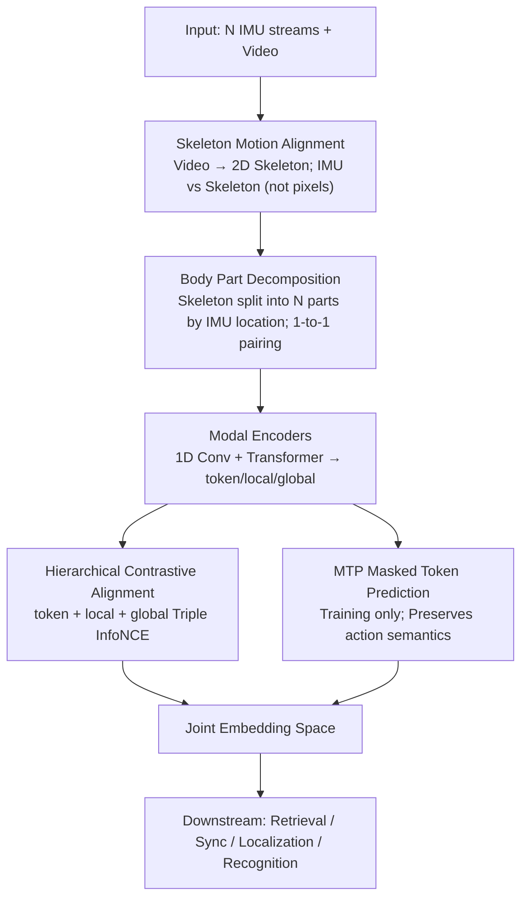

# MoBind: Motion Binding for Fine-Grained IMU-Video Pose Alignment

**Conference**: CVPR 2026  
**Paper**: [CVF Open Access](https://openaccess.thecvf.com/content/CVPR2026/html/Nguyen_MoBind_Motion_Binding_for_Fine-Grained_IMU_Video_Pose_Alignment_CVPR_2026_paper.html)  
**Code**: https://github.com/bbvisual/MoBind  
**Area**: Human Understanding / Multimodal Contrastive Learning / IMU-Video Alignment  
**Keywords**: IMU, Skeleton Motion, Hierarchical Contrastive Learning, Temporal Synchronization, Cross-modal Retrieval, Human Action Recognition

## TL;DR
MoBind utilizes hierarchical contrastive learning to align wearable IMU signals with 2D skeleton motion extracted from video. By aligning IMUs with "skeleton motion" instead of raw pixels to filter out irrelevant backgrounds, decomposing the body into parts for specific IMU pairing, and employing a three-level (token/local/global) contrastive strategy with a masked token prediction task, MoBind significantly outperforms strong baselines in cross-modal retrieval, sub-second temporal synchronization, person/part localization, and action recognition.

## Background & Motivation

**Background**: Understanding human motion is critical for action recognition, motion analysis, and rehabilitation monitoring. However, single modalities have inherent limitations: video provides rich semantics but is hindered by occlusions, viewpoints, and frame rates; IMUs offer dense and precise temporal data but lack visual context and are difficult to interpret. Aligning both into a joint representation enables calibration-free synchronization, cross-modal retrieval, and associating IMUs with the correct individuals. Prior IMU-visual works (IMU2CLIP, ImageBind, UniMTS, DeSPITE) mostly follow CLIP-style contrastive learning, compressing entire clips into single global vectors for pairing.

**Limitations of Prior Work**: The global single-vector design excels at coarse semantic differentiation (action categories) but **erases fine-grained temporal structures**. Segments differing only by a phase offset, short delay, or repetitive cycle boundary are compressed into similar codes. Consequently, these representations are insensitive to true temporal synchronization, failing to support calibration-free sync, sub-second cross-modal retrieval, or spatial localization.

**Key Challenge**: Directly adopting sub-second audio-visual alignment methods is ineffective because IMUs differ fundamentally from audio: ① Audio often relates to multiple visual instances and provides scene-level cues, whereas IMU is **local and strictly motion-centric**, making most visual backgrounds irrelevant. ② IMUs are often **multi-sensor** deployments on different body parts; naive concatenation loses spatial and temporal specificity. ③ Human motion is **highly continuous and repetitive** (e.g., gait cycles), generating numerous yet highly similar synchronization cues that lead to alignment ambiguity.

**Goal**: To learn a joint representation that preserves both coarse action semantics and explicit fine-grained (sub-second) temporal dynamics between IMU and video, supporting retrieval, synchronization, localization, and recognition tasks.

**Key Insight**: Instead of raw pixels, alignment is performed against **skeleton motion sequences** extracted from video (naturally filtering irrelevant backgrounds). The skeleton is decomposed into body parts matching IMU placement for one-to-one pairing, using hierarchical contrast to capture correspondences from tokens to the whole body.

**Core Idea**: A "four-piece" strategy—Skeleton Motion Alignment + Body Part Decomposition + Three-level Hierarchical Contrast + Masked Token Prediction—unifies fine-grained temporal synchronization and coarse action semantics into a joint embedding space.

## Method

### Overall Architecture
MoBind is an end-to-end framework: it extracts 2D skeleton sequences from video while processing raw IMU streams from $N$ Sensors. IMU and pose modules encode inputs into "per-sensor/per-part" local representations, which are then aggregated into global representations. Contrastive losses are applied simultaneously at the token, local, and global levels. A Masked Token Prediction (MTP) module is applied to the IMU stream during training to prevent the model from losing action semantics while focusing on fine-grained alignment. The learned representation supports cross-modal retrieval, temporal synchronization, person/part localization, and action recognition.

### Key Designs

**1. Skeleton Motion Alignment + Body Part Decomposition: Aligning IMU to Motion Semantics with Structured Pairing**

To address the issues of irrelevant visual backgrounds and loss of spatial specificity in multi-sensor setups, MoBind aligns IMUs with 2D skeleton motion sequences extracted via MMPose/RTMPose rather than raw pixels. Furthermore, based on known IMU placement, the skeleton is decomposed into $N$ part segments $X^{\text{part}}_n\in\mathbb{R}^ {F\times 2J_n}$, each paired with its corresponding IMU. Both streams (IMU, Pose) use a "1D Convolutional Block + Transformer Layer" encoder: sequences are split into $T$ non-overlapping temporal patches, projected into $T$ tokens, and average-pooled across the temporal dimension to obtain a local representation $Z\in\mathbb{R}^D$. Global representations $G\in\mathbb{R}^{D'}$ are obtained by concatenating the $N$ local vectors followed by a `LayerNorm → MLP` aggregation block.

**2. Hierarchical Contrastive Alignment: Three-level InfoNCE for Multi-granularity Correspondence**

To solve the loss of fine-grained temporal detail, MoBind employs contrastive learning at three levels: (i) **token-level**—matching cross-modal temporal tokens ($Z^{\text{imu}}_t$ vs $Z^{\text{part}}_t$) to promote sub-second correspondence; (ii) **local-level**—aligning each IMU sensor $n$ with its corresponding body part ($Z^{\text{imu}}_n$ vs $Z^{\text{part}}_n$); (iii) **global-level**—aligning aggregated IMU representations $G^{\text{imu}}$ with global skeleton representations $G^{\text{part}}$. Each level uses InfoNCE with cosine similarity $s(\cdot,\cdot)$ and a learnable temperature $\tau$, averaged across both directions (IMU↔Pose). For the global term:

$$L^{A\to B}_{\text{global}}=-\frac{1}{K}\sum_{i=1}^{K}\log\frac{\exp(s(G_{A,i},G_{B,i})/\tau)}{\sum_{j=1}^{K}\exp(s(G_{A,i},G_{B,j})/\tau)},$$

The final alignment loss is a weighted fusion: $L_{\text{align}}=\lambda_g L_{\text{global}}+\lambda_l L_{\text{local}}+\lambda_t L_{\text{token}}$.

**3. MTP Masked Token Prediction: Preserving Action Semantics**

Hierarchical contrast can bias the model toward fine-grained sync, potentially under-representing high-level semantics useful for action recognition. MTP is a training-only auxiliary task for the IMU stream: a subset of IMU token positions $\mathcal{M}$ (with ratio $\alpha=0.75$) is replaced by a learnable mask token $q_{\text{mask}}$. A lightweight Transformer $D_{\text{mtp}}$ predicts the masked tokens using context, with the loss defined as the mean squared error at masked positions:

$$L_{\text{mtp}}=\frac{1}{|\mathcal{M}|}\sum_{(n,t)\in\mathcal{M}}\big\|Z^{\text{pred}}_{n,t}-Z_{n,t}\big\|_2^2.$$

The total loss is $L=L_{\text{align}}+\lambda_{\text{mtp}}L_{\text{mtp}}$.

### Loss & Training
The model uses 5s windows with $T=25$ tokens. Local and global embedding dimensions are 256. Loss weights are $\lambda_g=1.0, \lambda_l=1.0, \lambda_t=0.5, \lambda_{\text{mtp}}=0.3$. 2D keypoints are estimated using RTMPose. The model is optimized using Adam ($LR=1\times10^{-4}$, batch size 1356), with early stopping based on validation R@1. Training takes approximately 2.5 hours on an RTX 5090.

## Key Experimental Results

### Main Results
Evaluated on mRi, TotalCapture, and EgoHumans (multi-person) datasets using estimated 2D keypoints. Cross-modal retrieval is measured by Recall@k ($k\in\{1,5,10\}$).

| Dataset | Direction | IMU2CLIP | DeSPITE | SyncNet | **MoBind** |
|--------|------|----------|---------|---------|------------|
| mRi | IMU→Video R@1 | 0.67 | 0.57 | 0.77 | **0.94** |
| mRi | Video→IMU R@1 | 0.38 | 0.32 | 0.75 | **0.92** |
| TotalCapture | IMU→Video R@1 | 0.06 | 0.03 | 0.51 | **0.87** |
| TotalCapture | Video→IMU R@1 | 0.07 | 0.03 | 0.54 | **0.68** |
| EgoHumans | IMU→Video R@1 | 0.29 | 0.54 | 0.74 | **0.83** |

Temporal synchronization (random offset $[-7,7]$s, top-5 retrieval; MAE in seconds, Acc with 200ms tolerance):

| Method | mRi MAE↓ | mRi Acc↑ | TotalCapture MAE↓ | TotalCapture Acc↑ | EgoHumans MAE↓ | EgoHumans Acc↑ |
|------|----------|----------|-------------------|-------------------|----------------|----------------|
| SyncWISE | 3.31 | 0.04 | 4.07 | 0.02 | 3.68 | 0.02 |
| IMU2CLIP | 1.17 | 0.70 | 2.32 | 0.13 | 3.13 | 0.44 |
| IMUSync | 0.72 | 0.75 | 0.96 | 0.71 | 1.01 | 0.82 |
| **MoBind** | **0.47** | **0.88** | **0.05** | **0.98** | **0.04** | **1.00** |

Person Localization (EgoHumans): MoBind achieved an Acc of 0.9812 and F1 of 0.9801, outperforming DeSPITE (0.9759), SyncNet (0.9749), and VIPL (0.9014).

### Ablation Study

| Configuration | mRi R@1 (I→V) | mRi R@1 (V→I) | Sync Acc | Localization |
|------|----------------|----------------|----------|------|
| global only | 0.34 | 0.31 | 0.81 | 0.22 |
| global + local | 0.77 | 0.78 | 0.86 | 0.75 |
| global + local + token | **0.94** | **0.92** | **0.88** | **0.81** |

| Configuration | mRi Finetune | mRi 1-NN | TotalCapture Finetune | TotalCapture 1-NN |
|------|--------------|----------|------------------------|---------------------|
| MoBind w/o MTP | 0.97 | 0.76 | 0.55 | 0.53 |
| MoBind | **0.98** | **0.86** | **0.72** | **0.71** |

### Key Findings
- **Hierarchical contrast is cumulative**: Using only global alignment results in an R@1 of 0.34; adding local alignment increases it to 0.77, and token-level alignment further raises it to 0.94.
- **MTP is crucial for semantics**: Removing MTP drops the TotalCapture action recognition 1-NN accuracy from 0.71 to 0.53 and Finetune from 0.72 to 0.55 (a nearly 20% drop), confirming its role as a semantic regularizer.
- **Why baselines fail**: In mRi R@1 errors, 75–79% of top-1 distractors belong to the same action class as the ground truth, indicating that global vectors lack instance-level specificity.
- **Robustness**: Sync accuracy reaches 100% with longer 3-minute clips. The model remains robust even when sensors are randomly dropped.

## Highlights & Insights
- "Skeletons over pixels": IMUs are local motion signals; bones naturally strip away irrelevant visual background, making alignment more effective than pixel-level contrast.
- Three-level contrast bridges the scale gap between "sub-second synchronization" and "action semantics" within a single embedding space.
- Structural body part decomposition enables both "who is wearing the IMU" (person localization) and "where is it worn" (part localization).
- MTP serves as a transferable "reconstruction as regularization" trick when contrastive learning becomes overly biased toward fine-grained sync.

## Limitations & Future Work
- Dependency on 2D skeleton quality (RTMPose); alignment may degrade under severe occlusion or extreme viewpoints.
- Requires known IMU placement for body part decomposition, limiting applicability in unknown or mismatched placement scenarios.
- Repetitive motions create many hard negatives; sync on very short fragments remains challenging.
- Localization accuracy in multi-person or high-motion scenes has room for improvement.

## Related Work & Insights
- **vs IMU2CLIP / DeSPITE**: These compress clips into global vectors for coarse HAR, lacking sub-second precision. MoBind's hierarchical contrast drastically reduces sync MAE (e.g., from 2.32s to 0.05s).
- **vs SyncNet / IMUSync**: Audio-visual sync cues differ from IMU-video; MoBind's specialized architecture achieves higher accuracy across datasets.
- **vs VIPL**: VIPL focuses on person-level association. MoBind unifies temporal sync and spatial (person+part) association, with person localization F1 (0.98) exceeding VIPL (0.89).

## Rating
- Novelty: ⭐⭐⭐⭐ first to address fine-grained alignment with hierarchical contrast and part decomposition.
- Experimental Thoroughness: ⭐⭐⭐⭐⭐ comprehensive coverage across three datasets and four downstream tasks.
- Writing Quality: ⭐⭐⭐⭐⭐ clear motivation and tight coupling between method and results.
- Value: ⭐⭐⭐⭐ useful for calibration-free sync and localization; source code available.

<!-- RELATED:START -->

## Related Papers

- [\[CVPR 2026\] MOFA-VTON: More Fashion Possibilities with Fine-Grained Adaptations in Virtual Try-On](mofa-vton_more_fashion_possibilities_with_fine-grained_adaptations_in_virtual_tr.md)
- [\[CVPR 2026\] MoLingo: Motion-Language Alignment for Text-to-Human Motion Generation](molingo_motion-language_alignment_for_text-to-motion_generation.md)
- [\[AAAI 2026\] CLIP-FTI: Fine-Grained Face Template Inversion via CLIP-Driven Attribute Conditioning](../../AAAI2026/human_understanding/clip-fti_fine-grained_face_template_inversion_via_clip-driven_attribute_conditio.md)
- [\[AAAI 2026\] Improving Sparse IMU-based Motion Capture with Motion Label Smoothing](../../AAAI2026/human_understanding/improving_sparse_imu-based_motion_capture_with_motion_label_smoothing.md)
- [\[CVPR 2026\] IMU-HOI: A Symbiotic Framework for Coherent Human-Object Interaction and Motion Capture via Contact-Conscious Inertial Fusion](imu-hoi_a_symbiotic_framework_for_coherent_human-object_interaction_and_motion_c.md)

<!-- RELATED:END -->
