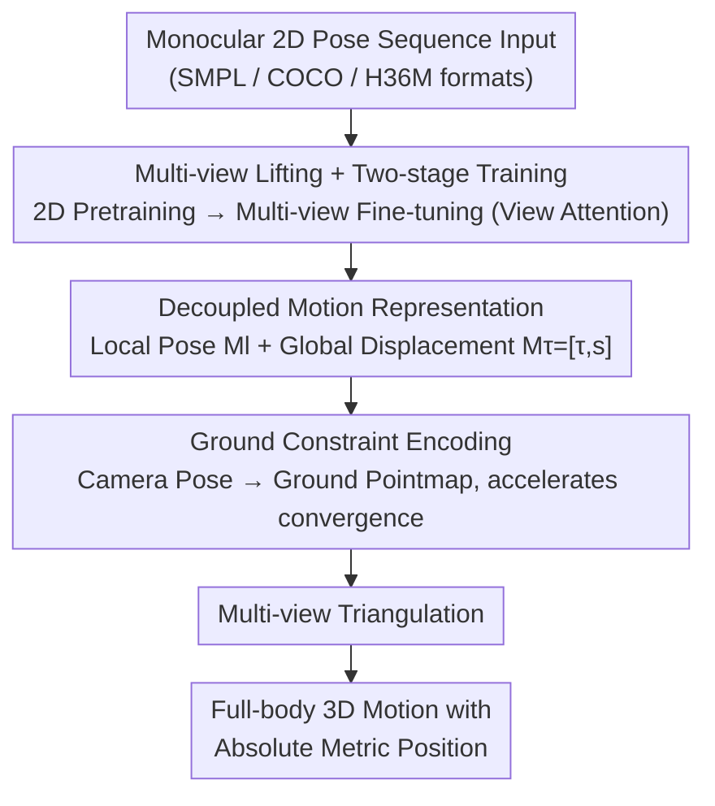

# Mocap-2-to-3: Multi-view Lifting for Monocular Motion Recovery with 2D Pretraining

**Conference**: CVPR 2026  
**Paper**: [CVF Open Access](https://openaccess.thecvf.com/content/CVPR2026/html/Wang_Mocap-2-to-3_Multi-view_Lifting_for_Monocular_Motion_Recovery_with_2D_Pretraining_CVPR_2026_paper.html)  
**Code**: https://wangzhumei.github.io/mocap-2-to-3/ (Project Page)  
**Area**: Human Understanding / Monocular Human Motion Recovery / Diffusion Models  
**Keywords**: Monocular Motion Capture, Multi-view Lifting, 2D Pretraining, Absolute Pose, Diffusion Models

## TL;DR
Mocap-2-to-3 reformulates "recovering 3D motion from monocular 2D poses" as a multi-view synthesis problem: a single-view motion diffusion model is first pretrained on massive 2D data, followed by multi-view fine-tuning on limited 3D data. Combined with decoupled local pose/global displacement representations and ground pointmap constraints, it recovers full-body motion with metric absolute positions from monocular input, outperforming SOTA methods in both camera-space and world-coordinates on RICH/AIST++.

## Background & Motivation

**Background**: To support downstream tasks interacting with the physical world (gaming, sports analysis, multi-person interaction, embodied AI), markerless motion capture must recover **absolute positions in world coordinates**. Monocular solutions are more practical than multi-camera systems due to reduced hardware requirements and constraints. Existing SOTA methods (WHAM, GVHMR, TRAM, etc.) rely heavily on precise 3D mocap data collected in controlled environments.

**Limitations of Prior Work**: (1) High-quality 3D data is expensive and requires professional equipment, limiting generalization to **out-of-distribution (OOD) scenes**; downstream tasks often require fine-tuning on domain-specific data. (2) Most monocular methods only recover **relative** global positions (aligned with the ground truth first frame), failing to deploy directly in scenarios requiring environmental awareness and spatial reasoning. (3) Estimating **metric scale** poses from monocular observations is inherently ill-posed—depth (Z-axis) cannot be directly inferred from 2D.

**Key Challenge**: 2D data is abundant (internet videos, estimated/annotated 2D skeletons) and motion-diverse but lacks 3D supervision; 3D data provides precise absolute positioning and consistent skeletal proportions but is scarce and controlled. How can we leverage both—using 2D diversity for generalization and 3D geometric constraints for precision?

**Goal**: Recover full-body 3D motion with absolute metric positions and fine-grained details from monocular 2D pose sequences, while achieving strong generalization to OOD motions.

**Key Insight**: Inspired by Motion-2-to-3, this work no longer performs "direct 3D regression" but **reformulates 3D motion as a multi-view synthesis process**—synthesizing 2D motions for other virtual views from monocular input, followed by triangulation into 3D. This enables training to be split into "2D pretraining + 3D multi-view fine-tuning," injecting 2D data diversity into the model.

**Core Idea**: Replace "direct 3D regression" with "multi-view lifting," utilizing decoupled motion representations and ground pointmap constraints to recover metric absolute poses from monocular input.

## Method

### Overall Architecture
Mocap-2-to-3 is a diffusion framework that lifts monocular 2D poses into globally consistent 3D motions. Training occurs in two stages: first, a **random single-view** 2D motion diffusion model $\mathcal{D}_{2D}$ is pretrained on large-scale 2D data to establish a motion prior; next, it is fine-tuned using multi-view 2D supervision projected from public 3D data. View Attention layers are inserted to enforce cross-view consistency, resulting in the multi-view diffusion model $\mathcal{D}_{mv}$. To recover absolute positions in world coordinates, the authors use a decoupled motion representation to learn local poses and global displacements separately. Ground plane equations calculated from camera poses are encoded as pointmaps and provided as conditional input to accelerate convergence. During inference, given a monocular 2D input, the model generates 2D motions for various virtual views, which are then triangulated to reconstruct 3D motion with absolute positions.

### Key Designs

**1. Multi-view Lifting + Two-stage Training: Bridging 3D Scarcity with 2D Diversity**

The pain point is that training only on limited 3D data leads to poor OOD generalization. The authors reformulate 3D motion as multi-view synthesis: Phase 1 trains a Transformer diffusion model $\mathcal{D}_{2D}$ that inputs random noise $\epsilon$ and outputs 2D motion sequences $M\in\mathbb{R}^{T\times J\times2}$ ($T$ frames, $J$ keypoints), learning to generate 2D motion from arbitrary camera views. This step establishes cross-view motion priors from real/public 2D videos and accelerates subsequent convergence. Phase 2 initializes the multi-view model $\mathcal{D}_{mv}$ with weights from $\mathcal{D}_{2D}$, using $V=4$ views (one primary camera $V_0$ for inference + three virtual cameras with poses sampled from pretrained distributions). 3D motions are projected to these views to provide geometrically consistent 2D supervision. Since image pairs are not required as input, existing 3D motions can be augmented via rotation/translation/viewpoint changes (pitch/yaw/roll/distance), generating large-scale virtual training data from few samples. $\mathcal{D}_{mv}$ enforces cross-view consistency via View Attention layers, taking the primary view 2D embedding $M_0$ and camera parameters $K,RT$ as input, synthesizing 2D motions for each virtual view for 3D triangulation. Diffusion architectures excel at modeling complex distributions compared to deterministic regression backbones.

**2. Decoupled Motion Representation: Preventing Position from Dominating Motion Details**

Directly predicting projected global coordinates from a given view fails because the impact of position on the loss far outweighs skeletal structure; the network prioritizes position cues at the expense of motion detail. The authors propose decoupling the optimization of **local pose** and **global displacement**. Local pose $M_l\in\mathbb{R}^{T\times(J-1)\times2}$ (excluding root position) is obtained by cropping the 2D pose within a bounding box, normalizing to $[-1,1]$, and centering the root joint. Global displacement $M_\tau=[\tau,s]\in\mathbb{R}^{T\times2\times2}$ consists of the root trajectory $\tau$ (pixel coordinates of the bounding box center) and motion scale $s$ (horizontal/vertical bounding box dimensions). The multi-view model predicts $M_v\in\mathbb{R}^{V\times T\times(J+1)\times2}$, containing root-centered local poses $M_v^l$ and global displacements $M_v^\tau$. The transformation from local to global coordinates is $\mathcal{M}_{v,\{1:J\}}^{g}=M_v^l\cdot s_v+\tau_v$, followed by concatenation with root coordinates $\mathcal{M}_v^g=[\tau_v,\mathcal{M}_{v,\{1:J\}}^{g}]$. Multi-view $\mathcal{M}_v^g$ is then reconstructed into absolute 3D poses via camera parameters and triangulation. This allowed motion and trajectory to be learned independently, ensuring both global consistency and detail preservation.

**3. Ground Constraint Encoding: Injecting Physical Geometry via Pointmaps**

Under monocular observation, depth is ambiguous. Learning 2D motion positions for other views from source view $V_0$ converges slowly even with camera embeddings. The authors introduce explicit geometric constraints by calculating the **ground plane** from known camera poses, represented as a pointmap $P\in\mathbb{R}^{W\times H\times3}$. Each image pixel $(u,v)$ is mapped to a 3D point $(x_w,y_w,z_w)$ in world coordinates, representing the intersection of the camera ray and the ground. Note that only the ground is mapped rather than the full environment, as pointmaps can be computed directly from $K, RT$ without additional sensors or scans. Pointmaps are encoded via ResNet-18 and integrated into $\mathcal{D}_{mv}$ through View Attention (for cross-view correlation) and Cross Attention layers (to guide movement $M_v$ generation). This provides the network with a natural 2D-to-3D cross-view correspondence, serving as a plug-and-play module that accelerates convergence for position learning.

### Loss & Training
2D pretraining utilizes two types of data: HumanML3D projected 2D joints (single random view per batch) + 2D data from the same source as the test set (e.g., RICH training set). Multi-view fine-tuning uses HumanML3D, BEDLAM, and Human3.6M. Inference involves $N$ denoising steps: at each step, $\mathcal{D}_{mv}$ takes $[\epsilon,M_0,K,RT,P]$ to predict $M_v^n$, which is transformed to $\mathcal{M}_v^{gn}$ via Eq.(1), triangulated into 3D absolute pose $W_{3d}^n$, and re-projected to each view to update $M_v^{ln}/M_v^{\tau n}$ for the next step, enforcing multi-view consistency. The final step yields $W_{3d}^0$ with global positions. SMPLify can be used as post-processing for SMPL parameter fitting.

## Key Experimental Results

Training used HumanML3D (including HumanAct12, AMASS), BEDLAM, and Human3.6M. Evaluation was conducted on RICH (outdoor) and AIST++ (indoor dance), featuring rare motions like sitting, lying down, and handstands to test generalization.

**Metrics**: Camera coordinates use root-aligned MPJPE and Procrustes-aligned PA-MPJPE for pose accuracy. World coordinates use W-MPJPE (first two frames aligned) and WA-MPJPE (full sequence aligned) for global trajectory. Since this work predicts absolute positions, **Abs-MPJPE** (no alignment) is also used. Additional metrics include root translation error $T_{root}$, motion smoothness Accel/Jitter, and foot sliding FS. Errors are in mm (lower is better).

### Main Results

SMPL keypoint Gains on RICH (using ground truth 2D keypoints for fair comparison):

| Method | PA-MPJPE↓ | MPJPE↓ | W-MPJPE↓ | WA-MPJPE↓ | Abs-MPJPE↓ | Accel↓ | FS↓ |
|------|-----------|--------|----------|-----------|-----------|--------|-----|
| SMPLify* | 83.8 | 155.3 | 284.4 | 165.7 | 406.2 | 28.6 | 57.9 |
| WHAM* | 40.1 | 74.4 | 182.5 | 106.1 | – | 4.9 | 3.5 |
| GVHMR* | 33.6 | 58.9 | 110.0 | 68.4 | – | 3.8 | 2.5 |
| TRAM*† | 36.3 | 67.1 | 169.3 | 107.9 | 533.8 | 4.3 | 27.6 |
| GVHMR+SMPLify*† | 30.7 | 58.7 | 109.4 | 68.6 | 430.4 | 3.7 | 5.6 |
| **Ours†** | **26.2** | **39.6** | **82.6** | **50.1** | **156.8** | **2.5** | 3.5 |

Compared to the current SOTA GVHMR+SMPLify, Ours reduces PA-MPJPE by 4.5mm (stronger motion details) and improves time-aligned global trajectories in world coordinates. Compared to other methods using calibrated camera poses (†), Abs-MPJPE leads significantly (156.8 vs 430.4) **without requiring scene scans like SA-HMR**. ⚠️ FS (foot sliding) at 3.5 is slightly higher than GVHMR's 2.5 because this work did not implement footprint optimization post-processing (listed as future work).

COCO keypoint Gains on AIST++ (using ViTPose detector input):

| Method | PA-MPJPE↓ | MPJPE↓ | Troot↓ |
|------|-----------|--------|--------|
| MotionBERT | 108.6 | 134.0 | 101.6 |
| WHAM* | 75.1 | 104.8 | 164.3 |
| GVHMR+SMPLify*† | 62.2 | 102.8 | 112.3 |
| MVLift | 79.2 | 110.7 | 67.6 |
| **Ours†** | **60.1** | **90.9** | **61.8** |

Ours outperforms both the 2D-only MVLift and GVHMR+SMPLify in both pose accuracy (PA-MPJPE) and global trajectory ($T_{root}$), demonstrating generalization to COCO skeletons and complex dance motions.

### Ablation Study (RICH)

| Config | PA-MPJPE↓ | MPJPE↓ | Abs-MPJPE↓ | W-MPJPE↓ | Epoch |
|------|-----------|--------|-----------|----------|-------|
| w/o decouple | 65.1 | 121.3 | 544.2 | 161.2 | – |
| w/o pointmaps | 45.8 | 85.6 | 373.9 | 121.8 | 3.5k |
| w/o pointmaps | 33.4 | 52.3 | 182.5 | 103.7 | 8k |
| w/ pointmaps | 30.5 | 45.3 | 157.9 | 88.6 | 3.5k |
| w/ 2D RICH | **26.2** | **39.6** | **156.8** | **82.6** | 3.5k |

### Key Findings
- **Decoupled representation is the foundation**: Removing decoupling (Row 1) spikes PA-MPJPE to 65.1 and Abs-MPJPE to 544.2, as position signals overwhelm motion detail learning.
- **Pointmaps primarily accelerate convergence**: At 3.5k epochs, including pointmaps (30.5) is far superior to excluding them (45.8); however, training without pointmaps to 8k epochs reaches a comparable level (33.4)—indicating pointmaps are not mandatory but **save over 50% training time**.
- **Domestic 2D data provides a significant boost**: Adding only 175 in-domain RICH 2D sequences during pretraining further improves PA/MPJPE from 30.5/45.3 to 26.2/39.6. Even without it, Ours exceeds GVHMR+SMPLify, confirming the validity of "2D data augmenting 3D estimation."

## Highlights & Insights
- Reformulating 3D regression as multi-view synthesis is a brilliant framework shift, allowing massive 2D data to feed 3D mocap training and bypassing the root cause of poor OOD generalization (3D data scarcity).
- Decoupling "local pose vs. global displacement" addresses loss imbalance: position scale drowning out skeletal details. This observation is universal for any task predicting both trajectories and poses.
- Ground pointmaps serve as plug-and-play geometric priors: they can be computed using only camera poses without scans or extra sensors, unifying "accelerated convergence" and "ease of deployment."
- Format Agnostic: The same framework can be retrained to improve any 2D skeleton format (SMPL/COCO/H36M), showing strong engineering versatility.

## Limitations & Future Work
- Dependency on 2D input quality: Inaccurate 2D skeletons estimated from raw video can degrade 3D reconstruction. The authors plan to introduce detection confidence to improve robustness.
- Foot sliding (FS) is slightly inferior to GVHMR's optimized post-processing; foot sliding constraints are planned.
- ⚠️ Main experiments often use ground truth 2D keypoints (SMPL) or ViTPose (COCO) for fair comparison; the end-to-end performance on raw video is less extensively detailed.
- Requires calibrated camera poses (†), limiting applicability in uncalibrated wild scenarios.

## Related Work & Insights
- **vs. GVHMR/WHAM (World-aligned HMR)**: They recover global trajectories from video but lack metric absolute positioning. Ours targets metric absolute positions, superior in both Abs-MPJPE and PA-MPJPE.
- **vs. SA-HMR (Environment-aware Absolute Pose)**: SA-HMR relies on pre-scanned scenes to resolve scale ambiguity. Ours uses only camera poses for ground pointmaps, making it easier to deploy with lower global positioning/body scale errors.
- **vs. MVLift (2D-only Training)**: MVLift proves 2D can recover global motion, but accuracy is limited by a lack of 3D supervision. Ours combines 2D pretraining with 3D multi-view fine-tuning for both accuracy and generalization.
- **vs. TRAM/MetricHMR (SLAM Camera Estimation)**: They use SLAM for absolute recovery, which is prone to bias and drift. Ours uses calibrated camera poses to reduce systematic deviation and ensure more reliable positioning.

## Rating
- Novelty: ⭐⭐⭐⭐⭐ The "transcription of 3D regression to multi-view synthesis + Decoupled Representation + Ground Pointmaps" trio forms a new paradigm for metric absolute pose recovery.
- Experimental Thoroughness: ⭐⭐⭐⭐ Dual datasets (RICH/AIST++), three coordinate systems (Camera/World/Absolute), dual formats (SMPL/COCO), and clear ablations. End-to-end raw video results could be more comprehensive.
- Writing Quality: ⭐⭐⭐⭐ Motivation is logically cumulative; representations and pointmaps are well-explained. Some inference/camera details are deferred to supplementary materials.
- Value: ⭐⭐⭐⭐⭐ Addresses real pain points in "metric absolute positioning + OOD generalization" and reduces 3D dependency via 2D data, highly useful for gaming/embodied interaction.

<!-- RELATED:START -->

## Related Papers

- [\[CVPR 2026\] MV-Fashion: Towards Enabling Virtual Try-On and Size Estimation with Multi-View Paired Data](mv-fashion_towards_enabling_virtual_try-on_and_size_estimation_with_multi-view_p.md)
- [\[CVPR 2026\] SyncMos: Scalable Motion Synchronisation for Multi-Agent Scene Interaction](syncmos_scalable_motion_synchronisation_for_multi-agent_scene_interaction.md)
- [\[CVPR 2026\] Beyond Single-View Sufficiency: CVBench for Cross-View Human Understanding](beyond_single-view_sufficiency_cvbench_for_cross-view_human_understanding.md)
- [\[CVPR 2025\] HumanMM: Global Human Motion Recovery from Multi-shot Videos](../../CVPR2025/human_understanding/humanmm_global_human_motion_recovery_from_multi-shot_videos.md)
- [\[CVPR 2026\] Differentially Private 2D Human Pose Estimation](differentially_private_2d_human_pose_estimation.md)

<!-- RELATED:END -->
