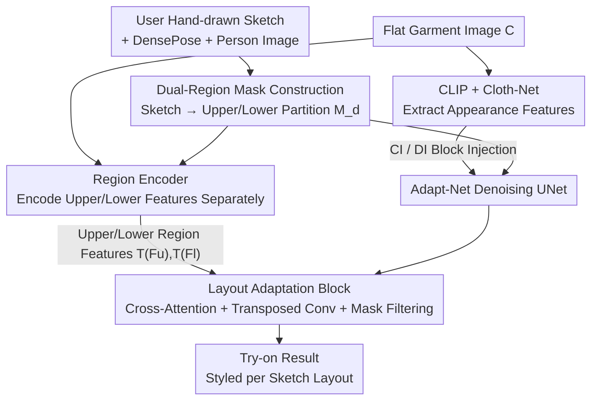

# MOFA-VTON: More Fashion Possibilities with Fine-Grained Adaptations in Virtual Try-On

**Conference**: CVPR2026  
**arXiv**: [2606.11148](https://arxiv.org/abs/2606.11148)  
**Code**: To be confirmed  
**Area**: Human Understanding / Virtual Try-On / Diffusion Models  
**Keywords**: Virtual Try-On, Controllable Generation, Dual-Region Mask, Layout Adjustment, User Sketch Interaction  

## TL;DR
MOFA-VTON enables users to control "how to style tops and bottoms" (e.g., tucked in, tucked out, or various hemline styles) using a single hand-drawn curve sketch. It converts the sketch into a "dual-region mask" for layout guidance and utilizes "Layout Adaptation blocks" to spatially align upper and lower body features at the feature level. It achieves SOTA image quality on VITON-HD and DressCode while unlocking styling diversities unattainable by traditional methods.

## Background & Motivation
**Background**: The goal of image-based virtual try-on is to transfer a flat garment image onto a specific human target. Early methods were based on GANs, divided into "garment warping + try-on synthesis" stages. Recently, the field has shifted toward diffusion models (StableVITON, IDM-VTON, CAT-DM, etc.), leveraging their powerful generative capabilities to achieve increasingly high image quality and garment fidelity.

**Limitations of Prior Work**: Almost all existing methods focus solely on "directly overlaying the target garment onto the body"—strictly replicating the wearing style from the original image. Consequently, the same garment is always presented with a fixed hemline position and fit, resulting in monotonous outputs that fail to reflect real-world styling diversity, such as "tucked in for a neat look" versus "left out for a casual look."

**Key Challenge**: The authors attribute the inability to achieve diversity to two factors: (1) Traditional **clothing-agnostic masks** erase the entire garment region of the person and keep everything else identical, forcing new garments to fit into the original layout and locking layout freedom from the source. (2) Models lack a mechanism to "dynamically adjust the spatial position of garment features," leaving no way to implement changes even if desired.

**Goal**: To allow users to finely and intuitively control the interaction layout between upper and lower garments with pixel-level precision while maintaining high image quality.

**Key Insight**: Existing attempts at diversity are either point-based (COTTON, Wear-Any-Way use sparse points, but the range of influence per point is blurry and freedom is limited) or text-based (PromptDresser, UP-VTON use natural language, which lacks pixel-level precision and may lead to semantic drift and mismatched appearances). The authors argue that a **hand-drawn curve** is a natural "boundary line" between the upper and lower body, which is more continuous than discrete points and more spatially accurate than text.

**Core Idea**: Convert user-drawn curves into a "dual-region mask" representing the upper and lower body respectively to replace traditional clothing-agnostic masks. Then, use a set of Layout Adaptation blocks to position the upper and lower garment features at the locations specified by the mask at the feature level. This chain of "sketch → dual-region layout guidance → spatial adjustment at the feature layer" transforms fixed layouts into controllable ones.

## Method

### Overall Architecture
The input consists of a person image $I$, a user hand-drawn curve sketch, a DensePose image $P$, and a flat garment image $C$. The output is the try-on result with the garment styled according to the sketch. The pipeline consists of two steps: first, converting the sketch into a **dual-region mask** $M_d$ for layout guidance, and second, using **mask-guided layout adjustment** during the diffusion denoising process to place garment features in the correct regions.

The generative backbone is a denoising UNet called **Adapt-Net**, which takes the concatenation of $\mathcal{E}(I)$ (noisy person latent), $\mathcal{E}(P)$ (DensePose), $\mathcal{E}(I_m)$ (masked person image), and $M_d$ to denoise $\mathcal{E}(I)$. To preserve the target garment's appearance, a CLIP image encoder, a pre-trained Cloth-Net, and a newly designed region encoder extract features at different levels. These are injected into the backbone via Coarse Injection blocks (CI block), Detail Injection blocks (DI block), and Layout Adaptation blocks (LA block). CLIP and Cloth-Net (via CI/DI blocks) handle "what the garment looks like," while the region encoder (via LA blocks) handles "where the garment is placed."

### Key Designs

**1. Dual-Region Mask Construction: Turning a Curve into Layout Guidance**

Traditional clothing-agnostic masks only erase the original garment area, leaving the lower body (pants/skirts) fully exposed, which forces the new garment to replicate the original layout. MOFA-VTON uses a sketch to generate a **dual-region mask** $M_d$. First, the standard agnostic mask is expanded downward to its lowest point to create an initial mask $M_i$ covering the interaction zone. Next, the DensePose $P$ provides a clean human silhouette; arms are removed to get a torso map $P'$. The user curve is truncated at its intersection with the torso, resampled, and smoothed (extending to torso boundaries if necessary). This refined curve is used to crop $P'$ to isolate the lower-body region, which is binarized to get the lower-body mask $M_l$. Finally, the regions are fused with different weights:

$$M_d = \beta M_i * (1 - M_l) + \gamma M_l,$$

where weights for upper/lower regions are $\beta=1$ and $\gamma=0.5$. $M_d$ is no longer a simple binary "hole" but a continuous layout map encoding "where is upper, where is lower, and where is the boundary," which is the prerequisite for region-based adjustment.

**2. Region Encoder: Encoding Separate Features and Spreading Influence**

Garment features from CLIP/Cloth-Net lack explicit layout attribution. The region encoder uses a symmetrical structure: the upper branch uses a stacked-convolution UpperNet to encode $\mathrm{Concat}(C, M_d)$, combined with the CLIP text embedding of a predefined upper-body prompt $p_u$, yielding $F_u = \mathrm{Concat}(E_u(\mathrm{Concat}(C, M_d), \phi(p_u)))$. The lower branch similarly uses a LowerNet to process $\mathrm{Concat}(B, M_d)$ (where $B$ is the lower-body content from parsing) to get $F_l$. A key innovation is adding a **transposed convolution** $\mathcal{T}$ before the output: its upsampling propagates region features outward, expanding the range of influence and encouraging the model to adaptively learn feature interactions at the boundaries, outputting $\mathcal{T}(F_u)$ and $\mathcal{T}(F_l)$.

**3. Layout Adaptation Block: Spatial Positioning via Cross-Attention**

This component applies the "layout guidance" to the generated features. The LA block contains dual cross-attention paths, using the feature map $F_s$ from the DI block in Adapt-Net as the query, and $\mathcal{T}(F_u), \mathcal{T}(F_l)$ as key/value pairs respectively:

$$Attn_u = \mathrm{softmax}\!\left(\frac{F_s W_q \cdot (\mathcal{T}(F_u) W_{ku})^T}{\sqrt{d_k}}\right) \cdot \mathcal{T}(F_u) W_{vu},$$

and similarly for the lower body $Attn_l$. The learned correspondences inject upper/lower region information into early backbone features. After attention, another transposed convolution $\mathcal{T}$ is applied for diffusion, followed by **mask filtering** using the dual-region mask to constrain propagated features to their respective regions. The fusion is defined as:

$$F'_s = F_s + \mathcal{T}(Attn_u) \cdot M + \mathcal{T}(Attn_l) \cdot M',$$

where $M' = \beta + \gamma - M$ is the mask with swapped weights. Since $\beta \neq \gamma$, the mask achieves smooth weight transitions at the boundaries, ensuring natural transitions and avoiding hard edges.

### Loss & Training
The framework follows the Stable Diffusion latent space paradigm: an autoencoder encodes the image into latent space $z_0 = \mathcal{E}(x)$, and the forward process adds noise $z_t = \sqrt{\alpha_t} z_{t-1} + \sqrt{1-\alpha_t}\,\epsilon$. The denoising network $\epsilon_\theta$ is trained using the LDM noise prediction loss: $\mathcal{L}_{\text{ldm}} = \mathbb{E}_{z_0, \epsilon, t}\big[\|\epsilon - \epsilon_\theta(z_t, c, t)\|_2^2\big]$. After replacing the agnostic mask with the dual-region mask, self-supervised training on paired data is still possible (by default, setting the curve to match the original image layout for evaluation).

## Key Experimental Results

### Main Results
On VITON-HD (13,679 pairs) compared against diffusion/GAN baselines, evaluated using SSIM/LPIPS/FID/KID for paired settings and FID/KID for unpaired settings:

| Dataset | Method | FID(P)↓ | KID(P)↓ | SSIM↑ | LPIPS↓ | FID(U)↓ | KID(U)↓ |
|--------|------|---------|---------|-------|--------|---------|---------|
| VITON-HD | StableVITON | 6.05 | 1.09 | 0.8867 | **0.0605** | 9.14 | 1.31 |
| VITON-HD | IDM-VTON | 6.45 | 1.46 | 0.8635 | 0.0700 | 9.37 | 1.58 |
| VITON-HD | GP-VTON | 6.41 | 1.04 | 0.8839 | 0.0669 | 9.34 | 1.23 |
| VITON-HD | **MOFA-VTON** | **5.97** | **0.92** | **0.8870** | 0.0632 | **8.61** | **1.17** |
| D.C. Upper | IDM-VTON | 7.36 | 1.09 | 0.9362 | 0.0291 | 11.73 | 1.68 |
| D.C. Upper | GP-VTON | 7.60 | 0.85 | 0.9434 | 0.0323 | 12.48 | 1.35 |
| D.C. Upper | **MOFA-VTON** | **6.41** | **0.72** | **0.9452** | 0.0316 | **9.17** | **1.06** |

MOFA-VTON achieves the best performance in most metrics, with LPIPS being slightly secondary. Notably, during evaluation, the curve was set to the "default layout" of the original image for a fair comparison, showing that controllability is an added benefit that does not sacrifice base quality.

### Ablation Study
Three variants removing the dual-region mask, LA block, and feature expansion/filtering (transposed conv + mask ops):

| Config | FID(P)↓ | KID(P)↓ | SSIM↑ | LPIPS↓ | FID(U)↓ | Note |
|------|---------|---------|-------|--------|---------|------|
| MOFA-VTON* (w/o Dual-Region Mask) | 7.79 | 1.59 | 0.8697 | 0.0826 | 11.10 | Reverts to agnostic mask; region encoder+LA block fail. |
| MOFA-VTON† (w/o LA Block) | 6.52 | 1.23 | 0.8717 | 0.0661 | 9.06 | Mask only spliced into input; adjustment fails in complex poses. |
| MOFA-VTON‡ (w/o T-Conv + Filtering) | 6.10 | 1.01 | 0.8818 | 0.0649 | 8.78 | Roughly fits curve, but hem details are coarse. |
| MOFA-VTON (Full) | **5.97** | **0.92** | **0.8870** | **0.0632** | **8.61** | — |

### Key Findings
- **Dual-region mask contributes the most**: Removing it caused the largest drop in FID (from 5.97 to 7.79) and total loss of diversity capability. It is the foundation for both quality and controllability.
- **LA block enables adjustments in complex poses**: Without it, simple cases might work, but complex ones (e.g., crossed arms) fail, proving the value of region correspondences learned via cross-attention.
- **T-Conv + Mask Filtering handles "fine-tuning"**: Without these, the fit is approximate but the hemline is messy. This covers the "last mile" from working to working well.
- A user study of 35 participants showed MOFA-VTON wins in most comparisons regarding fitness, usability, functionality, and fineness.

## Highlights & Insights
- **Curves as an interaction medium are the optimal choice**: Compared to points (blurry influence) and text (low precision, semantic drift), a curve is naturally continuous and spatially precise.
- **Dual-region mask unifies control and self-supervision**: By replacing the agnostic mask, it allows training on paired data without additional annotation costs.
- **Transposed convolution as a "feature diffuser"**: It is ingeniously used not for resolution recovery, but to spread region features toward boundaries for boundary learning.
- **The weight-swap trick ($M'=\beta+\gamma-M$)**: A simple arithmetic operation creates complementary weights for upper/lower bodies, ensuring smooth transitions and avoiding seam artifacts.

## Limitations & Future Work
- **Dependency on manual sketching**: While simpler than points, it still requires interaction. It lacks an automated "layout recommendation" capability for batch scenarios.
- **Limited to upper/lower boundaries**: The mask is essentially a binary split. Its performance on complex multi-layer interactions (e.g., coat + inner-wear + belt) remains unverified.
- **Evaluation Caveat**: Quantitative metrics were tested on "default layouts" for fairness; diversity is mainly supported by qualitative results. There is a lack of an objective metric for "control accuracy" (matching the hem to the sketch).
- **LPIPS still secondary**: The perceptual similarity is slightly lower than StableVITON, suggesting room for improvement in extremely fine texture fidelity.

## Related Work & Insights
- **vs. COTTON / Wear-Any-Way (Point-based)**: These use sparse points with blurry influence and limited freedom. MOFA-VTON uses continuous curves for pixel-level adjustment, which is more precise and requires less effort.
- **vs. PromptDresser / UP-VTON (Text-based)**: Text lacks spatial precision and suffers from appearance mismatches due to semantic drift. MOFA-VTON constrains layout directly via spatial sketches.
- **vs. StableVITON / IDM-VTON (High quality but fixed)**: These focus on fidelity but are essentially "overlay" methods. MOFA-VTON upgrades try-on from replication to customization without losing quality.

## Rating
- Novelty: ⭐⭐⭐⭐⭐ Using curves/dual-region masks for try-on diversity is a novel mechanism for an overlooked dimension.
- Experimental Thoroughness: ⭐⭐⭐⭐ Complete primary comparisons and user studies, though lacking quantitative control accuracy metrics.
- Writing Quality: ⭐⭐⭐⭐ Clear motivation, well-explained pipeline/formulas, and rich illustrations.
- Value: ⭐⭐⭐⭐ Directly enhances the utility and personalization of e-commerce virtual try-on.

<!-- RELATED:START -->

<!-- RELATED:END -->

## Related Papers

- [\[CVPR 2026\] Mobile-VTON: High-Fidelity On-Device Virtual Try-On](mobile_vton_ondevice_virtual_tryon.md)
- [\[CVPR 2026\] Reference-Free Image Quality Assessment for Virtual Try-On via Human Feedback](reference-free_image_quality_assessment_for_virtual_try-on_via_human_feedback.md)
- [\[CVPR 2026\] RefTon: Reference Person Shot Assist Virtual Try-on](refton_reference_person_shot_assist_virtual_try-on.md)
- [\[CVPR 2025\] VTON 360: High-Fidelity Virtual Try-On from Any Viewing Direction](../../CVPR2025/human_understanding/vton_360_high-fidelity_virtual_try-on_from_any_viewing_direction.md)
- [\[CVPR 2026\] MoBind: Motion Binding for Fine-Grained IMU-Video Pose Alignment](mobind_motion_binding_for_fine-grained_imu-video_pose_alignment.md)

<!-- RELATED:END -->
