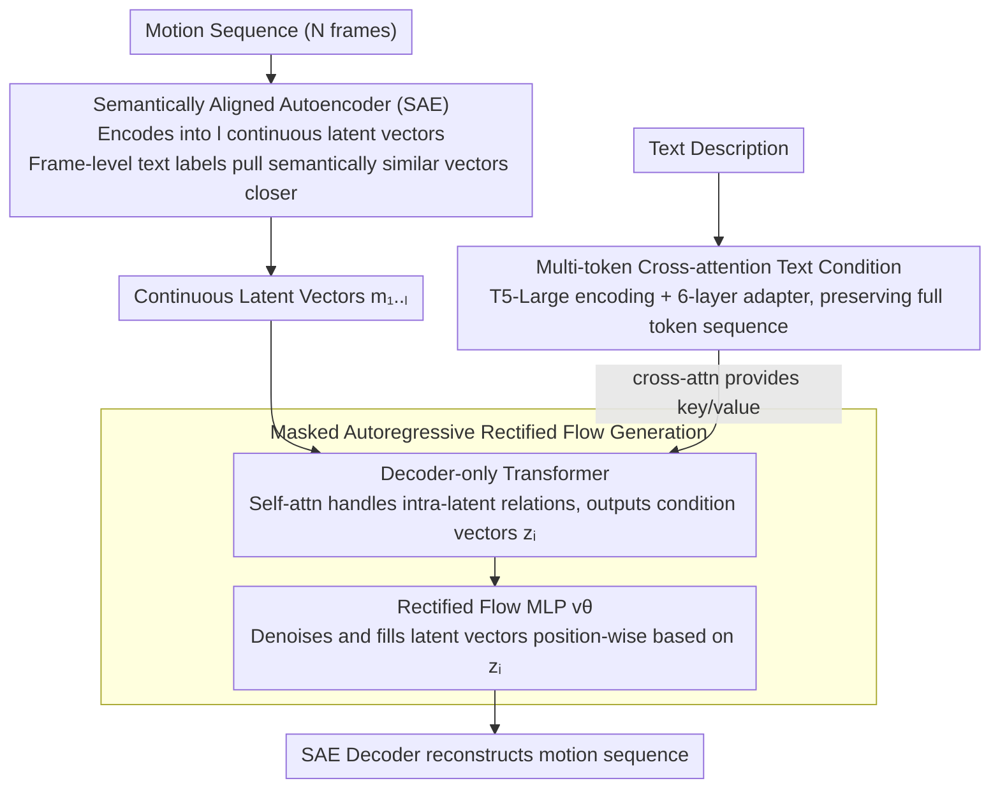

# MoLingo: Motion-Language Alignment for Text-to-Human Motion Generation

**Conference**: CVPR 2026  
**arXiv**: [2512.13840](https://arxiv.org/abs/2512.13840)  
**Code**: [https://hynann.github.io/molingo/MoLingo.html](https://hynann.github.io/molingo/MoLingo.html)  
**Area**: Human Understanding  
**Keywords**: Text-driven motion generation, semantically aligned latent space, cross-attention conditioning, autoregressive diffusion, continuous latent space

## TL;DR

MoLingo achieves overall SOTA performance in FID, R-Precision, and user studies for text-to-human motion generation. This is accomplished by performing masked autoregressive rectified flow on a continuous latent space, utilizing a Semantically Aligned Autoencoder (SAE) and multi-token cross-attention for text condition injection.

## Background & Motivation

**Background**: Text-driven human motion generation is a critical technology for computer animation, AR/VR, and human-computer interaction. Current mainstream methods are categorized into: (1) direct diffusion in pose space (e.g., MDM), and (2) diffusion in a latent space after encoding (e.g., MLD, MARDM). The latter is further divided into compressing the entire sequence into a single latent vector versus autoregressively generating multiple latent vectors.

**Limitations of Prior Work**: Direct diffusion in pose space struggles with complex joint distributions and tends to retain mocap noise, causing artifacts. Single-vector latent diffusion loses significant temporal detail. VQ-based methods map continuous motions to a finite codebook, introducing quantization errors that reduce the realism of fine-grained movements. Furthermore, existing text conditioning methods (single-token or AdaLN modulation) lack expressive power, limiting the precision of text-motion alignment.

**Key Challenge**: How to construct a "diffusion-friendly" latent space where semantically similar motions are also proximal in the latent space? How to more effectively inject text conditions so the generated motion remains faithful to the text description?

**Goal**: (1) What kind of latent space is most suitable for motion diffusion? (2) How can text conditions be injected most effectively?

**Key Insight**: Inspired by works like REPA in image generation, a semantically aligned motion encoder is trained using frame-level text labels to ensure semantically similar latent vectors are closer in space. Concurrently, multi-token cross-attention is found to be significantly superior to single-token conditioning.

**Core Idea**: Use frame-level text labels to align the semantic structure of the motion latent space. Combined with multi-token cross-attention conditioning, motion is generated via masked autoregressive rectified flow on this continuous latent space.

## Method

### Overall Architecture

MoLingo consists of two core components: (1) a Semantically Aligned motion Autoencoder (SAE) that encodes an $N$-frame motion sequence into $l = N/h$ continuous latent vectors $m_{1:l} \in \mathbb{R}^{l \times d}$; (2) a masked autoregressive Transformer + rectified flow MLP, conditioned on multi-token text encoded by T5, which progressively denoises latent vectors and decodes them back into motion sequences. Training is conducted in two stages: first the SAE, then the autoregressive generative model.

### Key Designs

**1. Semantically Aligned Autoencoder (SAE): Aligning Semantics in Latent Space**

Direct diffusion in pose space is hindered by complex joint distributions and mocap noise. While standard VAE latent spaces are continuous, they lack "semantic" encoding in their geometric structure—two motions with similar meanings might be distant in the latent space, forcing the diffusion model to learn complex mappings to align with text. SAE addresses this by adding a frame-level text semantic alignment constraint to the standard VAE reconstruction objective. It leverages frame-level labels from the BABEL dataset: for each motion latent vector $m_j$, the aligned text labels are encoded by a frozen text encoder, averaged, and projected to create a class token $\kappa_j$ as a semantic anchor. A soft cosine loss is then used to pull the latent vector towards its anchor:

$$\mathcal{L}_\text{sem} = \frac{1}{|\mathcal{I}|}\sum_{i \in \mathcal{I}}\left(1 - \frac{m_i \cdot \kappa_i}{\|m_i\| \|\kappa_i\|}\right)$$

Notably, many frames in BABEL have redundant labels (e.g., "walk" for several seconds). To prevent collapsing diversity by over-clustering these vectors, SAE calculates the cosine similarity $\Delta_i$ between adjacent class tokens. Samples where similarity exceeds a threshold $\tau$ are filtered out from the alignment set $\mathcal{I}$, applying constraints only to frames with distinct semantic transitions. Soft cosine loss is chosen over rigid contrastive losses like InfoNCE because human motion is inherently continuous and ambiguous; InfoNCE's rigid requirement to push non-identical samples apart proved harmful (as evidenced by InfoNCE's FID of 0.129 being significantly worse than the 0.066 achieved by cosine loss).

**2. Multi-token Cross-attention Text Conditioning: Avoiding Global Compression**

Many previous works (e.g., MARDM) inject text conditions via a single token through AdaLN modulation, which compresses structured descriptions like "a person squats then jumps left" into a single global vector, losing fine-grained motion-word correspondences. MoLingo instead uses T5-Large to encode text, followed by $l_\text{adapter}=6$ layers of Transformer encoder adapters for cross-modal enhancement, retaining the full multi-token sequence $\mathbf{w} = \{w_1, ..., w_{l_\text{text}}\}$. In the decoder-only Transformer, self-attention and MLP operations occur within the motion latent vectors, while cross-attention uses the motion vectors as queries and text tokens as keys/values. This allows each latent vector to "consult" relevant words in the text. This change yielded immediate gains: replacing AdaLN with multi-token cross-attention reduced FID from 0.077 to 0.049 and significantly improved R-Precision Top-1.

**3. Masked Autoregressive Rectified Flow Generation: Frame-wise Denoising on Continuous Latent Space**

With a semantically aligned continuous latent space established, a generation method was needed to preserve temporal detail without introducing quantization errors. MoLingo adopts an autoregressive approach for continuous latent vectors, decomposing the joint distribution via the chain rule:

$$p(m_1,...,m_l) = \prod_i p(m_i \mid c, m_1,...,m_{i-1})$$

During training, latent vectors are randomly masked. The decoder-only Transformer generates condition vectors $z_i$ for each position based on text conditions and known vectors. These are fed to an MLP $v_\theta$ using a rectified flow objective to approximate the reverse distribution:

$$\mathcal{L} = \mathbb{E}\big[\|v_\theta(m_i^t, t, z_i) - (\epsilon - m_i)\|^2\big]$$

At inference, the model starts from full masking and progressively denoises to fill all latent vectors, using CFG (scale=5.5) to amplify text guidance. Compared to standard diffusion, rectified flow straightens the path from noise to data, reducing sampling steps. Compared to VQ autoregression, the continuous space maintains fine-grained motion amplitudes.

### Loss & Training

The total SAE loss is $\mathcal{L}_\text{SAE} = \mathcal{L}_\text{recon} + \lambda_\text{sem}\mathcal{L}_\text{sem} + \lambda_\text{KL}\mathcal{L}_\text{KL}$, where $\mathcal{L}_\text{recon}$ includes feature reconstruction, joint positions, and joint velocities. SAE is trained for 5000 epochs with batch size 256. The autoregressive model is trained for approximately 800 epochs using EMA and 10% null prompt replacement for CFG. Training took approximately 10 hours on 4 H100 GPUs.

## Key Experimental Results

### Main Results

| Method | FID ↓ | R-Precision Top-1 ↑ | CLIP-Score ↑ | MModality ↑ |
|------|-------|---------------------|-------------|-------------|
| MDM | 0.518 | 0.440 | 0.578 | **3.604** |
| MLD | 0.431 | 0.461 | 0.610 | 3.506 |
| MoMask | 0.116 | 0.490 | 0.637 | 1.309 |
| ACMDM-XL | 0.058 | 0.522 | 0.652 | 2.077 |
| DisCoRD | 0.053 | 0.506 | 0.645 | 1.303 |
| MoLingo (VAE) | **0.049** | 0.528 | 0.672 | 1.414 |
| MoLingo (SAE) | 0.066 | **0.544** | **0.686** | 1.226 |

Under the MARDM-67 protocol, MoLingo (VAE) achieves the best FID, while MoLingo (SAE) achieves the best text-motion alignment (R-Precision and CLIP-Score).

### Ablation Study

| Conditioning | Text Encoder | Autoencoder | FID ↓ | R-Precision Top-1 ↑ |
|----------|-----------|---------|-------|---------------------|
| AdaLN | CLIP | AE | 0.114 | 0.500 |
| AdaLN | T5 | AE | 0.077 | 0.508 |
| CrossAttn | T5 | VAE | **0.049** | 0.528 |
| CrossAttn | T5 | AE | 0.051 | 0.533 |
| CrossAttn | T5 | SAE | 0.066 | **0.544** |

### Key Findings

- **CrossAttn vs AdaLN**: Multi-token cross-attention reduced FID from 0.077 to 0.049 and increased R-Precision Top-1 from 0.508 to 0.528-0.544, a substantial improvement.
- **SAE Alignment Effect**: SAE outperforms AE and VAE in R-Precision and CLIP-Score, though FID is slightly higher (0.066 vs 0.049), suggesting semantic alignment sacrifices minor distribution matching for stronger textual faithfulness.
- **Cosine vs InfoNCE**: InfoNCE's FID (0.129) was significantly worse than cosine loss (0.066), as rigid contrastive constraints are too stiff for continuous human motion.
- **User Study**: Users preferred MoLingo in 83.75% (vs. DisCoRD), 77.70% (vs. MoMask), and 84.70% (vs. MotionStreamer) of cases.
- 4× temporal downsampling with 16D latent space is the optimal configuration; increasing latent dimensions proved detrimental.

## Highlights & Insights

- **Semantic Alignment in Latent Space**: Guided by frame-level labels, this ensures semantically similar motions are geometrically close. This concept is transferable to other sequence generation tasks (e.g., audio, trajectory) with aligned labels.
- **Soft Cosine vs. Hard Contrastive**: For continuous, fuzzy signals like motion, soft constraints outperform hard ones—an insight applicable to representation learning for other continuous signals.
- **Superiority of Multi-token Cross-attention**: Single-token methods lose context, whereas multi-token preserves structured semantics. This validates insights from T2I (e.g., DALL-E 3) within the T2M domain.

## Limitations & Future Work

- Generates primary body motion only, lacking fine-grained hand movements, which is a major drawback for real-world applications.
- SAE relies on BABEL frame-level labels, which have limited coverage and high redundancy. Scaling to larger data may require automated labeling.
- A trade-off exists between FID and R-Precision (SAE excels in the latter but not the former). Future work could target simultaneous optimization.
- Controversy remains regarding evaluation metrics (inconsistent results across protocols), highlighting the need for a more robust framework.

## Related Work & Insights

- **vs MARDM**: MARDM uses CLIP single-token + AdaLN; MoLingo uses T5 multi-token + CrossAttn + SAE, with each component contributing to performance gains.
- **vs MotionStreamer**: MotionStreamer uses 272D representations to avoid IK artifacts. MoLingo outperforms it using both 263D and 272D representations.
- **vs VQ-based methods (MoMask, DisCoRD)**: VQ methods show better diversity (MModality), but continuous latent space methods possess a clear advantage in realism (FID) and text alignment.
- Inspired by REPA (Representation Alignment in image generation) to introduce semantic alignment to motion generation.

## Rating

- Novelty: ⭐⭐⭐⭐ Frame-level semantic alignment in SAE is the core innovation; multi-token conditioning is effectively transferred from other domains.
- Experimental Thoroughness: ⭐⭐⭐⭐⭐ Covers four evaluation protocols (MARDM-67, TMR-263, MS-272, User Study) and extensive ablations.
- Writing Quality: ⭐⭐⭐⭐ Clear, problem-driven approach that addresses its two core questions effectively.
- Value: ⭐⭐⭐⭐ SOTA results plus a transferable latent space design, providing tangible progress for the motion generation field.

<!-- RELATED:START -->

## Related Papers

- [\[CVPR 2026\] Multi-level Causal LLM-based Text-to-Motion Generation with Human Alignment (MoTiGA)](multi-level_causal_llm-based_text-to-motion_generation_with_human_alignment.md)
- [\[CVPR 2026\] LaMoGen: Language to Motion Generation Through LLM-Guided Symbolic Inference](lamogen_language_to_motion_generation_through_llm-guided_symbolic_inference.md)
- [\[CVPR 2026\] Next-Scale Autoregressive Models for Text-to-Motion Generation](next-scale_autoregressive_models_for_text-to-motion_generation.md)
- [\[CVPR 2026\] MotionMaster: Generalizable Text-Driven Motion Generation and Editing](motionmaster_generalizable_text-driven_motion_generation_and_editing.md)
- [\[CVPR 2026\] Unified Number-Free Text-to-Motion Generation Via Flow Matching](unified_number-free_text-to-motion_generation_via_flow_matching.md)

<!-- RELATED:END -->
