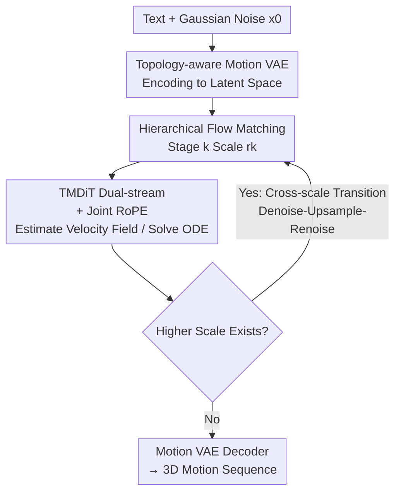

# MotionHiFlow: Text-to-Motion via Hierarchical Flow Matching

**Conference**: CVPR2026  
**arXiv**: [2604.23264](https://arxiv.org/abs/2604.23264)  
**Code**: https://github.com/ai-lh/MotionHiFlow  
**Area**: Human Motion Generation / Text-to-Motion / Flow Matching  
**Keywords**: text-to-motion, hierarchical flow matching, cross-scale transition, diffusion transformer, joint positional encoding  

## TL;DR
MotionHiFlow decomposes text-to-3D human motion generation into a multi-stage flow matching process that is "coarse-to-fine and low-to-high temporal scale." It links flows across scales using a noise-consistent cross-scale transition. Combined with a dual-stream Text-Motion Diffusion Transformer (TMDiT) and joint-aware Joint RoPE, it achieves SOTA results on HumanML3D and KIT-ML (FID 0.032 / 0.135).

## Background & Motivation
**Background**: Text-to-motion generation aims to produce 3D human pose sequences from natural language descriptions that are semantically aligned, physically plausible, and contain fine-grained limb movements. Recent diffusion, autoregressive, and masked generative methods have improved complexity and naturalness, but most model semantic alignment and motion details simultaneously on a **single temporal scale**.

**Limitations of Prior Work**: Handling everything on a single scale forces the model to struggle between "global trajectory structure" (requiring a coarse temporal perspective) and "fine-grained limb movements" (requiring a fine temporal perspective), making it difficult to achieve long-term coherence, naturalness, and precise text alignment simultaneously.

**Key Challenge**: In human cognition, complex motions are conceived **hierarchically**—starting with a high-level framework of key poses (coarse motion) followed by dynamic transitions and fine-grained limb movements (fine motion). Existing methods bypass this coarse-to-fine process; overemphasizing details may even interfere with semantic learning. The authors support this with an experiment: linearly downsampling motion to keep only 20% of frames (0.2×) leaves text-motion R-precision stable, suggesting coarse motion preserves most semantics. Models trained only on coarse scales sometimes show even stronger semantic alignment.

**Goal**: Design a coarse-to-fine hierarchical generation strategy that first generates coarse motion capturing high-level semantic structures at low temporal scales, then progressively adds fine-grained motion details at higher scales.

**Key Insight**: Use flow matching as the "noise-to-data" transport tool within each scale and relay these flows. The key difficulty lies in **cross-scale transition**, where simple upsampling of noisy data destroys noise consistency and degrades generation quality.

**Core Idea**: Replace the "single-scale-fits-all" approach with "multi-stage flow matching from low to high temporal scales + noise-consistent cross-scale transition" to generate motion from coarse to fine in latent space.

## Method

### Overall Architecture
MotionHiFlow operates in a latent space encoded by a topology-aware Motion VAE. Generation is split into $K$ stages. Each stage $k$ refines the motion representation at a temporal scale $r_k \in (0, 1]$ within a time interval $[t_{k-1}, t_k]$. Early stages (low scales) focus on high-level semantics and coarse structures, while subsequent stages (high scales) add details. Within each stage, a velocity field is learned via flow matching to transport "noisier start points" to "cleaner endpoints," estimated by a TMDiT (with Joint RoPE). Stages are connected by a **cross-scale transition** (denoising-upsampling-renoising) that links the clean results of the previous stage to the start of the next higher-scale stage while maintaining noise consistency. The pipeline forms a deterministic ODE trajectory from initial noise $\bm{x}_0$ to the data distribution, finally decoded by the VAE. Implementation uses $K=3$ with scales $r_k \in \{1/3, 2/3, 1\}$.

### Key Designs

**1. Hierarchical Flow Matching: Multi-stage Flow Relay**

To address the interference between semantics and details in single-scale models, generation is divided into $K$ progressive scales. In stage $k$, the endpoint state is defined as a linear interpolation of noise and clean data at that scale: $\bm{x}_{t_k}^{(k)} = (1-t_k)f(\bm{x}_0, r_k) + t_k f(\bm{x}_1, r_k)$, where $f(\bm{x}, r)$ is temporal resampling by factor $r$ ($r<1$ downsampling, $r>1$ upsampling). The starting state $\bm{x}_{t_{k-1}}^{(k)}$ is designed to incorporate information from the previous stage $f(\bm{x}_1, r_{k-1})$ and the initial noise $\bm{x}_0$ to maintain cross-stage noise consistency. Linking the flows $S_k$ defines the path from noise to data. The training objective is the hierarchical flow matching loss:

$$\mathcal{L}_{HFM}(\theta) = \mathbb{E}_{k,t}\left\|v_\theta(\bm{x}_t^{(k)}, t) - (\bm{x}_{t_k}^{(k)} - \bm{x}_{t_{k-1}}^{(k)})\right\|^2$$

This forces the network to approximate the velocity vector "endpoint minus startpoint" at each stage. This is effective because low-scale stages have fewer frames, forcing the model to learn the high-level semantic skeleton first, while high-scale stages add details onto the aligned skeleton, preventing detailed noise from overwhelming semantic signals.

**2. Cross-scale Transition: Denoising-Upsampling-Renoising for Noise Consistency**

Simply upsampling noisy data from low to high scales causes noise distribution misalignment (noise inconsistency), reducing quality. Ours designs a three-step transition: First, **denoise** by extrapolating the clean data of the current scale $\hat{\bm{x}}_1^{(k)} = [\hat{\bm{x}}_{t_k}^{(k)} - (1-t_k)\bm{x}_0^{(k)}]/t_k$. Second, **upsample** the clean data to the higher scale $r_{k+1}$ by factor $r_{k+1}/r_k$: $\hat{\bm{x}}_1'^{(k+1)} = f(\hat{\bm{x}}_1^{(k)}, r_{k+1}/r_k)$. Third, **renoise** by constructing the next stage's starting point using the higher scale's noise: $\hat{\bm{x}}_{t_k}^{(k+1)} = (1-t_k)\bm{x}_0^{(k+1)} + t_k\hat{\bm{x}}_1'^{(k+1)}$. Crucially, upsampling only occurs on clean data; noise is sampled independently per scale and then interpolated. This ensures the noise at each stage's start follows the distribution of that scale, maintaining a deterministic ODE trajectory without extra noise injection during inference.

**3. TMDiT and Topology-aware VAE: Semantic and Structural Clarity**

Traditional methods (e.g., standard Transformer + single sentence embedding $c_{\text{vec}}$) compress sentences into a single vector, losing fine-grained interaction. Inspired by MMDiT/Flux, TMDiT runs **two independent streams** for motion features $\bm{x}$ and **word-level** text features $\bm{c}$ (CLIP encoded). These streams have separate linear transforms and FFNs, exchanging info via self-attention. Time step $t$, sentence embedding $c_{\text{vec}}$, and scale $r_k$ are fused into a modulation embedding $\bm{y}$ to scale/shift/gate each block. Parameter sharing uses "independent parameters for early layers, shared parameters for the last $L_s$ layers" to extract modality-specific features before learning shared representations. The Motion VAE uses a Graph Convolutional Network (GCN) to explicitly model skeleton topology, downsampling the temporal dimension by 4 and graph-pooling spatially to $j=6$ latent joints (torso, pelvis, limbs). Together, they provide a latent space that understands both text details and joint structures, reducing MM-Dist from 3.043 to 2.691.

**4. Joint RoPE: Skeleton Topology and Symmetry in Positional Encoding**

Standard RoPE only encodes temporal positions and cannot represent spatial/topological relationships between joints. Joint RoPE splits each attention head's feature dimensions into four segments via ratios $[1/2, 1/8, 1/8, 1/4]$ for individual 1D RoPE: the first $1/2$ encodes temporal position (multiplied by scale $r_k$ to adapt to different stages); the next two $1/8$ segments (total $1/4$) encode 2D spatial coordinates relative to the pelvis in a reference T-pose; the final $1/4$ encodes joint depth in the kinematic tree. It also enforces **skeleton symmetry**: symmetric joint pairs (e.g., left hand vs. right hand) share the same relative rotation for the same temporal offset. This unifies spatio-temporal and topological information, injecting structural priors while being scalable to different joint counts.

### Loss & Training
Two-stage training. Stage 1: Train Motion VAE with standard VAE loss (reconstruction + KL) plus an auxiliary temporal robustness term: for a random batch subset, latent variables are downsampled by $r \in [0.3, 1]$, decoded, and compared to downsampled GT motion via MSE: $\mathcal{L}_{\text{aug}} = \|\text{Dec}(f(x,r)) - f(M,r)\|^2$ (weight 0.5). Stage 2: Freeze VAE, train TMDiT with hierarchical flow matching loss (Eq. 6), using a 10% probability of null token replacement for classifier-free guidance (CFG). Details: VAE 300k steps (batch 256), TMDiT 200k steps (batch 64), AdamW, initial LR $2\times10^{-4}$, MultiStepLR decay by 0.2 at 50%/75%. TMDiT has 9 blocks (3 independent, 6 shared), latent dim 384, 6 heads, FFN dim 1536.

## Key Experimental Results

### Main Results
Compared against SOTA on HumanML3D (14,616 motions, 44,970 pairs) and KIT-ML (3,911 motions), repeating experiments 20 times for 95% confidence intervals.

| Dataset | Metric | MotionHiFlow | Prev. SOTA | Note |
|--------|------|------|----------|------|
| HumanML3D | R@1 ↑ | 0.563 | 0.581 (SALAD) | 2nd, behind SALAD |
| HumanML3D | FID ↓ | **0.032** | 0.033 (MoGenTS) | Best |
| HumanML3D | MM-Dist ↓ | 2.691 | 2.649 (SALAD) | 2nd |
| KIT-ML | R@1 ↑ | **0.482** | 0.477 (SALAD) | Best |
| KIT-ML | FID ↓ | **0.135** | 0.143 (MoGenTS) | Best |
| KIT-ML | MM-Dist ↓ | **2.552** | 2.585 (SALAD) | Best |

Ours is nearly optimal across all metrics on KIT-ML. On HumanML3D, it ranks 1st in FID and follows SALAD closely in R-precision/MM-Dist. User studies show MotionHiFlow outperforms MoMask and MoGenTS in realism and text alignment, with a 47% win rate over GT in text alignment.

### Ablation Study

Scale count and configuration (HumanML3D, Table 2):

| Scales $\{r_k\}$ | FID ↓ | R@1 ↑ | MM-Dist ↓ | Note |
|------|---------|---------|-----------|------|
| [0.4] | 0.106 | 0.561 | 2.717 | Coarse only; good semantics, poor FID |
| [1] | 0.051 | 0.556 | 2.723 | Fine only single scale |
| [1/2, 1] | 0.038 | **0.565** | 2.702 | Two stages |
| **[1/3, 2/3, 1]** | **0.032** | 0.563 | **2.691** | Three stages (Default) |
| [1/4, 2/4, 3/4, 1] | 0.035 | 0.560 | 2.693 | Four stages; diminishing returns |

Key components (HumanML3D, Table 3):

| Configuration | FID ↓ | R@1 ↑ | MM-Dist ↓ | Note |
|------|---------|---------|-----------|------|
| Baseline | 0.074 | 0.511 | 3.043 | Std Transformer + AdaLN |
| + TMDiT | 0.045 | 0.557 | 2.738 | Word-level text + Dual-stream, big MM-Dist gain |
| + Topology-aware VAE| **0.032** | **0.563** | **2.691** | Full Model |

### Key Findings
- **Coarse scales are sufficient for semantic alignment**: The single [0.4] scale achieves R@1 0.561 and MM-Dist 2.717, validating that "coarse motion preserves most semantics"; however, FID is 0.106, indicating a need for hierarchical refinement.
- **Hierarchy is the primary driver for FID improvement**: FID drops from 0.051 (single scale [1]) to 0.032 (three scales). Three stages is the sweet spot; four stages slightly degrade FID (0.035), suggesting scale count has an optimal value.
- **TMDiT word-level dual streams contribute most to semantic alignment**: Adding TMDiT alone improves MM-Dist from 3.043 to 2.738 and R@1 from 0.511 to 0.557. The topology-aware VAE further lowers FID by adding fine-grained structural accuracy.

## Highlights & Insights
- **Evidence-based Motivation**: A simple experiment showing R-precision remains stable at 0.2× downsampling provides empirical proof that "semantics reside in coarse scales," justifying the hierarchical design rather than relying on intuition.
- **Smart Cross-scale Transition**: The "denoise-upsample-renoise" insight ensures upsampling acts on clean data while noise is sampled independently per scale. This unifies multi-resolution generation into a deterministic ODE without stage-wise noise injection, transferable to image/video flow matching.
- **Structural Priors in Joint RoPE**: Segmenting RoPE to encode time, T-pose spatial coordinates, and kinematic depth while enforcing symmetry is a lightweight way to inject skeleton topology into attention, ensuring scalability to different joint counts.

## Limitations & Future Work
- Validated mainly on HumanML3D/KIT-ML. Benefits for longer sequences, multi-person scenes, or complex object interactions remain to be tested.
- R-precision/MM-Dist on HumanML3D still slightly trails SALAD, suggesting a gap in pure semantic retrieval; the hierarchical advantage is mostly in FID (realism) and KIT-ML.
- Scale scheduling $\{r_k\}$ is a manual hyperparameter; four stages saw degradation, making adaptive selection of stage count and scales an open problem.
- VAE latent joints are fixed at 6 (torso/pelvis/limbs), potentially limiting expression for finer limbs like fingers. Finer graph pooling or variable topology could be explored.

## Related Work & Insights
- **vs. Single-scale Diffusion/Masking (MoMask, BAMM, MoGenTS)**: These model semantics and details simultaneously. Ours uses hierarchical flow matching to align semantics then add details, surpassing them in FID (0.032 vs. MoGenTS 0.033).
- **vs. SALAD**: SALAD has higher R-precision/MM-Dist on HumanML3D but much higher FID (0.076 vs ours 0.032) and is outperformed by ours on KIT-ML. Ours excels in realism and cross-dataset robustness.
- **vs. Naive Flow Matching for Motion (FlowMotion, etc.)**: Earlier works lacked motion-specific adaptations. Ours uses TMDiT + Joint RoPE and cross-scale transitions to customize flow matching for motion.
- **vs. Noisy Data Upsampling (PixelFlow, etc.)**: Such methods break noise consistency; our three-step transition fixes this by maintaining a deterministic ODE trajectory.

## Rating
- Novelty: ⭐⭐⭐⭐ Combines "coarse-to-fine hierarchy" with flow matching; noise-consistent transition and diagnostic-led motivation are creative.
- Experimental Thoroughness: ⭐⭐⭐⭐ Two standard benchmarks + scale/component ablations + user study with 20-run confidence intervals; scenarios are somewhat standard.
- Writing Quality: ⭐⭐⭐⭐ Clear logic from motivation to method; some cross-scale transition notation requires careful reading.
- Value: ⭐⭐⭐⭐ Sets new SOTA for FID and leads on KIT-ML; hierarchical flow matching is relevant for motion, image, and video domains. Open sourced.

<!-- RELATED:START -->

## Related Papers

- [\[CVPR 2026\] Unified Number-Free Text-to-Motion Generation Via Flow Matching](unified_number-free_text-to-motion_generation_via_flow_matching.md)
- [\[CVPR 2026\] Hierarchical Enhancement of Semantic Priors for Disentangled Text-Driven Motion Generation](hierarchical_enhancement_of_semantic_priors_for_disentangled_text-driven_motion_.md)
- [\[CVPR 2026\] FMPose3D: monocular 3D pose estimation via flow matching](fmpose3d_monocular_3d_pose_estimation_via_flow_matching.md)
- [\[CVPR 2026\] Pressure2Motion: Hierarchical Human Motion Reconstruction from Ground Pressure with Text Guidance](pressure2motion_hierarchical_human_motion_reconstruction_from_ground_pressure_wi.md)
- [\[CVPR 2026\] ParTY: Part-Guidance for Expressive Text-to-Motion Synthesis](party_part-guidance_for_expressive_text-to-motion_synthesis.md)

<!-- RELATED:END -->
