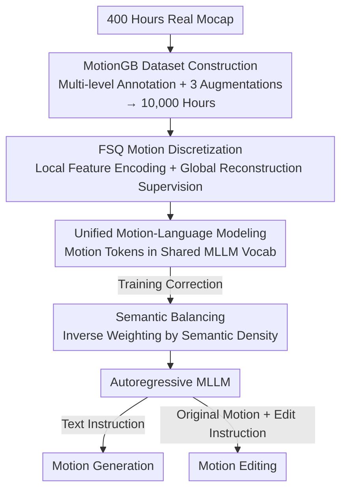

# MotionMaster: Generalizable Text-Driven Motion Generation and Editing

**Conference**: CVPR 2026  
**Paper**: [CVF Open Access](https://openaccess.thecvf.com/content/CVPR2026/html/Jiang_MotionMaster_Generalizable_Text-Driven_Motion_Generation_and_Editing_CVPR_2026_paper.html)  
**Area**: Human Understanding / Text-driven human motion generation and editing  
**Keywords**: Human motion generation, motion editing, MLLM fine-tuning, FSQ discretization, multi-motion composition

## TL;DR
MotionMaster treats human motion as a new modality integrated into the shared vocabulary of a pre-trained multimodal large language model (Qwen2.5-VL). It utilizes a 10,000-hour annotated motion dataset (MotionGB) and an FSQ discretizer that balances local joint precision with global trajectory consistency. By employing an end-to-end autoregressive model to perform both text-driven motion generation and editing simultaneously, it achieves 41.6% higher semantic consistency for multi-motion sequences and 20.8% higher body part composition compared to prior methods.

## Background & Motivation
**Background**: Text-driven human motion generation has evolved from early VAE/GAN models to diffusion models (MDM, MotionDiffuse, MLD) and the "motion as discrete tokens for autoregression" paradigm (T2M-GPT, MotionGPT). These methods perform well on "single sentence to simple motion" tasks.

**Limitations of Prior Work**: Existing methods often fail in real-world scenarios due to three overlapping issues: ① Thin data foundation: Mainstream datasets have coarse annotations and low semantic diversity, making it difficult for models to generalize to complex instructions requiring compositional understanding. ② Representation trade-off: Existing motion representations struggle to maintain both local joint precision and global trajectory consistency, a contradiction amplified during large-scale training. ③ Fragmented pipelines: Multi-motion generation and body part editing often rely on "post-hoc stitching" of separately generated segments rather than a unified end-to-end understanding of motion semantics.

**Key Challenge**: Most methods train motion models from scratch, discarding the motion semantics and long-range reasoning capabilities already encoded in pre-trained MLLMs. A composition like "kick a ball then do a cartwheel" involves verbs and logic that MLLMs inherently understand; training from scratch forces the model to relearn these from a limited dataset.

**Goal**: Develop a unified end-to-end framework that supports both text-to-motion generation and text-guided motion editing, with zero-shot generalization for complex or composite instructions unseen during training.

**Key Insight**: Since MLLMs already "understand" motion semantics, motion should be treated as a new modality to fine-tune a pre-trained MLLM, allowing linguistic priors to migrate directly to motion understanding.

**Core Idea**: A triplet of "fine-tuning pre-trained MLLM + large-scale motion data + local-global balanced discretizer" to place motion and language in the same embedding space for unified autoregressive generation and editing.

## Method

### Overall Architecture
MotionMaster follows a pipeline that compresses motion into discrete tokens and treats them as new "words" in the MLLM vocabulary. The input is either a text instruction (generation) or "original motion + editing instruction" (editing), and the output is a sequence of SMPL-X human motions. The framework consists of three parts: an FSQ discretizer that encodes motion into discrete tokens (using local features for codebook efficiency and global coordinate supervision to prevent drift), a vocabulary replacement strategy that substitutes the least useful text tokens in Qwen2.5-VL with motion tokens, and a semantic balancing strategy during training to correct the data skew (e.g., walking/standing being far more common than dancing). The 10,000-hour MotionGB dataset is derived from 400 hours of real mocap data through three types of structural augmentation.

### Key Designs

**1. MotionGB: Augmenting 400 Hours of Real Mocap into 10,000 Hours of Multi-level Annotated Data**

Data scarcity is a fatal pain point for motion generation, as high-quality mocap is expensive. MotionGB employs a "small real data + large-scale structural augmentation" approach. It starts with 400 hours of raw data from open-source mocap, video recovery (GVHMR), and proprietary recordings, manually filtering for artifacts. Two-stage labeling is applied: first, quantitative reports (joint angles, limb positions, velocities) are extracted per frame, then fed to Gemini to generate four semantic levels: high-level intent, overall motion, intermediate stages, and fine-grained details.

To scale the data, three augmentations are used, which also create "editing pairs": ① **Temporal Stitching**: Concatenating 2–3 motions with an in-betweening model to ensure natural transitions. ② **Body Part Stitching**: Merging different body part motions (e.g., "typing while jogging"), which naturally produces training pairs for part-based editing. ③ **Fine-grained Parameter Adjustment**: Applying 24 types of parametric modifications (joint transforms, rotation, speed) paired with precise descriptions (e.g., "raise the right arm higher"), creating instructions for the model to follow.

**2. FSQ Motion Discretization: Local Precision vs. Global Consistency**

MotionMaster solves the representation trade-off by decoupling encoding and supervision. The encoding side focuses on **local features**: a 85-dimensional vector per frame describes changes in the local coordinate system relative to frame $t$. Specifically, the frame-to-frame yaw difference $\Delta\theta_t = \theta_{t+1} - \theta_t$ and joint positions projected into the previous frame's coordinate system $p'_{t+1} = R_{-\theta_t}(p_{t+1} - p^{root}_t)$ are extracted, yielding $f_t = [\Delta\theta_t, \mathrm{flatten}(p'_{t+1})] \in \mathbb{R}^{85}$. This allows similar actions to share tokens regardless of their absolute position in world space, maximizing codebook utilization.

For discretization, Finite Scalar Quantization (FSQ) is used: $\hat z_{i,d} = \mathrm{round}(z_{i,d}\cdot L_d)/L_d$, with straight-through estimation for gradients. To prevent the integration of quantization errors from causing global trajectory drift, the supervision side focuses on **global coordinates**: reconstructing the sequence to world space and supervising global joint positions $L_{global} = \frac{1}{TJ}\sum_{t,j}\|p_{t,j} - \hat p_{t,j}\|_2^2$ and velocities $L_{vel}$.

**3. Unified Motion-Language Modeling + Dual-Modality Positional Encoding**

To truly integrate motion into the MLLM, MotionMaster replaces the least useful text tokens in the Qwen2.5-VL vocabulary with motion tokens, using `<SOM>` and `<EOM>` markers to bound sequences. During training, active text token embeddings are frozen to preserve linguistic knowledge, while new motion token embeddings and transformer weights are trained using causal autoregression $P(m_t \mid t_{prompt}, m_{<t})$.

A critical detail is the **dual-modality positional encoding**: RoPE uses two independent counters for text and motion. A global counter tracks text positions, but upon encountering `<SOM>`, a motion-specific counter starts from zero for that sequence. This prevents motion tokens from being shifted to high indices by long preceding text prompts, which would otherwise disrupt the internal relative positional relationships of the motion.

**4. Semantic Balancing: Inverse Weighting by Semantic Density**

To prevent the model from overfitting to common actions like "walking" or "standing," semantic balancing is applied. For each motion-text pair, a semantic embedding $e_i = \phi(t_i)$ is obtained via a T5 encoder. Local density is estimated using a Gaussian kernel $\rho_i = \frac{1}{k}\sum_{j\in N_k(i)}\exp(-\|e_i - e_j\|^2 / 2\sigma^2)$. The sampling probability is then set as $p_i \propto \rho_i^{-\alpha}$, ensuring that actions from sparse semantic regions are sampled more frequently.

### Loss & Training
The discretizer is trained with $L_{global}$ and $L_{vel}$. A two-stage coarse-to-fine IK solver recovers SMPL-X parameters from generated trajectories: first optimizing in the VPoser latent space to ensure biomechanical plausibility, then refining joint rotations to strictly regress target positions. The MLLM uses standard causal autoregressive loss. Generation and editing tasks are **jointly trained**, where editing tasks treat the original motion as additional context.

## Key Experimental Results

### Main Results
Evaluation was conducted on MotionGB-test-lite. Semantic alignment was measured by rendering motions into videos and scoring with Gemini (0–10), showing a 0.89 correlation with human judgment.

| Task | Metric | MotionMaster | Best Baseline | Gain |
|------|------|------|----------|------|
| Single Motion Gen | Semantic↑ | 9.88 | 7.20 (MMM) | +37% |
| Long Sequence (Multi) | Semantic↑ | 7.50 | 3.34 (MMM) | +124% |
| Motion Editing | Semantic↑ | 9.10 | 7.02 (MotionFix) | +30% |
| Motion Editing | R@1↑ | 0.77 | 0.27 (MotionFix) | Significant |

Standardized gains: OOD single motion generation +26.8%, multi-motion semantic consistency +41.6%, body part composition +20.8%. Diversity was lower than some baselines (1.62 vs. MotionMillion 3.10), which the authors attribute to the trade-off for higher semantic fidelity.

Discretizer quality comparison (Tab. 3, lower is better):

| Method | Local Pos (cm) | Global Rot (°) | Global Pos (cm) | Velocity (cm/s) |
|------|------|------|------|------|
| T2M-GPT | 11.92 | 11.89 | 16.92 | 20.1 |
| MoMask | 9.56 | 13.46 | 15.74 | 19.8 |
| **Ours** | **9.14** | **10.13** | **9.53** | **15.3** |

### Ablation Study

| Configuration | Single Motion Semantic | Editing R@1 | Note |
|------|---------|------|------|
| Full model | 9.88 | 0.77 | Base |
| 3B Model (small) | 8.78 | 0.75 | Capacity matters |
| 50% Data | 7.90 | 0.66 | Data volume critical |
| w/o Semantic Balancing | 8.58 | — | -1.3 in semantic score |

### Key Findings
- **Scale and Capacity**: Halving the data drops semantic scores significantly (9.88 to 7.90). Large MLLM capacity is vital for long-sequence reasoning.
- **Generation-Editing Synergy**: Joint training significantly outperforms single-task training (Gen: 7.40 → 9.88), suggesting that editing tasks force the model to learn localized semantic control.
- **Emergent Capabilities**: The model exhibits zero-shot style transfer and physical error correction, likely inherited from the MLLM's internal world knowledge.

## Highlights & Insights
- **"Motion inside the Vocab"**: Rather than an external branch, substituting useless tokens and freezing text embeddings allows motion to benefit from linguistic priors without degrading LLM knowledge.
- **Decoupled Discretization**: Entrusting codebook efficiency to local features and trajectory consistency to global supervision effectively solves a long-standing trade-off.
- **Dual RoPE Counters**: A subtle but essential engineering detail for handling interleaved multimodal sequences, ensuring relative positions are preserved within a modality.

## Limitations & Future Work
- **Local Rotation Error**: At 7.55°, the model is less precise with bone rotations around their own axes, which may affect fine-grained hand or foot orientations.
- **Diversity Trade-off**: The model's tendency to follow instructions strictly reduces the diversity of outputs compared to purely generative models.
- **Evaluation Bias**: Heavy reliance on Gemini as a "judge" introduces potential model bias and reproducibility risks.

## Related Work & Insights
- **vs. T2M-GPT / MotionGPT**: These models train from scratch using CLIP encoders. MotionMaster’s use of a pre-trained MLLM leads to a 41.6% lead in complex sequence composition.
- **vs. MoMask / MMM**: MotionMaster's discretizer achieves nearly half the global position error (9.53 vs 15.74) due to the local-global supervision strategy.

## Rating
- Novelty: ⭐⭐⭐⭐⭐ 
- Experimental Thoroughness: ⭐⭐⭐⭐ 
- Writing Quality: ⭐⭐⭐⭐ 
- Value: ⭐⭐⭐⭐⭐ 

<!-- RELATED:START -->

## Related Papers

- [\[CVPR 2026\] Hierarchical Enhancement of Semantic Priors for Disentangled Text-Driven Motion Generation](hierarchical_enhancement_of_semantic_priors_for_disentangled_text-driven_motion_.md)
- [\[CVPR 2026\] Text-Driven 3D Hand Motion Generation from Sign Language Data](text-driven_3d_hand_motion_generation_from_sign_language_data.md)
- [\[CVPR 2026\] MoLingo: Motion-Language Alignment for Text-to-Human Motion Generation](molingo_motion-language_alignment_for_text-to-motion_generation.md)
- [\[CVPR 2026\] Next-Scale Autoregressive Models for Text-to-Motion Generation](next-scale_autoregressive_models_for_text-to-motion_generation.md)
- [\[CVPR 2025\] SimMotionEdit: Text-Based Human Motion Editing with Motion Similarity Prediction](../../CVPR2025/human_understanding/simmotionedit_text-based_human_motion_editing_with_motion_similarity_prediction.md)

<!-- RELATED:END -->
