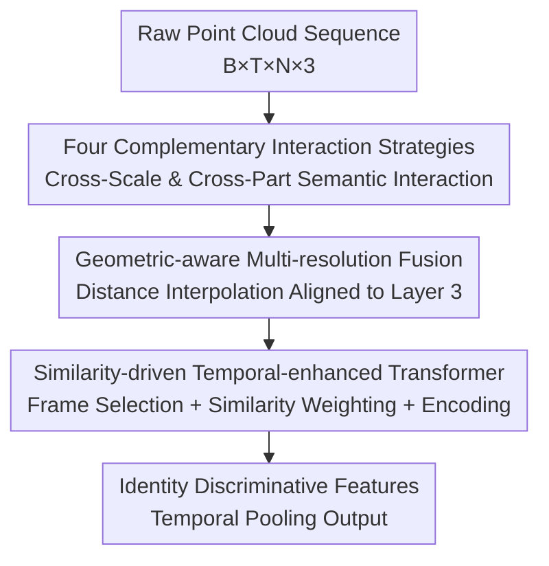

# MS^2Gait: A Multi-Scale Spatio-Temporal Fusion Network for LiDAR-based Gait Recognition

**Conference**: CVPR 2026  
**Paper**: [CVF Open Access](https://openaccess.thecvf.com/content/CVPR2026/html/Xu_MS2Gait_A_Multi-Scale_Spatio-Temporal_Fusion_Network_for_LiDAR-based_Gait_Recognition_CVPR_2026_paper.html)  
**Code**: None  
**Area**: Human Understanding / Biometrics (Gait Recognition)  
**Keywords**: Gait Recognition, LiDAR Point Clouds, Multi-Scale Spatio-Temporal Modeling, Cross-Part Semantic Interaction, Key Frame Selection

## TL;DR
MS²Gait directly performs gait recognition on raw LiDAR point clouds. Leveraging "four complementary interaction strategies," it enables spatially distant yet semantically related body parts (e.g., contralateral arm and leg) to communicate. It then employs a "similarity-driven temporal-enhanced Transformer" to adaptively weight frames based on motion consistency, achieving 93.5% and 83.1% Rank-1 accuracy on SUSTech1K and FreeGait, respectively, setting a new SOTA for raw point cloud-based gait recognition.

## Background & Motivation
**Background**: Gait recognition is regarded as a promising biometric modality because it does not require user cooperation, can operate at long distances, and is difficult to disguise. Traditional methods rely on 2D RGB videos to extract silhouette or skeleton sequences. In contrast, LiDAR point cloud-based methods have recently emerged due to their robustness to illumination variations, preservation of 3D geometric structures, and inherent privacy-preserving nature (textureless).

**Limitations of Prior Work**: 2D-based methods are extremely sensitive to illumination, occlusion, and viewpoints—the paper notes that recognition accuracy drops by more than 60% under poor illumination, and occlusion fragments the silhouettes. Moving to point clouds, existing methods have exposed two major shortcomings: (1) **Inadequate spatial multi-scale modeling**: Leading approaches either extract single-scale features or perform hierarchical sampling where features of different scales are extracted in isolation. Consequently, they fail to model the correlation between "spatially distant yet biomechanically related" parts (e.g., coordinated swinging of arms and legs during walking), causing performance to落 under non-gait distractors such as carrying backpacks, wearing loose clothing, holding umbrellas, or carrying objects. (2) **Oversimplified temporal modeling**: Most raw point cloud methods rely purely on max or average pooling to compress sequences into static representations, discarding gait periodicity and fine-grained dynamics. Moreover, they lack designs to handle "temporal heterogeneity." Differences in walking pace and sampling rates cause fixed-length sequences to cover vastly different gait cycles, leading to redundancies in densely sampled sequences and insufficient coverage in sparsely sampled ones.

**Key Challenge**: The unordered, sparse, and non-Euclidean nature of point clouds renders the "part partition + multi-branch aggregation" paradigm designed for 2D regular grids ineffective. Conversely, biomechanical cues crucial for identity discrimination (trunk-limb coordination) inherently require modeling semantic correlations between spatially distant parts, which is precisely what existing isolated extraction paradigms fail to achieve.

**Goal**: This is decomposed into two sub-problems: spatially, how to facilitate the flow of semantic features across different scales and body parts; and temporally, how to adaptively emphasize consistent motion and suppress noisy frames without explicit supervision (i.e., without requiring gait phase annotations).

**Core Idea**: On the spatial side, "target-candidate" pairs replace rigid "anchor-neighborhood" pairs, establishing a feature propagation chain from foot to hip via four complementary interaction strategies. On the temporal side, a "diversity-driven key frame selection + multi-scale cosine similarity aggregation" scheme is proposed to dynamically weight frames based on motion consistency, which is then fed into a Transformer to encode long-range periodicity.

## Method

### Overall Architecture
MS²Gait receives a raw point cloud sequence $P_o \in \mathbb{R}^{B \times T \times N \times 3}$ ($B$ batch, $T$ frames, $N$ points per frame, with 3D $xyz$ coordinates per point) and outputs a feature representation for identity discrimination. The entire pipeline consists of three sequential modules: first, the **Hierarchical Spatial Feature Extractor (HSFE)** extracts multi-scale spatial features through four SGM-Blocks with complementary interaction strategies, facilitating information exchange between spatially distant yet semantically related regions; second, the **Geometric-aware Multi-resolution Feature Fusion (GMFF)** aligns features with four different spatial densities to a unified point distribution, merging them into a multi-scale spatial representation; finally, the **Similarity-driven Temporal-enhanced Transformer (STET)** performs key frame selection, multi-scale similarity aggregation, and Transformer encoding to obtain the final temporally robust feature. The entire pipeline can be formulated as:

$$F_{\text{final}} = \mathcal{T}\!\left(\mathcal{G}\!\left(\left[\mathcal{H}_i(P_o)\right]_{i=1}^{4}\right)\right)$$

where $\mathcal{H}_i$ represents the spatial extractor of the $i$-th layer, $\mathcal{G}$ is the fusion module, and $\mathcal{T}$ is the temporal module. The network inherits an improved PointNet++ baseline, where the four SGM-Blocks take input channels associated with $(3, 4C, 8C, 16C)$ and yield output channels of $(4C, 8C, 16C, 256)$, hierarchically clustering human point clouds with progressively decreasing numbers of sampled points.

### Key Designs

**1. Four Complementary Interaction Strategies: Enabling Distant Body Parts to Communicate**

To address the limitation of isolated feature extraction across scales and the failure to model long-range part correlations, the authors first replace the "MLP + MaxPooling" local aggregation in traditional SGM (Sampling-Grouping-Mixing) with "MLP + Softmax weighting." The traditional formulation $f_i' = \text{maxpool}(g(p_j - p_i, f_j))$ suffers from two drawbacks: MaxPooling discards the semantic distribution, and isolated neighborhoods block physical connections between distant yet correlated parts. In the improved formulation, for each target point $i$ and candidate point $j$, the score is computed as $s_j = g_2([g_1(f_i - f_j);\, \delta(p_i - p_j)])$ (explicitly modeling semantic contrast via relative features $f_i - f_j$ and capturing geometric relations using $\delta(\cdot)$), and then weighted as $f_i' = \sum_{j \in \mathcal{M}_i} \text{softmax}(s_j)\cdot g_3(f_j)$. This generalizes aggregation from rigid "anchor-neighborhood" pairs to flexible "target-candidate" pairs.

Based on this, four complementary strategies are proposed at two levels: **Set-level (first two)**—(1) **Intra-Set Mixing** allows target points to aggregate information from candidates within their own spatial neighborhood, capturing fine-grained local structures; (2) **Inter-Set Mixing** performs backward propagation, letting a target point receive messages from all anchor points that cover it in their neighborhoods. This injects complementary cues via expanded receptive fields under occlusion/self-occlusion to recover features of blocked regions. **Layer-level (latter two)**—(3) **Intra-Layer Mixing** selects candidates based on feature similarity rather than spatial proximity. Since biomechanically related parts (e.g., contralateral limbs) are spatially separated, this step captures symmetrical and coordinated gait patterns; (4) **Inter-Layer Mixing** allows target points in the $l$-th layer to select from candidates in $l\pm1$ layers whose neighborhoods overlap with theirs, modeling "local motion constrained by larger structures" (e.g., movement of feet depending on shins and torso), and enabling cross-scale biomechanical dependency propagation. Together, these four form a propagation chain: features flow gradually from local (foot) to global (hip), connecting fragmented body parts into a consolidated informational exchange for the lower body. Ablations reveal that Inter-Set Mixing offers the most substantial gain, as its backward propagation specifically improves representation under occlusion.

**2. GMFF (Geometric-aware Multi-resolution Feature Fusion): Aligning Hierarchical Features of Different Densities onto a Unified Coordinate System**

The four interaction strategies yield multi-level representations of varying densities, which cannot be directly concatenated due to inconsistent point distributions. GMFF selects the point set of the third layer $L_k$ as the target distribution (avoiding layers 1–2 due to fine-grained, localized noise). For each point $i$ in the target layer, 3-NN-based inverse-distance interpolation is used for alignment:

$$w_{ij} = \frac{1}{d_{ij}+\varepsilon}\Bigg/\sum_{l \in \mathcal{T}_i}\frac{1}{d_{il}+\varepsilon}$$

The aligned feature $f_i' = \sum_{j \in \mathcal{T}_i} w_{ij}\cdot f_j$ is the distance-weighted sum of neighbor features (where $\mathcal{T}_i$ represents the 3 nearest neighbors of $i$ in the source layer). Features from all layers are interpolated to the point distribution of $L_k$, concatenated, fused via an MLP, and then aggregated into the final multi-scale spatial representation using UAP (Uniform Altitude Partition, following LidarGait++). While retaining 3D geometric relationships, this step enables the integration of cross-resolution features, contributing the most (+2.1%) to the "carrying" subset in ablation studies.

**3. STET (Similarity-driven Temporal-enhanced Transformer): Adaptively Weighting Frames with Motion Consistency to Address Temporal Heterogeneity**

Even with fixed sequence lengths, variations in walking pace and sampling rates still introduce redundancies and noise, while standard self-attention treats all frames equally and incurs quadratic complexity. STET operates in three steps:

**(a) Diversity-driven Key Frame Selection**: The target number of key frames is dynamically set as $K = \max(K_{\min}, \min(K_{\max}, \lfloor \alpha\cdot T\rfloor))$ (where $\alpha \in [0.5, 0.8]$, $K_{\min}$ ensures phase coverage, and $K_{\max}$ controls computational cost). After L2 normalization, starting from the frame closest to the global mean, it iteratively selects the frame least similar to the already selected set in the feature space using a max-min greedy heuristic: $i_k = \arg\min_{i \in \mathcal{R}_{k-1}} \max_{j \in \mathcal{S}_{k-1}}\langle \bar f_i, \bar f_j\rangle$, while preserving chronological order $i_1 < \cdots < i_K$. This step is parameter-free, operates in the feature space rather than at fixed temporal intervals, filters redundancies in high-frequency sequences, preserves sparse frames in low-frequency ones, and requires zero gait phase annotations.

**(b) Multi-Scale Cosine Similarity Aggregation**: Over two scales, local ($k=3$) and mid-range ($k=5$), each key frame aggregates information from its temporal neighborhood $\mathcal{N}_{i_m}^{(k)}$ in the original sequence. The weight is calculated based on cosine similarity $\omega_{i_m,t}^{(s)} = \frac{\exp(\langle\bar f_{i_m},\bar f_t\rangle)}{\sum_{j}\exp(\langle\bar f_{i_m},\bar f_j\rangle)}$, and the aggregated feature is $\phi_m^{(s)} = \sum_t \omega_{i_m,t}^{(s)} f_t$. Softmax multi-scale fusion with learnable parameters $u_s$ is then applied, alongside a residual gate: $\hat f_m = f_{i_m} + \sigma(\text{MLP}(f_{i_m}))\odot f_m^{\text{enhanced}}$—thereby assigning higher weights to consistent gait frames and suppressing outlier noise.

**(c) Transformer Encoding**: Multi-head self-attention, complemented by positional encodings, captures local transitions and long-range periodicity. Temporal pooling then yields the final representation. This design enables the model to remain relatively stable under 50% random frame dropouts (as shown in robustness experiments) where LidarGait++ degrades considerably.

### Loss & Training
The total loss combines Triplet Loss and Cross-Entropy Loss. The SGD optimizer is used (momentum of 0.9, weight decay of $5\times10^{-4}$), with the learning rate decreasing from 0.1 to $1\times10^{-4}$ via cosine annealing. For SUSTech1K, training runs for 40K iterations with downsampling points set to $[512,256,128,128]$, $C=16$, and $n_{sample}=32$. For FreeGait, it runs for 80K iterations with downsampling points of $[256,192,128,128]$, $C=32$, and $n_{sample}=16$. In STET, parameters are configured as $\alpha=0.6$, $K_{\min}=4$, and $K_{\max}=16$, employing a 4-layer 8-head Transformer with a dropout rate of 0.1. Training is regularized with random rotation, scaling, and jittering augmentations on four RTX 4090 GPUs.

## Key Experimental Results

### Main Results
On SUSTech1K (the largest LiDAR gait dataset, using 128-beam LiDAR with 25,239 sequences and 1,050 subjects), MS²Gait achieves near-optimal performance across nearly all metrics, outperforming depth-image-based (DIs) or hybrid DIs+PCs methods while using raw point clouds (PCs) alone.

| Dataset (Input) | Model | OA@R1 | Normal | Bag | Carrying | Umbrella | Uniform |
|----------------|------|-------|--------|-----|----------|----------|---------|
| SUSTech1K (PCs) | PointNet++ (Baseline) | 77.1 | 82.5 | 78.7 | 76.1 | 74.0 | 75.8 |
| SUSTech1K (PCs) | GaitCloud | 89.2 | 89.8 | 90.3 | 89.7 | 85.8 | 89.0 |
| SUSTech1K (PCs) | LidarGait++ | 92.7 | 94.2 | 93.9 | 92.4 | 91.5 | 91.9 |
| SUSTech1K (DIs+PCs) | HMRNet | 90.2 | 92.8 | 83.2 | 90.3 | 83.1 | 86.2 |
| **SUSTech1K (PCs)** | **MS²Gait (Ours)** | **93.5** | **96.6** | **94.7** | **93.3** | **92.5** | **92.4** |

Compared to the runner-up LidarGait++, the normal subset improves by 2.4% (94.2 $\to$ 96.6). The robustness advantage is particularly prominent in subsets featuring non-gait distractors, such as bag (94.7% vs. baseline 78.7%) and umbrella (92.5% vs. baseline 74.0%).

On FreeGait (11,921 sequences, 1,195 subjects, 25m long-range capture), MS²Gait likewise delivers the best performance, boosting the Rank-1 accuracy from baseline's 59.3% to 83.1%:

| Dataset (Input) | Model | Rank-1 | Rank-5 | mAP |
|----------------|------|--------|--------|-----|
| FreeGait (DIs) | LidarGait | 74.2 | 88.8 | 80.7 |
| FreeGait (PCs) | PointNet++ (Baseline) | 59.3 | 81.2 | 69.3 |
| FreeGait (PCs) | LidarGait++ | 82.0 | 93.6 | 87.2 |
| FreeGait (DIs+PCs) | HMRNet | 80.8 | 93.6 | 86.5 |
| **FreeGait (PCs)** | **MS²Gait (Ours)** | **83.1** | **93.8** | **87.7** |

Regarding parameter efficiency (Tab. 3), MS²Gait has 4.94 MB parameters and a GPU memory footprint of 205.7 MB/seq, which is on par with LidarGait++ (4.32 MB / 188.8 MB), demonstrating that gains do not require excessive computational costs (the Intra-Set Mixing of SGM-Blocks 2 & 3 reuses FPS/kNN results from prior Mixing stages to save inference time).

### Ablation Study
Tab. 4 breaks down the progressive integration of components starting from the PointNet++ baseline (experiments 9–11 are built on the full-scale HSFE):

| Configuration | OA-R1 | CL (Clothing) | UB (Umbrella) | Description |
|------|-------|-----------|---------|------|
| Intra-Set Only | 84.2 | 67.5 | 83.2 | Single interaction starting point |
| + Inter-Set + Intra-Layer + Inter-Layer (All Four Interactions) | 90.6 | 78.2 | 90.9 | All four strategies enabled |
| + GMFF | 92.0 | 78.1 | 91.7 | Multi-resolution fusion |
| + Transformer | 92.2 | 78.7 | 92.0 | Temporal encoding only |
| + Transformer + STE (Full STET) | 93.5 | 79.7 | 92.5 | Full model |

### Key Findings
- **The four interaction strategies contribute the most**: Moving from Intra-Set Only (84.2) to All Four Strategies (90.6) yields the sharpest performance gains on clothing (+10.7%) and umbrella (+7.7%) subsets, showing that cross-part information exchange successfully compensates for occlusions.
- **Inter-Set Mixing provides the highest individual gain among the four**, since its backward propagation is tailor-made to reconstruct occluded points, whereas Intra-/Inter-Layer Mixing establish semantic correlations between distant parts and convey information across scales.
- **Temporal Robustness**: When frames are randomly dropped by up to 50%, the degradation of all metrics in MS²Gait remains significantly minor compared to LidarGait++, owing to the combination of diversity-driven frame selection and multi-scale similarity aggregation that compensates for missing information.
- **Cross-Domain Generalization**: When trained on SUSTech1K and tested on FreeGait (involving density discrepancies of 12m vs. 25m), methods directly processing raw point clouds generally suffer drops in accuracy, yet MS²Gait maintains relatively robust cross-domain performance on raw point clouds.

## Highlights & Insights
- **Replacing "anchor-neighborhood" pairs with "target-candidate" pairs** represents a clean and abstract upgrade: once aggregation is freed from spatial adjacency constraints, it naturally allows contralateral limbs with similar features (instead of adjacent positions) to communicate, which matches the biological mechanics of gait.
- **The hierarchical "Set-level / Layer-level" division of the four interaction strategies** is highly systematic: the first two build robust lower-level encoding, while the latter two conduct high-level semantic modeling, eventually forming a "foot-to-hip" propagation chain. This offers great interpretability (with visualizations confirming the selection of distant candidates).
- **The unsupervised handling of temporal heterogeneity** is elegant: max-min diversity-driven greedy frame selection adaptively accommodates gait frequency in the feature space without requiring any gait phase annotations. Robustness to frame dropout is a direct benefit of this design, and the concept of "selecting key frames in the feature space" is highly transferable to other variable-length sequence tasks (e.g., video action recognition).
- **Surpassing hybrid DIs+PCs methods using only raw point clouds** highlights that properly executed geometric interaction and phase-aware temporal modeling can bypass depth-map projection altogether, eliminating the associated information loss.

## Limitations & Future Work
- The paper does not delineate the **failure boundaries of the frame selection strategy in the absence of explicit supervision**: systematic analysis is lacking regarding the sensitivities of hyperparameters like $\alpha$ and $K_{\min}/K_{\max}$ under diverse sampling rate distributions.
- **GMFF fixing the 3rd layer as the target distribution** is an empirical setup (layers 1-2 are too fine-grained and noisy); whether this design remains optimal in long-range scenarios with sparser points is not fully explored.
- Evaluation is restricted to the SUSTech1K and FreeGait outdoor LiDAR datasets. **Cross-sensor generalization (differing beams/manufacturers)** is only verified via transfer between these two datasets, leaving wider deployment robustness unvalidated.
- Although comparable to recent SOTA methods, stacking the four interaction strategies results in some parameter and memory growth, and its computational overhead for real-time edge-device deployment is not thoroughly analyzed.

## Related Work & Insights
- **vs. LidarGait / LidarGait++**: These represent projection-based or direct-processing approaches, with LidarGait++ converting point clouds to depth maps to sidestep density variations. MS²Gait adheres to raw point cloud processing, retrieving missing patterns through physical-part interactions and phase-aware temporal modeling. Consequently, it outperforms others by 2.4% on the normal subset while eliminating projection losses.
- **vs. PointNet++ (baseline)**: This work retains its hierarchical sampling backbone, but replaces "MLP+MaxPooling" with "MLP+Softmax weighting" and incorporates the four interaction strategies, boosting the Rank-1 accuracy on SUSTech1K from 77.1% to 93.5%.
- **vs. 2D Multi-Scale Gait Methods (GaitSet/GaitPart/GaitBase)**: 2D approaches rely on regular grids and pixel adjacency, which are inapplicable to sparse and unordered point clouds, and consistently lack cross-region semantic interaction mechanisms. This work breaks away from these constraints, redesigning interaction paradigms tailored to point cloud structures.

## Rating
- Novelty: ⭐⭐⭐⭐ The combination of four complementary interactions and diversity-driven frame selection delivers a clean paradigm shift for raw point cloud gait recognition, although individual components draw inspiration from prior work.
- Experimental Thoroughness: ⭐⭐⭐⭐⭐ Comprehensive coverage includes two major datasets, detailed ablation studies, cross-domain tests, frame dropout robustness, efficiency comparisons, and various visualizations.
- Writing Quality: ⭐⭐⭐⭐ Motivation and methods are clearly elaborated; equations are abundant but stay logically structured. Certain modules (such as UAP and layer selection in GMFF) rely heavily on prior literature context.
- Value: ⭐⭐⭐⭐ This work advances the SOTA for raw point cloud gait recognition and demonstrates strong robustness against non-gait distractors and frame dropouts, carrying clear practical utility for surveillance and identity verification.

<!-- RELATED:START -->

## Related Papers

- [\[CVPR 2026\] MMGait: Towards Multi-Modal Gait Recognition](mmgait_multi_modal_gait_recognition.md)
- [\[CVPR 2026\] EventGait: Towards Robust Gait Recognition with Event Streams](eventgait_towards_robust_gait_recognition_with_event_streams.md)
- [\[ICLR 2026\] From Sparse to Dense: Spatio-Temporal Fusion for Multi-View 3D Human Pose Estimation with DenseWarper](../../ICLR2026/human_understanding/from_sparse_to_dense_spatio-temporal_fusion_for_multi-view_3d_human_pose_estimat.md)
- [\[CVPR 2026\] Text-guided Feature Disentanglement for Cross-modal Gait Recognition](text-guided_feature_disentanglement_for_cross-modal_gait_recognition.md)
- [\[CVPR 2026\] HyperGait: Unleashing the Power of Parsing for Gait Recognition in the Wild via Hypergraph](hypergait_unleashing_the_power_of_parsing_for_gait_recognition_in_the_wild_via_h.md)

<!-- RELATED:END -->
