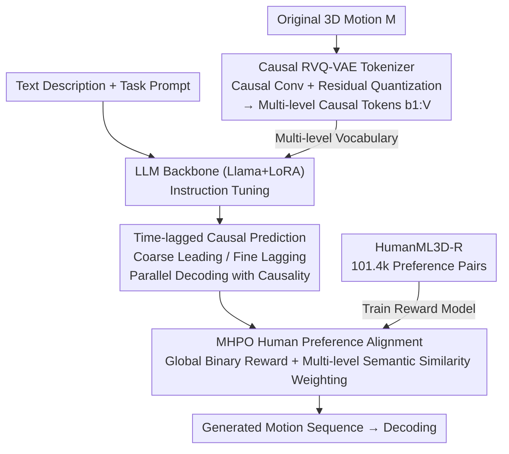

# Multi-level Causal LLM-based Text-to-Motion Generation with Human Alignment (MoTiGA)

**Conference**: CVPR 2026  
**Paper**: [CVF Open Access](https://openaccess.thecvf.com/content/CVPR2026/html/Chen_Multi-level_Causal_LLM-based_Text-to-Motion_Generation_with_Human_Alignment_CVPR_2026_paper.html)  
**Code**: None (No repository specified in the paper)  
**Area**: Human Understanding / Text-driven Motion Generation  
**Keywords**: Text-to-motion, LLM, Causal Residual Quantization, Preference Alignment, Motion Generation

## TL;DR
MoTiGA addresses three primary shortcomings of LLM-based text-to-motion generation—fine-grained quantization errors, the representation mismatch between "causal LLMs" and "non-causal VQ-VAE," and the lack of human preference alignment. These are resolved through Causal Residual Quantization (Causal RVQ-VAE), time-lagged causal prediction, and Multi-level Hybrid weighted Preference Optimization (MHPO). This approach reduces the FID by 82.3% on HumanML3D and 64.7% on KIT-ML compared to other LLM-based methods.

## Background & Motivation
**Background**: Text-driven human motion generation (text-to-motion) is split into task-specific models (e.g., T2M-GPT, Motion Diffusion using specialized Transformer/Diffusion architectures) and LLM-based methods (e.g., MotionGPT, MotionLLM using a unified architecture treating motion as a "foreign language" to leverage LLM world knowledge). LLM-based methods are gaining traction due to their strong generalization and multi-task unification capabilities.

**Limitations of Prior Work**: LLM-based methods generally use a **VQ-VAE** to discretize raw motion into tokens for the LLM, which introduces three specific issues. ① **Coarse Quantization**: Naive vector quantization loses fine-grained details. ② **Causal Mismatch**: Causal LLMs (Llama, GPT) can only look at the current and past steps, while VQ-VAE is a **non-causal global encoder** where each token is influenced by both past and future frames, contradicting the autoregressive nature of LLMs. ③ **Lack of Human Alignment**: Existing LLM motion models rarely perform preference alignment, leading to subjectively unacceptable outputs like "mirroring errors" (left-right reversal) or "incomplete motion errors" (missing key poses).

**Key Challenge**: To refine representations using residual quantization (multi-level tokens), the number of tokens increases by a factor of $V$, leading to a surge in autoregressive inference steps and amplified exposure bias. Conversely, parallel decoding of levels **breaks causal dependencies**. Hence, it is difficult to maintain "fine-grained representation ↔ causality ↔ inference efficiency" simultaneously.

**Goal**: Achieve fine-grained, causally consistent, and parallel-efficient motion representation within a unified LLM architecture while incorporating human preference alignment.

**Key Insight**: Since the LLM is causal, the motion tokenizer should also be modified to be causal (causal convolution + residual quantization). A time-lagged scheduling is designed so that "coarse-grained tokens are generated before fine-grained tokens," preserving the causal chain during parallel decoding.

**Core Idea**: Causal RVQ-VAE produces multi-level causal motion tokens (base layer for global motion, residual layers for details) + time-lagged causal prediction for parallel decoding + MHPO to inject human preference rewards stratified by semantic similarity.

## Method

### Overall Architecture
MoTiGA uses Llama-7B as the backbone (fine-tuned with LoRA) and operates in two stages. **Instruction Tuning Stage**: Causal RVQ-VAE discretizes 3D motion sequences $M$ into multi-level causal tokens (base layer $b^1$ captures global motion, residual layers $b^{2:V}$ provide details). The LLM then generates these tokens in parallel using a time-lagged causal prediction strategy conditioned on task prompts and text descriptions. **Human Preference Alignment Stage**: MHPO is performed on the instruction-tuned model. For each text prompt, $G$ motion candidates are sampled. A hybrid weighted reward, combining global binary rewards and multi-level semantic similarity, is used with a PPO-style objective to align the model with human preferences, using the self-constructed HumanML3D-R dataset.

### Key Designs

**1. Causal RVQ-VAE: Transforming Tokenizers from Non-causal to Causal and Multi-level while Minimizing Error**

To address "coarse quantization" and "non-causal mismatch," this work applies causal residual quantization. It consists of a 1D **causal convolutional** encoder $E$, a causal convolutional decoder $D$, and $V$ shared learnable codebooks. Given motion $M$, the encoder downsamples it to a base latent $z^1=E(M)$. Each level performs $b^v=Q(z^v)$ and $z^{v+1}=z^v-b^v$ (quantizing the residual), eventually approximating $\hat z=\sum_{v=1}^{V}b^v$ for reconstruction. Residual quantization reduces errors by approaching the original signal layer-by-layer, while **causal convolutions** ensure that the encoding at each step depends only on current and past frames, aligning perfectly with causal LLMs like Llama.

**2. Time-lagged Causal Prediction: Parallel Multi-level Decoding without Breaking Causality**

Causal RVQ-VAE increases the token count by $V$ times. Step-by-step decoding would double inference steps and amplify exposure bias. A naive fix is **time-synchronized parallel prediction** (shared backbone $F_b$ + shared head $F_h$ + per-level neck $F_n^v$), but this breaks causal dependency:

$$P(b^{v+1}_{t+1}\mid b^{1:v+1}_{1:t},X,\tau)\neq P(b^{v+1}_{t+1}\mid b^{1:v}_{t+1},b^{1:v+1}_{1:t},X,\tau)$$

The missing $b^{1:v}_{t+1}$ condition breaks the causal chain. **Time-lagged causal prediction** schedules coarse tokens to be generated for **later** time steps while fine tokens are generated for **earlier** steps (e.g., $b^1$ predicts $t_4$ while $b^4$ predicts $t_1$). This ensures that by the time a fine-level token is generated, its corresponding coarse-level context is already available from previous steps, balancing causality, fine granularity, and efficiency.

**3. MHPO + HumanML3D-R: Hierarchical Rewards via Weighted Semantic Similarity**

To mitigate "mirroring/incomplete motion," the authors propose Multi-level Hybrid weighted Preference Optimization. The baseline is GRPO, providing a global binary reward (+1 for preferred / -1 for non-preferred). However, binary rewards are **too sparse** for motion; even "preferred samples" may have subtle quality differences at various token levels. MHPO uses **multi-level semantic similarity** as an adaptive bonus. The reward for the $v$-th level token in a preferred sequence is:

$$\hat r^{+}_{i,t}=\begin{cases}(1-\varepsilon)r_i+\varepsilon\,\delta_v, & v=1\\(1-\varepsilon)r_i+\varepsilon(\delta_v-\delta_{v-1}), & v\in[2,V]\end{cases}$$

where $\delta_v=S_{[0,1]}\big(X,\,D(\sum_{k=1}^{v}b^k)\big)$ is the normalized semantic similarity between the text $X$ and motion decoded from the first $v$ levels (calculated via the TMR model). This concentrates rewards on **crucial tokens at critical levels** with high semantic relevance. For non-preferred sequences, a heavier penalty is applied only to hard samples where $\delta_V$ approaches 0: $\hat r^{-}_{j,t}=(1-\varepsilon)r_j+\varepsilon(1-\delta_V)(-1)$. The HumanML3D-R dataset contains **101,490 human preference pairs** used to train a classifier for the global reward $r$.

### Loss & Training
Causal RVQ-VAE is trained with reconstruction loss and latent embedding loss (consistent with Momask/T2M-GPT). The LLM backbone is Llama-7B + LoRA (rank 64), with instruction tuning for 240K steps ($lr=6\times10^{-4}$, approx. 72h on a single GPU) and preference alignment for 120K steps ($lr=6\times10^{-6}$, approx. 36h). The final MHPO objective combines normalized rewards $\hat A^+,\hat A^-$ into a PPO-style clipped objective $J_{MHPO}(\theta)$.

## Key Experimental Results

### Main Results
Evaluations were performed on HumanML3D and KIT-ML using FID, R-Precision (Top-1/3), MM-Dist, and Diversity. Results are averaged over 20 runs.

| Method | Type | HumanML3D FID ↓ | Top-1 ↑ | KIT-ML FID ↓ | Top-1 ↑ |
|------|------|-----------------|---------|--------------|---------|
| MotionGPT (FLAN-T5) | LLM | 0.232 | 49.2 | 0.510 | 36.6 |
| MotionGPT (Llama) | LLM | 0.590 | 37.6 | – | – |
| MotionLLM (Gemma) | LLM | 0.491 | 48.2 | 0.781 | 40.9 |
| Momask | Task-specific | 0.045 | 52.1 | 0.204 | 43.3 |
| **MoTiGA (Llama)** | LLM | **0.041** | **52.3** | **0.180** | **44.3** |

MoTiGA reduces the FID on HumanML3D from the previous LLM best of 0.232 to 0.041 (-82.3%) and from 0.510 to 0.180 on KIT-ML (-64.7%). It **matches or surpasses task-specific models** (e.g., Momask at 0.045) while maintaining the flexibility of the LLM architecture.

MoTiGA also performs well on secondary tasks: for motion captioning, it achieves 49.0 BLEU-1 and 55.9 Top-1 R-Precision. For motion generation from initial poses, it reaches an FID of 0.040 and takes only 3.684s per sample, **74.5% faster** than MotionGPT's 14.494s.

### Ablation Study
Incremental component evaluation (HumanML3D):

| Configuration | FID ↓ | Top-1 ↑ | Description |
|------|-------|---------|------|
| VQ-VAE + Stepwise Decoding | 0.213 | 46.4 | Baseline |
| Causal RVQ-VAE + Stepwise | 0.186 | 46.6 | Causal residual quantization preserves detail |
| + Synchronized Parallel | 0.064 | 51.0 | Parallel decoding improves performance |
| + Time-lagged Causal | 0.055 | 51.9 | Restores causality for further gain |
| + GRPO Alignment | 0.047 | 52.1 | Base preference alignment |
| + MHPO Alignment | **0.041** | **52.3** | Multi-level weighting (Best) |

Comparison of quantization levels $V$: $V=4$ is optimal (FID 0.055), while excessive levels degrade performance ($V=6$ increases FID to 0.058).

### Key Findings
- **Time-lagged vs. Synchronized**: The improvement from 0.064 to 0.055 demonstrates that parallel decoding hurts causality if coarse-layer conditions are not restored. Lagged scheduling recovers causality without sacrificing efficiency.
- **MHPO > GRPO**: 0.047 → 0.041 shows that multi-level semantic similarity weighting is more effective than global binary rewards for refining critical tokens and mitigating mirroring/completeness errors.
- Causal RVQ-VAE yields better generation quality for downstream LLMs compared to standard RVQ-VAE (e.g., at $V=4$, 0.055 vs 0.085), even if its reconstruction FID is slightly worse. This suggests **LLM-friendly causal representations** are more important than pure reconstruction accuracy.

## Highlights & Insights
- **"Making the tokenizer causal" is the cure**: Using causal convolutions to restrict encoding to the past resolves the root mismatch of feeding non-causal representations into a causal LLM.
- **Clever Time-lagged Scheduling**: By leading with coarse layers and lagging with fine layers, each fine token has access to its synchronized coarse context. This harmonizes causality, efficiency, and granularity—a "staggered-layer" concept transferable to any multi-level autoregressive generation.
- **MHPO Refines RL Rewards**: Moving from "one score per sequence" to "level-wise semantic assignment" using the TMR model as a semantic scorer provides a reusable paradigm for fine-grained RLHF in motion tasks.
- The open-sourcing of HumanML3D-R (100k+ preference pairs) addresses a major data gap in motion preference modeling.

## Limitations & Future Work
- Alignment depends heavily on the self-built HumanML3D-R and the trained reward classifier; annotation noise and classifier bias will directly impact alignment. Details on data collection are in the supplementary material, making it hard to evaluate independently. ⚠️
- Sensitivity to quantization level $V$: Requires tuning per dataset ($V=4$ is optimal here).
- Evaluation is limited to standard benchmarks (HumanML3D/KIT-ML). Generalization to long sequences, multi-person scenarios, or complex interactions remains to be fully verified.
- Computational costs for Llama-7B + LoRA (72h + 36h) are significant for smaller teams; although inference is accelerated by parallel decoding, total overhead compared to lightweight task-specific models hasn't been compared in detail.

## Related Work & Insights
- **vs. MotionGPT / MotionLLM (LLM-based)**: These use non-causal VQ-VAE and step-by-step decoding, suffering from coarse quantization, causal mismatch, and lack of alignment. MoTiGA provides targeted fixes, resulting in a magnitude of improvement in FID.
- **vs. Momask / T2M-GPT (Task-specific)**: Specialized architectures offer high accuracy but limited task flexibility. MoTiGA achieves comparable accuracy (FID 0.041 vs 0.045) while remaining a general-purpose LLM.
- **vs. GRPO (General RL Alignment)**: While GRPO applies uniform rewards to sequences, which is sparse for motion, MHPO introduces multi-level semantic bonuses to concentrate rewards where they matter most.

## Rating
- Novelty: ⭐⭐⭐⭐⭐ Causal tokenizer + Time-lagged parallel + Multi-level alignment is a robust and novel combination.
- Experimental Thoroughness: ⭐⭐⭐⭐ Comprehensive benchmarking and ablations, though generalization to complex scenes is limited.
- Writing Quality: ⭐⭐⭐⭐ Clear mapping between pain points and designs; logic is sound despite dense formulas.
- Value: ⭐⭐⭐⭐⭐ Successfully brings LLM-based motion generation to parity with task-specific models and contributes a large-scale preference dataset.

<!-- RELATED:START -->

## Related Papers

- [\[CVPR 2026\] MoLingo: Motion-Language Alignment for Text-to-Human Motion Generation](molingo_motion-language_alignment_for_text-to-motion_generation.md)
- [\[CVPR 2026\] FrankenMotion: Part-level Human Motion Generation and Composition](frankenmotion_part-level_human_motion_generation_and_composition.md)
- [\[CVPR 2026\] Hierarchical Enhancement of Semantic Priors for Disentangled Text-Driven Motion Generation](hierarchical_enhancement_of_semantic_priors_for_disentangled_text-driven_motion_.md)
- [\[CVPR 2026\] LaMoGen: Language to Motion Generation Through LLM-Guided Symbolic Inference](lamogen_language_to_motion_generation_through_llm-guided_symbolic_inference.md)
- [\[CVPR 2026\] Towards Decompositional Human Motion Generation with Energy-Based Diffusion Models](towards_decompositional_human_motion_generation_with_energy-based_diffusion_mode.md)

<!-- RELATED:END -->
