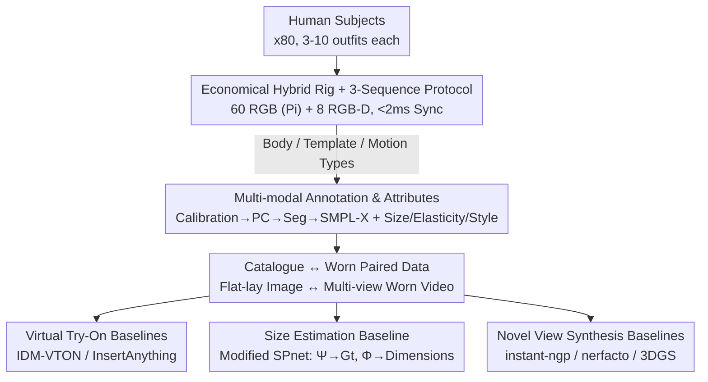

# MV-Fashion: Towards Enabling Virtual Try-On and Size Estimation with Multi-View Paired Data

**Conference**: CVPR 2026  
**Paper**: [CVF Open Access](https://openaccess.thecvf.com/content/CVPR2026/html/Laczko_MV-Fashion_Towards_Enabling_Virtual_Try-On_and_Size_Estimation_with_Multi-View_CVPR_2026_paper.html)  
**Code**: https://hunorlaczko.github.io/MV-Fashion (Project Page / Dataset Homepage)  
**Area**: Dataset / Virtual Try-On / Size Estimation  
**Keywords**: Multi-view dataset, Virtual Try-On (VTON), Size estimation, Garment dynamics, Novel View Synthesis

## TL;DR
MV-Fashion utilizes an "economical" multi-view synchronous capture rig consisting of 60 Raspberry Pi RGB cameras and 8 RGB-D cameras to record 3,273 synchronous videos (72.5M frames) of 80 subjects wearing 474 outfits (754 items). It provides multi-modal annotations for each garment, including **flat-lay catalogue ↔ in-the-wild worn** pairs, pixel-level segmentation, SMPL-X, point clouds, size charts, fabric elasticity, and styling. This marks the first time data required for virtual try-on, size estimation, and novel view synthesis are integrated into a single dataset, with baselines provided for all three tasks.

## Background & Motivation

**Background**: Vision research related to clothing is currently fragmented by two types of non-overlapping datasets. One type is 2D Virtual Try-On (VTON) datasets (VITON-HD, DressCode, IGPair, etc.), whose most valuable assets are **paired data**—the correspondence between a flat-lay garment image and its appearance when worn by a person, which is a prerequisite for training models to "paste clothes onto people." However, these are single-view 2D images lacking 3D geometry or multi-view information. The other type consists of 3D/4D human datasets (4D-DRESS, DNA-Rendering, MVHumanNet++, etc.), which capture geometry and motion using large camera arrays but **completely lack catalogue ↔ worn pairings** and fine-grained fashion annotations (size, fabric, styling).

**Limitations of Prior Work**: No existing dataset simultaneously provides "synchronous multi-view + catalogue pairing." Consequently, VTON research is restricted to single views, unable to achieve cross-view consistency or estimate fit based on actual sizing. Conversely, 3D datasets cannot supervise VTON models. Synthetic data (CLOTH3D/4D, BEDLAM), while perfectly annotated and large-scale, suffer from a significant **realism gap** and fail to capture the dynamics of real fabrics on loose clothing (skirts, coats). Real multi-view captures (ActorsHQ, DNA-Rendering) often depend on expensive equipment, creating high barriers to entry and generating data that is difficult to process.

**Key Challenge**: Paired data (needed for VTON) and multi-view geometry/dynamics (needed for 3D tasks) have historically never been obtained through the same capture protocol. Furthermore, real captures are either expensive or lack fashion-specific annotations.

**Goal**: To create a dataset that simultaneously possesses (1) synchronous multi-view video, (2) catalogue ↔ worn pairing, and (3) rich fashion-oriented annotations (sizing charts, fabric elasticity, styling, layered garments), implemented via **affordable off-the-shelf hardware**, thereby unifying VTON, size estimation, and novel view synthesis into a single resource.

**Key Insight**: The authors identified that high costs primarily stem from industrial-grade camera arrays. By using 60 inexpensive Raspberry Pi global shutter cameras as the primary dense coverage and only 8 RGB-D cameras for depth and 4K resolution, paired with electronic synchronization that reduces temporal misalignment to $<2ms$, dense multi-view coverage is achieved at an affordable cost.

**Core Idea**: Construct a realistic, paired, multi-view fashion video dataset with fine-grained fashion annotations using an "economical hybrid multi-view rig + three-sequence recording protocol + catalogue pairing," and establish baselines for VTON, size estimation, and NVS tasks.

## Method

As a **dataset paper**, the "method" refers to the data acquisition, annotation, and pairing processes, as well as the three downstream baselines implemented. The work is divided into two parts: a data production pipeline (capture → annotation → attributes → pairing) producing a 72.5M frame dataset with catalogue pairs, and the construction of baselines for virtual try-on, size estimation, and novel view synthesis to demonstrate the dataset's utility.

### Overall Architecture

The input consists of human subjects performing actions in a capture studio wearing various outfits. The output is a structured multi-view dataset where each sequence includes synchronous multi-view video, point clouds, pixel-level segmentation, SMPL-X body/pose parameters, sizing/fabric/style annotations, and corresponding flat-lay catalogue pairs. Scale: 80 subjects, 3–10 outfits each, totaling 474 outfits (754 items), 3,273 videos, 72.5M frames; layering includes 326 single-layer, 145 double-layer, and 3 triple-layer outfits.

### Key Designs

**1. Economical Hybrid Multi-view Rig + Three-Sequence Protocol: Dense Synchronous Coverage with Consumer Hardware**

To address the barrier of expensive multi-view capture, the authors replaced industrial camera arrays with 60 Raspberry Pi global shutter cameras (1.6 MP) for dense coverage and 8 Orbbec Femto Bolt RGB-D cameras for depth and 4K footage. Cameras are mounted in three rows on a 20-sided aluminum frame, with 40 high-power LED panels providing constant illumination to allow low exposure times and reduce motion blur. Crucially, **external electronic synchronization** keeps frame misalignment below $2ms$, which is essential for cross-view geometry and point cloud registration.

The recording protocol splits each outfit into three 20-second, 15fps sequences: the **Body sequence** involves subjects in minimal clothing performing a fixed A-pose for body shape estimation; the **Template sequence** captures the subject in the outfit in a fixed pose to obtain static garment geometry as a "canonical" reference; the **Motion sequence** captures 5 random fashion poses to record dynamic deformation, with multiple takes covering different styles (rolled sleeves, open/closed coats) and layering scenarios. This triad of "body baseline / static template / dynamic motion" directly supports the "canonical template + arbitrary pose input" pairings required for downstream size estimation.

**2. Catalogue ↔ Worn Pairing: Transferring Critical VTON Information to Multi-view Scenarios**

This is the core differentiator. VTON training relies on "flat-lay ↔ worn" pairs, which are absent in previous 3D/4D datasets. MV-Fashion pairs **every multi-view video sequence** with flat/catalogue images of the garment (front, back, and in both relaxed and stretched states). This allows models to be trained with supervision where the same garment has both a standard catalogue image and a multi-view dynamic worn representation—enabling both traditional single-view VTON and cross-view try-on (e.g., synthesizing a back-view worn pose using a front catalogue image). In Table 1b, MV-Fashion is the only dataset satisfying MV (multi-view), Paired, and Video criteria simultaneously.

**3. Multi-modal Annotations and Garment Attributes: Fashion-Specific Sizing Charts**

To address the lack of fine-grained fashion labels in 3D datasets, the authors built a unified pipeline. For geometry/pose: AprilTags are used for intrinsic/extrinsic/distortion calibration and RGB-depth stereo calibration; ColorICP registers depth into point clouds followed by polynomial color correction; foreground and layered garment masks use a "two-stage" approach with YOLOv8 and Qwen3-VL for initialization, SAM2 for segmentation, and manual QC. Body parameters are estimated using RTMW-x for 2D keypoints, triangulation to 3D, and a **modified SMPLify-X incorporating point cloud constraints** for SMPL-X fitting.

The most valuable fashion attribute is the **sizing chart**: the authors manually measured each garment with a tape measure to provide detailed charts, alongside 14 garment categories, fit (slim/regular/loose), styling (sleeves rolled, coat open/closed, tucked in), fabric elasticity (discrete scale 1=rigid to 5=highly elastic), and text descriptions generated by Qwen3-VL. For comparability, the 14 categories are grouped into six groups G1–G6 (e.g., G1=shirt, G6=dress) for size estimation experiments.

**4. Size Estimation Baseline: Adapting SPnet for Real Data with Multi-task Upgrades**

Size estimation is a technically significant challenge—recovering true dimensions from worn images with folds and drapes is difficult. The authors modified SPnet: an encoder-decoder network $\Psi(G_s, P_s, P_t)$ maps "input garment normal map $G_s$ + input pose $P_s$ + output canonical pose $P_t$" to a target normal map $G_t$ in the canonical pose. Subsequently, a network $\Phi(G_t)$ regresses sewing parameters/dimensions. Key modifications include: (1) training on **real data** from MV-Fashion ($G_s$ from Motion sequences via segmentation+Sapiens, $P_s$ from SMPL-X, $G_t/P_t$ from Template sequences); (2) $\Phi$ regressing **normalized** dimensions (rescaled to $[0,1]$); (3) comparing three $\Phi$ variants—per-group (original SPnet), multi-task (joint group training), and an enhanced version using a SwinV2 encoder with additional $P_t$ conditioning. The third variant achieved the lowest MAE of 4.279 cm by leveraging shared measurement patterns and pose alignment.

## Key Experimental Results

The paper focuses on demonstrating that the dataset can support three task types rather than purely chasing SOTA numbers.

### Dataset Scale Comparison (Table 1, Key Dimensions)

| Dimension | MVHumanNet++ | 4D-DRESS | VITON-HD | MV-Fashion (Ours) |
|------|--------------|----------|----------|-------------------|
| Frames | 645.1M | 78K | 13,679 | 72.5M |
| Subjects/Seqs | 4,500 / 60K | 32 / 520 | – | 80 / 3,273 |
| Multi-view | Yes (48 cam) | Yes (53 cam) | No | Yes (68 cam) |
| Catalogue Paired | No | No | Yes | **Yes** |
| Size/Style/Layer Labels | No | Partial | No | **Yes** |

Key Finding: While MV-Fashion is not the largest by frame count, it is the **only** dataset providing "multi-view video + catalogue pairing + size/style/layer annotations."

### Virtual Try-On Baseline (Table 3)

| Setting | Method | SSIM↑ | LPIPS↓ | FID↓ |
|------|------|-------|--------|------|
| Single-view | IDM-VTON | 0.881 | 0.086 | 10.187 |
| Single-view | InsertAnything | 0.927 | 0.065 | 8.192 |
| Multi-view | IDM-VTON Cross-view | 0.868 | 0.098 | 12.907 |
| Multi-view | IDM-VTON View-Adaptive | 0.873 | 0.093 | 12.775 |

### Size Estimation Baseline (Table 4, MAE for $\Phi$, units in cm, std in brackets)

| Group | Per-Group | Multi-Task | Multi-Task + SwinV2 |
|----|-----------|------------|---------------------|
| G3 (Skirt) | 9.951 (8.437) | 6.847 (9.174) | 6.643 (10.135) |
| G5 (Jumpsuit) | 12.109 (10.313) | 4.295 (2.746) | 4.889 (4.633) |
| Average | 4.904 (6.533) | 4.710 (6.392) | **4.279 (5.870)** |

The normal predictor $\Psi$ achieved a global MAE of 0.0163 and SSIM of 0.9355, indicating successful decoupling of pose from garment geometry.

### Key Findings
- **Paired data is effective**: Existing VTON models directly achieve high fidelity scores on the front-view paired subset of MV-Fashion (InsertAnything SSIM 0.927), proving the data is plug-and-play with current pipelines.
- **Cross-view is challenging**: When cross-view constraints are added, IDM-VTON performance drops (FID 10.187 → 12.907), quantifying the difficulty of synthesizing back-view poses from front catalogue images. Providing both front and back catalogue images via a "view-adaptive" IP-Adapter partially mitigates this (FID 12.775).
- **Multi-task + Pose Conditioning is robust**: For size estimation, the SwinV2+$P_t$ variant yielded the lowest average MAE (4.279 cm). Multi-task learning significantly reduced MAE in sample-scarce groups like G5 (12.1 cm → 4.3 cm).
- **NVS View Density saturates at 56 views** (Table 5): 3DGS metrics improved with more views up to 56 (PSNR 29.567), after which gains plateaued, validating that the 68-camera rig provides sufficient density for NVS.

## Highlights & Insights
- **"Pairing" is the soul of this paper**: Rather than a new model architecture, the innovation lies in integrating VTON's catalogue pairing into multi-view dynamic scenes, bridging the gap between 2D-VTON and 3D/4D domains.
- **Economical hardware strategy is pragmatic**: Using 60 Raspberry Pis + 8 RGB-D cameras with electronic synchronization lowers the barrier to entry for real multi-view capture, offering a blueprint for other research teams.
- **Protocol design facilitates downstream tasks**: The "Body/Template/Motion" tripartite recording protocol naturally generates the canonical ↔ posed pairings necessary for learning-based size estimation.
- **Manual sizing charts fill a significant gap**: By manually measuring garments where no public sizing data existed, the authors turned size estimation into a viable supervised learning problem.

## Limitations & Future Work
- **Demographic bias**: Subjects are primarily from Europe (56.8%) and America, with only 4.9% from Asia. This may limit generalization across diverse body shapes, skin tones, and clothing cultures.
- **No new architectures**: The study provides baselines rather than a new SOTA model. Failures in semantic control and visible artifacts in results highlight that the problem is far from solved.
- **Imbalanced sets**: Rare cases, such as triple-layer clothing (only 3 sets) and limited style variants for certain categories, may restrict model learning. MAE for skirts/dresses (G3/G6) remains higher due to complex folds.
- **Future Directions**: Supplementing the dataset with globally diverse populations; training native multi-view consistent VTON models; and utilizing elasticity/material labels for data-driven physical fabric simulation.

## Related Work & Insights
- **vs. VITON-HD / DressCode / IGPair (2D Paired VTON)**: These provide catalogue pairs but only single-view 2D images. MV-Fashion adds synchronous multi-view video to enable cross-view consistency research.
- **vs. 4D-DRESS / DNA-Rendering / MVHumanNet++ (3D/4D Human)**: These have scale and geometry but lack catalogue pairing and fashion-specific labels. MV-Fashion fills these gaps essential for the VTON and sizing communities.
- **vs. CLOTH3D / BEDLAM (Synthetic)**: Synthetic datasets have perfect labels but a realism gap regarding fabric dynamics. MV-Fashion provides real-world human-garment capture.
- **vs. SPnet (Size/Parameter Estimation)**: While SPnet learned on synthetic data, this work adapts the $\Psi/\Phi$ structure to real data with multi-task SwinV2 upgrades, proving real worn images contain enough signal for accurate sizing.

## Rating
- Novelty: ⭐⭐⭐⭐ The innovation is structural—providing the first "multi-view + catalogue pair + fashion label" dataset.
- Experimental Thoroughness: ⭐⭐⭐⭐ Covers VTON, size estimation, and NVS with baselines and ablations; however, no native new models were trained.
- Writing Quality: ⭐⭐⭐⭐ Clear motivation with strong comparative tables (Table 1). Baseline descriptions are somewhat concise.
- Value: ⭐⭐⭐⭐ Provides a unique multi-view resource for the VTON/Sizing/NVS communities with high long-term reuse potential.

<!-- RELATED:START -->

## Related Papers

- [\[CVPR 2026\] MOFA-VTON: More Fashion Possibilities with Fine-Grained Adaptations in Virtual Try-On](mofa-vton_more_fashion_possibilities_with_fine-grained_adaptations_in_virtual_tr.md)
- [\[CVPR 2026\] RefTon: Reference Person Shot Assist Virtual Try-on](refton_reference_person_shot_assist_virtual_try-on.md)
- [\[CVPR 2026\] Mobile-VTON: High-Fidelity On-Device Virtual Try-On](mobile_vton_ondevice_virtual_tryon.md)
- [\[CVPR 2026\] Mocap-2-to-3: Multi-view Lifting for Monocular Motion Recovery with 2D Pretraining](mocap-2-to-3_multi-view_lifting_for_monocular_motion_recovery_with_2d_pretrainin.md)
- [\[ICLR 2026\] Inverse Virtual Try-On: Generating Multi-Category Product-Style Images from Clothed Individuals](../../ICLR2026/human_understanding/inverse_virtual_try-on_generating_multi-category_product-style_images_from_cloth.md)

<!-- RELATED:END -->
