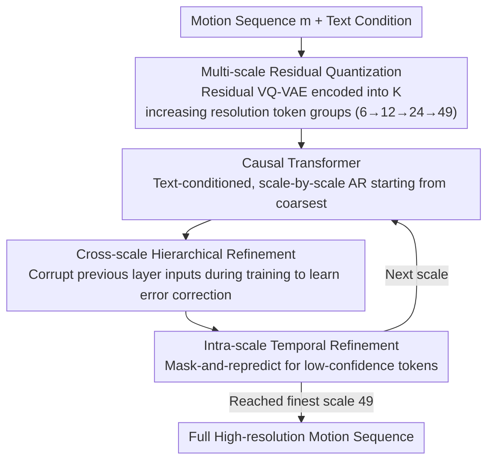

# Next-Scale Autoregressive Models for Text-to-Motion Generation

**Conference**: CVPR 2026  
**arXiv**: [2604.03799](https://arxiv.org/abs/2604.03799)  
**Code**: See project homepage  
**Area**: Human Understanding  
**Keywords**: Text-to-motion generation, autoregressive models, multi-scale prediction, hierarchical generation, motion synthesis

## TL;DR

MoScale proposes a next-scale autoregressive motion generation framework that replaces traditional next-token prediction. By employing coarse-to-fine hierarchical causal generation to capture global semantic structures, and introducing cross-scale hierarchical refinement alongside intra-scale temporal refinement, it achieves SOTA results on HumanML3D and KIT-ML (Top-1 0.540, FID 0.046).

## Background & Motivation

1. **Background**: Text-to-motion generation aims to synthesize human motion sequences that faithfully reflect text descriptions. Current methods primarily fall into three categories: next-token autoregressive (T2M-GPT, AttT2M), diffusion models (MDM, ReMoDiffuse), and masked Transformers (MoMask, MoMask++).

2. **Limitations of Prior Work**:
    - **Diffusion and Masked Transformers**: These models generate a draft of the full-resolution sequence before iterative refinement; however, initial global semantics are often inaccurate, and subsequent refinements primarily improve local consistency rather than global structure.
    - **Next-token AR**: Human motion exhibits extreme short-term predictability (future poses can be inferred from a brief history). Consequently, AR models during training exploit "short-horizon shortcuts" to minimize loss without learning long-range semantic structures. Temporal convolutions in VQ-VAE further exacerbate these local correlations.
    - **Common Issue**: Difficulty in capturing repetition counts (e.g., "two jumping jacks") and sequence-level action patterns (e.g., "turn around, pick something up, then turn around again").

3. **Key Challenge**: The causal direction of next-token modeling (frame-by-frame along the time dimension) and the high short-term predictability of human motion constitute a shortcut that hinders global semantic reasoning.

4. **Goal**: Design a causal hierarchy that forces the model to commit to a global semantic layout at the earliest stages of generation, thereby avoiding short-horizon shortcuts.

5. **Key Insight**: Inspired by next-scale modeling in the image domain (VAR), motion sequences are organized into hierarchical discrete token groups by temporal resolution, generated autoregressively from the coarsest scale (global semantics) to the finest scale (local details).

6. **Core Idea**: Replace next-token with next-scale to determine the global motion structure at the coarsest scale and refine it layer-by-layer toward high temporal resolution.

## Method

### Overall Architecture

MoScale addresses the chronic issue where next-token autoregressive models learn only local dynamics instead of global semantics. The solution involves changing the generation order from "frame-by-frame over time" to "coarse-to-fine across resolutions." The pipeline consists of three steps: first, a residual VQ-VAE encodes the motion sequence into $K$ discrete token groups with increasing temporal resolutions (e.g., 6→12→24→49). The coarsest group (only 6 tokens) is forced to represent the "global structure of the entire sequence," while the finest group provides frame-by-frame local details. Next, a causal Transformer, conditioned on text, generates tokens scale-by-scale starting from the coarsest level, using bidirectional attention within each scale to produce all tokens at once. During generation, two refinement mechanisms are applied: one for cross-scale error accumulation and another for intra-scale temporal consistency. The key is that the model is forced to establish the global semantic layout at the very first step (coarsest scale), preventing it from relying on the shortcut of "predicting the next frame by looking at previous ones."

### Key Designs

**1. Multi-scale Residual Quantization: Mapping different layers to different temporal resolutions rather than residuals of the same resolution**

The root cause of laziness in traditional next-token AR lies in the "frame-by-frame" granularity—human poses are highly predictable in the short term, allowing models to lower loss by simply observing the previous frame. MoScale's first modification is at the representation layer: the encoder compresses motion $\mathbf{m} \in \mathbb{R}^{T \times D_m}$ into latent variables $\mathbf{f}$, which are then quantized layer-by-layer according to $K$ increasing lengths $(L_1, ..., L_K)$. The $k$-th layer quantizes the residual $\mathbf{f} - \hat{\mathbf{f}}_{:k-1}$ not captured by previous layers after downsampling it to length $L_k$. All scales share a single codebook $\mathbf{Z} \in \mathbb{R}^{V \times D_e}$. This differs fundamentally from standard residual VQ where every layer operates at the same temporal resolution; here research ensures that "coarse scale = global structure" and "fine scale = local details" through the representation structure itself.

**2. Cross-scale Hierarchical Refinement: Forcing error correction through intentional input corruption**

Next-scale modeling shifts error accumulation from the time dimension to the scale dimension—if the coarse scale prediction is incorrect, fine scales will merely add details to a flawed skeleton, leading to divergence. This stems from standard teacher forcing: during training, each layer sees perfect inputs from the previous scale, but during inference, it consumes its own noisy intermediate results (exposure bias). MoScale fixes this by actively introducing imperfections during training: tokens from scale $k-1$ are randomly replaced with random codebook tokens at a corruption rate $\gamma_k \sim U[0, \gamma_{max}]$. The model then predicts the correct residual target for scale $k$ based on this contaminated input. Crucially, corruption only affects the input seen by scale $k$ and does not alter the learning target of scale $k-1$ to avoid polluting its supervision signal. Experiments show $\gamma_{max}=0.6$ is optimal: too low fails to expose errors, while too high introduces excessive noise.

**3. Intra-scale Temporal Refinement: Mask-and-repredict for low-confidence tokens to ensure consistency**

While scale-by-scale causal generation ensures global structure, producing all tokens within a single scale simultaneously can lead to temporal incoherence. This step adds an "iterative refinement" pass within each scale: low-confidence tokens are identified and replaced by a [MASK] via a binary mask $\mathbf{m}_k^i$, then concatenated with features from previous scales and fed back into the Transformer for re-prediction. This follows a cosine re-masking schedule over several rounds (refinement steps are set to $(1, 2, 5, 10)$ for each scale, with more refinement for finer resolutions). This approach is effective because text-to-motion datasets are much smaller than language corpora, where iterative refinement and bidirectional context have proven advantageous. An additional benefit is that this mask-and-repredict mechanism functions as conditional completion, allowing MoScale to support zero-shot motion editing, completion, and continuation without structural changes.

### Loss & Training

- **VQ-VAE Training**: Reconstruction loss + joint position loss + commitment loss.
- **Transformer Training**: Teacher forcing + cross-entropy loss, with a 10% probability of dropping text conditions (Classifier-Free Guidance).
- **Hyperparameters**: HumanML3D trained for 120 epochs with a learning rate of $3 \times 10^{-4}$; KIT-ML trained for 60 epochs.
- **Inference**: CFG scale set to 5 for HumanML3D and 3 for KIT-ML.
- **Architecture**: Codebook size 512, 4 hierarchical scales, sequence lengths (6, 12, 24, 49).

## Key Experimental Results

### Main Results

HumanML3D:

| Method | Type | Top-1↑ | FID↓ | MM-Dist↓ | Diversity |
|------|------|--------|------|----------|-----------|
| T2M-GPT | Next-token | 0.492 | 0.141 | 3.121 | 9.722 |
| ParCo | Next-token | 0.515 | 0.109 | 2.927 | 9.576 |
| ReMoDiffuse | Diffusion | 0.510 | 0.103 | 2.974 | 9.018 |
| MoMask++ | MaskedTrans | 0.528 | 0.072 | 2.912 | - |
| **Ours (S=18)** | **Next-scale** | **0.540** | **0.046** | **2.830** | 9.525 |

KIT-ML:

| Method | Top-1↑ | FID↓ | MM-Dist↓ |
|------|--------|------|----------|
| ParCo | 0.430 | 0.453 | 2.820 |
| MoMask | 0.433 | 0.204 | 2.779 |
| **Ours (S=18)** | **0.442** | 0.173 | **2.717** |

### Ablation Study

| Configuration | Top-1↑ | FID↓ | MM-Dist↓ |
|------|--------|------|----------|
| Base (No refinement) | 0.481 | 0.176 | 3.136 |
| + Hierarchical Refinement (HR) | 0.534 | 0.090 | 2.853 |
| + Temporal Refinement (TR) | 0.497 | 0.129 | 3.043 |
| + HR & TR (Full) | **0.540** | **0.046** | **2.830** |

Text Complexity Analysis (Top-3):

| Method | FULL | MEDIUM+HIGH | HIGH |
|------|------|-------------|------|
| ParCo | 0.801 | 0.778 | 0.709 |
| MoMask++ | 0.811 | 0.802 | 0.762 |
| **Ours** | **0.817** | **0.812** | **0.775** |

### Key Findings

- **Hierarchical refinement is the primary driver for text alignment**: HR contributes significantly to the Top-1 improvement from 0.481 to 0.534, while TR mainly improves local temporal consistency.
- **Superiority increases with text complexity**: On the high-complexity subset, MoScale improves Top-1 by 0.066 over ParCo, significantly higher than the 0.016 overall gain.
- **Optimal corruption rate $\gamma_{max} = 0.6$**: Rates that are too low do not expose enough errors, while those that are too high introduce excessive noise.
- **Model Scalability**: Performance continues to improve as the Transformer scales from 4 to 16 layers, maintaining training efficiency.

## Highlights & Insights

- The **short-horizon shortcut of next-token AR** is a profound insight: the short-term predictability of human motion causes AR models to "cheat" by learning local dynamics while ignoring global semantics. Next-scale breaks this shortcut by forcing the encoding of global structure at the coarsest scale.
- The **Cross-scale Refinement** design is clever: training the current layer by corrupting previous layer inputs simulates inference-time error accumulation while maintaining single-forward-pass training efficiency.
- **Unified Zero-shot Capabilities**: The same mask-and-repredict mechanism naturally supports motion editing, completion, and continuation, achieving a 78-82% preference rate in user studies.
- Training efficiency is superior to baseline methods, and the model is highly scalable, making it practical for real-world applications.

## Limitations & Future Work

- VQ-VAE quantization error remains a bottleneck, potentially causing information loss in fine-grained actions.
- Currently, only T5 text features are used; exploring stronger text representations (e.g., LLM embeddings) for improved semantic alignment remains a future direction.
- The Multimodality metric is relatively low (0.873), indicating a potential decrease in generation diversity.
- The number of scales and sequence lengths are determined empirically rather than through an adaptive mechanism.
- While inference speed (0.28s at S=18) is acceptable, it is slower than S=4 (0.08s); the trade-off between refinement steps and quality warrants further exploration.

## Related Work & Insights

- **vs MoMask++**: MoMask++ uses a shared codebook, unified Transformer, and random token perturbation, but the perturbations disrupt hierarchical causality. MoScale strictly maintains a coarse-to-fine causal structure, outperforming it by 0.012 in Top-1.
- **vs ParCo**: ParCo improves standard next-token AR by introducing complex modules with limited gains. MoScale changes the generation dimension (scale vs. time), achieving better results with more efficient training.
- **vs VAR (Image)**: MoScale adopts the next-scale philosophy from VAR but introduces critical adaptations—Cross-scale Refinement and Intra-scale Temporal Refinement—to handle the low-data challenges unique to motion datasets.
- This work validates that the "generation order" is vital for sequence modeling, offering insights for other temporal generation tasks.

## Rating

- Novelty: ⭐⭐⭐⭐⭐ Introduces next-scale to motion generation with a deep analysis of next-token short-horizon shortcuts.
- Experimental Thoroughness: ⭐⭐⭐⭐⭐ Comprehensive evaluation across two benchmarks, user studies, complexity analysis, and detailed ablations.
- Writing Quality: ⭐⭐⭐⭐⭐ Clear motivations, fluent methodology, and insightful analysis.
- Value: ⭐⭐⭐⭐ Significant contribution to the motion generation field with a generalized hierarchical AR approach.

<!-- RELATED:START -->

## Related Papers

- [\[CVPR 2026\] Causal Motion Diffusion Models for Autoregressive Motion Generation](causal_motion_diffusion_models_for_autoregressive_motion_generation.md)
- [\[CVPR 2026\] LLaMo: Scaling Pretrained Language Models for Unified Motion Understanding and Generation with Continuous Autoregressive Tokens](llamo_scaling_pretrained_language_models_for_unified_motion_understanding_and_ge.md)
- [\[CVPR 2026\] Interact2Ar: Full-Body Human-Human Interaction Generation via Autoregressive Diffusion Models](interact2ar_full-body_human-human_interaction_generation_via_autoregressive_diff.md)
- [\[CVPR 2026\] RoMo: A Large-Scale, Richly Organized Dataset and Semantic Taxonomy for Human Motion Generation](romo_a_large-scale_richly_organized_dataset_and_semantic_taxonomy_for_human_moti.md)
- [\[CVPR 2026\] Towards Decompositional Human Motion Generation with Energy-Based Diffusion Models](towards_decompositional_human_motion_generation_with_energy-based_diffusion_mode.md)

<!-- RELATED:END -->
