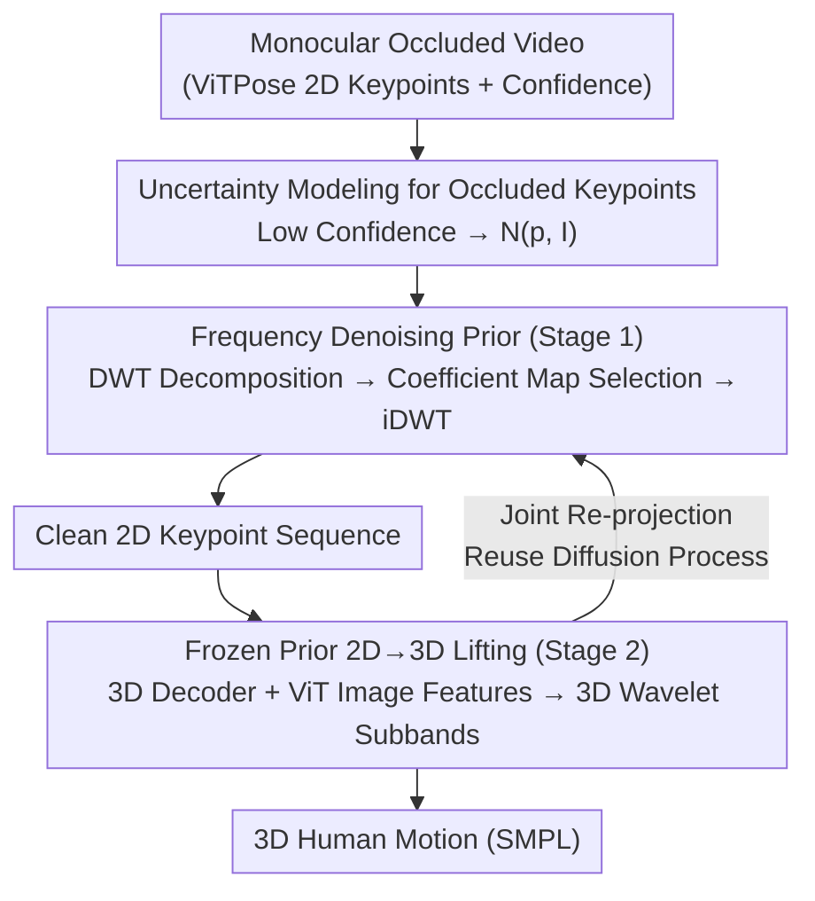

# Occluded Human Body Capture with Frequency Domain Denoising Prior

**Conference**: CVPR 2026  
**Paper**: [CVF Open Access](https://openaccess.thecvf.com/content/CVPR2026/html/Huang_Occluded_Human_Body_Capture_with_Frequency_Domain_Denoising_Prior_CVPR_2026_paper.html)  
**Code**: https://github.com/boycehbz/FreqMotion  
**Area**: Human Understanding / 3D Vision  
**Keywords**: Occluded Human Reconstruction, Frequency Domain Denoising, Discrete Wavelet Transform (DWT), Diffusion Models, Motion Capture

## TL;DR
3D human motion capture from monocular occluded video is reformulated as a "wavelet coefficient selection" problem. Uncertainty of occluded keypoints is characterized using Gaussian distributions, and a frequency-domain diffusion prior is utilized to select credible coefficients in the Discrete Wavelet Transform (DWT) domain, enabling consistent and periodicity-preserving motion recovery under long-term occlusion.

## Background & Motivation
**Background**: While monocular 3D human motion capture has advanced significantly, most methods assume full body visibility and do not explicitly address the frequent occlusions encountered in real-world scenarios. The few works handling occlusion are categorized into single-image methods (relying on human representations, data augmentation, or training strategies) and video-based methods (learning temporal motion priors to complete occluded parts).

**Limitations of Prior Work**: Single-image methods lack temporal constraints, leading to unreliable results. Although video-based methods introduce temporal priors, the information provided by temporal consistency is insufficient during "long-term occlusion," often resulting in over-smoothed motion and loss of authentic dynamic details.

**Key Challenge**: Occluded parts involve intrinsic "information loss + multi-solution ambiguity"—an occluded 2D region can correspond to multiple plausible 3D poses. Temporal priors merely smooth noise along the time axis and fail to leverage the more fundamental structural information of human motion.

**Key Insight**: The authors observe (Fig. 1 of the paper) that even under partial occlusion, the motion trajectories of human joints (e.g., left and right knees) maintain **periodicity** and **consistent momentum**. Since periodicity and momentum are naturally characterized in the frequency domain, the problem is shifted to the frequency domain for resolution.

**Core Idea**: Discrete Wavelet Transform (DWT) is used to formulate occluded motion capture as a "wavelet coefficient selection" process. A denoising prior is learned in the frequency domain to select effective wavelet components from credible image observations while filtering out noise introduced by occlusion, followed by an inverse transform back to clean motion. Compared to phase representations or DCT, the multi-scale analysis of DWT captures **local periodicity** and is more robust to non-stationary signals (sudden movements) as well as high- and low-frequency noise.

## Method

### Overall Architecture
The method is a two-stage frequency-domain denoising pipeline sharing a common diffusion process. The input is a monocular occluded video, and the output is frame-wise SMPL 3D human motion. First, an off-the-shelf 2D detector (ViTPose) provides keypoints and confidence scores. For occluded joints with low confidence, their coordinates are not directly trusted; instead, uncertainty is modeled via a Gaussian distribution. Visible keypoints (credible) and occluded keypoints (sampled from the distribution) are combined into a complete 2D sequence, decomposed into multiple wavelet subbands via DWT, and a transformer diffusion model predicts "coefficient maps" step-by-step to select valid wavelet components. Clean 2D keypoints are reconstructed via iDWT (Stage 1). After training Stage 1, the encoder is frozen. Latent embeddings and subbands are fed into a 3D decoder guided by image features to predict 3D wavelet subbands, which are transformed via iDWT into 3D motion. By re-projecting 3D joints back to 2D, the **same diffusion process** continues to train the 3D decoder.

### Key Designs

**1. Uncertainty Modeling for Occluded Keypoints: Moving Beyond Blind Trust**

Occlusion brings severe pixel-level ambiguity, where even powerful human parsing models cannot provide reliable semantics. Previous methods regressed 3D motion directly from image features or 2D keypoints, ignoring this uncertainty and failing during occlusions. This work channels each joint based on confidence: visible joints with high confidence use their detected coordinates directly; occluded joints with confidence below a threshold use the detected pixel coordinates $p_i$ as the mean to construct a Gaussian distribution $\mathcal{N}(p_i, I)$ (where $I$ is the identity matrix) to represent uncertainty. Thus, a 2D pose sequence is represented as "a set of deterministic coordinates + a set of distributions." These distributions are subsequently refined using credible keypoints—explicitly encoding "missing/ambiguity" into probability rather than forcing a false point coordinate.

**2. Frequency Domain Denoising Prior: Turning Occlusion Completion into Wavelet Coefficient Selection**

Insufficient information and over-smoothing in temporal priors during long-term occlusion is the core pain point. The authors instead use a diffusion model for denoising in the frequency domain. The forward process differs from standard diffusion: instead of diffusing data to standard Gaussian noise, it diffuses ground-truth 2D keypoints toward the previously constructed initial distribution $q(p_t\mid\hat p_0)=p+\sqrt{\hat\alpha_t}(\hat p_0-p)+\sqrt{1-\hat\alpha_t}\,\epsilon$, thereby injecting the 2D detector's prior knowledge into the estimation. Noise is added only to untrusted keypoints, while credible keypoints remain unchanged throughout forward and reverse steps, teaching the model to "infer occluded points from credible points." At each reverse step, the noisy 2D sequence $P$ is decomposed via DWT across spatial and temporal dimensions into four subbands $y=\mathrm{cat}(y_{L,L},y_{H,L},y_{L,H},y_{H,H})$. A transformer network $F$ regresses a coefficient map $m$ for each subband, performing **element-wise weighted selection** of wavelet coefficients via Hadamard product $\bar y_{h,v}=m_{h,v}\cdot\hat y_{h,v}$. Clean keypoints are reconstructed via iDWT and fed to the next diffusion step. Unlike traditional wavelet filtering that only handles high-frequency bands, coefficient maps are learned for every subband because occluded motion contains both high- and low-frequency noise. Training uses an L1 loss on 2D keypoints $L_{keyp}=|P-\hat P|$. The multi-scale nature of DWT preserves local periodicity and spatio-temporal information, making it more suitable for "local occlusion" than DCT, which discards high frequencies globally.

**3. Frozen Prior 2D→3D Lifting and Joint Re-projection: Enabling 3D Decoder Training via the Same Diffusion Process**

Lifting noisy 2D detections directly to 3D is difficult—temporal 3D diffusion cannot remove 2D detection noise, while pure 3D wavelet selection without 2D priors struggles to distinguish credible signals. The authors reuse Stage 1: the encoder parameters are frozen, and its latent embeddings $z$ and subbands, along with ViT-extracted image features $I$, are fed into a 3D decoder $D$ to predict 3D motion wavelet subbands and shape parameters $Y_{h,v},\beta=D(y,z,I)$. Pose and translation are restored via $x=\mathrm{iDWT}(Y)$. The key insight is **Joint Re-projection**: projecting 3D joints back to the 2D image plane generates 2D keypoints, allowing the Stage 1 frequency diffusion process to be used unchanged to train the 3D decoder. The total loss $L=L_{smpl}+L_{joint}+L_{verts}+L_{keyp}$ combines supervision for SMPL parameters, 3D joints, vertex positions, and re-projected keypoints. Freezing the prior encoder ensures only credible signals participate in 3D frequency prediction.

**4. OcMotion Dataset: The First Video-level Benchmark for Real-world Occluded 3D Motion**

Research on occlusion has long lacked real-world training data. The authors supplemented motion annotations for the image-level occlusion dataset 3DOH50K to construct the first **video-level** 3D occluded motion dataset, OcMotion: 43 sequences, 6 viewpoints, and over 300,000 frames (10 FPS), including 3D motion in SMPL format, 2D poses, and camera parameters. Manual annotation of 2D poses for 5K randomly sampled images yielded a re-projection error of only 7.3 pixels. It fills the gap left by AGORA (synthetic) and 3DOH50K (image-only) regarding "real-object occlusion + video," serving both training and evaluation.

### Loss & Training
The Stage 1 frequency prior is trained using only the 2D keypoint L1 loss $L_{keyp}=|P-\hat P|$. In Stage 2, the encoder is frozen, and the 3D decoder is trained with $L=L_{smpl}+L_{joint}+L_{verts}+L_{keyp}$, where $L_{smpl}=\|[\beta,\theta]-[\hat\beta,\hat\theta]\|_2^2$, $L_{joint}=\|J_{3D}-\hat J_{3D}\|_2^2$, $L_{vert}=\|V_{3D}-\hat V_{3D}\|_2^2$, and $L_{keyp}$ is calculated using re-projected keypoints. SMPL 6D rotation representation is used, with pose $\theta\in\mathbb{R}^{144}$, translation $\tau\in\mathbb{R}^3$, and shape $\beta\in\mathbb{R}^{10}$.

## Key Experimental Results

> Metric Descriptions: **MPJPE** Mean Per Joint Position Error (mm, lower is better); **PA-MPJPE** MPJPE after Procrustes alignment; **PVE** Per Vertex Error (mesh quality); **Accel.** Acceleration error (smoothness/jitter).

### Main Results

Comparison with SOTA on OcMotion / 3DPW / 3DPW-OC (Selected; * denotes single-image methods, † denotes methods explicitly handling occlusion):

| Method | OcMotion MPJPE↓ | OcMotion Accel.↓ | 3DPW MPJPE↓ | 3DPW-OC MPJPE↓ | 3DPW-OC Accel.↓ |
|------|------|------|------|------|------|
| VIBE | 106.3 | 51.6 | 93.5 | 98.3 | 39.0 |
| TCMR | 112.9 | 23.7 | 95.0 | 90.3 | 8.0 |
| †PhaseMP | 97.8 | 28.8 | 83.5 | 86.4 | 13.4 |
| ScoreHMR | 81.1 | 24.6 | 68.7 | 65.9 | 10.3 |
| GVHMR | 80.6 | 20.5 | – | – | – |
| **Ours (w/o OcMotion training)** | **79.2** | **20.1** | **67.3** | **63.1** | **9.1** |

Even without training on OcMotion, the proposed method leads in joint accuracy and acceleration error on occluded data; it remains competitive with SOTA on non-occluded 3DPW. In the Hi4D two-person heavy occlusion scenario, it achieves the best results (MPJPE 61.5 vs. CloseInt 63.1, Accel. 15.6 vs. 19.9).

### Ablation Study

All configurations trained and evaluated on OcMotion; "+" indicates module added to the Temporal Regression baseline:

| Config | MPJPE↓ | PA-MPJPE↓ | Accel.↓ | Description |
|------|------|------|------|------|
| Temporal Regression (Baseline) | 51.7 | 37.7 | 28.2 | Direct regression from image features |
| + Ground-Truth Keypoints | 32.5 | 22.2 | 12.5 | 2D keypoints provide valid information (Upper Bound) |
| + Predicted Keypoints | 52.3 | 37.7 | 28.2 | Noisy detection provides no gain |
| + Denoised Keypoints | 51.4 | 37.7 | 23.3 | Temporal denoising only reduces some high-frequency jitter |
| + Denoised Keypoints + DCT | 51.6 | 37.5 | 17.6 | DCT discards global high frequencies, damaging details |
| + Denoised Keypoints + DWT | 49.6 | 36.4 | 18.8 | DWT captures local periodicity, better than DCT |
| + 3D Diffusion + DWT | 51.0 | 36.9 | 19.8 | No Phase 1 prior, similar to MotionWavelet |
| + Prior | 49.1 | 36.3 | 18.5 | Frequency prior encoder provides more information |
| **+ Prior + 3D Diffusion** | **48.5** | **35.4** | **15.5** | Full model; joint re-projection yields further gains |

### Key Findings
- **Frequency + DWT is the key to performance**: On denoised keypoints, DWT (49.6) significantly outperforms DCT (51.6) because occlusion is a "local" phenomenon. DCT discards global high frequencies, which kills motion details, whereas DWT's multi-scale analysis preserves local periodicity and spatio-temporal information.
- **Frozen prior is more effective than pure 3D diffusion**: "+ 3D Diffusion + DWT" (without Stage 1 prior) only reaches 51.0, while introducing the pre-trained frequency prior drops it to 49.1, indicating that the encoder's latent embeddings carry more usable information than direct 3D lifting from noisy 2D detections.
- **Joint re-projection loop further reduces acceleration error**: The full model reduces Accel. from 18.5 to 15.5, improving temporal consistency and validating the "re-projecting 3D back to 2D to reuse the diffusion process for 3D decoder training" strategy.
- ⚠️ In Tab. 4, Accel. for the DCT row (17.6) is slightly lower than the DWT row (18.8), but the authors argue that DWT is superior when considering MPJPE, PA-MPJPE, and detail quality; acceleration alone is not a definitive conclusion here.

## Highlights & Insights
- **Translating occlusion completion into "wavelet coefficient selection"**: Using a learnable coefficient map for Hadamard weighting on each subband is equivalent to "selecting credible components and suppressing occlusion noise" in the frequency domain. This perspective is more aligned with the periodic nature of human motion than frame-by-frame temporal denoising.
- **Non-standard forward diffusion injects detector priors**: Diffusing ground truth toward an "initial distribution centered on detected coordinates" and adding noise only to untrusted points uses 2D detections as diffusion anchors. This can be Migrated to any structured prediction task involving "partially credible observations + partial missingness."
- **A single diffusion process for both 2D denoising and 3D lifting**: Supervision is transferred back to 2D via re-projection to reuse the Stage 1 pipeline for 3D decoder training, avoiding the need for a separately designed 3D diffusion framework.

## Limitations & Future Work
- Dependent on the output and confidence thresholds of off-the-shelf 2D detectors (ViTPose); if the detector misidentifies even visible joints under extreme occlusion, the "anchors" for Gaussian uncertainty modeling become untrustworthy.
- The assumption of periodicity and consistent momentum is most beneficial for "locomotion / repetitive actions." For completely non-periodic, sudden, and long-term occluded motions, the information provided by the frequency prior might be limited (⚠️ the paper does not provide quantitative analysis for such failure cases).
- OcMotion is extended from 3DOH50K, where some heavily occluded frames relied on manual motion adjustment, potentially introducing bias. With 300,000 frames but only 43 sequences, action diversity is relatively limited.
- Future directions: Replacing isotropic Gaussian uncertainty with learnable covariance or introducing person-object contact constraints might improve accuracy under object occlusion.

## Related Work & Insights
- **vs PhaseMP (Phase representation)**: Both use frequency domain knowledge for occlusion, but PhaseMP uses Fourier phase manifolds + test-time optimization, struggling with non-stationary signals (sudden actions) and severe depth ambiguity. This work uses DWT multi-scale analysis for local periodicity and feed-forward inference, resulting in higher accuracy on occluded data (3DPW-OC MPJPE 63.1 vs. 86.4).
- **vs DCT-based methods**: DCT decomposes signals into global frequency components and discards high frequencies for denoising. Since occlusion is local, global high-frequency removal damages details. DWT focuses on local areas and preserves spatio-temporal information, outperforming DCT in ablations.
- **vs MotionWavelet (Pure 3D wavelets)**: Direct wavelet coefficient selection in 3D space cannot distinguish credible image observations, leading to inconsistencies with the image. This work denoises using a 2D frequency prior from "credible 2D partial observations" before 3D lifting, making it more robust to long-term occlusion and high-frequency noise.
- **vs Temporal video methods (TCMR / VIBE / ScoreHMR)**: These rely on temporal consistency to complete occlusions, which provides insufficient information during long-term occlusions and causes over-smoothing. This work introduces periodic information in the frequency domain, resulting in lower acceleration errors and more coherent motion.

## Rating
- Novelty: ⭐⭐⭐⭐⭐ Reformulating occluded motion capture as frequency-domain wavelet coefficient selection and using non-standard forward diffusion to inject detection priors is novel and self-consistent.
- Experimental Thoroughness: ⭐⭐⭐⭐ Multiple benchmarks (OcMotion/3DPW/3DPW-OC/Hi4D) and detailed ablations. However, conclusions on certain metrics (DCT vs. DWT Accel.) require caution, and failure analysis for non-periodic long occlusions is missing.
- Writing Quality: ⭐⭐⭐⭐ The logic from motivation to method to experiments is clear, with complete formulas; some notations (coefficient maps/subband concatenation) require cross-referencing figures.
- Value: ⭐⭐⭐⭐⭐ Contributes both a method and the first real-world video-level occluded 3D dataset, OcMotion, offering long-term value to the occluded human reconstruction community.

<!-- RELATED:START -->

## Related Papers

- [\[CVPR 2026\] Spatial-Frequency Collaborative Learning for Occluded Visible-Infrared Person Re-Identification](spatial-frequency_collaborative_learning_for_occluded_visible-infrared_person_re.md)
- [\[CVPR 2026\] Through the Frequency Lens: Cross-Domain Generalisable Gaze Estimation with Adaptive Modulation](through_the_frequency_lens_cross-domain_generalisable_gaze_estimation_with_adapt.md)
- [\[CVPR 2026\] SAM 3D Body: Robust Full-Body Human Mesh Recovery](sam_3d_body_robust_full-body_human_mesh_recovery.md)
- [\[CVPR 2026\] IMU-HOI: A Symbiotic Framework for Coherent Human-Object Interaction and Motion Capture via Contact-Conscious Inertial Fusion](imu-hoi_a_symbiotic_framework_for_coherent_human-object_interaction_and_motion_c.md)
- [\[CVPR 2026\] Interact2Ar: Full-Body Human-Human Interaction Generation via Autoregressive Diffusion Models](interact2ar_full-body_human-human_interaction_generation_via_autoregressive_diff.md)

<!-- RELATED:END -->
