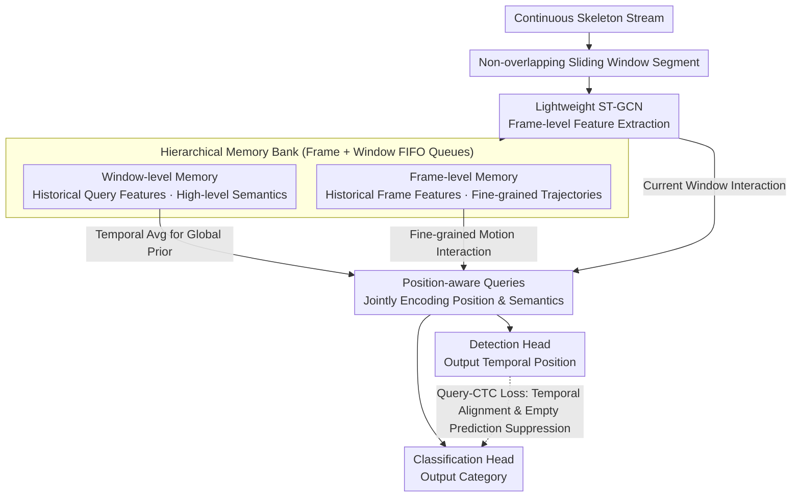

# OMG-Bench: A New Challenging Benchmark for Skeleton-based Online Micro Hand Gesture Recognition

**Conference**: CVPR 2026  
**arXiv**: [2512.16727](https://arxiv.org/abs/2512.16727)  
**Code**: [Project Page](https://omg-bench.github.io/)  
**Area**: Human Understanding / Gesture Recognition  
**Keywords**: Micro hand gesture recognition, online gesture recognition, skeletal data, hierarchical memory, VR/AR interaction

## TL;DR

This paper constructs the first large-scale public benchmark for skeleton-based online micro hand gesture recognition, OMG-Bench (40 classes, 13,948 instances), and proposes the HMATr framework. By utilizing hierarchical memory banks and position-aware queries, HMATr achieves end-to-end unification of detection and classification, outperforming SOTA methods by 7.6% in detection rate.

## Background & Motivation

**Background**: As hand pose estimation technology matures on headsets like Meta Quest and PICO, skeleton-based gesture recognition has become increasingly vital for VR/AR interaction. Current research primarily focuses on macro gestures (large-scale movements) using sliding windows with classification or two-stage detection-classification schemes.

**Limitations of Prior Work**: (1) **Dataset issues**: Existing datasets are small (e.g., SHREC'22 has only 288 sequences and 1,152 instances), have poor skeleton quality (using outdated single-view estimators), and lack dynamics (obvious temporal gaps between gestures that do not reflect real continuous interaction). (2) **Micro gesture gap**: Prolonged use of macro gestures causes arm muscle fatigue. Micro gestures are better suited for long-term interaction, but no public skeleton-based micro gesture datasets currently exist. (3) **Algorithm limitations**: Two-stage methods lack end-to-end optimization; CTC-based methods are prone to empty predictions on weak signals; sliding windows are sensitive to hyperparameters, where non-overlapping windows truncate gestures and overlapping windows cause redundant computation.

**Key Challenge**: Three major challenges of micro gestures—subtle inter-class differences (e.g., thumb touching index fingertip vs. middle fingertip), rapid dynamics (average duration of only 0.57s), and varied temporal lengths—make existing designs inadequate.

**Goal**: (1) Construct a high-quality, large-scale micro gesture benchmark. (2) Design an end-to-end framework to unify detection and classification, addressing window truncation and insufficient cross-window context.

**Key Insight**: On the data side, a multi-view self-supervised hand pose estimation and semi-automatic labeling pipeline are used to ensure quality and scale. On the algorithmic side, the query mechanism from object detection is leveraged to unify detection and classification with learnable queries.

**Core Idea**: Construct the first online micro gesture benchmark and propose the Hierarchical Memory-Augmented Transformer (HMATr). HMATr maintains cross-window context continuity through frame-level and window-level memory banks, while position-aware queries implicitly encode spatial-temporal information of gestures.

## Method

### Overall Architecture

HMATr addresses a fundamental conflict in streaming scenarios: micro gestures are transient (0.57s average) with weak signals, yet online recognition requires segmenting the skeleton stream into short windows. Narrow windows truncate gestures, while wide windows cause redundancy and latency. HMATr utilizes non-overlapping windows for inference but attaches a "memory" system to carry over historical information, achieving context continuity without redundancy.

The pipeline functions as follows: a continuous skeleton stream is segmented into non-overlapping windows; each window is fed into a lightweight ST-GCN to extract frame-level spatial-temporal features. These features participate in recognition and interact with a hierarchical memory bank (frame-level + window-level FIFO queues). Finally, a set of position-aware learnable queries processes both memory and current features, outputting the temporal location and category of each gesture via detection and classification heads.

### Key Designs

**1. Hierarchical Memory Bank: Historical Context for Non-overlapping Windows**

Non-overlapping windows provide low latency but lack context for truncated gestures. The hierarchical memory bank maintains two fixed-length FIFO queues: frame-level memory $\mathcal{M}_f \in \mathbb{R}^{B \times L_f \times C}$ stores skeletal features to preserve fine-grained trajectories, and window-level memory $\mathcal{M}_w \in \mathbb{R}^{B \times L_w \cdot N \times C}$ stores compressed high-level semantics from historical queries. The queue lengths are fixed ($L_f=16$, $L_w=3$). Frame-level memory provides raw evidence of "what happened," while window-level memory provides the abstract semantics of "what it means." Removing this dual-layer memory leads to a 5.8% drop in DR.

**2. Position-aware Query: Unified Detection and Classification**

Traditional methods split "when" (detection) and "what" (classification) into two stages, preventing end-to-end optimization. In micro gestures, these tasks are coupled: localization needs category clues to distinguish meaningful actions, and classification needs precise localization. Position-aware queries initialize from window-level memory to gain historical priors: $\mathcal{M}_w^t$ is averaged to form a global memory query $Q_m^t$. Queries then interact with frame-level memory and current features, allowing detection and classification to share representations and constraints within the same carrier.

**3. Query-CTC Loss: Preventing Signal Loss**

Micro gesture signals are weak, and standard alignment losses like CTC often default to predicting blank tokens. HMATr adds a query-based CTC loss alongside bipartite matching loss (Cross-Entropy + L1/IoU). This forces predicted gestures to align with ground truth on the timestamp axis by leveraging the semantic information already encoded in the queries. Removing this loss results in a 1.9% drop in DR.

### Loss & Training

The total loss is $\mathcal{L} = \lambda_{cls} \mathcal{L}_{cls} + \lambda_{pos} \mathcal{L}_{pos} + \lambda_{q-CTC} \mathcal{L}_{q-CTC}$, with $\lambda_{cls}=2$, $\lambda_{pos}=5$, and $\lambda_{q-CTC}=0.2$. Cross-entropy is used for classification, and L1 combined with IoU is used for localization. Unmatched queries are assigned to the background. Training uses the Adam optimizer with a batch size of 64, learning rate of 0.001, and weight decay of 0.0004.

## Key Experimental Results

### Main Results

| Method | Type | DR↑ | FP↓ | JI↑ | NLD↑ | Inference Time (ms)↓ | Avg Latency (frames)↓ |
|------|------|-----|-----|-----|------|-------------|------------|
| **HMATr (Ours)** | End-to-End | **89.2%** | **0.22** | **0.71** | **0.77** | **1.61** | **7.67** |
| HiOD | Sliding Window | 81.2% | 0.29 | 0.66 | 0.70 | 72.44 | 8.66 |
| Bound.Reg. | Boundary Supervised | 81.6% | 0.37 | 0.59 | 0.61 | 22.64 | 8.82 |
| AG-MAE | Boundary Supervised | 80.7% | 0.28 | 0.65 | 0.72 | 2.36 | 8.25 |
| BlockGCN | Sliding Window | 78.3% | 0.32 | 0.66 | 0.65 | 7.83 | 7.89 |

Generalization on SHREC'22:

| Method | DR↑ | FP↓ | JI↑ |
|------|-----|-----|-----|
| HMATr | **0.85** | **0.08** | **0.79** |
| AG-MAE | 0.82 | 0.13 | 0.74 |
| DSTA | 0.77 | 0.11 | 0.71 |

### Ablation Study

| Configuration | DR↑ | FP↓ | JI↑ | NLD↑ |
|------|-----|-----|-----|------|
| Full HMATr | **89.2%** | **0.22** | **0.71** | **0.77** |
| w/o Frame Memory | 85.7% | 0.26 | 0.67 | 0.73 |
| w/o Window Memory | 86.1% | 0.25 | 0.68 | 0.74 |
| w/o Dual-layer Memory | 83.4% | 0.30 | 0.63 | 0.70 |
| w/o Query-CTC Loss | 87.3% | 0.24 | 0.69 | 0.75 |

### Key Findings
- HMATr outperforms all comparison methods across four metrics, with a 7.6% improvement in DR (relative to Bound.Reg.) while maintaining the fastest inference (1.61ms) and lowest latency (7.67 frames).
- Hierarchical memory is critical: DR drops by 5.8% without dual-layer memory, proving cross-window context is essential for micro gestures.
- Both memory types contribute independently, justifying the multi-granularity design.
- Non-overlapping windows with memory avoid redundant computation while maintaining continuity.

## Highlights & Insights

- **OMG-Bench Scale**: 40 micro gesture classes, 18 subjects, 1,272 sequences, 13,948 instances—far exceeding SHREC'22 (16 classes, 1,152 instances).
- **Data Quality**: Multi-view self-supervised pose estimation yields a mean joint error of only 2.78mm, significantly better than single-view commercial solutions.
- **Challenge Statistics**: Average duration is only 0.57s; 27.60% are consecutive gestures of the same class; normalized joint displacement is only 8.95 (vs. 128.73 in SHREC'22).
- **Architecture**: Replacing overlapping windows with a memory mechanism balances efficiency and performance. The unified query mechanism is more elegant and effective than two-stage schemes.

## Limitations & Future Work

- Currently supports only single-hand micro gestures; bimanual and hand-object interactions are not covered.
- The 40 classes primarily involve thumb interaction; palm-based or spatial trajectory gestures are absent.
- Memory lengths ($L_f=16, L_w=3$) are fixed and may require adaptive adjustment for different interaction tempos.
- Subject diversity remains limited (18 subjects).

## Related Work & Insights

- **vs SHREC'22**: OMG-Bench is superior in scale (12x), quality (multi-view), and challenge level.
- **vs STMG**: The first skeletal micro gesture method used only 7 classes with thumb/index finger. This work uses 21 joints and 40 classes, presenting much higher difficulty.
- **vs OO-dMVMT**: HMATr is 8.1% higher in DR due to the unified query mechanism and hierarchical memory.
- The dataset pipeline is transferable to other fine-grained action recognition tasks, such as surgical operation or sign language recognition.

## Rating
- Novelty: ⭐⭐⭐⭐ Both the dataset and method fill a significant gap in micro gesture recognition.
- Experimental Thoroughness: ⭐⭐⭐⭐⭐ Comprehensive comparisons, ablations, generalization tests, and efficiency analyses.
- Writing Quality: ⭐⭐⭐⭐ Clear structure with detailed statistical analysis.
- Value: ⭐⭐⭐⭐ High contribution as a benchmark to drive VR/AR interaction research.

<!-- RELATED:START -->

## Related Papers

- [\[AAAI 2026\] New Synthetic Goldmine: Hand Joint Angle-Driven EMG Data Generation Framework for Micro-Gesture Recognition](../../AAAI2026/human_understanding/new_synthetic_goldmine_hand_joint_angle-driven_emg_data_generation_framework_for.md)
- [\[CVPR 2026\] Region-Aware Instance Consistency Learning for Micro-Expression Recognition](region-aware_instance_consistency_learning_for_micro-expression_recognition.md)
- [\[CVPR 2026\] RGB-Event based Pedestrian Attribute Recognition: A Benchmark Dataset and An Asymmetric RWKV Fusion Framework](rgb-event_based_pedestrian_attribute_recognition_a_benchmark_dataset_and_an_asym.md)
- [\[CVPR 2026\] CoordSpeaker: Exploiting Gesture Captioning for Coordinated Caption-Empowered Co-Speech Gesture Generation](coordspeaker_exploiting_gesture_captioning_for_coordinated_caption-empowered_co-.md)
- [\[CVPR 2026\] PolySLGen: Online Multimodal Speaking-Listening Reaction Generation in Polyadic Interaction](polyslgen_online_multimodal_speaking-listening_reaction_generation_in_polyadic_i.md)

<!-- RELATED:END -->
