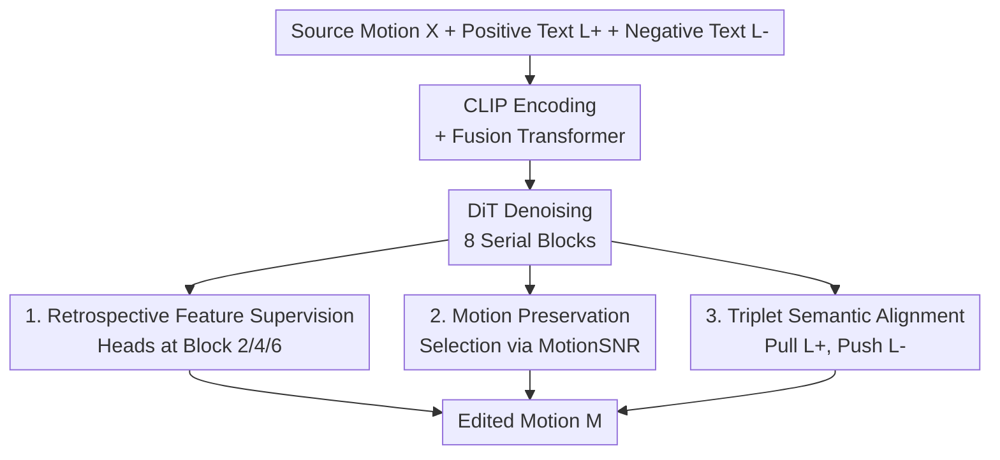

# Omni-Supervised Motion Editing: Balancing Change and Invariance through Positive-Negative Learning

**Conference**: CVPR 2026  
**Paper**: [CVF Open Access](https://openaccess.thecvf.com/content/CVPR2026/html/Shi_Omni-Supervised_Motion_Editing_Balancing_Change_and_Invariance_through_Positive_Negative_Learning_CVPR_2026_paper.html)  
**Code**: https://github.com/rocket-ycyer/OmniME  
**Area**: Human Understanding / Text-driven Motion Editing / Diffusion Models  
**Keywords**: Motion editing, Positive-negative supervision, Retrospective feature supervision, Motion preservation, Triplet alignment  

## TL;DR
OmniME addresses text-driven human motion editing by decomposing supervision into two complementary branches: "positive supervision" (retrospective intermediate feature supervision + similarity-based motion preservation) and "negative supervision" (triplet semantic alignment). Within a diffusion framework, it simultaneously constrains "what to change" and "what to keep," reducing the Average Rank (AvgR) from 20.88 to 13.06 on MotionFix and from 29.05 to 22.77 on STANCE Adjustment.

## Background & Motivation
**Background**: Text-driven human motion editing aims to generate a target motion $M=G(X,L)$ that follows a natural language instruction $L$ (e.g., "perform the second repetition faster") while preserving the unmentioned parts of the source motion $X$. Current mainstream approaches utilize diffusion-based conditional generation, feeding the source motion and text together as conditions for denoising.

**Limitations of Prior Work**: Existing diffusion methods either use coarse-grained global conditioning, which often "blurs" fine-grained semantics—for instance, changing the entire range of motion when only told to "raise hands to shoulder height"—or rely on heuristic similarity cues for local editing, which can compromise temporal continuity and lead to jitter or physically unrealistic poses. The paper highlights two baselines: MotionFix lacks an explicit mechanism to distinguish "editable vs. non-editable regions," and SimMotionEdit introduces similarity-based auxiliary supervision to alleviate motion preservation issues but remains limited in hierarchical alignment and semantic consistency.

**Key Challenge**: The fundamental difficulty in motion editing is the **trade-off between change and invariance**. The model must accurately modify target regions (change) while keeping unedited regions intact to maintain temporal coherence and realism (invariance). These objectives are naturally conflicting: favoring change harms continuity, while favoring invariance prevents effective editing. The paper formulates this trade-off using a preservation factor $m\in[0,1]^F$ as $M = m\odot X + (1-m)\odot\tilde{X}$, explicitly representing the contribution of source vs. edited content per frame.

**Key Insight & Core Idea**: The authors observe that prior methods focus only on "positive supervision" (pulling results toward the target) but neglect "negative supervision" (explicitly informing the model of incorrect semantics). Consequently, OmniME splits supervision: the **positive supervision branch** ensures "correct editing + preservation," while the **negative supervision branch** prevents "semantic drift." Together, they form an "omni-supervised" system that imposes constraints at the feature, motion, and semantic levels simultaneously.

## Method

### Overall Architecture
OmniME is a diffusion-based motion editor based on a "Fusion Transformer $\to$ Diffusion Transformer / DiT" backbone. Inputs consist of the source motion, positive text (instruction), and a randomly sampled negative text, outputting the edited motion. The workflow involves: encoding positive/negative text into semantic features via CLIP (ViT-L/14); merging source motion and positive text features through a 4-layer Fusion Transformer; and feeding the fused info into a DiT composed of **8 serial transformer blocks** for denoising. Three additional supervision sets are attached to this backbone; they do not alter the network architecture but modify supervision signals during training.

Specifically: ① Lightweight prediction heads are attached to DiT blocks 2, 4, and 6 for intermediate layer supervision (retrospective feature supervision) using ground-truth targets. ② A preservation loss is added for samples identified as having "subtle changes" based on source-target frame-wise similarity. ③ A triplet loss is applied to the final DiT motion embedding alongside positive/negative text embeddings. The final objective is the weighted sum of diffusion loss, classification loss, and these three auxiliary losses.

### Key Designs

**1. Retrospective Feature Supervision: Stabilizing Optimization through Layer-wise Alignment**

Diffusion transformers usually only supervise the final layer, leaving intermediate representations unconstrained, which can lead to early drift during training. OmniME follows the SimMotionEdit concept but "advances" supervision to intermediate layers. After DiT blocks $l\in\{2,4,6\}$, a lightweight projection head $f^{(l)}(\cdot)$ maps the latent representation $h^{(l)}\in\mathbb{R}^{B\times T\times D}$ back to motion space $\hat{x}^{(l)}=f^{(l)}(h^{(l)})$, calculating frame-wise MSE against the ground-truth $x$: $L^{(l)}=\frac{1}{BTJ}\sum_{b,t}\lVert \hat{x}^{(l)}_{b,t}-x_{b,t}\rVert_2^2$.

The "retrospective" aspect lies in the aggregation: losses from layers 2/4/6 are weighted and combined with the final layer (reconstruction) loss: $L_{\text{retro}}=\sum_{l\in\{2,4,6\}}\lambda_l L^{(l)}$. This ensures the **final layer remain the primary signal**, while intermediate layers progressively guide representations toward the target distribution, enhancing stability and facilitating fine-to-coarse editing correspondence.

**2. Motion Preservation Mechanism: Prioritizing "Subtle Change" Samples via MotionSNR**

Lacking explicit signals for "which frames to keep" often causes global supervision to overwrite frames that should remain unchanged. OmniME calculates this from the data. Frame-wise similarity is computed in three steps: first, calculating raw similarity in rotation and joint position spaces using a sliding window $W$: $SR^r_i=-\min_{|i-j|\le W}d_r(x_i,m_j)$; second, merging these into a scale-invariant temporal similarity curve $SR_i$; third, calculating **MotionSNR** (Motion Signal-to-Noise Ratio) $\text{MotionSNR}=\frac{\sum_{x\in TR}x}{\sum_{x\in BR}x}$, where $TR$ and $BR$ are top-$\kappa$ and bottom-$\kappa$ frames ranked by similarity.

A high MotionSNR indicates that the edited motion is highly consistent with the source (a "subtle editing" case). For samples exceeding a threshold $\tau$, an additional preservation loss is applied: $L_{\text{presv}}=\mathbb{I}\big(\text{MotionSNR}(x,m)>\tau\big)\cdot\frac{1}{T}\sum_i\lVert m_i-x_i\rVert_2^2$. The intuition is that for minor edits, the model should focus on reconstructing unedited frames exactly while isolating the few frames that need change.

**3. Triplet Semantic Alignment: Enhancing Text-Motion Correspondence with Negative Samples**

Restricting supervision to positive targets can result in less "sharp" semantic alignment as the model lacks a concept of "incorrect semantics." For this negative branch, OmniME takes the final DiT latent representation $h^{(L)}$ and performs temporal mean pooling to get a motion embedding $z_m=\frac{1}{T}\sum_t h^{(L)}_t\in\mathbb{R}^{B\times D}$. Given a positive text feature $z_p$ and a randomly sampled negative text feature $z_n$, the triplet loss is defined as $L_{\text{triplet}}=\frac{1}{B}\sum_i\big[\lVert z^i_m-z^i_p\rVert_2^2-\lVert z^i_m-z^i_n\rVert_2^2+\alpha\big]_+$ with margin $\alpha=0.2$. This pulls the result toward the instruction while pushing it away from irrelevant semantics.

### Loss & Training
The total loss is a weighted sum:

$$L_{\text{total}} = L_{\text{diff}} + \lambda_{\text{cls}}L_{\text{cls}} + \lambda_{\text{retro}}L_{\text{retro}} + \lambda_{\text{preserve}}L_{\text{preserve}} + \lambda_{\text{triplet}}L_{\text{triplet}}$$

Weights: $\lambda_{\text{retro}}=1$, $\lambda_{\text{triplet}}=0.01$. $\lambda_{\text{preserve}}$ is $0.2$ for MotionFix and $0.1$ for STANCE. Training uses 300 diffusion steps, cosine noise scheduling, and a guidance scale of 2 for both text/motion conditions. Fusion/Diffusion transformers have 4 and 8 layers respectively, with 8 heads and a hidden dimension of 512. Optimized via AdamW ($1\times10^{-4}$) for 1500 epochs on an A6000.

## Key Experimental Results

Evaluation utilizes the "motion-to-motion retrieval" protocol from MotionFix: extracting features with a pre-trained TMR and calculating retrieval accuracy (R@1/2/3) and Average Rank (AvgR, lower is better) across a fixed batch (Batch=32) and the full Test Set.

### Main Results

MotionFix Dataset (Generated-to-Target):

| Method | Conference | R@1↑(Batch) | AvgR↓(Batch) | R@1↑(Test) | AvgR↓(Test) |
|------|------|------|------|------|------|
| MDM | ICLR'23 | 4.03 | 15.55 | 0.10 | — |
| TMED | SIGGRAPH Asia'24 | 62.90 | 2.71 | 14.51 | 56.63 |
| MotionReFit | CVPR'25 | 66.33 | 2.64 | — | — |
| SimMotionEdit | CVPR'25 | 70.62 | 2.38 | 25.49 | 23.49 |
| SimMotionEdit* | CVPR'25 | 71.04 | 2.22 | 26.88 | 20.88 |
| **Ours** | — | **77.29** | **1.79** | **32.02** | **13.06** |

STANCE Adjustment Dataset (Generated-to-Target):

| Method | Conference | R@1↑(Batch) | AvgR↓(Batch) | R@1↑(Test) | AvgR↓(Test) |
|------|------|------|------|------|------|
| TMED | SIGGRAPH Asia'24 | 29.69 | 6.97 | 11.22 | 35.56 |
| SimMotionEdit* | CVPR'25 | 36.46 | 5.71 | 12.76 | 29.05 |
| MotionReFit | CVPR'25 | 42.45 | 5.12 | — | — |
| **Ours** | — | **43.75** | **4.66** | **22.45** | **22.77** |

OmniME leads across both datasets and settings. The most significant Gains are seen in Test Set AvgR (20.88 $\to$ 13.06; 29.05 $\to$ 22.77). (`*` denotes variants without explicit text conditions in the DiT stage).

### Ablation Study

Incremental addition of modules on MotionFix (Base is SimMotionEdit* reproduction, #1):

| # | $L_{\text{retro}}$ | $L_{\text{triplet}}$ | $L_{\text{preserve}}$ | R@1↑(Batch) | AvgR↓(Batch) | R@1↑(Test) | AvgR↓(Test) |
|---|---|---|---|------|------|------|------|
| 1 | | | | 71.04 | 2.22 | 26.88 | 20.88 |
| 2 | ✓ | | | 72.71 | 2.09 | 30.63 | 18.62 |
| 3 | | ✓ | | 73.54 | 2.04 | 28.26 | 17.99 |
| 4 | | | ✓ | 75.62 | 1.88 | 30.24 | 15.58 |
| 5 | ✓ | ✓ | | 74.58 | 1.98 | 31.82 | 16.82 |
| 6 | ✓ | ✓ | ✓ | **77.29** | **1.79** | **32.02** | **13.06** |

Cross-dataset Robustness (Train on MotionFix $\to$ Test on STANCE, Test Set):

| Method | R@1↑ | R@2↑ | R@3↑ | AvgR↓ |
|------|------|------|------|------|
| SimMotionEdit*† | 21.43 | 33.04 | 42.41 | 8.80 |
| **Ours** | **22.40** | **35.94** | **47.40** | **7.44** |

### Key Findings
- **Complementary Components**: Adding any single component (#2/#3/#4) improves upon the baseline. Motion preservation (#4) provides the largest individual Gain in AvgR(Test) ($20.88 \to 15.58$), while using all three (#6) yields the best result, verifying the synergy of positive and negative supervision.
- **Value of Negative Supervision**: Triplet loss alone (#3) reduces AvgR(Test) from 20.88 to 17.99, proving that pushing away incorrect semantics is a significant contributor.
- **Generalization vs. Overfitting**: Superior cross-dataset performance indicates that the change/invariance balance captures general motion editing principles rather than dataset-specific biases.
- **Human Alignment**: A user study ($n=30$) showed OmniME outperforms SimMotionEdit in semantic alignment, motion preservation, smoothness, and naturalness.

## Highlights & Insights
- **Explicit Negative Supervision**: Unlike previous methods focusing solely on positive targets, OmniME explicitly defines "wrong" semantics through triplet loss, providing a clearer "positive-negative" dichotomy.
- **Data-Driven Preservation vs. Manual Masks**: MotionSNR transforms motion preservation from a manual marking/heuristic task into a computable frame-wise statistic. This approach of "letting sample difficulty dictate supervision intensity" is transferable to image/video editing contexts.
- **Zero-Cost Retrospective Mechanism**: Attaching lightweight heads to intermediate DiT blocks stabilizes training without altering the core architecture—a reusable trick for intermediate layer alignment.
- **Orthogonal Supervision Layers**: Designing constraints at the feature (retro), motion (preserve), and semantic (triplet) levels allows individual improvements to aggregate effectively for the final performance.

## Limitations & Future Work
- **Scope**: Current framework is limited to single-person editing; multi-person interaction and interactive refinement are cited for future research.
- **Hyperparameter Sensitivity**: MotionSNR parameters ($W$, $\kappa$, $\tau$) require tuning per dataset, potentially complicating transfer to significantly different motion types.
- **Evaluation Metrics**: Main results rely heavily on TMR retrieval; more quantitative metrics for generation quality (e.g., FID) or physical validity could strengthen the analysis.
- **Instruction Sampling**: Negative samples are currently random; mining "hard negatives" (instructions semantically similar but in opposite directions) might further refine the triplet loss efficacy.

## Related Work & Insights
- **vs. MotionFix (TMED)**: MotionFix established the dataset and diffusion baseline but lacked a mechanism for region-specific preservation. OmniME improves AvgR(Test) from 56.63 to 13.06 on this benchmark.
- **vs. SimMotionEdit**: SimMotionEdit pioneered source-target similarity for preservation. OmniME extends this via MotionSNR and adds negative supervision and retrospective alignment, filling gaps in semantic consistency.
- **vs. MotionReFit**: MotionReFit utilizes MotionCutMix (MCM) data augmentation. OmniME achieves superior R@1 (77.29 vs. 66.33) on MotionFix Batch by focusing on supervision strategy rather than data augmentation.

## Rating
- Novelty: ⭐⭐⭐⭐ Introducing an explicit positive/negative supervision dichotomy to motion editing is a strong perspective.
- Experimental Thoroughness: ⭐⭐⭐⭐ Multiple datasets and user studies provide good coverage, though physical validity metrics are missing.
- Writing Quality: ⭐⭐⭐⭐ Logic is clear and framework diagrams are helpful; minor ambiguities in some hyperparameter descriptions.
- Value: ⭐⭐⭐⭐ SOTA performance and open-source code; the MotionSNR selection and negative supervision concepts are valuable for other editing tasks.

<!-- RELATED:START -->

## Related Papers

- [\[CVPR 2026\] MotionMaster: Generalizable Text-Driven Motion Generation and Editing](motionmaster_generalizable_text-driven_motion_generation_and_editing.md)
- [\[ECCV 2024\] CoMo: Controllable Motion Generation Through Language Guided Pose Code Editing](../../ECCV2024/human_understanding/como_controllable_motion_generation_through_language_guided_pose_code_editing.md)
- [\[CVPR 2026\] LaMoGen: Language to Motion Generation Through LLM-Guided Symbolic Inference](lamogen_language_to_motion_generation_through_llm-guided_symbolic_inference.md)
- [\[AAAI 2026\] Modality-Aware Bias Mitigation and Invariance Learning for Unsupervised Visible-Infrared Person Re-Identification](../../AAAI2026/human_understanding/modality-aware_bias_mitigation_and_invariance_learning_for_unsupervised_visible-.md)
- [\[CVPR 2026\] Geometric Neural Distance Fields for Learning Human Motion Priors](geometric_neural_distance_fields_for_learning_human_motion_priors.md)

<!-- RELATED:END -->
