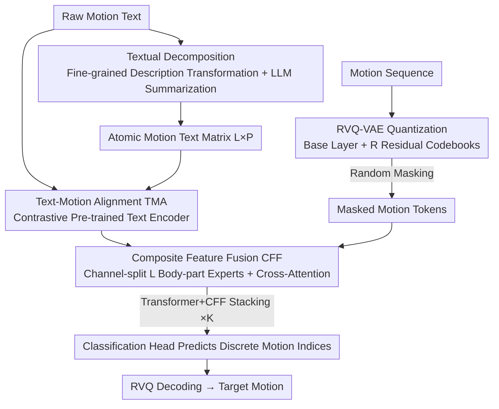

# Open the Motion Door: Atomic Motion Decomposition and Recomposition for Open-Vocabulary Motion Generation

**Conference**: CVPR 2026  
**Paper**: [CVF Open Access](https://openaccess.thecvf.com/content/CVPR2026/html/Fan_Open_the_Motion_Door_Atomic_Motion_Decomposition_and_Recomposition_for_CVPR_2026_paper.html)  
**Code**: Project Page https://vankouf.github.io/OpenTheMotionDoor/  
**Area**: Human Understanding / Text-driven Motion Generation  
**Keywords**: Text-to-Motion, Open-vocabulary, Atomic Motion, Decomposition-Recomposition, RVQ-VAE  

## TL;DR
To address the poor generalization of Text-to-Motion (T2M) models on out-of-distribution text, this paper proposes an "Atomic Motion Decomposition-Recomposition" framework. It decomposes arbitrary raw text into low-level "atomic motion" descriptions across different body parts and time intervals, then learns to recompose these atomic motions into complete sequences. Using only HumanML3D for training, it significantly outperforms SOTA models on two out-of-distribution datasets (IDEA400, Mixamo).

## Background & Motivation
**Background**: Current text-to-motion generation paradigms primarily follow three approaches: simple mapping (e.g., T2M-GPT, MMM learn a direct transformation from text to motion), cross-domain alignment (e.g., MotionCLIP/OOHMG align text, motion, and image spaces using CLIP), and pre-training followed by fine-tuning (e.g., OMG pre-trains a diffusion model on large unlabeled motion data before fine-tuning on small paired datasets).

**Limitations of Prior Work**: These three paradigms essentially learn a direct "raw text $\to$ raw motion" mapping. Constrained by the scale and semantic diversity of paired datasets (e.g., HumanML3D), models fail to cover the complete open-vocabulary motion space. They struggle with novel, complex, or fine-grained descriptions not present in the training set. Even large-scale attempts like MotionMillion (2000+ hours, 7B parameters) still face bottlenecks in data quality and scale, containing many low-quality, noisy, or redundant samples.

**Key Challenge**: While high-level motion semantics are highly diverse (long-tail), paired data can never fully cover this tail. Simply increasing data volume and model size leads to high costs and diminishing returns.

**Key Insight**: Inspired by observations from PRIMAL—where human motion is physics-dominated in short time windows and semantics-dominated in long windows—the authors note that short motion segments can span the entire motion space. They propose a critical insight: **although high-level semantics vary, many motions share a common set of underlying "atomic motions" (simple, reusable body-part movements)**. For instance, while "getting shot and falling, then kneeling" may not be in the training set, its components (leaning forward, bending knees) appear in other samples (e.g., swimming).

**Core Idea**: By using "atomic motions" as an intermediate representation, the generation process is split into two steps: decomposing out-of-distribution (OOD) raw text into a sequence of atomic motion descriptions, and then recomposing these atomic motions into the target motion. Since atomic motions decomposed from OOD text often overlap with in-distribution ones, this "decomposition-recomposition" paradigm significantly enhances generalization.

## Method

### Overall Architecture
The method adopts a **discrete generative masked modeling** paradigm consisting of two main stages: training a Residual VQ-VAE (RVQ) to quantize motions into discrete tokens, and training a text-to-motion masked generative model. Given a motion-language description, the generative model synthesizes motion through two sequentially coupled phases: (1) **Textual Decomposition**, which maps arbitrary text to a set of atomic descriptions characterizing specific body parts over short intervals, resulting in an $L \times P$ matrix ($L$ body parts, $P$ time segments); (2) **Atomic Recomposition**, which synthesizes the target motion from atomic descriptions via the Text-Motion Alignment (TMA) module and the Composite Feature Fusion (CFF) module.

The generative model comprises $K$ stacked layers of "Transformer layers + CFF blocks." The Transformer layers handle global interaction between motion and text, while CFF blocks enforce local compositionality of atomic inputs. During training, motion tokens are predicted after random masking. During inference, all tokens are initialized as `[MASK]`, the LLM extracts atomic text, and masked tokens are iteratively predicted (low-confidence tokens are re-masked, high-confidence tokens are fixed) until the sequence is resolved. Finally, the RVQ decoder restores the motion sequence.

### Key Designs

**1. Atomic Motion as Intermediate Representation: Replacing an incomplete semantic space with a reusable motion primitive space**

This is the central observation of the paper. Direct "raw text $\to$ raw motion" learning generalizes poorly because raw text carries abstract, high-level semantics, and paired data is insufficient; the model only learns a mapping between restricted subsets of the text and motion spaces. The authors use atomic motions (low-level movements of a single body part in short windows, e.g., "bending knee," "lowering left hand") as a bridge. While high-level semantics vary, low-level atomic motions are highly shared and combinable. t-SNE visualizations confirm that raw text features differ significantly across HumanML3D, IDEA400, and Mixamo, whereas the distributions nearly overlap after textual decomposition, proving that atomic motions cover behavior across datasets and eliminate domain gaps.

**2. Textual Decomposition: Rule-based fine-grained description + LLM summarization**

Decomposing motion into atomic units is challenging, and existing methods that rely solely on LLMs to split raw text into body-part narratives cannot guarantee consistency with actual motion. This paper designs a **fine-grained description transformation algorithm** to characterize joint-level changes from three perspectives: velocity, magnitude, and behavior category. The process involves four steps: ① **Pose Extraction**: Extracting descriptors $PD_i$ (joint angles, orientation, position, etc.) for each frame; ② **Pose Aggregation**: Comparing differences $\Delta PD$ across consecutive frames to merge monotonic changes into segments, calculating cumulative change $SP_{D_i}$ and velocity $V_{P_{D_i}}$; ③ **Segment Aggregation**: Uniformly dividing the sequence into $P$ temporal bins; ④ **Description Transformation**: Mapping segment descriptors to behavior labels (e.g., negative $SP_{D_i}$ for joint angles is labeled "bending," positive "extending"), producing phrases like "slowly and significantly bending." These descriptions are fed into an LLM with the raw text to generate $L$ atomic descriptions per bin. This "rule-then-LLM" strategy ensures atomic text semantically matches real motion behavior better than pure LLM approaches.

**3. Text-Motion Alignment TMA: Training a text encoder on paired data to replace misaligned CLIP features**

Traditional T2M models use CLIP to extract text features and align them to motion space via linear layers or attention. However, CLIP is trained on text-image pairs (static descriptions), creating a gap with temporal motion descriptions. Learning this alignment during generation distracts the network from "atomic $\to$ target" composition. Inspired by the TMR retrieval method, the authors pre-train a text encoder (TMA) on **text-motion paired data** using a contrastive InfoNCE loss:

$$\mathcal{L}_{NCE}=-\frac{1}{2M}\sum_i\left(\log\frac{\exp(A_{ii}/\tau)}{\sum_j\exp(A_{ij}/\tau)}+\log\frac{\exp(A_{ii}/\tau)}{\sum_j\exp(A_{ji}/\tau)}\right)$$

where $A_{ij}$ is the similarity between motion and text embeddings and $\tau$ is a temperature parameter. The trained TMA extracts features for both raw and atomic text. Because these features are inherently aligned to the motion space, the downstream CFF module can focus on structured fusion rather than denoising alignment.

**4. Composite Feature Fusion CFF: Splitting motion channels into body-part experts for cross-attention with atomic text**

CFF injects atomic text features into motion features to guide the generative model through a structured composition process. Specifically, the motion embedding $\tilde m_1 \in \mathbb{R}^{N \times D_m}$ from the previous layer is split along the channel dimension into $L$ branches ($L \times D_W = D_m$), where each branch acts as a body-part "expert," reshaped to $\tilde m_2 \in \mathbb{R}^{L \times N \times D_W}$. Using atomic text embeddings $T_a \in \mathbb{R}^{L \times P \times D_W}$ as Key/Value and $\tilde m_2$ as Query, cross-attention is performed: $\tilde m_3 = F_{CFF}(\tilde m_2; T_a)$. This results in a fused representation of atomic motions, which is reshaped and projected back to $\tilde m_o \in \mathbb{R}^{N \times D_m}$. Compared to related work like ATOM, CFF allows each atomic motion to interact with multiple pose features, providing richer temporal context.

### Loss & Training
The RVQ-VAE is pre-trained on large-scale unlabeled motion data to obtain discrete representations. The TMA text encoder is pre-trained on paired data using InfoNCE. The main generative model is trained via masked modeling, with a classification head predicting discrete indices using Cross-Entropy loss. Training uses only HumanML3D paired data.

## Key Experimental Results

### Main Results
Trained only on HumanML3D and evaluated on in-domain (HumanML3D) and two out-of-distribution (OOD) datasets (IDEA400 daily motions, Mixamo artist animations). Metrics include FID (lower is better), R-Precision (higher is better), and Diversity (higher is better).

| Dataset | Metrics | Ours | T2M-GPT | MMM | ATOM |
|--------|------|------|---------|-----|------|
| HumanML3D (In-domain) | FID↓ / R-Prec↑ | 0.132 / 0.498 | 0.116 / 0.491 | **0.080** / 0.504 | 1.691 / 0.343 |
| IDEA400 (OOD) | FID↓ / R-Prec↑ | **0.847** / **0.449** | 0.934 / 0.211 | 1.051 / 0.183 | 0.946 / 0.190 |
| Mixamo (OOD) | FID↓ / R-Prec↑ | **0.186** / **0.516** | 0.221 / 0.249 | 0.471 / 0.171 | 0.342 / 0.249 |

While performance on the in-domain HumanML3D is comparable to SOTA (with MMM slightly better in FID), **Ours significantly leads on the two OOD datasets**. R-Precision jumps from 0.249 (T2M-GPT/ATOM) to 0.449 on IDEA400, and from 0.249 to 0.516 on Mixamo. Qualitatively, Ours correctly generates composite motions that even MotionMillion (7B parameters, millions of samples) fails to perform—such as "walking while raising an object above the head," where MotionMillion typically misses the walking component.

### Ablation Study
Evaluation of module impact on HumanML3D and IDEA400 (CFF\* denotes a naive concatenation of atomic and raw text):

| Configuration | IDEA400 FID↓ | IDEA400 R-Prec↑ | Explanation |
|------|-------------|-----------------|------|
| Baseline | 0.898 | 0.160 | Raw text only |
| Baseline+CFF\* | 0.890 | 0.162 | Naive concatenation; negligible gain |
| Baseline+CFF | 0.886 | 0.170 | Feature-level fusion; minor improvement |
| Baseline+TMA | 0.844 | 0.380 | R-Precision nearly doubles |
| Baseline+TMA+CFF (Full) | 0.847 | **0.449** | Full model |

### Key Findings
- **TMA is the primary engine for generalization**: Adding TMA alone nearly doubles R-Precision on IDEA400, proving that aligning text features to the motion space relieves the model from the burden of learning composition from scratch.
- **CFF requires TMA**: Adding CFF on top of TMA increases R-Precision by ~11% (0.380→0.449), whereas adding CFF without TMA only yields ~3% gain. Naive concatenation (CFF\*) is ineffective, proving that feature-level, body-part-aware structural fusion is key.
- **CFF benefits OOD most**: The gain from CFF on OOD IDEA400 is significantly larger than on in-domain HumanML3D, as it is specifically designed for open-vocabulary generalization.

## Highlights & Insights
- **Turning generalization into a composition problem**: Instead of hoping paired data covers long-tail semantics, the model acknowledges that low-level atomic motions are reusable. This shifts the challenge from data scale to compositionality.
- **Practical "Rule-then-LLM" decomposition**: Pure LLM decomposition often lacks physical grounding. Using deterministic joint-level rules to "anchor" descriptions to real movement before LLM summarization ensures both fidelity and readability.
- **Expert-based Fusion**: Dividing motion features into $L$ body-part experts and using cross-attention with aligned atomic text provides a structural template for composite generation tasks.
- **Distribution alignment via t-SNE**: Providing visual proof that atomic representations overlap across domains while raw text features do not is a highly effective way to demonstrate the value of the proposed representation.

## Limitations & Future Work
- Textual decomposition depends on a handcrafted algorithm (thresholds, bin count $P$, and body part divisions $L$). Discussion on sensitivity and cross-skeleton transferability is limited.
- Inference requires online LLM decomposition, introducing latency and costs not suitable for real-time applications.
- Body parts are fixed into 6 categories (spine, limbs, root), which may be insufficient for ultra-fine-grained motions like finger or facial expressions.
- Slight FID regression on HumanML3D suggests that prioritizing generalization may come with a minor cost to in-domain fitting.

## Related Work & Insights
- **vs. Direct Mapping (T2M-GPT / MMM)**: These models learn direct transforms that break down in OOD scenarios; Ours uses atomic motion as a bridge to leverage reusable primitives.
- **vs. ATOM**: ATOM uses learnable codebooks for decomposition, but its atomic elements lack temporal context in cross-attention; Ours uses textual descriptions with richer temporal-spatial interactions in CFF.
- **vs. Alignment (MotionCLIP / OOHMG)**: These methods lose temporal dynamics by relying on static pose-image CLIP priors; Ours maintains dynamics through TMA on text-motion pairs.
- **vs. Scaling (MotionMillion)**: Rather than massive data scaling, this work achieves open-vocabulary capability through "decomposition-recomposition" on limited paired data.

## Rating
- Novelty: ⭐⭐⭐⭐⭐ Uses atomic motion as an intermediate representation to frame generalization as a composition problem.
- Experimental Thoroughness: ⭐⭐⭐⭐ Solid multi-dataset evaluation and ablation, though lacks hyperparameter sensitivity analysis.
- Writing Quality: ⭐⭐⭐⭐ Clear motivation and good visualization, though some implementation details are deferred to the supplement.
- Value: ⭐⭐⭐⭐⭐ Provides a reusable paradigm for low-resource, open-vocabulary generation.

<!-- RELATED:START -->

## Related Papers

- [\[CVPR 2026\] OSMO: Open-vocabulary Self-eMOtion Tracking](osmo_open-vocabulary_self-emotion_tracking.md)
- [\[CVPR 2026\] OpenT2M: No-frill Motion Generation with Open-source, Large-scale, High-quality Data](opent2m_no-frill_motion_generation_with_open-source_large-scale_high-quality_dat.md)
- [\[CVPR 2026\] Learning to Diversify and Focus: A Reinforcement Framework for Open-Vocabulary HOI Detection](learning_to_diversify_and_focus_a_reinforcement_framework_for_open-vocabulary_ho.md)
- [\[CVPR 2026\] Causal Motion Diffusion Models for Autoregressive Motion Generation](causal_motion_diffusion_models_for_autoregressive_motion_generation.md)
- [\[CVPR 2026\] HandX: Scaling Bimanual Motion and Interaction Generation](handx_scaling_bimanual_motion_and_interaction_generation.md)

<!-- RELATED:END -->
