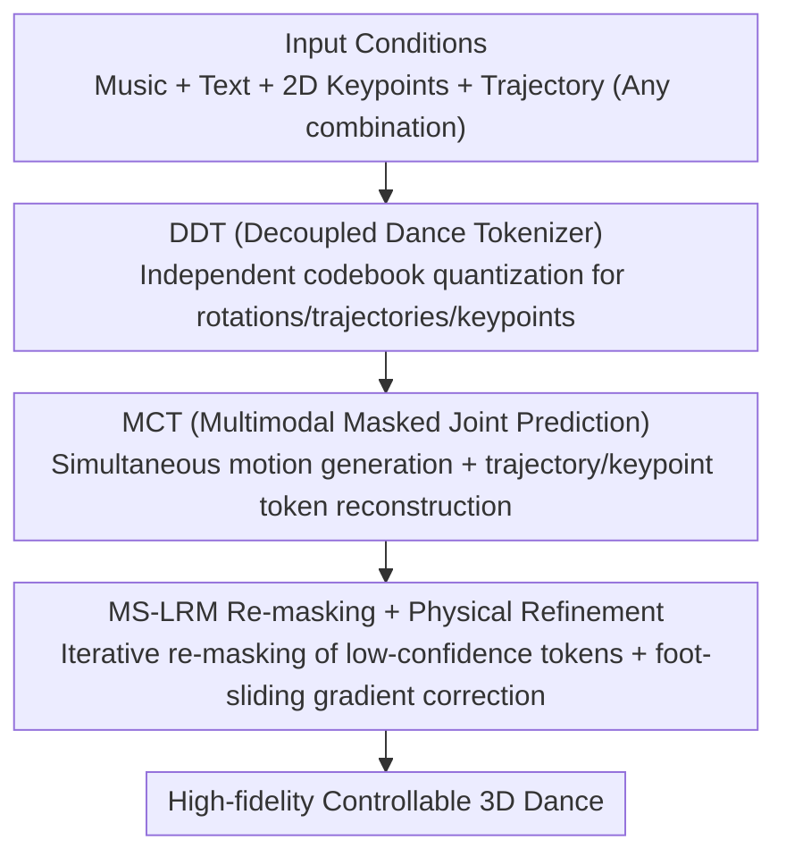

# OpenDance: Multimodal Controllable 3D Dance Generation with Large-scale Internet Data

**Conference**: CVPR 2026  
**Paper**: [CVF Open Access](https://openaccess.thecvf.com/content/CVPR2026/html/Zhang_OpenDance_Multimodal_Controllable_3D_Dance_Generation_with_Large-scale_Internet_Data_CVPR_2026_paper.html)  
**Code**: https://open-dance.github.io (Project Page)  
**Area**: Human Understanding / 3D Dance Generation  
**Keywords**: 3D Dance Generation, Multimodal Controllable, Masked Modeling, Motion Dataset, Physical Plausibility

## TL;DR
OpenDance introduces OpenDanceSet, a 100-hour large-scale 3D dance dataset across 14 genres with multimodal annotations (music, text, 2D keypoints, trajectories) derived from internet videos. Simultaneously, it proposes OpenDanceNet, a unified framework utilizing "decoupled tokenization + multimodal masked joint prediction + inference-time re-masking refinement" to achieve high-fidelity and finely controllable 3D dance generation driven by "music + arbitrary condition combinations."

## Background & Motivation
**Background**: Music-driven 3D dance generation holds immense potential in virtual humans, gaming, and AR/VR. Recent diffusion and autoregressive models, combined with paired music-dance data, have enabled the synthesis of dance movements without manual intervention.

**Limitations of Prior Work**: Most existing methods lack "flexible controllability." Real-world choreography requires precise spatial control (key poses, stage positioning) and stylistic control (musical beats, genres, movement styles). Mainstream generative models typically only accept music and cannot process fine-grained user conditions. A few works supporting spatial editing or seed motion fine-tuning lack a unified framework capable of handling arbitrary multimodal combinations like "text + keyframes + trajectories."

**Key Challenge**: Controllable generation is hindered by two main factors. First, **Data**: Existing datasets are mostly captured via motion capture (mocap) systems, resulting in small scales (often <1 hour per genre) and a lack of paired multimodal annotations (text, 2D keypoints). While some works use text-motion datasets for training, the distribution gap between general human motion and dance motion leads to suboptimal results. Second, **Model**: Different control modalities (language, motion, spatial position) provide varying strengths of supervisory signals. Naive joint optimization often leads the network to "take shortcuts" by learning high-level style signals while ignoring difficult fine-grained spatial signals.

**Goal**: ① Construct a large-scale, richly annotated multimodal dance dataset; ② Design a unified model capable of controllable generation from arbitrary multimodal condition combinations.

**Key Insight**: Regarding data, the authors leverage advances in video motion reconstruction to extract 3D dance from massive internet videos (instead of expensive mocap), providing style signals (music, text) and spatial signals (keypoints, trajectories). Regarding the model, various modalities are **first decoupled and then unified via masked joint prediction**, treating difficult-to-learn spatial tokens as prediction targets to force the model to utilize them.

**Core Idea**: Use decoupled discrete tokens to represent each control modality, followed by a multimodal masked Transformer that "generates motion tokens while reconstructing trajectory/keypoint tokens," combined with inference-time physical refinement for controllable dance generation under any "music + X" condition.

## Method

### Overall Architecture
OpenDanceNet decomposes controllable dance generation into three stages: "Tokenization → Joint Prediction → Inference Refinement." First, the **Decoupled Dance Tokenizer (DDT)** independently encodes joint rotations, global trajectories, and 2D keypoints into discrete tokens to avoid premature cross-modal fusion. Then, the **Multimodal Condition Transformer (MCT)** performs masked joint prediction—music and text serve as style conditions, while keypoints and trajectories serve as spatial conditions. The model predicts both motion tokens and reconstructs masked trajectory/keypoint tokens. During inference, iterative masked prediction is performed, using **MS-LRM re-masking + physical refinement** to gradually improve quality and physical plausibility. The framework naturally supports sparse frame-level constraints (e.g., partial keypoints or trajectories) to generate coherent dance.

### Key Designs

**1. OpenDanceSet: Scaling Multimodal Dance Data from Web Videos**

To address small scales and lack of multimodal labels, the authors filtered ~600 hours of in-the-wild videos to obtain 100.26 hours of 3D dance involving 14 sub-genres, 147 dancers, and 41K sequences longer than 60s, all resampled to 30FPS. A semi-automated pipeline integrates pre-trained estimators, LLMs, manual annotation, and professional artists: GPT generates retrieval queries, YOLOX filters for soloists, and 2D keypoints are extracted and de-jittered. 3D motion is fitted to SMPL using a world-coordinate-based learned estimator. Text is labeled by professional artists for main/sub-genres and by LLMs for limb details based on keypoint visualization. Audio features include Jukebox (4,800-dim) and Librosa (beats + 35-dim low-level features). Post-processing uses Kalman filtering, PFC for foot-sliding penalization, and filtering based on jitter, stillness, and human alignment (via MotionCritic). User studies show OpenDanceSet outperforms AIST++ in realism (62.4%) and diversity (58.8%).

**2. DDT Decoupled Tokenizer: Modal-Independent Quantization for Sparse Constraints**

Existing methods suffer from insufficient motion diversity and weak alignment between continuous control signals and latent spaces. DDT trains a shared tokenizer on OpenDanceSet, AIST++, and AMASS. Joint rotations $J$, global trajectories $X$, and 2D keypoints $K$ are **independently** mapped to latent features $z_i$ and quantized into discrete tokens using three independent codebooks $C_i=\{c_n\}_{n=1}^N$, resulting in a unified discrete representation $\hat z\in\mathbb R^{3\times T\times d}$. By **deliberately avoiding early cross-modal fusion**, sparse frame-level constraints can be encoded into tokens through their respective branches, ensuring a consistent mapping for precise multi-conditional generation.

**3. Multimodal Masked Joint Prediction (MCT): Targeting Difficult Spatial Tokens**

Naive approaches treat 2D keypoints and trajectories as "additional conditions" and only generate motion tokens. The authors found this insufficient because spatial signals impose strict frame-level constraints that the network tends to ignore in favor of coarse style conditions. MCT is designed as a **joint predictor**: it generates motion tokens from masked sequences and reconstructs ground-truth trajectory and keypoint tokens. Modalities are tokenized (Jukebox for music, CLIP for text, DDT for keypoints/trajectories) and concatenated as $Z=[Z_{music},Z_{text},Z_{traj},Z_{kpts}]$. **Modality-level random masking** with probability $p_{mask}$ is applied to music/text, while token-level masking is applied to trajectories/keypoints to prevent over-reliance on a single modality. Optimizing cross-entropy:

$$L^{mask}_{CE}=-\mathbb E_Z\Big[\sum_{i\in M}\log p_\theta(z_i\mid Z_{mask})\Big].$$

Jointly predicting spatial tokens forces the model to capture cross-modal relationships and reduces foot sliding.

**4. Inference-time MS-LRM Re-masking + Physical Refinement**

Since training uses multimodal masking, MCT naturally supports inference with any condition combination. User-provided sparse constraints are injected as hard conditions after DDT tokenization. Inference involves $N$ steps of iterative masked prediction. **MS-LRM (Multi-Step Logit-Ranked Re-Masking)** is used to re-mask low-confidence tokens across all iterations. To suppress foot sliding, physical-aware refinement is performed at each step: motion tokens are sampled via Gumbel-Softmax, decoded via DDT, and 3D joints are calculated via Forward Kinematics. The logits are updated using the gradient of the foot-sliding loss $L_{fs}$ as $\hat e_{logits}=e_{logits}-\epsilon\nabla_{e_{logits}}L_{fs}$ before re-sampling. A light post-processing step ensures smooth, stable motion.

### Loss & Training
In addition to the MCT masked cross-entropy, **spatial auxiliary supervision** tightly couples trajectories, keypoints, and rotations. Predicted trajectories/keypoints are supervised against ground truth using differentiable sampling. Objectives include trajectory loss $L_{traj}$, keypoint loss $L_{kpts}$, forward kinematics loss $L_{fk}$ (mapping rotations + trajectory to 3D joint positions $F(\cdot)$), and foot contact loss $L_{con}$ weighted by binary contact labels $b_i$. Training uses non-uniform sampling (larger steps for abundant data like Street dance). Pose representation uses 24-joint SMPL with 6-DoF rotations and 3D root translations.

## Key Experimental Results

### Main Results
AIST++ Dataset:

| Method | PFC↓ | FIDk↓ | FIDg↓ | BAS↑ |
|------|------|-------|-------|------|
| Ground Truth | 1.332 | 17.10 | 10.60 | 0.2374 |
| EDGE | 1.536 | 31.82 | 22.16 | 0.2043 |
| MoMask | 1.648 | 44.92 | 26.20 | 0.2312 |
| **Ours** | **1.140** | **24.82** | 12.54 | **0.2513** |

OpenDanceSet Dataset:

| Method | PFC↓ | FIDk↓ | FIDg↓ | BAS↑ |
|------|------|-------|-------|------|
| Ground Truth | 0.1578 | 8.05 | 2.98 | 0.2453 |
| EDGE | 0.2386 | 36.42 | 9.97 | 0.2372 |
| TM2D | 2.8794 | 69.95 | 23.42 | 0.2201 |
| MoMask | 0.3281 | 61.11 | 20.19 | 0.2344 |
| **Ours** | 0.3462 | **23.19** | 11.89 | **0.2472** |
| **+ Physical Refinement** | 0.2733 | 37.40 | **7.72** | 0.2389 |

Takeaways: On AIST++, Ours achieves the lowest PFC, best FIDk (24.82), and highest BAS (0.2513). On OpenDanceSet, Ours achieves the best FIDk (23.19) and further reduces FIDg to 7.72 with physical refinement.

### Ablation Study
| Ablation Target | Key Observations | Conclusion |
|----------|----------|------|
| Joint Prediction (Table 5) | Removing trajectory/keypoint prediction spikes FIDk from ~47 to 171.69. | Joint prediction of spatial tokens is the cornerstone of quality. |
| Multi-condition Training (Table 6) | Music-only training yields FIDk 102.87; adding trajectory/keypoints/text reduces it to ~48. | Multi-condition training significantly improves diversity and quality. |
| Inference Control Signals (Table 4) | Injecting Traj/Kpts drastically reduces distance errors (e.g., Kpts dist. 0.14→0.044). | Effectively utilizes spatial control for fine-grained guidance. |
| MCT Loss Terms (Table 7) | Adding $L_{con}/L_{fk}/L_{traj}/L_{kpts}$ improves PFC (0.3142→0.2966) and FIDg (22.32→20.38). | Spatial losses synergistically improve physics and fidelity. |

### Key Findings
- **Treating spatial signals as prediction targets** (not just conditions) is the most significant contributor to performance; removing it causes FIDk to degrade multiple times.
- Multi-condition training allows the model to handle diverse combinations robustly during inference.
- Physical refinement (MS-LRM + foot-sliding gradient) reduces FIDg and PFC but causes a slight increase in FIDk, indicating a trade-off between fidelity sub-metrics.

## Highlights & Insights
- **Scaling dance data from web videos bypasses mocap bottlenecks**: The semi-automated pipeline using GPT, multiple estimators, and layered annotation scales data while providing multimodal labels.
- **Decoupled tokenization is essential for flexible control**: Independent codebooks and the absence of early fusion allow sparse frame-level constraints to be injected as tokens directly.
- **Joint prediction counters "modal laziness"**: Forcing the model to reconstruct masked spatial tokens ensures it truly attends to difficult strong-constraint signals.
- **Inference-time physical refinement via differentiable FK**: Injecting physical priors through gradients into the sampling process is a cleaner approach than purely post-processing.

## Limitations & Future Work
- Physical refinement improves FIDg/PFC but increases FIDk, requiring further investigation into balancing fidelity dimensions.
- 3D motion is estimated from videos rather than captured via mocap, so absolute accuracy is bounded by the performance of the reconstruction estimators.
- Future work: Jointly refining multiple fidelity dimensions, scaling to group dance/long-term choreography, and incorporating more control modalities like emotion or camera movement.

## Related Work & Insights
- **vs. AIST++/FineDance (Mocap Datasets)**: These are high-fidelity but limited in scale (<15 hours) and lack multimodal pairs; OpenDanceSet maximizes both scale and multimodal annotation.
- **vs. EDGE/Bailando (Music-driven Generation)**: Most only accept music; OpenDanceNet supports arbitrary "Music + X" conditions and performs better on FIDk/BAS.
- **vs. MoMask (Masked Motion Generation)**: MoMask re-masks only the latest step; Ours (MS-LRM) re-masks low-confidence tokens across all iterations for higher stability.

## Rating
- Novelty: ⭐⭐⭐⭐ Solid combination of dataset construction, decoupled tokenization, and masked joint prediction. 
- Experimental Thoroughness: ⭐⭐⭐⭐⭐ Comprehensive benchmarks, four sets of ablations, and user studies.
- Writing Quality: ⭐⭐⭐⭐ Clear motivation and methodology; logically well-structured.
- Value: ⭐⭐⭐⭐⭐ High value for digital humans and choreography; datasets and project are open.

<!-- RELATED:START -->

## Related Papers

- [\[CVPR 2026\] OpenT2M: No-frill Motion Generation with Open-source, Large-scale, High-quality Data](opent2m_no-frill_motion_generation_with_open-source_large-scale_high-quality_dat.md)
- [\[CVPR 2026\] M4Human: A Large-Scale Multimodal mmWave Radar Benchmark for Human Mesh Reconstruction](m4human_a_large-scale_multimodal_mmwave_radar_benchmark_for_human_mesh_reconstru.md)
- [\[CVPR 2026\] LCA: Large-scale Codec Avatars - The Unreasonable Effectiveness of Large-scale Avatar Pretraining](lca_large-scale_codec_avatars_the_unreasonable_effectiveness_of_large-scale_avata.md)
- [\[CVPR 2026\] RoMo: A Large-Scale, Richly Organized Dataset and Semantic Taxonomy for Human Motion Generation](romo_a_large-scale_richly_organized_dataset_and_semantic_taxonomy_for_human_moti.md)
- [\[CVPR 2026\] Text-Driven 3D Hand Motion Generation from Sign Language Data](text-driven_3d_hand_motion_generation_from_sign_language_data.md)

<!-- RELATED:END -->
