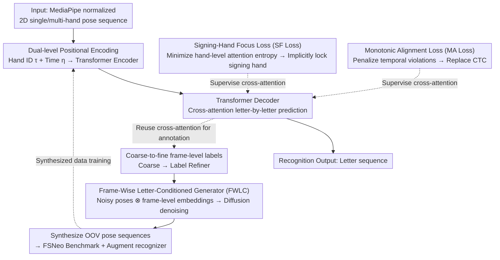

# OpenFS: Multi-Hand-Capable Fingerspelling Recognition with Implicit Signing-Hand Detection and Frame-Wise Letter-Conditioned Synthesis

**Conference**: CVPR2026  
**arXiv**: [2602.22949](https://arxiv.org/abs/2602.22949)  
**Code**: [JunukCha/OpenFS](https://github.com/JunukCha/OpenFS)  
**Area**: Human Understanding  
**Keywords**: Fingerspelling recognition, sign language understanding, implicit signing-hand detection, monotonic alignment loss, diffusion generation, OOV generalization

## TL;DR

The OpenFS framework is proposed, achieving multi-hand fingerspelling recognition via dual-level positional encoding + signing-hand focus loss + monotonic alignment loss for implicit signing-hand detection. It also designs a frame-wise letter-conditioned diffusion generator to synthesize OOV data, achieving SOTA on ChicagoFSWild/ChicagoFSWildPlus/FSNeo benchmarks with inference speeds over 100x faster than PoseNet.

## Background & Motivation

**Fingerspelling is a key supplement to sign language**: It is difficult to create unique gestures for every proper noun or new word in sign language. Therefore, fingerspelling (spelling letter-by-letter) is indispensable for expressing technical terms, personal names, and neologisms. Its accurate recognition serves as a bridge for communication between Deaf and hearing individuals.

**Signing-hand ambiguity**: Existing methods rely on optical flow or hand motion magnitude for explicit signing-hand detection. However, non-signing hands sometimes exhibit larger motion, leading to detection errors and recognition failures while making the training process unstable.

**Peaky behavior of CTC loss**: Existing methods commonly use CTC loss, where models tend to make sparse predictions on a few frames (peaky behavior). This provides insufficient supervision for the encoder and hinders the learning of discriminative hand pose representations.

**OOV problem is severely underestimated**: New words and internet slang emerge continuously, making the model's ability to generalize to unseen vocabulary crucial. However, manual collection of new word data is expensive and requires fingerspelling experts.

**Existing generation methods are unsuitable for fingerspelling**: CLIP-based text-to-motion models capture word-level semantics as global conditions, failing to model fine-grained letter-level finger joint movements and transitions between letters.

**Lack of OOV evaluation benchmarks**: Previously, there was no standardized evaluation benchmark specifically for new word/OOV fingerspelling recognition, making it difficult to systematically evaluate model generalization.

## Method

### Overall Architecture

OpenFS consists of three core components:

- **Multi-Hand Fingerspelling Recognizer**: Based on a Transformer encoder-decoder architecture. The encoder receives normalized 2D single or multi-hand pose sequences extracted by MediaPipe. After MLP embedding, dual-level positional encoding is added before being sent to the Transformer encoder layers. The decoder receives the letter sequence (including `<start>` and `<end>` tokens) and predicts the next letter via cross-attention.
- **Frame-Wise Letter-Conditioned Generator (FWLC)**: Based on a Transformer encoder + diffusion mechanism. Noisy hand poses are concatenated frame-by-frame with frame-level letter embeddings and sent to the encoder to iteratively denoise and generate realistic fingerspelling pose sequences.
- **FSNeo Benchmark**: Utilizes the generator to synthesize 1,635 unique words × 5 sequences = 8,175 samples for new words (lexical, morphological, and semantic neologisms based on NEO-BENCH classification).

The recognizer and generator are not isolated: the cross-attention learned by the recognizer decoder is reused to generate frame-level letter labels. These labels are used to train the generator, which in turn synthesizes OOV data to improve recognizer training, forming a closed loop from recognition to generation.

### Key Designs

**1. Dual-Level Positional Encoding**

- **Hand Identity Encoding $\tau$**: All tokens of the same hand share the same encoding to distinguish between hands (left/right and different individuals).
- **Temporal Positional Encoding $\eta$**: Different hands in the same frame share the same temporal encoding, while different frames use different values to maintain temporal alignment and order.
- Both use sinusoidal formulas and are added to the pose token embeddings before being fed into the encoder.

**2. Signing-Hand Focus Loss (SF Loss) $\mathcal{L}_{SF}$**

- Extract average attention maps from the decoder's cross-attention layers and aggregate them into a hand-level attention distribution based on hand identity.
- Minimize the entropy of this distribution $\rightarrow$ Encouraging the decoder to focus on the dominant signing hand, achieving implicit signing-hand detection.

**3. Monotonic Alignment Loss (MA Loss) $\mathcal{L}_{MA}$**

- Construct a cumulative cross-attention map and calculate differences along the letter dimension. Positive values indicate that subsequent letters have higher attention on earlier frames than the previous letter (violating temporal order).
- Penalize these positive deviations $\rightarrow$ Forcing attention to increase monotonically over time, replacing the CTC loss.

**4. Coarse-to-Fine Frame-Level Letter Labeling**

- **Coarse Labeling**: Utilizing the trained recognizer's cross-attention matrix, frames where attention weights exceed a threshold are assigned to the corresponding letter; conflicting frames are labeled as blank $\phi$.
- **Fine Labeling**: Freeze the recognizer and train a frame-level label refiner (taking encoder features as input to predict letters frame-by-frame). The weight of the blank class is set to 0.1 to suppress its dominance.

**5. Frame-Wise Letter-Conditioned Generator (FWLC)**

- Existing text-to-motion models (e.g., MDM) use CLIP word-level semantics as a global condition, which cannot model precise letter-level finger joint movements or transitions, making them unsuitable for fingerspelling synthesis.
- The FWLC generator uses a Transformer encoder + diffusion mechanism as its backbone: noisy hand pose sequences and frame-level letter sequences (produced by Key Design 4) are embedded and **concatenated frame-by-frame**. Standard positional encoding and diffusion timesteps are added, and the encoder predicts the clean pose via denoising, trained with MSE loss.
- During inference, given a letter sequence, it iteratively denoises for about 50 steps (predicting clean poses from current samples and partially re-adding noise at each step, similar to MDM sampling), until the timestep reaches zero, resulting in natural and letter-level accurate pose sequences.
- Frame-level conditioning is the source of its effectiveness: In experiments, the letter accuracy of FWLC synthesized sequences (82.3) is much higher than letter-level LC (40.2) or word-level WC (23.3).

### Loss & Training

$$\mathcal{L} = \mathcal{L}_{CE} + \lambda_{SF}\mathcal{L}_{SF} + \lambda_{MA}\mathcal{L}_{MA}$$

Where $\lambda_{SF} = 0.8$ and $\lambda_{MA} = 1.0$. The generator is trained using MSE loss.

## Key Experimental Results

### Main Results

Comparison of letter accuracy on ChicagoFSWild (CFSW), ChicagoFSWildPlus (CFSWP), and FSNeo:

| Method | CFSW | CFSWP | FSNeo |
|------|------|-------|-------|
| Shi et al. (2018) | 57.5 | 58.3 | - |
| Shi et al. (2019) | 61.2 | 62.3 | - |
| FSS-Net | 52.5 | 64.4 | - |
| PoseNet | 61.6 | 61.0 | 61.2 |
| **Ours** | **75.4** | **70.5** | **80.5** |
| PoseNet† | 69.2 | 69.4 | 94.9 |
| **Ours†** | **77.7** | **74.6** | **97.6** |

† denotes the use of additional synthetic training data.

Inference speed comparison (CFSW 868 samples, A40 GPU):

| Method | Batch Size | Latency(s)↓ | Throughput↑ | Letters/sec↑ | FPS↑ |
|------|--------|----------|---------|---------|------|
| PoseNet | 1 | 4,282 | 0.2 | 1 | 6 |
| **Ours** | 1 | 39 | 22.0 | 106 | 962 |
| **Ours** | 32 | 6 | 149.8 | 725 | 6,356 |

### Ablation Study

Ablation of positional encoding and auxiliary losses (CFSW letter accuracy):

| Configuration | Acc. |
|------|------|
| Standard PE + No Auxiliary Loss | 73.2 |
| Standard PE + Auxiliary Loss | 73.1 |
| Dual-Level PE + No Auxiliary Loss | 74.8 |
| Dual-Level PE + Auxiliary Loss (Full Model) | **75.4** |

Comparison of generator conditioning strategies (letter accuracy of generated sequences):

| Condition Strategy | PoseNet Rec. | Ours Rec. |
|----------|-------------|----------|
| WC (Word-level, CLIP) | 19.9 | 23.3 |
| LC (Letter-level) | 26.4 | 40.2 |
| FWLC (Frame-wise letter, Ours) | **63.5** | **82.3** |

### Key Findings

- Auxiliary losses (SF + MA) only produce a synergistic effect when paired with dual-level PE (from 73.2 $\rightarrow$ 73.1 vs. 74.8 $\rightarrow$ 75.4).
- Implicit signing-hand detection accuracy reached 99.9%, with only 1 failure (which was also ambiguous to humans), far exceeding PoseNet's 90.4%.
- Synthetic data not only improves OpenFS performance but also significantly boosts PoseNet (CFSW +7.6, FSNeo +33.7), validating the generator's versatility.
- Frame-wise letter conditioning (FWLC) is far superior to word-level (WC) and letter-level (LC) conditioning because fingerspelling requires precise frame-by-frame letter-pose correspondence.

## Highlights & Insights

- **Implicit signing-hand detection** replaces explicit detection, naturally achieved through SF loss within cross-attention with 99.9% accuracy, eliminating recognition failures caused by detection errors.
- **MA loss replaces CTC loss**, solving the peaky behavior problem through cross-attention regularization and learning semantically richer encoder representations.
- **End-to-end without post-processing**, with inference speeds ranging from 962 FPS (single sample) to 6,356 FPS (batch), which is 100+ times faster than PoseNet.
- **Complete Recognition-Generation loop**: Recognizer cross-attention is used to generate frame-level labels $\rightarrow$ train the generator $\rightarrow$ synthetic data augments the recognizer, forming a positive cycle.
- Constructed the first OOV fingerspelling evaluation benchmark FSNeo, filling a gap in the field.

## Limitations & Future Work

- Only validated on American Sign Language (ASL) fingerspelling; applicability to other sign systems (e.g., British Sign Language two-handed fingerspelling) is unknown.
- Relies on MediaPipe for hand pose extraction; failures in the pose estimator propagate to recognition (end-to-RGB solutions might be more robust in some scenarios).
- The diffusion generator requires 50 iterations of denoising; generation speed is not reported, which may not be suitable for real-time data augmentation.
- The FSNeo benchmark consists entirely of synthetic data, which may have a distribution gap compared to real OOV fingerspelling scenarios.
- Ablation experiments were only conducted on CFSW, without full validation of component contributions on CFSWP and FSNeo.

## Related Work & Insights

- **Fingerspelling Recognition**: Shi et al. (2018/2019) established the ChicagoFSWild series and used CNN+LSTM with visual attention; PoseNet uses a Transformer encoder-decoder + re-ranking with single-hand pose input; FSS-Net focuses on detections for search/retrieval; HandReader is a multimodal framework fusing RGB and pose. This paper improves via implicit detection and replacing CTC loss.
- **Fingerspelling/Action Generation**: Text-to-motion models like MDM use CLIP global conditions, which are unsuitable for fingerspelling needing letter-level control; sign language generation studies focus on full-body movements but emphasize joint semantic expressiveness. This paper proposes a frame-wise letter-conditioned diffusion generator specifically for frame-by-frame letter-pose alignment.

## Rating

- Novelty: ⭐⭐⭐⭐ (Implicit detection + MA loss replacing CTC + Frame-wise generator; three innovations coupled into a complete system)
- Experimental Thoroughness: ⭐⭐⭐⭐ (Three datasets + speed comparison + detailed ablation + synthetic data efficacy on other methods + qualitative analysis)
- Writing Quality: ⭐⭐⭐⭐⭐ (Clear structure, rich and intuitive diagrams, complete logic chain from motivation to method to experiment)
- Value: ⭐⭐⭐⭐ (Open-source code and data, new benchmark, deployment-friendly real-time speed, practical significance for the Deaf community)

<!-- RELATED:START -->

## Related Papers

- [\[CVPR 2026\] JUMP-Hand: Learning Joint-wise Uncertainty to Gate Mixture of View Experts for Multi-View 3D Hand Reconstruction](jump-hand_learning_joint-wise_uncertainty_to_gate_mixture_of_view_experts_for_mu.md)
- [\[CVPR 2026\] OMG-Bench: A New Challenging Benchmark for Skeleton-based Online Micro Hand Gesture Recognition](omg-bench_a_new_challenging_benchmark_for_skeleton-based_online_micro_hand_gestu.md)
- [\[CVPR 2026\] Sketch2Colab: Sketch-Conditioned Multi-Human Animation via Controllable Flow Distillation](sketch2colab_sketch-conditioned_multi-human_animation_via_controllable_flow_dist.md)
- [\[CVPR 2026\] MGDHand: Multi-Granularity Prior-to-Inertial Distillation Framework for Sequential 3D Hand Pose Estimation from Sparse IMUs](mgdhand_multi-granularity_prior-to-inertial_distillation_framework_for_sequentia.md)
- [\[CVPR 2026\] HandDreamer: Zero-Shot Text to 3D Hand Model Generation](handdreamer_zero_shot_text_to_3d_hand_model_generation.md)

<!-- RELATED:END -->
