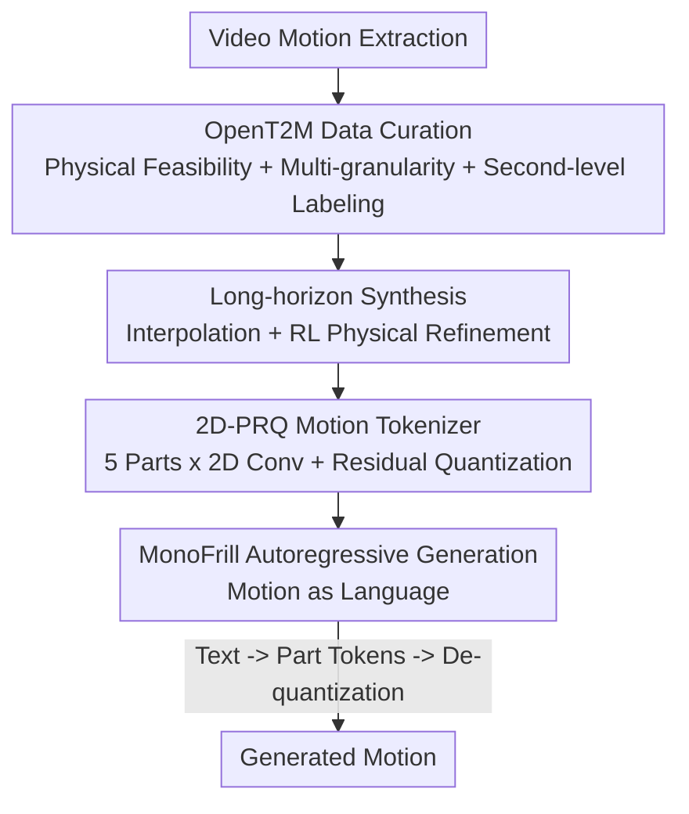

# OpenT2M: No-frill Motion Generation with Open-source, Large-scale, High-quality Data

**Conference**: CVPR 2026  
**Paper**: [CVF Open Access](https://openaccess.thecvf.com/content/CVPR2026/html/Cao_OpenT2M_No-frill_Motion_Generation_with_Open-source_Large-scale_High-quality_Data_CVPR_2026_paper.html)  
**Code**: Project Page https://research.beingbeyond.com/opent2m (Dataset open-sourced)  
**Area**: Human Understanding / Text-to-Motion Generation  
**Keywords**: Text-to-Motion, Motion dataset, Motion tokenizer, Residual quantization, Zero-shot generalization

## TL;DR
The authors identified train/val set leakage in existing Text-to-Motion (T2M) benchmarks, where models overfit rather than generalize. They constructed OpenT2M, a million-scale, physically plausible, second-level annotated, long-horizon open-source motion dataset. Accompanied by MonoFrill—a "no-frills" autoregressive model using a 2D-PRQ tokenizer that treats motion as a "time × body-part" 2D image—the work improves zero-shot R@1 on de-leaked OOD benchmarks from approximately 0.07 to 0.24.

## Background & Motivation
**Background**: Text-to-motion generation (generating human motion from a sentence) has progressed rapidly. The mainstream approach involves using a tokenizer (VQ-VAE style) to discretize continuous motion into tokens, followed by an autoregressive or diffusion model. Evaluation typically relies on the HumanML3D and Motion-X benchmarks.

**Limitations of Prior Work**: The authors conducted a statistical audit revealing "false prosperity." By mapping the CLIP distributions of training and validation texts, they found significant overlaps: 10.62% for HumanML3D and 16.97% for Motion-X where validation texts **appear verbatim in the training set**, often corresponding to nearly identical motions. Existing SOTA models show the typical signs of overfitting, requiring hundreds of epochs to converge. Once leaked samples are removed (denoted as the * version), performance drops precipitously. The perceived "gains" on standard benchmarks are largely due to memory of the training distribution rather than true generalization.

**Key Challenge**: Generalization requires diverse, high-quality motion data. However, high-quality motion data has stagnated since AMASS due to the high cost of professional MoCap. Extracting motion from internet videos via pose estimation provides scale but introduces physical implausibility (foot sliding, drifting, interpenetration), which contaminates training. Scale and quality have remained mutually exclusive.

**Goal**: ① Create a large, clean (physically plausible) open-source dataset; ② Build a leak-free benchmark to measure true generalization; ③ Demonstrate that with correct data, T2M can excel without fancy architectural tricks.

**Key Insight**: Curate a million-scale dataset (OpenT2M) from noisy video-extracted motions using a "physical feasibility RL filter." Support it with a simple tokenizer (2D-PRQ) that treats the body as five parts and motion as a 2D image, powering the "no-frills" MonoFrill model.

## Method

### Overall Architecture
The work comprises **Data** (OpenT2M dataset + curation pipeline) and **Model** (MonoFrill autoregressive generator with 2D-PRQ tokenizer). The data curation pipeline cleans noisy motions via physical feasibility verification, multi-granularity filtering, second-level text annotation, and long-horizon synthesis. In the model, 2D-PRQ discretizes motion into "part-level tokens," which an LLM backbone predicts autoregressively. The entire pipeline is intentionally kept simple—"no-frills"—placing the emphasis on data quality and representation.

### Key Designs

**1. OpenT2M Data Curation: Cleaning Video Motion to MoCap Quality**

The authors designed a three-step serial pipeline to ensure both scale and quality. The first step is **physical feasibility verification**: a robust imitation/tracking policy $\pi_{\text{refine}}$ is trained on AMASS to "track" video-extracted motions. Only motions successfully replicated by the policy are retained; physically impossible ones (jitter, sliding) are discarded. Approximately 63% of motions pass, retaining high-dynamic actions like dancing and fencing. The second step is **multi-granularity filtering** based on 2D keypoint counts (occlusion), bounding box area (resolution), and duration. The third step is **second-level text annotation**: using Gemini-2.5-pro to generate fine-grained limb-level descriptions for every second, then synthesizing them into a coherent summary.

**2. Long-horizon Synthesis: Complex Sequences Beyond 10 Seconds**

To address the lack of long-sequence data, the authors developed an automated synthesis pipeline. Short motions are concatenated via spherical interpolation (Slerp) with alignment. To fix physically impossible transitions at joints, **two-step refinement** is applied using RL policies and avatar trajectory control. Gemini-2.5-pro is then used to merge descriptions into clean, user-oriented instructions. OpenT2M is the first dataset with an average motion duration exceeding 10 seconds.

**3. 2D-PRQ: Quantizing Motion as "Time × Part" 2D Images**

Standard VQ-style tokenizers use 1D temporal convolution on the whole body, leading to information loss at scale. While some split the body (e.g., upper/lower), they often ignore spatial constraints between parts. The **2D-PRQ** observation: split motion data $m_{1:T}\in\mathbb{R}^{T\times D}$ into part-level features $\tilde m_{1:T}\in\mathbb{R}^{T\times p\times d}$ ($p=5$: limbs and torso) and **treat it as a 2D image where width is time and height is the body part**. This allows 2D convolutions to simultaneously capture temporal correlations and spatial dependencies across parts. Each latent vector $\tilde b_{i,j}$ undergoes residual quantization with a shared codebook $C$. The loss function combines global, part-specific, and commitment terms:

$$
\mathcal{L} = \|m-\hat m\|_1 + \sum_{i=0}^{p}\|m_i-\hat m_i\|_1 + \beta\sum_{k=1}^{K}\sum_{i=1}^{p}\|r^k_i - \mathrm{sg}[b^k_i]\|_2^2
$$

This 2D approach significantly reduces reconstruction error on large-scale data compared to independent part processing.

**4. MonoFrill: Motion as Language via Autoregressive LLMs**

Contrasting with complex T2M architectures, the authors model motion as a "special language." After discretization by 2D-PRQ, an LLM backbone predicts tokens autoregressively. The LLM vocabulary is expanded with $K$ codebook indices, using `<mot>/</mot>` to define motion sequences and `<part>/</part>` to separate body parts. Training occurs in two stages: tokenizer training (reconstruction) and instruction-tuning (text-motion alignment), optimizing standard negative log-likelihood (NLL):

$$
\mathcal{L}(\Theta) = -\sum_{j=1}^{L}\log P_\Theta(y_j \mid \text{desc}, \hat y_{1:j-1})
$$

MonoFrill is backbone-agnostic (GPT2 / LLaMA2 / LLaMA3), attributing performance solely to data and 2D-PRQ.

### Loss & Training
Two stages: ① Tokenizer training with reconstruction loss (Equation 2, including global $L_1$, part $L_1$, and commitment loss with weight $\beta$); ② Generator training with token-level NLL (Equation 1). Tokenizer: learning rate 2e-4, batch 256, temporal downsampling $\alpha=4$. MonoFrill: full-parameter training on 8×A800, learning rate 2e-4, batch 1024. Downstream benchmarks are fine-tuned for only 50 epochs (vs. 300) to isolate generalization from memorization.

## Key Experimental Results

### Main Results
**Zero-Shot OOD Generalization (Table 2, OpenT2M_zero, 12k held-out motions)**: The core conclusion is that "changing the dataset leads to a qualitative leap in generalization." All baselines improved significantly when switched to OpenT2M training data.

| Model | Training Data | R@1 ↑ | R@3 ↑ | FID ↓ | MMDist ↓ |
|------|---------|-------|-------|-------|----------|
| Real (Upper Bound) | - | 0.316 | 0.621 | - | 3.771 |
| MDM | HumanML3D | 0.065 | 0.180 | 51.31 | 7.642 |
| MDM | OpenT2M | 0.194 | 0.447 | 8.153 | 4.889 |
| T2M-GPT | HumanML3D | 0.070 | 0.186 | 62.04 | 8.093 |
| T2M-GPT | OpenT2M | 0.159 | 0.357 | 5.566 | 5.072 |
| **MonoFrill-2D-PRQ4** | **OpenT2M** | **0.240** | **0.512** | **1.475** | **4.281** |

Methods trained on HumanML3D had near-zero generalization (R@1 0.05~0.07, FID 50+). Switching to OpenT2M raised R@1 to 0.15~0.19, while MonoFrill with 2D-PRQ reached 0.240, approaching the real-data bound.

**Motion Reconstruction (Table 6, Codebook 1024, Feature Dim 512)**: 2D-PRQ validates that the advantages of 2D representation grow with data scale.

| Tokenizer | HumanML3D MPJPE ↓ | Motion-X MPJPE ↓ | OpenT2M MPJPE ↓ |
|-----------|-------------------|------------------|------------------|
| RQ-VAE8 | 45.633 | 65.484 | 84.655 |
| PRQ6 (Indep. Parts) | 25.485 | 58.155 | 67.569 |
| **2D-PRQ6** | **25.417** | **48.099** | **37.922** |

On small datasets (HumanML3D), 2D-PRQ is comparable to independent PRQ (25.4 vs 25.5). On OpenT2M, the gap widens significantly (37.9 vs 67.5), proving the necessity of joint spatiotemporal modeling for large-scale data.

### Ablation Study

| Configuration | Key Metrics | Note |
|------|---------|------|
| MonoFrill + OpenT2M Pretrain (Table 3) | R@1 0.518 / FID 0.238 | With pretraining |
| MonoFrill w/o Pretrain | R@1 0.503 / FID 0.546 | FID doubles without OpenT2M pretraining |
| Long-horizon: w/o synth data (Table 4) | R@1 0.091 / FID 36.84 | Fails on long-sequence benchmarks |
| Long-horizon: +synth data | R@1 0.484 / FID 0.430 | Decisive improvement |
| Text Refinement (Table 5) | R@1 0.520→0.533 | Cleaning instructions improves alignment |
| Zero-shot Tokenizer (Table 8) | PRQ4 135.9 → 2D-PRQ4 77.7 | 2D design greatly reduces tokenizer overfitting |

### Key Findings
- **Leakage audit is the most impactful finding**: Verbatim overlap in benchmarks means previous "SOTA" results are largely memorization.
- **Data > Architecture**: The minimalist MonoFrill outperformed complex baselines in OOD scenarios simply by using OpenT2M.
- **2D-PRQ Scaling**: Benefits are strongly coupled with data size. In small datasets, 2D-PRQ may underperform due to higher training requirements.
- **Backbone Saturation**: Gains from LLaMA2-7B to LLaMA3-8B are marginal, suggesting the bottleneck lies elsewhere (e.g., data quality limit or tokenizer interface) rather than LLM size.

## Highlights & Insights
- **"Debunking then Building" Narrative**: By first proving the leakage in existing benchmarks via CLIP embedding visualizations and verbatim matching, the authors provided a compelling necessity for OpenT2M.
- **RL Feasibility as a Filter**: Using an AMASS-trained policy to determine if a motion can be "reproduced" is a clever, scalable quality signal that preserves high-dynamic actions better than rule-based checks.
- **"Motion as 2D Image" Perspective**: Treating time and body parts as height and width for 2D convolutions captures structural constraints often lost in independent-part modeling.
- **Honest Reporting**: The authors openly reported where 2D-PRQ underperforms (small data) and the saturation points of LLM backbones.

## Limitations & Future Work
- **Reliance on Commercial LLMs**: Curation relies on Gemini-2.5-pro, which may limit reproducibility due to API costs and black-box labeling.
- **Physical Filter Data Loss**: Discarding 37% of data might introduce selection bias; the characteristics of discarded motions require analysis.
- **"No-frill" Boundaries**: The success of simple structures depends on OpenT2M's scale. The work does not systematically compare whether complex architectures might yield further gains *given* large data.
- **Long-horizon Brittleness**: FID scores remain sensitive to the presence of synthesized long-duration data, indicating weak extrapolation without explicit training.

## Related Work & Insights
- **vs. MotionLib / Being-M0**: MotionLib emphasized scale but missed public physical quality control. OpenT2M provides open-source, physically verified data. 2D-PRQ joint modeling improves upon the independent-part tokenization of Being-M0.
- **vs. HuMo100M**: While HuMo100M is larger, OpenT2M focuses on physical feasibility RL filtering and the curation of long-horizon benchmarks.
- **vs. PRQ / Part-based VQ**: Previous works split the body but ignored inter-part spatial constraints; 2D-PRQ addresses this through 2D convolutions.

## Rating
- **Novelty**: ⭐⭐⭐⭐ (Leakage audit + RL physical filtering + 2D-PRQ perspective)
- **Experimental Thoroughness**: ⭐⭐⭐⭐⭐ (8 tables, cross-dataset, OOD evaluations, ablation of backbones)
- **Writing Quality**: ⭐⭐⭐⭐ (Clear narrative, though some notation is sparse)
- **Value**: ⭐⭐⭐⭐⭐ (Public million-scale high-quality dataset and a critical correction of benchmark practices)

<!-- RELATED:START -->

## Related Papers

- [\[CVPR 2026\] OpenDance: Multimodal Controllable 3D Dance Generation with Large-scale Internet Data](opendance_multimodal_controllable_3d_dance_generation_with_large-scale_internet_.md)
- [\[CVPR 2026\] Open the Motion Door: Atomic Motion Decomposition and Recomposition for Open-Vocabulary Motion Generation](open_the_motion_door_atomic_motion_decomposition_and_recomposition_for_open-voca.md)
- [\[ICLR 2026\] SpeakerVid-5M: A Large-Scale High-Quality Dataset for Audio-Visual Dyadic Interactive Human Generation](../../ICLR2026/human_understanding/speakervid-5m_a_large-scale_high-quality_dataset_for_audio-visual_dyadic_interac.md)
- [\[CVPR 2026\] RoMo: A Large-Scale, Richly Organized Dataset and Semantic Taxonomy for Human Motion Generation](romo_a_large-scale_richly_organized_dataset_and_semantic_taxonomy_for_human_moti.md)
- [\[CVPR 2026\] LCA: Large-scale Codec Avatars - The Unreasonable Effectiveness of Large-scale Avatar Pretraining](lca_large-scale_codec_avatars_the_unreasonable_effectiveness_of_large-scale_avata.md)

<!-- RELATED:END -->
