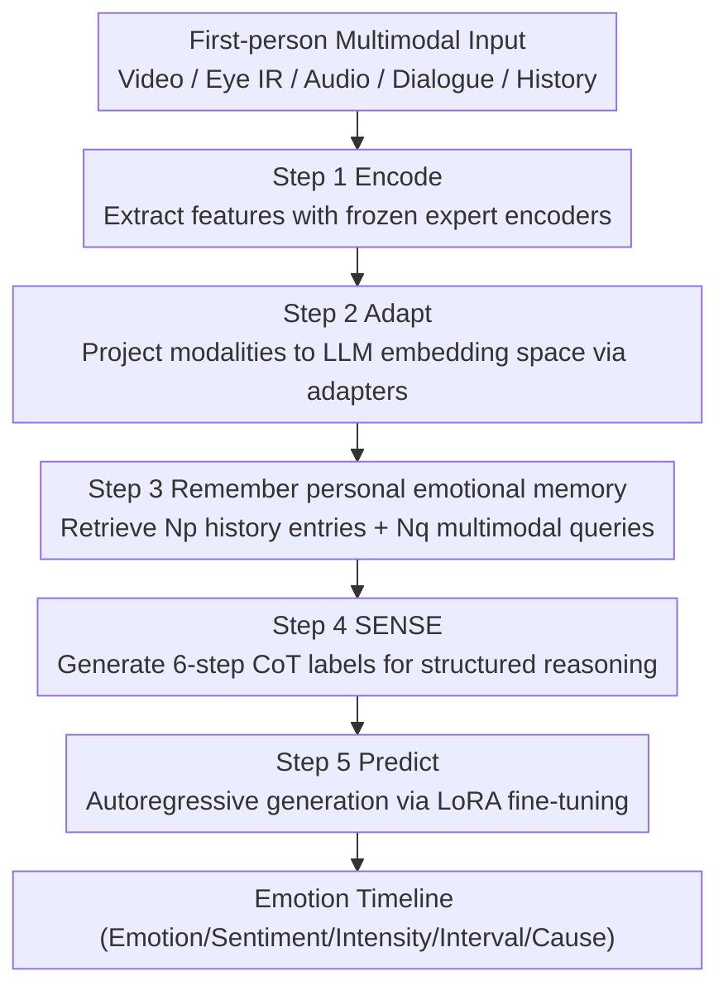

# OSMO: Open-vocabulary Self-eMOtion Tracking

**Conference**: CVPR 2026  
**Paper**: [CVF Open Access](https://openaccess.thecvf.com/content/CVPR2026/html/Abdelfattah_OSMO_Open-vocabulary_Self-eMOtion_Tracking_CVPR_2026_paper.html)  
**Code**: Project Page https://osmo-emos.github.io  
**Area**: Human Understanding / Affective Computing / First-person Multimodal  
**Keywords**: Self-emotion Tracking, Smart Glasses, First-person, Open-vocabulary Emotion, Multimodal Large Multimodal Model (LMM)  

## TL;DR
This paper proposes a new task, "First-person Self-emotion Tracking"—inferring the wearer's evolving emotions over time from the multimodal streams of smart glasses (speech, visual environment, dialogue text, and eye movements). It introduces the OSMO dataset (110 hours, the first and largest first-person emotion dataset with per-subject timelines), the OSMO benchmark (5 tasks), and the OSIRIS model (the first LMM to join video/audio/dialogue/eye IR and use emotional history for temporal reasoning), significantly setting new SOTA results across all metrics.

## Background & Motivation
**Background**: Self-emotion tracking can significantly improve mental health (studies report reducing depressive symptoms by 34% and anxiety by 20%). However, existing solutions (such as mobile apps) rely on high-friction manual logging, leading to low adoption. Smart glasses, as an all-day wearable, passive device integrating multimodal sensors (voice tone, gaze behavior, environmental context), are naturally suited for continuous, context-aware emotion tracking.

**Limitations of Prior Work**: Existing emotion recognition datasets are unsuitable for training models deployable on smart glasses—they are either **exo-centric** (third-person) or consist of **short, isolated video clips** (failing to model emotional continuity). Furthermore, primary sources (labs, movies, web vlogs) are filled with exaggerated, performative expressions that fail to capture subtle, spontaneous real-world emotions. Consequently, emotion LMMs trained on these inherit four defects: (1) dependence on facial views, performing poorly in first-person perspectives; (2) processing single utterances in isolation, misinterpreting context-dependent meanings (e.g., whether "That's just great" is sincere or sarcastic); (3) ignoring the influence of previous emotions (carry-over effect); and (4) lacking interpretable reasoning, resulting in hallucinated outputs.

**Key Challenge**: Emotion is inherently a **continuous, context-dependent process with temporal inertia**, yet existing data and models treat it as discrete classification of trimmed video clips.

**Goal**: Redefine emotion understanding as a "continuous, context-aware tracking process" and address gaps in three areas: data (lack of first-person real emotion data), tasks (lack of continuous tracking benchmarks), and models (lack of temporal + multimodal + interpretable models).

**Key Insight / Core Idea**: Instead of collecting entirely new raw data, this work annotates three existing first-person datasets (EgoLife, Nymeria, AEA)—which already meet the requirements of being "real-world, longitudinal, subject-identified, and multimodal"—with high-quality emotional labels. Simultaneously, it designs a multimodal LMM capable of "reasoning before judging" while remembering personal emotional history.

## Method

### Overall Architecture
This work is a tripartite contribution consisting of a dataset, a benchmark, and a model:

- **OSMO Dataset**: Using a three-stage human–LMM collaborative pipeline, 110 hours of smart glass recordings (EgoLife/Nymeria/AEA) are annotated to obtain per-subject, timestamped open-vocabulary emotion timelines (including emotion, sentiment polarity, intensity, intervals, and causes), supplemented by LMM-generated modality descriptions and Chain-of-Thought (CoT) labels. It covers English (41.3%) and Mandarin (58.7%).
- **OSMO Benchmark**: Emotion understanding is decomposed into 5 continuous tasks—Open-vocabulary Emotion Recognition, Sentiment Analysis, Intensity Prediction, Temporal Localization, and Emotional Reasoning. Four generalization protocols are defined: Cross-Subject (XSub), Cross-Time (XTime), Cross-Language (XLang), and Cross-Set (XSet).
- **OSIRIS Model**: The first emotion-tracking LMM to jointly process first-person video, audio, dialogue, and eye IR. Through five steps—Encode, Adapt, Remember, SENSE, and Predict—it reasons over personal emotional history, current expressions, and first-person observations to output emotional states and their explanations.

The five-step reasoning pipeline of the OSIRIS model is shown below (the dataset construction pipeline is detailed under "Key Designs 1"):

### Key Designs

**1. Three-stage human–LMM collaborative annotation: LMM screening, human labeling, and LLM+human verification**

Emotional expressions are sparse in real-world recordings, making full manual annotation of 750 hours of raw footage impractical. The authors designed a three-stage pipeline: **Stage 1 (LMM Pre-screening)**—Generating timestamped transcriptions via Whisper, segmenting into 200,000 sentence-level clips, and using four SOTA emotion LMMs (Emotion-LLaMA, AffectGPT, DeSTA2.5-Audio, Qwen-Audio2) to assign pseudo-labels (Ekman's six emotions or neutral). Denoising is performed via majority voting (≥3 votes), retaining 17,800 high-confidence segments and expanding them into 30-second context segments to form a 125-hour subset. **Stage 2 (Manual Annotation)**—Recruiting 41 annotators for multi-stage training to label open-vocabulary emotions (leveraging Plutchik’s wheel), polarity, three-level intensity, time intervals, and causes based only on observable cues. LMM predictions were hidden to prevent bias, totaling 8000+ hours of labor. **Stage 3 (Quality Assessment)**—LLM-assisted checking (for missing info, abnormal durations <1s/>25s, short descriptions, and overlaps) using LLaMA3 as a judge to score samples 1–10 (rejecting <8), followed by manual 3D evaluation (category correctness, localization accuracy, reasoning validity). Final inter-annotator agreement reached 87.0% (category), 91.2% (localization), and 82.6% (reasoning). This division of labor confirmed that LMMs are excellent at narrowing candidates (88% retained by humans) but weak at fine-grained classification (only 48.6% overlap with human labels).

**2. SENSE Structured Emotional Reasoning: Evidence before conclusion with automated CoT labels**

Existing models often infer emotions in a single, opaque step, relying on spurious correlations like "tears = sadness," ignoring cases where tears flow from joy and failing to leverage the autoregressive reasoning of LLMs. The authors reformulate emotion recognition as a structured reasoning problem: OSIRIS must interpret sensory cues before inferring emotion. However, manual annotation of such fine-grained multimodal cues is too costly. Observing that "human descriptions capture emotional nuances but lack sensory detail, while multimodal models provide detail but lack depth," the authors propose **SENSE (Structured Emotional reasoNing from SEnsory inputs)**: SOTA video/audio captioning models extract fine-grained visual $R_v$ and acoustic $R_a$ descriptions, and eye IR is mapped to action units for ocular cues $R_e$. Human emotional descriptions $R_h$, along with $R_v, R_a, R_e$, dialogue $X_c$, and history $X_{emo}$, are fed to LLaMA3 as a "cognitive agent" to produce a 6-step reasoning chain $R=\{r_1,\dots,r_6\}$ (visual, audio, dialogue, ocular, previous emotion, and final inference). OSIRIS is fine-tuned on these CoT labels, teaching it not just "what to predict" but "how to reason," transforming the task from simple classification to an introspective cognitive process. Ablations show SENSE is the single largest gain-provider.

**3. Personal Emotion Memory Module: Explicit modeling of emotional carry-over effects**

Emotions are not discrete instants but evolve with inertia (e.g., the surprise of joy leaves a lasting warmth). OSIRIS maintains a personalized emotion log $\mathbf{L}=\{E^{(1)},\dots,E^{(j-1)}\}$, where each event $E^i=\{\mathbf{O}^i,\mathbf{Q}^i,t^i,D^i\}$ records: **What** (open-vocabulary semantic description $\mathbf{O}^i$), **How** (multimodal expression signature—embeddings $\tilde z^i_m$ are projected, pooled, and normalized, weighted by modality gates $\alpha_m=\sigma(g_m)$, and refined with $N_{ms}$ learnable queries $\mathbf{Q}$ into $\mathbf{Q}^i$), and **When** (timestamp $t^i$ and duration $D^i$). At inference time $t^j$, it retrieves the $N_p$ most recent history entries $\mathbf{X}^j_{emo}$ and $N_q$ multimodal queries $\mathbf{Q}^j_{exp}$, each paired with temporal metadata ($\Delta t^i=t^j-t^i$ and $D^i$): semantic emotions are integrated into text input, and multimodal tokens are inserted directly into the LLM, enabling the model to interpret emotion as part of a continuous temporal trajectory. Ablations show significant gains as $N_p$ increases from 0 to 4 and $N_q$ peaks at 32, though gains from $N_{ms}$ beyond 1 are marginal.

**4. Full Modality Fusion and First-time Eye Tracking: Unifying into LLM space via adapters**

In the Encode step, OSIRIS uses frozen off-the-shelf encoders for first-person video $X_v$, eye IR video $X_e$, and audio $X_a$, while dialogue $X_c$ is encoded by the LLM's embedding layer. Notably, **it is the first model to explicitly incorporate eye IR into emotion modeling** (as ocular dynamics like eye-widening in surprise or squinting in laughter are strongly correlated with emotion). In the Adapt step, each modality is assigned a learnable adapter $G_m(\cdot)$ to project representations into the LLM embedding dimension $d$, unifying heterogeneous modalities for cross-modal reasoning. This design of "frozen expert encoding + lightweight adapters + LoRA fine-tuning" allows for efficient multimodal integration while retaining pre-trained capabilities. Ablations show performance drops without any modality, with **removing dialogue text causing the largest drop (-11.8)** followed by eye tracking (-9.1).

### Loss & Training
In the Predict step, given multimodal context $\mathcal{X}=\{X_v,X_e,X_a,X_c,X_{emo},\mathbf{Q}\}$ and instruction $\mathbf{I}$, OSIRIS autoregressively maximizes the likelihood of generating reasoning chain $R$: $\theta^*=\arg\max_\theta\prod_{l=1}^{L_r}P_\theta(r_l\mid\mathcal{X},\mathbf{I},r_{<l})$. LoRA is used to insert low-rank adapters into attention and feed-forward layers of the base LLM, freezing most weights for efficient optimization.

## Key Experimental Results

### Main Results
Custom metrics for the 5 benchmark tasks include: **OVER** (Open-vocabulary Emotion Recognition: SOS = Set Overlap Score, HR = Hit Rate); **SA** (Sentiment Analysis: Accuracy + Weighted F1 WAF); **IP** (Intensity Prediction: WAF + Accuracy); **EL** (Temporal Localization: mIoU + $R_{n,U}@m$); and **ER** (Emotional Reasoning: BLEU/ROUGE-L/METEOR + LLaMA judge scoring for Information Correctness IC, Detail Orientation DO, Contextual Understanding CU, and Temporal Consistency TUC on a 1–100 scale). Mean Δ represents the average gain over the zero-shot LLaMA3 baseline.

| Protocol | Model | OVER HR | SA WAF | IP WAF | EL mIoU | Mean Δ |
|------|------|---------|--------|--------|---------|--------|
| XSub | Zero-shot LLaMA3 (Baseline) | 45.4 | 47.7 | 32.5 | 25.4 | — |
| XSub | AffectGPT (Fine-tuned) | 66.7 | 67.5 | 47.6 | 43.5 | +24.4 |
| XSub | **OSIRIS (Full Modality w/ Eye)** | **77.6** | **76.7** | **58.0** | **51.2** | **+35.1** |
| XTime | AffectGPT (Fine-tuned) | 67.4 | 71.2 | 45.3 | 42.6 | +25.5 |
| XTime | **OSIRIS (Full Modality w/ Eye)** | **78.4** | **79.1** | **55.2** | **50.1** | **+35.6** |

OSIRIS outperforms zero-shot LLaMA3 by +35.1/+35.6 on XSub/XTime respectively. In the fine-tuned setting, it exceeds the previous SOTA AffectGPT by an average of +10.7 (XSub) and +10.1 (XTime). The **largest gain was seen in reasoning tasks (average +14.1 in LLaMA judge metrics)**, validating the SENSE strategy. In cross-language (XLang) protocols, English-to-Chinese transfer outperformed Chinese-to-English for all models (due to higher subject diversity in the English subset, 282 vs 6 subjects); in cross-set (XSet), models trained on OSMO generalized better to the unseen AEA dataset.

### Ablation Study
Component contributions (Mean Δ) relative to fine-tuned AffectGPT on OSMO-XSub:

| Configuration | Relative Gain | Description |
|------|---------|------|
| + History $X_{emo}$ | +3.6 | Models emotional continuity (e.g., confusion → frustration) |
| + Memory Query $Q_{exp}$ | +6.8 | Models emotional carry-over effects |
| + Dialogue Context | +7.7 | Clarifies ambiguous tone (is "really?" surprise or anger?) |
| + SENSE Reasoning | +8.2 | Largest single gain; reasoning before judgment |
| All Combined | +10.5 | Synergy of temporal + context + reasoning |

Modality removal ablations (Performance change): w/o Dialogue **-11.8 (Most critical)**, w/o Eye -9.1, w/o Audio -7.8, w/o Video -7.5.

### Key Findings
- **SENSE is the most significant single component (+8.2)** and contributes most to reasoning metrics, proving that "structuring emotion recognition as reasoning" is the core source of improvement.
- **Dialogue text is the most critical modality** (dropping -11.8 without it), confirming that emotion relies heavily on conversational context—the same "unbelievable" means opposite things after "we won" versus "we lost." Expanding dialogue history $N_u$ from 1 to 16 increased OVER HR gain from +6.4 to +11.4.
- **Personal history has a saturation point**: Returns for history entries $N_p$ and memory queries $N_q$ peak around 4 and 32 respectively, while memory slots $N_{ms}$ beyond 1 show almost no gain—suggesting that modeling the "most recent few emotions" is sufficient to capture temporal inertia.
- **Data Quality**: OSMO’s CoT descriptions with SENSE were scored +24.2 and +40.9 higher by LLaMA3 and DeepSeek-V2 respectively compared to E3, confirming the quality advantage of human-LLM collaborative annotation.

## Highlights & Insights
- **Task Redefinition**: Upgrading from "discrete classification of trimmed clips" to "continuous, context-aware emotion tracking" with data/benchmarks/models establishes a powerful new research direction.
- **Smart Data Strategy**: Re-labeling existing datasets that already meet first-person/longitudinal requirements is a clever way to obtain spontaneous real-world emotions while saving collection costs.
- **SENSE Synergizes Humans and LMMs**: Using LLMs as cognitive agents to bridge human-level nuanced emotion with LMM-level sensory detail to create CoT labels is an approach transferable to any task requiring interpretable intermediate reasoning.
- **Inclusion of Eye Tracking**: Demonstrating that eye movement is the second most critical modality highlights that this often-overlooked, low-cost signal is highly valuable for affective computing.
- **Explicit Modeling of Inertia**: The memory module (What/How/When triad + gated signatures + temporal metadata) provides a reusable structure for temporal affective modeling.

## Limitations & Future Work
- **Subject Diversity**: The cross-lingual asymmetry (EN→ZH better than ZH→EN) stems from the high subject count in English (282) vs Mandarin (6). Further expansion of subjects and cultures is needed for "universal" tracking.
- **High Resource Cost**: 8000+ hours of manual labor and multiple SOTA LMMs for screening/labeling create high replication barriers.
- **Focus on "Embodied Emotion"**: It explicitly excludes internal emotions requiring invasive sensors and focuses on observable physiological expressions. Also, eye cues $R_e$ derived from "emotion → AU" mapping might introduce circular dependencies (re-inferring cues to infer emotion). ⚠️ Whether this causes label leakage is not explicitly discussed.
- **Privacy and Ethics**: Tracking personal emotional trajectories all day via smart glasses involves high privacy risks; the paper does not deeply explore deployment ethics or consent mechanisms.

## Related Work & Insights
- **vs. Third-person/Short-clip Datasets (MELD, MER-Caption, MAFW, etc.)**: These are exo-centric, performative, and lack timelines. OSMO is first-person, spontaneous, and the largest such dataset with per-subject timelines and eye tracking.
- **vs. E3 (The only other first-person dataset)**: E3 consists of noisy handheld vlogs, lacks eye tracking/subject timelines, and uses closed-set labels. OSMO uses smart glasses, offers timestamped per-subject open-vocabulary labels, and has much higher CoT quality.
- **vs. Emotion LMMs (AffectGPT, Emotion-LLaMA, E3-LLaMA)**: They process sentences in isolation and ignore dialogue history and continuity. OSIRIS uses emotional memory for continuity and SENSE for explicit CoT reasoning, outperforming them across the board.
- **vs. Unimodal Models**: Unimodal models lack multimodal context; OSIRIS provides full fusion and is the first to include eye IR.

## Rating
- Novelty: ⭐⭐⭐⭐⭐ Proposes the new task of first-person self-emotion tracking with a tripartite contribution and eye tracking integration.
- Experimental Thoroughness: ⭐⭐⭐⭐⭐ Extremely solid with 4 protocols, 5 tasks, and multi-dimensional ablations (components, modalities, history length).
- Writing Quality: ⭐⭐⭐⭐ Clear motivation and contributions with rich charts; some formulas were partially rendered in cache and required original text reference.
- Value: ⭐⭐⭐⭐⭐ Establishes a new direction for wearable affective computing with open-sourced resources; high research and application value.

<!-- RELATED:START -->

## Related Papers

- [\[CVPR 2026\] Open the Motion Door: Atomic Motion Decomposition and Recomposition for Open-Vocabulary Motion Generation](open_the_motion_door_atomic_motion_decomposition_and_recomposition_for_open-voca.md)
- [\[CVPR 2026\] Learning to Diversify and Focus: A Reinforcement Framework for Open-Vocabulary HOI Detection](learning_to_diversify_and_focus_a_reinforcement_framework_for_open-vocabulary_ho.md)
- [\[CVPR 2026\] Humanoid-GPT: Scaling Data and Structure for Zero-Shot Motion Tracking](humanoid-gpt_scaling_data_and_structure_for_zero-shot_motion_tracking.md)
- [\[CVPR 2026\] LAMP: Localization Aware Multi-camera People Tracking in Metric 3D World](lamp_localization_aware_multi-camera_people_tracking_in_metric_3d_world.md)
- [\[CVPR 2026\] OpenT2M: No-frill Motion Generation with Open-source, Large-scale, High-quality Data](opent2m_no-frill_motion_generation_with_open-source_large-scale_high-quality_dat.md)

<!-- RELATED:END -->
