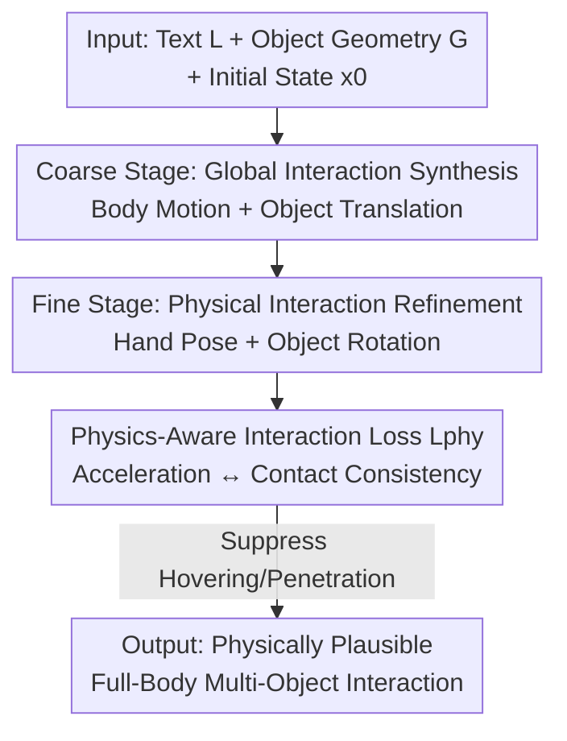

# PAMotion: Physics-Aware Motion Generation for Full-Body Interaction with Multiple Objects

**Conference**: CVPR 2026  
**Paper**: [CVF Open Access](https://openaccess.thecvf.com/content/CVPR2026/html/Di_PAMotion_Physics-Aware_Motion_Generation_for_Full-Body_Interaction_with_Multiple_Objects_CVPR_2026_paper.html)  
**Code**: https://github.com/liyuheng520/PAMotion  
**Area**: Human Motion Generation  
**Keywords**: Human-Object Interaction, Motion Generation, Diffusion Models, Physics-Aware, Full-Body Interaction

## TL;DR
PAMotion utilizes the physical intuition that "object acceleration exposes the contact state" to design a soft physics-aware interaction loss. Combined with a coarse-to-fine two-stage conditional diffusion, it ensures text-driven full-body multi-object interaction motions are semantically aligned while eliminating issues like hand interpenetration and floating objects, achieving SOTA on HIMO and ParaHome.

## Background & Motivation
**Background**: Generating realistic human-object interaction (HOI) motions given text instructions is a fundamental problem in CV/Graphics, with applications in AR/VR, robotics, and behavior understanding. Diffusion models have performed well in generating motions for "single person manipulating a single object," with representative works like HIMO-Gen using dual-branch diffusion networks to jointly predict human and object motion.

**Limitations of Prior Work**: Real-world scenarios often involve manipulating multiple objects simultaneously ("pour beer into a goblet, then into the trash can"). Directly extrapolating single-person single-object methods to multiple objects leads to frequent physical implausibilities: hands penetrating objects, objects hovering in mid-air, and inconsistencies between contact timing and applied forces.

**Key Challenge**: The root cause is that these methods model interactions as pure kinematic signals—learning only joint/object trajectories—**without modeling the underlying physical causality**. In multi-object interactions, contact relationships are complex, and the absence of physical constraints naturally leads to results that violate common sense.

**Goal**: To explicitly address "why the object moves this way" within the generation framework by bridging kinematic synthesis and physical reasoning, while maintaining the high-level goal of "semantically consistent motion."

**Key Insight**: The authors start from a simple yet critical observation: in daily, slow-speed human interactions, **the acceleration of an object itself reveals its contact state**. If an object's acceleration is approximately equal to gravity $g$, it is likely in free motion without contact; if the acceleration deviates from $g$ (including $\hat a = 0$ when hovering), external forces must exist, indicating direct or indirect contact with hands or other objects.

**Core Idea**: Transform the above conditions into a soft "physics-aware interaction loss." When an object's acceleration deviates from gravity, it is forced to remain close to the hand or other objects without penetration. This is integrated into a coarse-to-fine two-stage diffusion process: first generating text-aligned global motion, then refining physically-constrained hand and object poses.

## Method

### Overall Architecture
PAMotion aims to generate a sequence of $T$ frames and $N$ objects $X=[x_i]$ for full-body multi-object interaction, given text $L$, object geometry $G=[g^n]$, and initial state $x_0$. Each frame $x_i=(h_i, o^n_i)$ contains human and object states. The human is represented by SMPL-X, with joint rotations parameterized by R6D and split into body parts $(J_{b,i}, Q_{b,i})$ and hand parts $(J_{h,i}, Q_{h,i})$. Object states $o^n_i$ include translation $T^n_i$ and rotation $R^n_i$.

The framework uses a **coarse-to-fine two-stage conditional diffusion**: the coarse stage generates global motion aligned with the text—global translation $g_i$, body motion $(J_{b,i}, Q_{b,i})$, and object translation $T^n_i$; the fine stage refines fine-grained hand joints $(J_{h,i}, Q_{h,i})$ and object rotations $R^n_i$, constrained by the physics-aware interaction loss $\mathcal{L}_{phy}$. This decoupling is motivated by the fact that human descriptions are high-level ("move the lamp to the bed") rather than detailing hand paths. Balancing torso, hand, and fine object dynamics simultaneously in one network often fails; thus, goal-level motion is estimated first as a condition for local physical optimization.

### Key Designs

**1. Physics-Aware Motion Modeling: Object Acceleration as a Contact Probe**

This is the core insight of the paper, directly addressing the limitations of kinematic-only generation. Daily interactions are categorized into three states: **Free-Motion State** where acceleration $\hat a \approx g$ (free fall/parabolic motion); and **Contact-Motion State**, which includes hovering ($\hat a = 0$ where hand support balances gravity) and manipulating objects ($\hat a \neq g$). Hard constraints or explicit contact losses are unstable on real data due to noise and hand deformation. Therefore, the authors propose a soft, differentiable constraint coupling object acceleration $\hat a$ with the minimum distance $d_t$ to hands or other objects:

$$\mathcal{L}_{phy} = \mathbb{E}_t\left[\left|\log\frac{d_t}{\beta}\right| \cdot |(a_t - g)\cdot t|\right]$$

In this formula, $\beta$ is a hyperparameter (set to 0.01) allowing slight deformation. The multiplicative gating is key: in free motion ($a_t \approx g$), the weight $|(a_t-g)\cdot t|$ approaches 0, suppressing the distance loss and allowing independent movement. In contact motion, $|(a_t-g)\cdot t|$ becomes a positive weight activating the distance constraint. Due to the $\log(\cdot)$ shape, **the loss increases sharply during penetration** ($d_t$ is very small), while providing soft supervision for slight hovering. One loss simultaneously suppresses both phenomena. Note: in the expression $|(a_t-g)\cdot t|$, $t$ is used for both frame indexing and dot product terms; refer to the original paper for exact notation.

**2. Coarse-to-Fine Two-Stage Generation: Aligning Semantics then Physics**

This design balances high-level goals and low-level physics. **Stage I (Coarse)** generates global human motion $(g_i, J_{b,i}, Q_{b,i})$ and object translation $T^n_i$ using a dual-branch diffusion network similar to HIMO. It is conditioned on text $L$, object geometry $G$, and $x_0$. Supervision uses kinematic and geometric consistency: L2 loss on joint positions and first derivatives ($\mathcal{L}_{pv}=\sum_i\|J_{b,i}-\hat J_{b,i}\|_2^2+\sum_i\|\dot J_{b,i}-\hat{\dot J}_{b,i}\|_2^2$), rotations $\mathcal{L}_{qv}$, object translations $\mathcal{L}_{tv}$, and global translations $\mathcal{L}_{gv}$, plus inter-object distance constraints $\mathcal{L}_{dist}$. The total coarse loss is $\mathcal{L}_{coarse}=\mathcal{L}_{pv}+\mathcal{L}_{qv}+\mathcal{L}_{tv}+\mathcal{L}_{gv}+\lambda_0\mathcal{L}_{dist}$.

**Stage II (Fine)** refines hand motion $(J_{h,i}, Q_{h,i})$ and object rotation $R^n_i$ using Stage I outputs as conditions. Object acceleration is calculated by randomly sampling 1024 points on the object surface. For point $p$, rigid body motion $\hat a^n_i = R^n_i\big(\dot\omega\times p + \omega\times(\omega\times p)\big) + \ddot T^n_i$ is used, taking the maximum weighting value for $\mathcal{L}_{phy}$. The fine stage total loss is $\mathcal{L}_{fine}=\mathcal{L}^r_{pv}+\mathcal{L}^r_{qv}+\mathcal{L}^r_{rv}+\lambda_1\mathcal{L}_{phy}$. During training, Stage II uses ground-truth conditions, while inference uses Stage I predictions.

### Loss & Training
The model is trained on an RTX 3090 for 1000 epochs (approx. 25 hours: 10h coarse + 15h fine) with batch size 32. Text is encoded using frozen CLIP-ViT-B/32. The denoising network includes 8 mutual interaction modules with 4 heads and hidden dimension 512. Hyperparameters are $\{\beta, \lambda_0, \lambda_1\}=\{0.01, 1.0, 0.1\}$. Inference takes approx. 2.1 seconds for 1000 diffusion steps.

## Key Experimental Results

### Main Results
Comparison on HIMO (3.3K 4D HOI sequences) for two-object and three-object settings (↑ higher is better, ↓ lower is better, → closer to Real is better):

| Setting | Method | R-Prec.↑ | FID↓ | MM-Dist↓ | Diversity→ |
|------|------|----------|------|----------|-----------|
| 2 Objects | Real | 0.7988 | 0.0176 | 3.5659 | 11.3973 |
| 2 Objects | HIMO-Gen | 0.6369 | 1.4811 | **3.6491** | 11.6603 |
| 2 Objects | **PAMotion** | **0.6914** | **0.8285** | 3.9841 | **11.4431** |
| 3 Objects | Real | 0.6988 | 0.1811 | 3.7696 | 9.7674 |
| 3 Objects | HIMO-Gen | 0.5350 | 4.7712 | 5.0866 | 8.9460 |
| 3 Objects | **PAMotion** | **0.6750** | **1.3763** | **3.7707** | **9.4573** |

In the two-object setting, R-Precision and FID are significantly improved over HIMO-Gen, though MM-Dist is slightly lower. **The advantage widens in the three-object setting**: R-Precision, FID, and MM-Dist lead the second-best method by 14.0%, 3.395, and 1.316 respectively.

ParaHome results also show comprehensive leads, especially in FID:

| Method | R-Prec.↑ | FID↓ | MM-Dist↓ | Diversity→ |
|------|----------|------|----------|-----------|
| Real | 0.6818 | 0.0017 | 5.3107 | 6.4100 |
| HIMO-Gen | 0.5909 | 3.2398 | 5.4455 | 6.1703 |
| **PAMotion** | **0.6364** | **0.7962** | **5.3356** | **6.3145** |

### Ablation Study
Removing the physics loss $\mathcal{L}_{phy}$ results in consistent performance drops across settings:

| Setting | Configuration | R-Prec.↑ | FID↓ | MM-Dist↓ | Diversity→ |
|------|------|----------|------|----------|-----------|
| 2 Objects | Ours (full) | **0.6914** | **0.8285** | **3.9841** | 11.4431 |
| 2 Objects | w/o $\mathcal{L}_{phy}$ | 0.6758 | 0.9046 | 4.0274 | 11.5996 |
| 3 Objects | Ours (full) | **0.6750** | **1.3763** | **3.7707** | 9.4573 |
| 3 Objects | w/o $\mathcal{L}_{phy}$ | 0.6312 | 1.5736 | 3.8260 | 9.4524 |

### Key Findings
- The gains from $\mathcal{L}_{phy}$ are more pronounced in three-object settings (which are more complex and prone to errors), validating the value of physical constraints in dense interaction scenarios.
- Qualitatively, $\mathcal{L}_{phy}$ directly alleviates hovering and penetration artifacts, explaining the significant improvement in FID (distribution similarity).
- PAMotion's advantage over HIMO-Gen increases with the number of objects, supporting the claim that kinematics-only methods fail under extrapolation.

## Highlights & Insights
- **Encoding physical intuition as a soft gated loss** is effective: $|\log(d_t/\beta)|$ handles distance, while $|(a_t-g)\cdot t|$ acts as a dynamic weight. This only activates distance constraints when contact is implied by acceleration, avoiding instability on noisy data.
- **Acceleration as a contact probe** is a clever observation: contact states are inferred from kinematic quantities (acceleration) without explicit contact labels or full physics simulation, bridging generation and physical reasoning efficiently.
- Decoupling "semantic goals" and "physical details" provides a template for other high-level command to low-level refinement generation tasks.

## Limitations & Future Work
- The authors acknowledge that while $\mathcal{L}_{phy}$ ensures contact, it **does not constrain the grasping pose itself**. Cases where the hand touches an object but the pose is physically impossible (e.g., wrong finger alignment) still occur. Integrating pre-trained large-scale grasping models (e.g., GraspNet) could help but introduces hand coordination complexity.
- The physical assumptions rely on "daily slow-speed interactions." The reliability for fast motions where acceleration noise is high remains uncertain. Furthermore, torso interactions (e.g., sitting, hugging) are explicitly ignored.
- Evaluation still relies on HIMO/ParaHome datasets and motion-text extractors; a direct quantitative metric for penetration/hovering counts is currently missing.

## Related Work & Insights
- **vs HIMO-Gen**: HIMO-Gen treats human and object as pure kinematic signals; PAMotion incorporates physical reasoning through $\mathcal{L}_{phy}$ and fine-stage refinement, proving more robust as object count increases.
- **vs Physics-based HOI**: Traditional physics-based methods use explicit force modeling and simulation, which are computationally heavy. PAMotion offers a middle ground by using acceleration as a contact proxy, remaining端-to-end trainable and lightweight at the cost of full physical fidelity.

## Rating
- Novelty: ⭐⭐⭐⭐ Using acceleration to infer contact states and converting it into a gated loss is an intuitive and effective bridge between kinematics and physics.
- Experimental Thoroughness: ⭐⭐⭐ Solid across two datasets and difficulty settings, though ablation is somewhat limited to $\mathcal{L}_{phy}$ and lacks direct physical artifact quantification.
- Writing Quality: ⭐⭐⭐⭐ Clear derivation from observation to loss and pipeline; the physical intuition of contact states is well-explained.
- Value: ⭐⭐⭐⭐ Refreshing SOTA for multi-object full-body HOI generation; the soft physics loss has potential for wide application in contact-sensitive tasks.

<!-- RELATED:START -->

## Related Papers

- [\[CVPR 2026\] SAM 3D Body: Robust Full-Body Human Mesh Recovery](sam_3d_body_robust_full-body_human_mesh_recovery.md)
- [\[CVPR 2026\] HandX: Scaling Bimanual Motion and Interaction Generation](handx_scaling_bimanual_motion_and_interaction_generation.md)
- [\[CVPR 2026\] InterAgent: Physics-based Multi-agent Command Execution via Diffusion on Interaction Graphs](interagent_physics-based_multi-agent_command_execution_via_diffusion_on_interaction_graphs.md)
- [\[CVPR 2026\] ReGenHOI: Unifying Reconstruction and Generation for 3D Human-Object Interaction Understanding](regenhoi_unifying_reconstruction_and_generation_for_3d_human-object_interaction_.md)
- [\[CVPR 2026\] SyncMos: Scalable Motion Synchronisation for Multi-Agent Scene Interaction](syncmos_scalable_motion_synchronisation_for_multi-agent_scene_interaction.md)

<!-- RELATED:END -->
