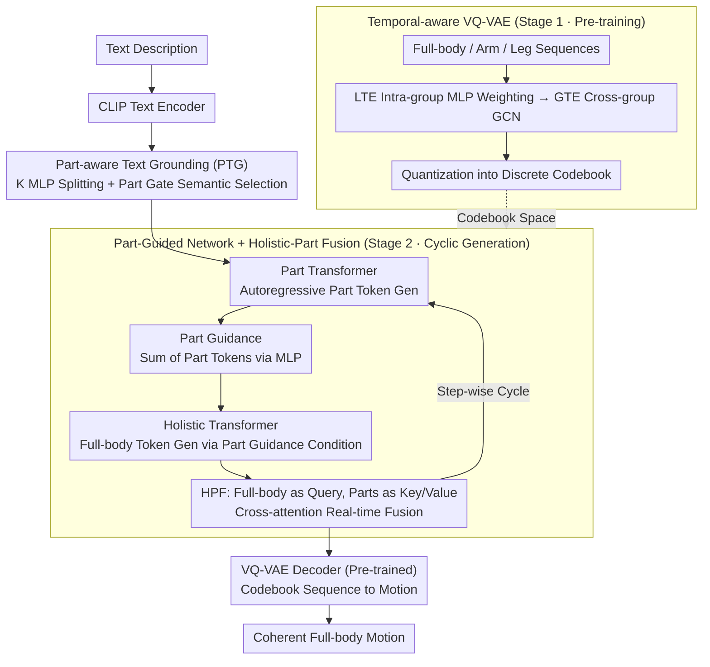

# ParTY: Part-Guidance for Expressive Text-to-Motion Synthesis

**Conference**: CVPR 2026  
**arXiv**: [2603.09611](https://arxiv.org/abs/2603.09611)  
**Code**: [Project Page](https://heokunho.github.io/ParTY/)  
**Area**: Human Understanding  
**Keywords**: text-to-motion, body part guidance, VQ-VAE, part-aware text grounding, motion coherence

## TL;DR

The ParTY framework is proposed to significantly improve the precision of text-motion semantic alignment for individual body parts while maintaining full-body motion coherence through a Part-Guided Network and Part-aware Text Grounding (PTG). It resolves the fundamental contradiction between "part expressiveness vs. full-body coherence" found in existing holistic and part-based methods.

## Background & Motivation

- **Prospects of Text-driven Motion Generation**: Text-to-motion has extensive applications in animation, VR, games, and robotics. Significant architectural progress (VQ-VAE + Transformer, Diffusion Models) has been made recently.
- **Limitations of Holistic Methods**: Most existing methods treat the human body as a single entity to generate full-body motion. While global coherence is good, they struggle to accurately model fine-grained descriptions involving specific body parts; part-level semantics are often ignored or misrepresented.
- **Defects of Part-based Methods**: Methods like ParCo and LGTM decompose the body into independent parts (arms, legs) for generation. Although part control is stronger, they suffer from: (i) lack of a mechanism to explicitly align text semantics with specific parts; (ii) incoherent full-body motion (e.g., neck twisting, inconsistent orientation between upper and lower body) caused by simple concatenation after independent generation.
- **Key Challenge**: A fundamental trade-off exists between part expressiveness and full-body coherence—part-based methods enhance the former at the expense of the latter, and no current method successfully reconciles both.
- **Missing Evaluation Protocols**: Current evaluation metrics (e.g., FID, R-Precision) operate only at the full-body level, failing to measure part-level semantic alignment or cross-part motion coherence.
- **Goal**: To design a unified framework that bridges the advantages of holistic and part-based methods—achieving both fine-grained part-text alignment and coherent full-body output; and to propose new metrics for part-level and coherence evaluation.

## Method

### Overall Architecture

ParTY utilizes a two-stage training strategy. **Stage 1** trains a Temporal-aware VQ-VAE to quantify full-body and part-specific (arms, legs) motion sequences into discrete codebooks. **Stage 2** trains holistic and part Transformers: text embeddings processed by Part-aware Text Grounding (PTG) are fed into respective part Transformers. These Transformers generate part motion tokens to construct Part Guidance, which is then injected into the holistic Transformer to guide full-body generation. During generation, part information is continuously integrated via Holistic-Part Fusion (HPF). At inference, the predicted codebook sequences are reconstructed into motions by the Stage 1 VQ-VAE decoder.

### Key Designs

**1. Temporal-aware VQ-VAE: Preserving Temporal Flow in Large Compression Windows**

Standard VQ-VAEs often flatten inter-frame temporal flow when compressing motion in large fixed windows, leading to a collapse in quantization quality. ParTY decouples this through two-level temporal enhancement: Local Temporal Enhancement (LTE) groups frame-level features within windows and uses an MLP to calculate weights for weighted summation, preserving local dynamics. Global Temporal Enhancement (GTE) then uses a Graph Convolutional Network (GCN) on these group-level features to capture global temporal dependencies before quantization. This allows the window size to increase from 4 to 12 (reducing inference time by ~64%) while maintaining a reconstruction FID of 0.042, far superior to the original MoMask's 0.126 at the same window size.

**2. Part-aware Text Grounding (PTG): Tailored Text Semantics for Each Part**

A single sentence often describes arms, legs, and the torso simultaneously. Providing a single text embedding to all part Transformers dilutes fine-grained semantics. PTG "splits" and then "selects": CLIP text embeddings are transformed into $K$ diverse embeddings via independent MLPs. A part-specific Gate network then adaptively weights these to select the most relevant semantic directions for that part. To ensure these $K$ embeddings are distinct yet accurate, a contrastive diversity loss $\mathcal{L}_{\text{div}}$ is used. An LLM generates auxiliary descriptions for each part (e.g., "pick up item with left hand" for arms), and an L1 loss aligns the Gate-selected part embedding with these descriptions. Crucially, the LLM is only used during training—at inference, the Gate has learned to split semantics without LLM assistance.

**3. Part-Guided Network + Holistic-Part Fusion: Part-pioneered Guidance vs. Post-hoc Splicing**

The poor coherence in part-based methods stems from "hard-splicing" independently generated parts. ParTY adopts a cyclic "parts first, full-body follow" approach: in each cycle, part Transformers autoregressively generate $T$ tokens, which are aggregated into Part Guidance via an MLP. The holistic Transformer generates full-body tokens for the same period conditioned on this guidance, possessing "look-ahead" information about the parts. Holistic-Part Fusion (HPF) facilitates dynamic alignment at each step by concatenating full-body, arm, and leg tokens for self-attention, then using full-body tokens as queries and part tokens as keys/values for cross-attention. Attention maps show that parts mentioned in the text receive significantly higher weights, ensuring part-specific semantics do not conflict with the overall torso posture.

## Loss & Training

The total loss consists of four components:

$$\mathcal{L} = \mathcal{L}_{\text{hol}} + \mathcal{L}_{\text{part}} + \lambda_{\text{div}} \mathcal{L}_{\text{div}} + \lambda_{\text{aux}} \mathcal{L}_{\text{aux}}$$

- $\mathcal{L}_{\text{hol}}$: Cross-entropy loss for the holistic Transformer.
- $\mathcal{L}_{\text{part}}$: Cross-entropy loss for part Transformers (arms + legs).
- $\mathcal{L}_{\text{div}}$: Contrastive diversity loss to encourage $K$ embeddings to be distinct but semantically consistent.
- $\mathcal{L}_{\text{aux}}$: Auxiliary L1 loss aligning PTG output with LLM-generated part embeddings (training only).

VQ-VAE stage: $\mathcal{L}_{vq} = \mathcal{L}_{rec} + \lambda_{app} \cdot \mathcal{L}_{app}$, including L1 reconstruction and L2 codebook approximation losses.

## Key Experimental Results

Evaluated on HumanML3D (14,616 motions, 44,970 texts) and KIT-ML (3,911 motions, 6,278 texts).

**Table 1: Main Full-body Results (HumanML3D)**

| Method | R-Prec Top-1↑ | R-Prec Top-3↑ | FID↓ | MM-Dist↓ |
|------|--------------|--------------|------|----------|
| T2M-GPT | 0.491 | 0.775 | 0.116 | 3.118 |
| ParCo | 0.515 | 0.801 | 0.109 | 2.927 |
| MoMask | 0.521 | 0.807 | 0.045 | 2.958 |
| BAMM | 0.525 | 0.814 | 0.055 | 2.919 |
| **Ours** | **0.550** | **0.836** | **0.035** | **2.779** |

**Table 2: Part-level Evaluation (HumanML3D)**

| Method | Part | R-Prec Top-1↑ | FID↓ | MM-Dist↓ |
|------|------|--------------|------|----------|
| MoMask | Arms | 0.452 | 0.175 | 3.440 |
| ParCo | Arms | 0.468 | 0.215 | 3.326 |
| **Ours** | **Arms** | **0.506** | **0.133** | **3.079** |
| MoMask | Legs | 0.403 | 0.104 | 3.513 |
| ParCo | Legs | 0.407 | 0.118 | 3.482 |
| **Ours** | **Legs** | **0.463** | **0.078** | **3.122** |

**Table 3: Coherence Evaluation**

| Method | Temporal Coherence↑ | Spatial Coherence↑ |
|------|--------------------|--------------------|
| ParCo | 0.49 | 0.59 |
| MoMask | 0.84 | 0.90 |
| **Ours** | **0.88** | **0.92** |

**Table 4: Generalizability of Temporal-aware VQ-VAE on MoMask**

| Method | Window Size | Rec. FID↓ | Gen. FID↓ | Inference Time |
|------|----------|----------|----------|----------|
| MoMask | 4 | 0.020 | 0.045 | 80ms |
| MoMask + Ours | 4 | 0.003 (+85%) | 0.033 (+26%) | - |
| MoMask | 12 | 0.079 | 0.126 | 29ms (-64%) |
| MoMask + Ours | 12 | 0.011 (+86%) | 0.042 (+67%) | - |

## Highlights & Insights

- **Resolving the Key Challenge**: Successfully addresses the "part expressiveness vs. full-body coherence" trade-off. The Part-Guided Network ensures parts guide the full-body generation proactively.
- **Elegant PTG design**: Diversity loss combined with Gate-based selection is more robust than LLM text decomposition (LGTM), with zero LLM overhead during inference.
- **Universal VQ-VAE Enhancement**: Temporal-aware VQ-VAE can be integrated into other frameworks like MoMask, offering significant improvements (26%-67% lower FID) and enabling faster inference with larger windows.
- **Comprehensive Evaluation**: Introduces part-level and coherence (TC, SC) metrics, filling a gap in the field and quantifying the coherence failures of part-based methods.

## Limitations & Future Work

- **Granularity**: Body parts are only split into arms and legs; modeling finer details like fingers, head, or specific torso segments is missing.
- **LLM Dependency**: Training relies on LLM-generated part descriptions, which increases data preparation costs; quality depends on LLM output.
- **Inference Latency**: The cyclic "part-first" generation increases total steps. While large-window VQ-VAE helps, total latency remains higher than single Transformer models.
- **Complexity**: Evaluation is limited to HumanML3D and KIT-ML, excluding multi-person interaction or object interaction.

## Related Work & Insights

- **Holistic text-to-motion**: T2M-GPT, MoMask, and BAMM provide good coherence but lack part-level detail.
- **Part-based methods**: ParCo and LGTM improve part control but suffer from "splicing" artifacts and lack of joint text alignment.
- **Motion Quantization**: VQ-VAE is standard, but fixed windows lose temporal flow; this work enhances temporal retention through LTE and GTE.

## Rating

| Dimension | Rating |
|------|------|
| Novelty | ⭐⭐⭐⭐ |
| Experimental Thoroughness | ⭐⭐⭐⭐⭐ |
| Writing Quality | ⭐⭐⭐⭐ |
| Value | ⭐⭐⭐⭐ |

<!-- RELATED:START -->

## Related Papers

- [\[CVPR 2026\] Miburi: Towards Expressive Interactive Gesture Synthesis](miburi_towards_expressive_interactive_gesture_synthesis.md)
- [\[CVPR 2026\] Pressure2Motion: Hierarchical Human Motion Reconstruction from Ground Pressure with Text Guidance](pressure2motion_hierarchical_human_motion_reconstruction_from_ground_pressure_wi.md)
- [\[CVPR 2026\] FrankenMotion: Part-level Human Motion Generation and Composition](frankenmotion_part-level_human_motion_generation_and_composition.md)
- [\[CVPR 2026\] Hierarchical Enhancement of Semantic Priors for Disentangled Text-Driven Motion Generation](hierarchical_enhancement_of_semantic_priors_for_disentangled_text-driven_motion_.md)
- [\[CVPR 2026\] Multi-level Causal LLM-based Text-to-Motion Generation with Human Alignment (MoTiGA)](multi-level_causal_llm-based_text-to-motion_generation_with_human_alignment.md)

<!-- RELATED:END -->
