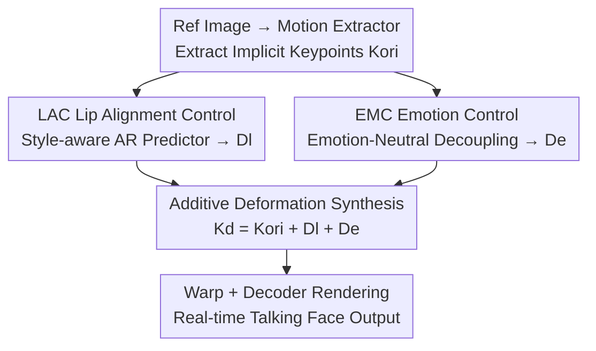

# PC-Talk: Precise Facial Animation Control for Audio-Driven Talking Face Generation

**Conference**: CVPR 2026  
**Paper**: [CVF Open Access](https://openaccess.thecvf.com/content/CVPR2026/html/Wang_PC-Talk_Precise_Facial_Animation_Control_for_Audio-Driven_Talking_Face_Generation_CVPR_2026_paper.html)  
**Code**: [Project Page](https://bq-wang0511.github.io/PC-Talk/)  
**Area**: Digital Human / Talking Face Generation  
**Keywords**: Audio-driven talking face, implicit keypoints, lip-audio alignment, emotion control, speaking style

## TL;DR
PC-Talk performs "additive deformation" on the intermediate representation of implicit keypoints. It employs a LAC module to control lip-audio alignment with speaking styles and an EMC module to decouple pure emotional deformation by "subtracting neutral expressions." This enables fine-grained, controllable, real-time (30 FPS) talking face generation for speaking styles, lip-motion amplitude, emotional intensity, and even multi-region composite emotions, achieving SOTA on HDTF and MEAD.

## Background & Motivation

**Background**: Audio-driven talking face generation is widely used in digital humans, film/television, and voice assistants. Recent methods have made significant progress in lip-sync precision (Wav2Lip introduces lip-sync discriminators; diffusion-based methods like EchoMimic/Hallo/Sonic improve image quality). Others, such as EAT, VASA, and Ditto, utilize intermediate representations (implicit keypoints) for two-stage (audio-to-motion + motion-to-image) generation.

**Limitations of Prior Work**: Current methods **lack precise control over talking faces**, resulting in repetitive facial motions. Specifically: (1) Speaking Style—different individuals have different lip-shape habits for the same phoneme (e.g., mouth opening for "duck," width for "bee," or puckering for "too"). Existing methods either use a single style source, lack fine-grained editing for individual articulations, or fail to simulate the impact of volume on lip amplitude. (2) Emotion—real emotions are often composite (e.g., happy mouth + sad brows). Most existing methods use single emotion labels, lack intensity adjustment, or cannot synthesize composite emotions across regions. EAT suffers from low image quality, and ED-Talk's limited emotion library may conflate anger with sadness.

**Key Challenge**: In the implicit keypoint space, lip deformation simultaneously contains "lip-audio synchronization deformation" and "pure emotional deformation." The two are naturally entangled and difficult to decouple. Directly predicting deformations for emotional faces leads to mutual contamination between emotion and lip shapes (e.g., excessive mouth closure).

**Goal**: Decompose controllability into two orthogonal dimensions—Lip Alignment Control (LAC) and Emotion Control (EMC)—achieving fine-grained adjustments in style, intensity, and facial regions.

**Key Insight**: Some points within implicit keypoints carry **semantic meaning** (corresponding to lips, brows, etc., bound to 2D landmarks via distance constraints), allowing for both precise synchronization and region-based operations. Furthermore, deformation in this space is approximately additive.

**Core Idea**: Perform **additive deformation** on implicit keypoints: $K_d = K_{ori} + D_l + D_e$. Lip deformation $D_l$ is provided by LAC, while emotional deformation $D_e$ is provided by EMC. Specifically, $D_e$ is decoupled by subtracting "neutral prediction" from "emotion prediction."

## Method

### Overall Architecture
PC-Talk uses implicit keypoints as the intermediate representation. First, a motion extractor retrieves original keypoints $K_{ori}$ from a reference image $I_{ref}$ (using a pose estimator for rotation $R$, translation $t$, and scale $s$; an expression estimator for deformation $\delta$; and a canonical keypoint detector for $K_c$, where $K_{ori}=s\cdot(K_c\cdot R+\delta)+t$). Two modules then calculate deformations in parallel: the LAC module predicts lip-audio alignment deformation $D_l$ based on audio $a$ and speaking style, while the EMC module predicts emotional deformation $D_e$ based on emotion input. These are added to $K_{ori}$ to obtain the driven keypoints $K_d=K_{ori}+D_l+D_e$. Finally, a warping module estimates optical flow between $K_{ori}$ and $K_d$, applied to appearance features $f_a$ extracted by an identity encoder. A decoder renders the final result: $I_{res}=Decoder(Warp(f_a,K_{ori},K_d))$. Other components are frozen during LAC/EMC training.

### Key Designs

**1. Implicit Keypoints and Additive Deformation: Converting Control to Keypoint Space Addition**

PC-Talk avoids direct pixel generation, mapping all control to deformations of implicit keypoints: $K_d=K_{ori}+D_l+D_e$. A key design is that specific keypoints carry **semantic meaning**, bound to 2D facial landmarks (lips, brows, etc.) via training constraints. This allows for precise synchronization and independent manipulation of facial regions—a prerequisite for composite emotions. The **additive** nature of $D_l$ and $D_e$ allows LAC and EMC to operate independently and be easily overlaid. The rendering end uses warp ($K_{ori}\to K_d$ flow) and a decoder, supporting real-time per-frame video processing.

**2. LAC (Lip Alignment Control): Style-aware AR Predictor + AV-Sync Pre-trained Audio Encoder**

To address the lack of fine-grained style control, LAC uses a **style-aware autoregressive Transformer** (inspired by FaceFormer) to predict deformation. Style embeddings $e_s$ and positional encodings are fed into the model; the AR structure ensures temporal consistency. Features are fused via self-attention and cross-attention with audio features. Finally, a refinement MLP acts **directly on $K_{ori}$ rather than expression deformation** to alleviate residual entanglement: $D_l=ExpPredictor(e_a,e_s,K_{ori})$. The audio embedding $e_a$ is not from ASR (like Whisper) but from an audio encoder **pre-trained on 2D audio-visual synchronization**, improving lip-audio alignment. For the style space, one-hot codes or video references (encoded via Transformer) are used. Lip amplitude can be scaled by a factor $f$ calculated from audio volume, and style editing is achieved by projecting $D_l$ onto specific phoneme deformation vectors.

**3. EMC (Emotion Control): Decoupling via "Emotion minus Neutral" + Multi-region Composite Emotions**

This design addresses the entanglement of emotional and lip deformations. Using the same audio, the model predicts both "emotional" and "neutral" combined deformations (ensuring identical lip movement). Pure emotional deformation is obtained by subtraction: $D_e=CPred(emo,e_a)-CPred(\text{'neutral'},e_a)$, where $CPred$ is a combined expression predictor. The subtraction cancels shared lip components, allowing emotion to be overlaid on synchronized lip motion without contamination. Since $CPred$ shares the LAC architecture, intensity and style controls are transferable. Multi-region composite emotions are synthesized by generating emotional expressions for each facial region independently (e.g., happy mouth + sad eyes) using semantic keypoint positioning.

### Loss & Training
The LAC loss is $L_{LAC}=L_{sync}+\lambda_{kp}L_{kp}+\lambda_{reg}L_{reg}+\lambda_{vel}L_{vel}+\lambda_{style}L_{style}$. $L_{sync}$ adopts features from an AV-sync network (similar to Wav2Lip) to enhance lip-sync. $L_{kp}$ is the L1 loss for implicit keypoints, $L_{reg}$ constrains excessive deformation, $L_{vel}$ enforces temporal consistency, and $L_{style}$ is a discriminatory loss for style adaptation. The EMC module uses only $L_{kp}, L_{reg}, L_{vel}$. Videos are processed at 25fps and audio at 16kHz. LAC is trained on HDTF and neutral MEAD segments; EMC is trained on emotional MEAD content. Using an RTX 4090, LAC takes two days and EMC one day. The system outputs 512×512 at 30 FPS.

## Key Experimental Results

Datasets: HDTF (16 hours, 300+ identities, neutral) and MEAD (40+ identities, 8 emotions). Metrics: LSE-C↑/LSE-D↓ (SyncNet confidence/distance), FID↓, NIQE↓, FVD↓, Accemo↑ (emotion accuracy), and E-FID↓ (expression distance).

### Main Results: Lip Alignment (HDTF / MEAD-Neutral)

| Method | Input | HDTF LSE-C↑ | HDTF LSE-D↓ | HDTF FID↓ | HDTF FVD↓ |
|------|------|-------------|-------------|-----------|-----------|
| Wav2Lip | Video | 8.65 | 6.78 | 32.24 | 183.99 |
| LatentSync | Video | 8.92 | 6.84 | 16.32 | 175.23 |
| **Ours** | Video | **9.03** | **6.69** | **15.51** | **100.85** |
| Sonic | Image | 8.64 | 6.77 | 40.81 | 212.78 |
| **Ours** | Image | **9.37** | **6.44** | 33.07 | 205.55 |

Findings: PC-Talk's lip-sync (LSE-C 9.03/9.37) exceeds specialized models like Wav2Lip and LatentSync, with significantly lower FVD, indicating superior temporal consistency.

### Emotional Talking Face (MEAD)

| Method | LSE-C↑ | FID↓ | Accemo↑ | E-FID↓ |
|------|--------|------|---------|--------|
| EAT | 12.77 | 109.91 | 68.21 | 2.54 |
| ED-Talk | 7.81 | 131.69 | 57.45 | 2.10 |
| **Ours** | 7.74 | **35.26** | **72.32** | **1.88** |

PC-Talk achieves the highest emotion accuracy (72.32) and the best FID/E-FID, indicating realistic and accurate emotional expression.

### Ablation Study

| Configuration | LSE-C↑ |
|------|------------------|
| w/o AV Encoder + w/o Lsync + w/o Lkp | 6.23 |
| + AV Encoder | 7.17 |
| + AV Encoder + Lsync | 8.92 |
| + Full | **9.37** |

### Key Findings
- **Pre-trained AV-sync audio encoder is crucial**: Replacing it with Whisper significantly drops LSE-C. Combining it with $L_{sync}$ and $L_{kp}$ leads to progressive gains.
- **Emotion decoupling enhances naturalness**: Without decoupling, expressions appear unnatural; decoupling ensures clear separation.
- **Efficiency**: PC-Talk runs at 30.13 FPS, far exceeding diffusion-based methods like EchoMimic (0.84) and Hallo-v2 (0.69).

### Efficiency Comparison (FPS)

| Method | SadTalker | EchoMimic | Hallo-v2 | Ours (w/o control) | Ours |
|------|-----------|-----------|----------|-------------------|------|
| FPS | 10.76 | 0.84 | 0.69 | 34.75 | 30.13 |

## Highlights & Insights
- **"Emotion minus Neutral" Decoupling**: Predicting both emotional and neutral deformations for the same audio and subtracting them cancels the shared lip components. This simply and effectively solves the long-standing problem of lip-emotion entanglement.
- **Additive Deformation + Semantic Keypoints**: Converting control to keypoint addition allows decoupled LAC/EMC modules to be overlaid. Semantic keypoints facilitate multi-region composite emotions.
- **Superior Lip-Sync**: Using an AV-sync pre-trained encoder and $L_{sync}$ allows the model to outperform specialized lip-sync frameworks, suggesting that alignment quality in audio representation is more important than backbone complexity.
- **Transferable Trick**: Applying the refinement MLP directly to $K_{ori}$ instead of expression deformation helps alleviate residual entanglement.

## Limitations & Future Work
- Emotion sources from audio/text rely on pre-trained classifiers; classifier errors propagate to generation.
- The "Emotion minus Neutral" decoupling assumes lip components are identical in both predictions, but residuals may still contain non-emotional components.
- Region-based synthesis for composite emotions relies on semantic keypoint segmentation quality; naturalness at regional seams requires further analysis.
- Training is limited to the 8 emotion categories in MEAD, potentially limiting generalization to subtle or mixed real-world emotions.

## Related Work & Insights
- **vs EAT**: Both use implicit keypoints, but EAT lacks lip-emotion decoupling and has poor image quality (FID 109.91). PC-Talk excels in quality and emotion accuracy.
- **vs ED-Talk**: ED-Talk improves expressiveness via decoupling but has a limited emotion library and lacks intensity control. PC-Talk supports continuous intensity and composite emotions.
- **vs VASA / Ditto**: VASA generates lip-sync motion via DiT but lacks exploration of motion space controllability. Ditto suffers from unstable lip-sync. PC-Talk is superior in both.
- **vs Wav2Lip**: Wav2Lip focuses solely on lip-sync without controllability. PC-Talk outperforms it in lip-sync while offering style and emotion control.

## Rating
- Novelty: ⭐⭐⭐⭐ Combination of "Emotion-Neutral" decoupling and additive semantic keypoints is clever; multi-region composite emotion is a genuine new capability.
- Experimental Thoroughness: ⭐⭐⭐⭐ Comprehensive results across datasets and baselines, though some details are moved to supplementary materials.
- Writing Quality: ⭐⭐⭐⭐ Clear decomposition of control dimensions and intuitive illustrations.
- Value: ⭐⭐⭐⭐ 30 FPS real-time performance with fine-grained control offers high practical value for digital human applications.

<!-- RELATED:START -->

## Related Papers

- [\[CVPR 2026\] ActAvatar: Temporally-Aware Precise Action Control for Talking Avatars](actavatar_temporally-aware_precise_action_control_for_talking_avatars.md)
- [\[CVPR 2026\] AudioAvatar: Personalized Audio-driven Whole-body Talking Avatars](audioavatar_personalized_audio-driven_whole-body_talking_avatars.md)
- [\[ECCV 2024\] Audio-Driven Talking Face Generation with Stabilized Synchronization Loss](../../ECCV2024/human_understanding/audio-driven_talking_face_generation_with_stabilized_synchronization_loss.md)
- [\[CVPR 2026\] Unifying Precise Keyframes and Semantic Control via Multi-level Diffusion](unifying_precise_keyframes_and_semantic_control_via_multi-level_diffusion.md)
- [\[CVPR 2026\] Bridging Facial Understanding and Animation via Language Models](bridging_facial_understanding_and_animation_via_language_models.md)

<!-- RELATED:END -->
## Related Papers

- [\[CVPR 2026\] ActAvatar: Temporally-Aware Precise Action Control for Talking Avatars](actavatar_temporally-aware_precise_action_control_for_talking_avatars.md)
- [\[CVPR 2026\] AudioAvatar: Personalized Audio-driven Whole-body Talking Avatars](audioavatar_personalized_audio-driven_whole-body_talking_avatars.md)
- [\[ECCV 2024\] Audio-Driven Talking Face Generation with Stabilized Synchronization Loss](../../ECCV2024/human_understanding/audio-driven_talking_face_generation_with_stabilized_synchronization_loss.md)
- [\[CVPR 2026\] Talking Together: Synthesizing Co-Located 3D Conversations from Audio](talking_together_synthesizing_co-located_3d_conversations_from_audio.md)
- [\[CVPR 2026\] UniLS: End-to-End Audio-Driven Avatars for Unified Listening and Speaking](unils_end-to-end_audio-driven_avatars_for_unified_listening_and_speaking.md)

<!-- RELATED:END -->
